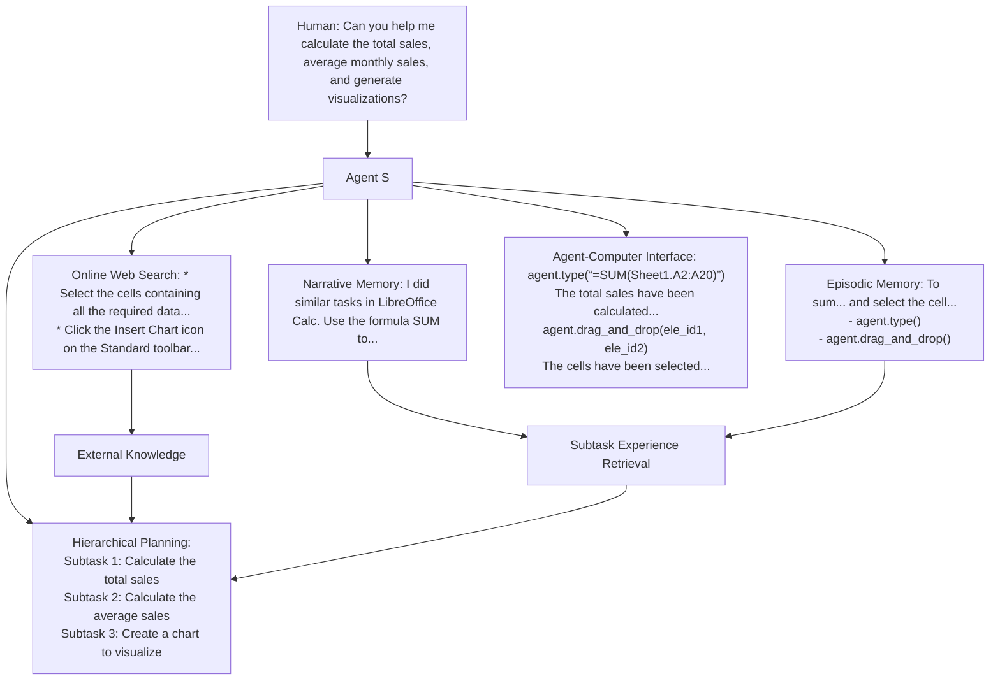
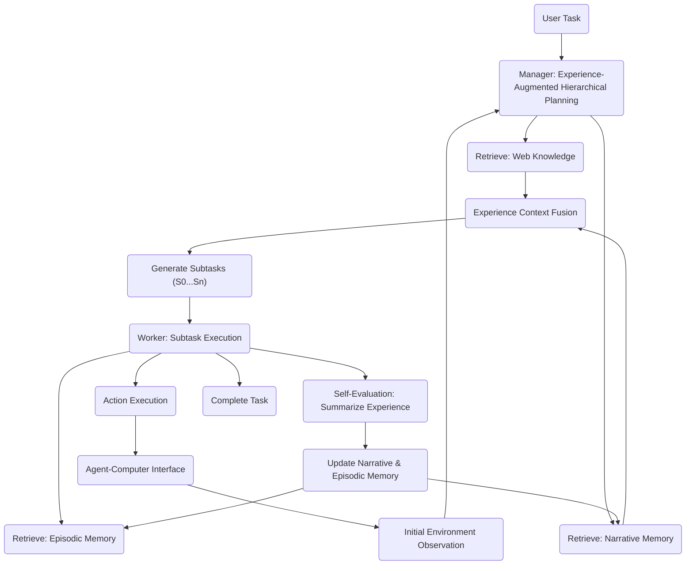
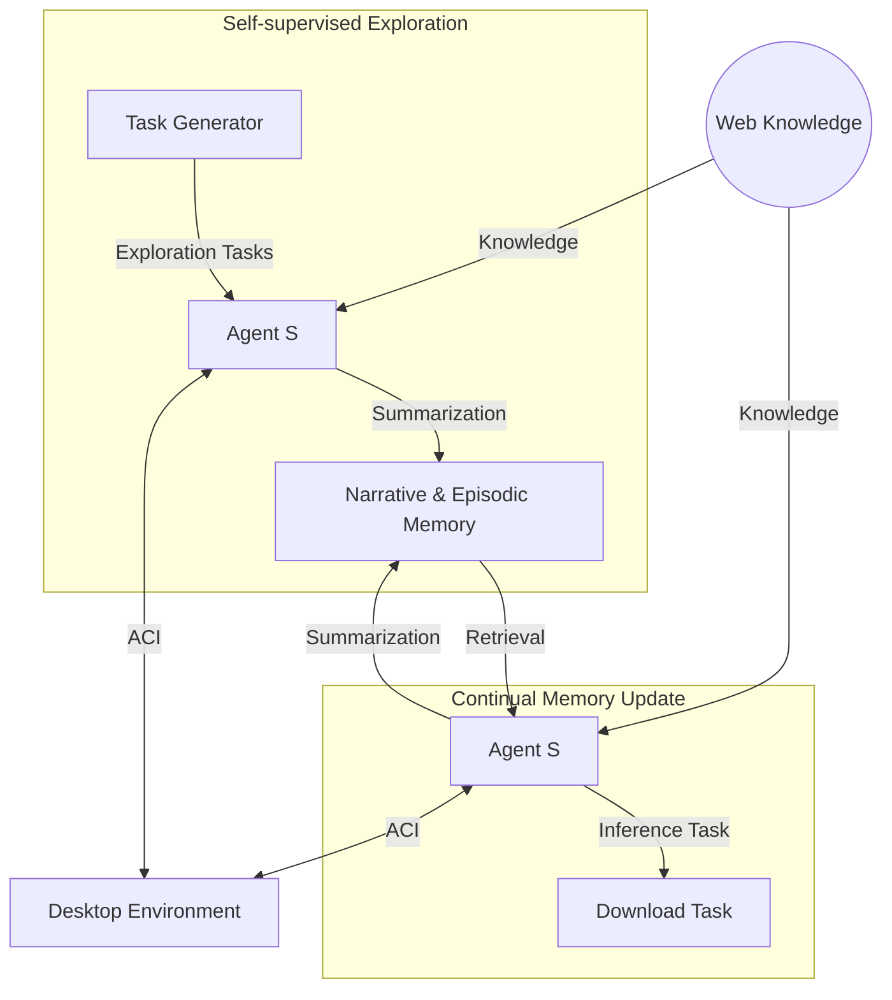

# AGENT S: AN OPEN AGENTIC FRAMEWORK THAT

## USES COMPUTERSLIKE AHUMAN



## ABSTRACT

We present Agent S, an open agentic framework that enables autonomous interaction with computers through a Graphical User Interface (GUI), aimed at transforming human-computer interaction by automating complex, multi-step tasks. Agent S aims to address three key challenges in automating computer tasks: acquiring domain-specific knowledge, planning over long task horizons, and handling dynamic, non-uniform interfaces. To this end, Agent S introduces experience-augmented hierarchical planning, which learns from external knowledge search and internal experience retrieval at multiple levels, facilitating efficient task planning and subtask execution. In addition, it employs an Agent-Computer Interface (ACI) to better elicit the reasoning and control capabilities of GUI agents based on Multimodal Large Language Models (MLLMs). Evaluation on the OSWorld benchmark shows that Agent S outperforms the baseline by 9.37% on success rate (an 83.6% relative improvement) and achieves a new state-of-the-art. Comprehensive analysis highlights the effectiveness of individual components and provides insights for future improvements. Furthermore, Agent S demonstrates broad generalizability to different operating systems on a newly-released WindowsAgentArena benchmark. Code available at <https://github.com/simular-ai/Agent-S>.

## 1 INTRODUCTION

```txt
“The digital revolution is far more significant than the invention of writing or even of printing.”
```

```txt
— Douglas Engelbart, The Inventor of Computer Mouse
```

Since its invention, the mouse has been controlled by humans for interacting with computers. But does it really have to be? Autonomous Graphical User Interface (GUI) agents offer the promise of solving very specific and highly varied user queries—such as data entry, scheduling, and document creation for individual users, and streamlining operations in commercial settings—in the most general way: through direct UI interaction using the mouse and keyboard. Moreover, by eliminating the need for constant manual interaction, these agents not only boost efficiency but also improve accessibility, empowering individuals with disabilities to interact with technology in new, transformative ways. Recent advancements in Multimodal Large Language Models (MLLMs), such as GPT-4o (OpenAI, 2023) and Claude (Anthropic, 2024), have laid the foundation for the development of GUI agents for human-centred interactive systems like desktop OS (Xie et al., 2024; Bonatti et al., 2024).

However, automating computer tasks presents significant challenges. First, the vast range of constantly-evolving applications and websites requires the agent to possess specialized and up-to-date domain knowledge and the ability to learn from open-world experience. Second, complex desktop tasks often involve long-horizon, multi-step planning with interdependent actions that must be executed in a specific sequence. The agent must, therefore, create a clear plan with intermediate subgoals and track task progress. Third, GUI agents must navigate dynamic, non-uniform interfaces, processing large volumes of visual and textual information while operating within a vast action space. This involves distinguishing between relevant and irrelevant elements, accurately interpreting graphical cues, and responding to visual feedback during task execution.

In this paper, we present Agent S, a new agentic framework that tackles these challenges towards the goal of using computers like a human. First, to enhance the GUI agent's capabilities in solving diverse, long-horizon desktop tasks with specific domain knowledge, we propose an Experience-Augmented Hierarchical Planning method. This approach leverages Online Web Knowledge and past experiences stored in Narrative Memory to decompose the complex, long-horizon task into a structured plan of manageable subtasks (see Figure 1). Online Web Knowledge provides up-to-date external knowledge about specific applications, allowing the agent to adapt to frequently changing software and websites. Narrative Memory contains high-level, abstractive task experiences from past interactions, equipping the agent with contextual understanding for effective task planning. The agent monitors task completion progress, and during each subtask execution, it retrieves detailed, step-by-step subtask experience from Episodic Memory to dynamically refine its actions and continuously improve its planning ability. Successful subtasks and the full task experience are evaluated, summarized, and stored in episodic and narrative memory to enable continual improvement.

```chart
{
  "type": "bar",
  "data": {
    "labels": ["Operating System", "Office", "Daily", "Professional", "Workflow"],
    "datasets": [
      {
        "label": "OSWorld",
        "backgroundColor": "rgba(75, 192, 192, 0.6)",
        "data": [41.7, 6.2, 12.3, 14.3, 7.5]
      },
      {
        "label": "Agent S",
        "backgroundColor": "rgba(255, 99, 132, 0.6)",
        "data": [45.8, 13.0, 27.1, 36.7, 10.5]
      }
    ]
  },
  "options": {
    "scales": {
      "y": {
        "beginAtZero": true,
        "max": 50
      }
    }
  }
}
```

```txt
Figure 2: Agent S vs. OSWorld Agent results across five broad computer task categories.
```

Furthermore, we introduce a specific language-centric Agent-Computer Interface (ACI) (Lieberman & Selker, 2003) as an abstraction layer to improve grounding, safety, and efficiency for MLLM-based GUI agents. The ACI defines an interaction paradigm by (1) a dual-input strategy using visual input for understanding environmental changes together with an accessibility tree for precise element grounding; (2) a bounded action space of language-based primitives (e.g., click(elementid)) that are conducive to MLLM common-sense reasoning and generate environment transitions at the right temporal resolution for the agent to observe immediate and task-relevant environment feedback.

Our approach shows a remarkable improvement in the overall performance of Agent S on the OSWorld benchmark (OpenAI, 2023) (from 11.21% to 20.58%, with a relative improvement of 83.6%), establishing the new state-of-the-art results. The detailed comparison is shown in Figure 2, which demonstrates consistent improvements by Agent S across five broad computer task categories over the OSWorld agent. We also evaluate our Agent S on a concurrent work— WindowsAgentArena (Bonatti et al., 2024), where we observe a performance improvement from 13.3% to 18.2% on an equivalent setup without any explicit adaptation. The improvement demonstrates the broad generalizability of Agent S to different operating systems. We detail the component-wise improvements introduced by the proposed strategies through ablation studies and present a comprehensive error analysis of our Agent S framework. In summary, our contributions are four-fold:

- We introduce Agent S, a new agentic framework that integrates experience-augmented hierarchical planning, self-supervised continual memory update, and an Agent-Computer Interface for MLLM-based GUI agents to perform complex computer tasks.
- We propose an experience-augmented hierarchical planning method that uses experience from external web knowledge and the agent's internal memory to decompose complex tasks into executable subtasks.
- We extend the concept of an ACI to GUI agents, allowing MLLM-based agents to operate computers more precisely using a set of high-level, predefined primitive actions.
- We conduct extensive experiments on OSWorld to show the effectiveness of individual components of Agent S, establishing new state-of-the-art on automating computer tasks. Besides, we demonstrate its generalizability across different operating systems on WindowsAgentArena.

## 2 RELATED WORK

### MLLM Agents

The advent of Multimodal Large Language Models (MLLMs) has led to a host of works that utilize them as a reasoning backbone in Agentic Systems (Sumers et al., 2024). These Agents augment LLMs with Memory, Structured Planning (Wang et al., 2023; Shinn et al., 2023; Weng et al., 2023), Tool Use (Schick et al., 2023; Shen et al., 2023; Patil et al., 2023), and the ability to Act in external environments Park et al. (2023). These agents have shown promise in domains ranging from embodied simulators (Liang et al., 2023; Song et al., 2023) to video games (Wu et al., 2023; Wang et al., 2024) and scientific research (Bran et al., 2023). For Software Engineering (Hong et al., 2024; Qian et al., 2024) in particular, Yang et al. (2024) proposed an Agent-Computer Interface (Lieberman & Selker, 2003) for MLLM agents to understand and act more efficiently and reliably. Our work extends and integrates these individual modules into a new MLLM agent framework for computer control.

### GUI Agents

MLLM agents have been applied to execute natural language instructions in both web and OS environments. Early research concentrated on web navigation tasks, utilizing MLLMs to interact with web interfaces (Gur et al., 2024; He et al., 2024; Kim et al., 2023; Shaw et al., 2023; Putta et al., 2024). Recently, the focus has shifted to OS-level environments, leading to the development of benchmarks and frameworks such as OSWorld Xie et al. (2024) and WindowsAgentArena Bonatti et al. (2024) for desktop control, and DiGIRL (Bai et al., 2024) and AndroidWorld (Rawles et al., 2024) for mobile environments. These OS-level tasks offer broader control capabilities beyond the limitations of single-browser contexts in web navigation. Methodologically, earlier GUI agents employed behavioral cloning with reinforcement learning (Humphreys et al., 2022), in-context trajectory examples (Zheng et al., 2024b), state-dependent offline experience (Fu et al., 2024b), and reusable skill generation (Wang et al., 2024). Contemporaneous work on GUI agents for video games and OS (Wu et al., 2024; Song et al., 2024; Tan et al., 2024) propose varying instances of cognitive architectures (Sumers et al., 2024). Our work contributes unique modules such as experience-augmented hierarchical planning and ACI for GUI control, integrated with a novel continual memory update framework.

### Retrieval-Augmented Generation (RAG) for AI Agents

Retrieval-Augmented Generation (RAG) for AI Agents improves the reliability of MLLM inference by augmenting the input with reliable and up-to-date external knowledge. Similarly, MLLM agents benefit from retrieving task exemplars (Kim et al., 2024), state-aware guidelines (Fu et al., 2024a), and past experiences (Kagaya et al., 2024). Our use of experience for augmentation differs in three ways: 1) our hierarchical planning leverages both full task experience and subtask experience; 2) the full task experience is summarized into an abstractive textual reward for subtask planning; 3) the subtask experience is assessed and annotated by a self-evaluator before being stored in memory.

## 3 AGENTS

Agent S, illustrated in Figure 3, is a novel framework that integrates three main strategies in a closed loop to tackle complex GUI-based operating system control tasks: experience-augmented



```txt
Figure 3: Overview of the Agent S framework. Given taskTuand initial environment observation
o 0 , the Manager conducts experience-augmented hierarchical planning using web knowledge and
narrative memory to produce subtaskss 0 ,... , sn. For eachsi, Workerwidraws from episodic
memory to generate an actionatat timet, which is executed by the ACI to return the next immediate
observationot+1. A self-evaluation module closes the loop by storing the summarized subtask and
full-task trajectories in narrative and episodic memory.
```

hierarchical planning, continual update of narrative and episodic memory, and an Agent-Computer Interface for precise perception and action on GUIs. Experience-augmented hierarchical planning allows Agent S to break down complex tasks into manageable subtasks. This enables both high-level planning and low-level execution to draw from external web-based experience and internal task-specific experience. A continual process of storing and retrieving self-evaluated task experience in narrative and episodic memory enables Agent S to improve over time and adapt to changes in the open-world desktop environment. The ACI ensures grounding by providing a vision-augmented accessibility tree observation containing all valid GUI elements and constraining the agent's chosen action to a bounded discrete space of valid actions. Below, we describe each component and its integration in detail.

### 3.1 EXPERIENCE-AUGMENTEDHIERARCHICALPLANNING

#### 3.1.1 MANAGER: FUSINGEXTERNALKNOWLEDGE ANDINTERNALEXPERIENCE FOR PLANNING

The ManagerGis the primary plan generator module in our system. It receives a taskTufrom the user and the initial environment observationO 0 (Annotated Accessibility Tree + Screenshot) from the ACI as input. The manager formulates an observation-aware queryQbased on the user instruction and its observation in a "How to do X" format. This query is used for two types of retrieval. First, the query is used for Online Web Search through Perplexica Search Engine^1 to get external knowledge. Then the same query is used to retrieve a similar task experience summary from the Manager's own Narrative MemoryMn. The retrieval is based on the similarity of the query embedding.

The Narrative Memory includes summaries of both successful and failed trajectories with specific actions removed as abstractive full task experienceEnu. The success/failure is evaluated by the Self-EvaluatorSmodule (described in Subsection 3.1.3) without any human feedback or ground truth information. This two-step retrieval provides the Manager with both the general and specific domain knowledge required to plan for the task. The outputs of the retrieval process are fused into a single fused guideline using the Experience Context Fusion submodule([Perplexica Search Engine](https://github.com/ItzCrazyKns/Perplexica)), represented formally as:

```math
\begin{align*}
& Q = LLM(T_u, O_0) \\[1em]
& K_{web} = Retrieve(Web, Q) \\[1em]
& E_{nu} = Retrieve(M_n, Q) \\[1em]
& K_{fused} = LLM(M_n(Q), K_{web})
\end{align*}
```

The fused knowledgeKfusedis then used bySubtask Plannersubmodule of the Manager to for-
mulate a detailed, topologically sorted queue of subtasks⟨s 0 ...sn⟩that can accomplish the user
instruction. The manager also generates associated contextCsifor each subtasksiwhich includes
additional information useful to accomplish the subtask.

### 3.1.2 WORKER: LEARNING FROMSUBTASKEXPERIENCE ANDTRAJECTORYREFLECTION

The subtasks⟨s 0 ..sn⟩ generated by the Manager G are executed sequentially by Worker modules ⟨w 0 ..wn⟩. Each Worker can take multiple time steps within one episode to complete a subtask si Firstly, the combination of the User Task Tu, the subtask si and the contextual information Csi are used as a query to retrieve similar subtask experience Esi from the Worker's Episodic Memory. The Episodic Memory is indexed by the concatenation of the task query, the subtask, and the contextual information ⟨Q, si, Csi⟩, based on the similarity of the embedding. As opposed to Narrative Memory, Episodic Memory includes a complete plan with specific grounding actions and only summaries from the subtask trajectories designated as DONE or successful by a Worker. Additionally, a Trajectory Reflector submodule TRi is associated with each worker. This submodule observes the entire episode as the worker is executing the subtask and provides reflective advice to the agent—helping it think of alternative strategies and avoid repetitive actions.

```math
Esi=Retrieve(Me,⟨Tu, si, Csi⟩)
```

The subtask experience Esi and the reflection is used by the Action Generator submodule inside a Worker to generate a single structured response - consisting of a previous action status check, observation analysis, semantic next action and grounded next action. This structured response allows the agent to generate a templated chain-of-thought Wei et al. (2022); Yao et al. (2023) for improved reasoning and results in a single grounded actionaj. This action is passed to the ACI which implements it in the Desktop Environment. Once the worker reasons that the subtask has been completed, it generates a special grounded action DONE which signals the successful end of the subtask. The worker can also optionally generate a FAIL signal, in which case the hierarchical operation is reset and the Manager replans a new set of subtasks based on the intermediate environment configuration.

### 3.1.3 SELF-EVALUATOR: SUMMARIZINGEXPERIENCES ASTEXTUALREWARDS

The Self-Evaluator Sis responsible for generating experience summaries as textual rewards r for the Manager and Worker modules. In the case of the successful end of an episode signaled by the Worker with a DONE signal, the evaluator observes the complete episode and generates learning in the form of a summarization of the strategy used by the worker to complete that subtask. This strategy is fed back into the Worker's episodic memoryMe. In the case of the end of the complete user-provided task, indicated either by the successful completion of all subtasks or by the maximum number of steps limit, the evaluator generates a learning signal in the form of the summary of the entire task completion process. This summary is fed back and saved in the narrative memory Mn of the Manager. This process of Observations, Hierarchical Action Generation, and Rewards in the form of textual summaries to update the internal memories of the Manager and Worker mirrors a classic Hierarchical Reinforcement Learning process - but uses Retrieval as a learning strategy.

### 3.2 MEMORYCONSTRUCTION ANDUPDATE

#### Initial Memory Construction via Self-supervised Exploration

To bootstrap Narrative Memory Mn and Episodic Memory Me, Agent S conducts self-supervised exploration on a set of synthetically generated tasks (see Figure 4). We utilize two methods to create two types of random exploration tasks: environment-independent tasks and environment-aware tasks. For environment-independent tasks, we leverage a task generator to generate the top 50 most common tasks from the various



```txt
Figure 4: The pipeline of memory construction and update, which contains two phases: Self-supervised Exploration and Continual Memory Update. The initial Narrative & Episodic Memory is constructed through some randomly curated tasks during the exploration phase, and then it is updated based on the inference tasks continually.
```

applications used in OSWorld (Xie et al., 2024) and WindowsAgentArena (Bonatti et al., 2024). For environment-aware tasks, we take the initial environments of the tasks in OSWorld and WindowsAgentArena and prompt a Task Generator to generate a different task based on the environment. Both types of tasks consist of the exploration tasks. Then we run Agent S on these tasks by only taking web knowledge Kweb and collect the full task (Narrative Experience En) and subtask experiences (Episodic Experience Ee) for the narrative and episodic memories. The key stored in narrative memory Mn is the query Q and for episodic memory Me, the key is query Q concatenated with subtask information ⟨Q, si, Csi⟩. Through this process, the initial memory is constructed.

#### Continual Memory Update

As our Agent S interacts with new tasks, it continually updates the Narrative Memory Mn and Episodic Memory Me, as illustrated in Figure 4. Thus even after the initial exploration is completed, the agent continues to learn as it encounters and attempts newer, more novel tasks. This process enables our agent to learn even during inference and retrieve the learned knowledge to new tasks effectively.

### 3.3 AGENT-COMPUTERINTERFACE

Current desktop environments are designed to accommodate two distinct user types: (1)human
users, who can perceive and respond to subtle visual changes in real-time, and (2)software pro-
grams, which execute predefined tasks through scripts and Application Programming Interfaces
(APIs). However, these interfaces are inadequate for MLLM agents tasked with GUI control and ma-
nipulation at the fundamental keyboard-mouse level. These agents operate on a different paradigm:
they respond in slow, discrete time intervals, lack an internal coordinate system, and cannot effi-
ciently process fine-grained feedback after each minor mouse movement or keyboard input. Draw-
ing inspiration from the ACI developed for Software Engineering agents (Yang et al., 2024), we
propose the creation of a novel ACI to bridge the gap between the unique operational constraints of
MLLM agents and the requirements of open-ended GUI-control tasks.

#### Perception and Grounding 

The image input is used by the agent to observe salient details about the environment—such as popups, button states, checking if a previous action worked, and reasoning about the next step. The accessibility tree input is used for reasoning about the next step and, more importantly, grounding specific elements in the environment. To achieve this, we tag each element in the accessibility tree with unique integer tags which can be used by agents when referring to these elements. Furthermore, while previous works seek to augment the image with information from the accessibility tree (Xie et al., 2024; Zheng et al., 2024a; Bonatti et al., 2024) using Set-of-Mark Prompting, we augment the accessibility tree with details from the image. To achieve this, we run an OCR module on the image and parse textual blocks from the screenshot. We then add these blocks to the accessibility tree as interactable UI elements if they do not already exist in the tree. We then perform an IOU (Intersection over Union) match with all elements in the tree to check for existing elements.

#### Constrained Action Space with Concurrent Feedback

Desktop automation has traditionally relied on APIs and scripts, but adopting these as actions would imply an unbounded combinatorial action space of arbitrary executable code. This is unsuitable for keyboard-mouse-level GUI automation agents because it compromises safety and precision. Code blocks can contain multiple sequential actions, leaving the agent with neither control over nor feedback from individual steps. To ensure that actions generated by agents are safely and reliably relayed to the environment and produce clear and timely feedback, our ACI design incorporates a bounded action space. This space
produce clear and timely feedback, our ACI design incorporates a bounded action space. This space
includes primitive actions like click, type, and hotkey (detailed in Appendix A.1). Agents can refer
to different elements by their tagged IDs, and the ACI translates the⟨primitive - ID⟩information
into executable Python code. Furthermore, the agent is allowed to perform only one discrete action
at each time step, so it can observe immediate feedback from the environment. These actions are
also coarse enough to account for the slow, stateless nature of MLLMs, e.g., the agent can directly
move to and click an element instead of moving the mouse in small increments.

## 4 EXPERIMENTS

### 4.1 EXPERIMENTALSETUP

Benchmarks. We evaluate Agent S on OSWorld (Xie et al., 2024), a benchmark for testing the
multimodal agents' capability of executing a wide range of computer tasks in a real computer envi-
ronment. This executable environment allows free-form keyboard and mouse control of real com-
puter applications, including OS, Office (LibreOffice Calc, Impress, Writer), Daily (Chrome, VLC
Player, Thunderbird), Professional (VS Code and GIMP), and Workflow (tasks involving multiple
apps). In addition, we also evaluate the generalization of Agent S on WindowsAgentArena (Bonatti
et al., 2024), a contemporaneous benchmark in the Windows operating system.

Settings & Baselines. Since the OSWorld benchmark contains 369 tasks on Ubuntu, for the
backbone model of Agent S, we leverage GPT-4o and Claude-3-Sonnet, respectively. For Win-
dowsAgentArena, we test all 154 tasks on GPT-4o. We use the PaddleOCR^2 toolkit as our OCR tool
in augmenting accessibility trees for grounding. The embedding model for the retrieval we use is
text-embedding-3-small. Agent S takes the accessibility tree and screenshot as inputs, so we also use
the reported results in OSWorld (Xie et al., 2024) and WindowsAgentArena (Bonatti et al., 2024)
with same input setting as baselines. The OSWorld baseline takes the coordinates-based accessibil-
ity tree and screenshots as input for spatial grounding to generate the action with coordinates at each
step. The WindowsAgentArena baseline NAVI (Bonatti et al., 2024) utilizes an accessibility tree,
OCR, and Proprietary models to process the screenshot and create Set-of-Marks as input. Its action
space includes a constrained set of primitives but allows multiple actions to be chained together.

### 4.2 MAINRESULTS

OSWorld. Table 1 shows the performance comparison between Agent S and the baseline models,
evaluated across the whole OSWorld test set. For the GPT-4o model, Agent S achieves an overall
success rate of 20.58%, nearly doubling the performance of the best corresponding baseline (GPT-
4o with 11.21%). Agent S consistently outperforms the baselines in the "Daily" and "Professional"
tasks, where it reaches 27.06% and 36.73% success rates, respectively, compared to the best base-

(^2) <https://github.com/PaddlePaddle/PaddleOCR>

```
Table 1: Main results of Successful Rate (%) on the OSWorld full test set of all 369 test examples.
Method OS Office Daily Profess. Workflow Overall
Claude-3 12.50 3.57 5.27 8.16 1.00 4.
Gemini-Pro-1.5 12.50 3.58 7.83 8.16 1.52 5.
GPT-4V 16.66 6.99 24.50 18.37 4.64 12.
GPT-4o 41.67 6.16 12.33 14.29 7.46 11.
Agent S w/ Claude-3.5 41.66 13.83 30.46 32.65 9.54 20.
Agent S w/ GPT-4o 45.83 13.00 27.06 36.73 10.53 20.
```

(a) Open Account Settings:
agent.click(41, 1, "left")

```
(b) Remove the Account:
agent.click(86, 1, "left")
```

```
(c) Remove the Account:
agent.click(149, 1, "left")
```

Figure 5: A successful example of the Thunderbird task: "Help me to remove the account 'anonym-
<x2024@outlook.com>'. For space concern, (a) (b) (c) demonstrate the screenshots, current subtasks,
and grounding actions at steps 1, 4, and 6, respectively.

line results of 12.33% and 14.29%. These tasks are commonly used in daily life or involved with
knowledge-intensive professional applications, which benefit more from the retrieval augmentation
of Agent S. Both Claude-3.5-Sonnet and GPT-4o outperform the baseline versions across the ma-
jority of tasks. Claude-3.5-Sonnet even performs better than GPT-4o in "Daily" and "Professional"
tasks. The results demonstrate the enhanced capability of Agent S in handling diverse and complex
tasks more effectively than the baseline approaches.

Qualitative Examples. In Figure 5, we illustrate an example of a task from the Thunderbird app
from OSWorld:Help me to remove the account "<anonym-x2024@outlook.com>". Agent S completes
tasks by interacting with the desktop through a combination of actions. More qualitative examples
are demonstrated in Appendix D.1.

### 4.3 ABLATIONSTUDY

To demonstrate the effectiveness of individual modules of Agent S, we stratified sampled a subset
of 65 instances,testsub^3 from the full test set for the ablation study. Considering the inference cost,
we utilized GPT-4o as the LLM backbone for all ablation studies for both the baseline and Agent S.

Learning from experience enhances the domain knowledge of GUI agents. The Experiential
learning process of Agent S involves searching web knowledge, retrieving full task experience from
narrative memory and retrieving subtask experience from episodic memory. To assess the impact of
different components, we systematically remove each component and observe performance changes
across different task categories. The results are shown in Table 2. Learning from universal experi-
ence available as web knowledge allows Agent S to make informed plans across a wide range of tasks
and has the most significant impact. The learning from Narrative and Episodic memories synergies
effectively with web retrieval, and the results detail how their ablation affects the agent's ability to
handle complex tasks, underscoring the value of experiential learning. These results demonstrate
that each component plays a critical role in enhancing the agent's domain knowledge. Removing
all three components (w/o All) degrades the performance significantly, revealing the importance of
learning from experiencein the design.

ACI elicits better reasoning abilities of LLMs and supports better agentic learning.Figure 6
presents the results of the ablation study on the ACI module. Comparing the baseline with Agent

(^3) The testsmall set provided by the OSWorld codebase is too small and imbalanced (only 39 examples in
total and 2 in the OS category) for practical evaluations. Thus, we sample a larger and more balanced subset.

Table 2: The ablation study of experience-augmented hierarchical planning in OSWorldtestsub.
The metric is Successful Rate (%).

```
Method OS (6) Office (17) Daily (16) Profess. (10) Workflow (16) Overall (65)
baseline (OSWorld Agent) 33.33 5.88 12.50 10.00 6.25 10.
Agent S 50.00 11.76 37.50 40.00 12.50 26.
```

- w/o Web Knowledge 16.60 11.76 24.49 30.00 6.25 16.
- w/o Narrative Memory 33.33 11.76 36.99 20.00 12.50 21.
- w/o Episodic Memory 33.33 5.88 25.00 30.00 12.50 18.
- w/o All 33.33 5.88 18.75 20.00 6.25 13.

```
0 5 10 15 20 25 30
Success Rate (%)
```

```
Agent S 26.15%
```

```
Agent S (ACI + Retrieval) 20.00%
```

```
Agent S (ACI-only) 12.31%
```

```
Baseline + Retrieval 12.31%
```

```
Baseline 10.77%
```

```
Figure 6: Ablation of ACI in OSWorldtestsub.
```

```
0 5 10 15 20 25 30
Success Rate (%)
```

```
Agent S - w/o Exploration 15.38%
```

```
Agent S - w/o Self-Evaluator 18.46%
```

```
Agent S - w/o Continual Memory Update 23.18%
```

```
Agent S 26.15%
```

```
Figure 7: Ablation of the memory update mech-
anism in OSWorldtestsub.
```

S (ACI-only)^4 highlights the enhanced reasoning abilities achieved by incorporating ACI. Addi-
tionally, we examined the impact of ACI on agentic learning by integrating the Experiential learning
process. For the baseline, adding Experiential learning slightly improved overall performance. How-
ever, when added to Agent S (ACI-only), the performance improved significantly, demonstrating
ACI's effectiveness in enhancing agentic learning.

Hierarchical Planning supports long-horizon workflows.The (ACI-only + Experiential Learn-
ing) setup in Figure 6 shows Agent S performance without Hierarchical Planning, and the observed
performance drop (26.15% to 20.00%) compared to the full Agent S underscores the importance of
Hierarchical Planning in modeling long-horizon workflows. The effect of hierarchical formulation
becomes pronounced in the presence of Experiential learning as the Manager can generate more
detailed and accurate plans in the subtask planning stage.

Exploration, Continual Memory Update and Self-Evaluator are indispensable for memory
construction.Our agent collects experience in two phases - initially during the self-supervised ex-
ploration phase and then continually as it interacts with new examples (See Figure 4). To assess
the effectiveness of these two learning stages and further examine our Self-evaluator which stores
experience as summaries instead of unfiltered trajectories we run the ablation shown in Figure 7.
Removing exploration limits memory updates to the inference phase only. Removing the contin-
ual memory update means we only use the memory obtained from the exploration phase without
subsequent updates. Removing the self-evaluator involves replacing summarized experiences with
the original full trajectories. The results shown in Figure 7 reveal that ablating both the continual
memory update and self-supervised exploration phases results in a performance drop, with the self-
supervised exploration being much more impactful. The ablation of the Self-Evaluator further shows
the benefits of using summarized trajectories instead of full trajectory exemplars for planning.

### 4.4 ERRORANALYSIS

We performed a thorough error analysis on the tasks that Agent S failed withintestsubof the OS-
World. There are three types of errors that we observed: (1)Planning Error: A planning error occurs
when the agent generates unsuitable plans for a task, including inaccuracies in the plan, misleading
subtask information, or misalignment of subtask sequence with task requirements. (2)Grounding
Error: A grounding error arises when the agent fails to accurately interact with target elements
despite their visibility and the application of correct reasoning. This includes incorrect element se-
lection or inaccurate coordinate selection due to the inherent limitations of our action space (e.g.,
selecting the center instead of a more precise part of the element). (3)Execution Error: An execu-
tion error emerges when the agent makes incorrect decisions or fails to adjust its behavior during

(^4) This version of Agent S excludes Hierarchical Planning to better study the effects of ACI in isolation.

```
Table 3: The statistic of Error Rate (%) ontestsubof OSWorld that Agent S failed to complete.
Error Metric OS Office Daily Profess. Workflow Overall
Planning Error 66.67 25.00 30.00 66.67 28.57 34.
Grounding Error 0.00 75.00 50.00 66.67 35.71 53.
Execution Error 33.33 87.50 100.00 66.67 71.43 79.
Subtask Failure 16.67 58.47 62.82 33.61 70.43 57.
```

task execution. This includes repetitive actions, diverging from subtask goals, delays in transitioning
between subtasks or violating established protocols by combining multiple actions into one.

Statistic Results of the Errors.We analyzed Agent S's trajectory for each failed task, identifying
error types based on the definitions provided. A single task may contain multiple errors. We also cal-
culated the Subtask Failure Rate, which measures the average percentage of failed subtasks relative
to total attempts, and the Error Rate, which reflects the proportion of tasks exhibiting a specific error
type. As shown in Table 3, execution and grounding errors are the most common across various task
categories. A case study of error occurrence can be found in Appendix D.2.

### 4.5 GENERALIZATION TODIFFERENTOPERATINGSYSTEMS

We test the Agent S framework with no modification on WindowsAgentArena (Bonatti et al., 2024),
a Windows OS benchmark released contemporaneously with our work. We compare Agent S with
the similar configuration^5 with GPT-4o as the MLLM backbone, Accessibility Tree + Image as the
input, and parsing with OCR. As shown in Table 4, Agent S outperforms the Navi agent without any
adaptation to the new Windows environment.

Table 4: Results of Successful Rate (%) on WindowsAgentArena using GPT-4o and Image + Ac-
cessibility Tree input on the full test set of all 154 test examples.

```
Method Office Web Browser Windows System Coding Media & Video Windows Utils Overall
NAVI(Bonatti et al., 2024) 0.0 20.0 29.2 9.1 25.3 0.0 13.
Agent S 0.0 13.3 45.8 29.2 19.1 22.2 18.
```

## 5 CONCLUSION

In this work, we present Agent S—A novel framework for developing fully Autonomous Graphical
User Interface (GUI) agents that can perform a wide range of user queries by directly controlling the
keyboard and mouse. Through the Agent S framework, we show the benefits of Learning from Expe-
rience for Task-oriented GUI agents. We also discuss the concept of an Agent Computer Interface for
the GUI domain, arguing in favour of an abstraction layer that allows MLLM agents to perceive and
reason at a language level with rich and continuous feedback. By leveraging Experience-Augmented
Hierarchical Planning, Online Web Knowledge, and an Agent-Computer Interface (ACI), Agent S
demonstrates SOTA performance on the OSWorld benchmark and generalizability across different
operating systems. We demonstrate the potential of MLLM agents to learn from external sources
and through direct interaction with the environment, without any human or environmental feedback
in the GUI agents domain, thus opening a discourse on zero-shot, agentic methods for GUI agents.

Future Work. A key metric that has been unaddressed in existing work on MLLM agents for
computer control, including ours, is the number of agent steps and wall clock time required for task
completion. While our work focuses on achieving significant improvement in task performance,
future work can consider a shortest-path navigation formulation of GUI control and evaluate the
Pareto-optimality of various agents on the dimensions of time and accuracy. In our work, we use
the state-of-the-art GPT-4o and Claude-3.5-sonnet models. However, future work can extend the
ideas of experiential learning and Agent Computer Interface for smaller, open-source MLLMs which
could be fine-tuned to bridge the gap.

(^5) The best-performing agent in WindowsAgentArena is based on an internal closed-sourced model that was
trained for GUI grounding and is not accessible outside of Microsoft now, so we choose a similar configuration
with ours for fair comparison.

## REFERENCES

Anthropic. The claude 3 model family: Opus, sonnet, haiku.Anthropic Blog, 2024. URLhttps:
//api.semanticscholar.org/CorpusID:268232499.

Hao Bai, Yifei Zhou, Mert Cemri, Jiayi Pan, Alane Suhr, Sergey Levine, and Aviral Kumar. Di-
girl: Training in-the-wild device-control agents with autonomous reinforcement learning.CoRR,
abs/2406.11896, 2024. doi: 10.48550/ARXIV.2406.11896. URLhttps://doi.org/10.
48550/arXiv.2406.11896.

Rogerio Bonatti, Dan Zhao, Francesco Bonacci, Dillon Dupont, Sara Abdali, Yinheng Li, Yadong
Lu, Justin Wagle, Kazuhito Koishida, Arthur Bucker, Lawrence Jang, and Zack Hui. Windows
agent arena: Evaluating multi-modal os agents at scale, 2024. URLhttps://arxiv.org/
abs/2409.08264.

Andres M Bran, Sam Cox, Oliver Schilter, Carlo Baldassari, Andrew D White, and Philippe
Schwaller. Chemcrow: Augmenting large-language models with chemistry tools, 2023. URL
<https://arxiv.org/abs/2304.05376>.

Wenqi Fan, Yujuan Ding, Liangbo Ning, Shijie Wang, Hengyun Li, Dawei Yin, Tat-Seng Chua, and
Qing Li. A survey on RAG meeting llms: Towards retrieval-augmented large language models.
In Ricardo Baeza-Yates and Francesco Bonchi (eds.),Proceedings of the 30th ACM SIGKDD
Conference on Knowledge Discovery and Data Mining, KDD 2024, Barcelona, Spain, August
25-29, 2024, pp. 6491–6501. ACM, 2024. doi: 10.1145/3637528.3671470. URLhttps://
doi.org/10.1145/3637528.3671470.

Yao Fu, Dong-Ki Kim, Jaekyeom Kim, Sungryull Sohn, Lajanugen Logeswaran, Kyunghoon Bae,
and Honglak Lee. Autoguide: Automated generation and selection of state-aware guidelines for
large language model agents.CoRR, abs/2403.08978, 2024a. doi: 10.48550/ARXIV.2403.08978.
URLhttps://doi.org/10.48550/arXiv.2403.08978.

Yao Fu, Dong-Ki Kim, Jaekyeom Kim, Sungryull Sohn, Lajanugen Logeswaran, Kyunghoon Bae,
and Honglak Lee. Autoguide: Automated generation and selection of state-aware guidelines for
large language model agents.CoRR, abs/2403.08978, 2024b. doi: 10.48550/ARXIV.2403.08978.
URLhttps://doi.org/10.48550/arXiv.2403.08978.

Izzeddin Gur, Hiroki Furuta, Austin V. Huang, Mustafa Safdari, Yutaka Matsuo, Douglas Eck,
and Aleksandra Faust. A real-world webagent with planning, long context understanding,
and program synthesis. InThe Twelfth International Conference on Learning Representa-
tions, ICLR 2024, Vienna, Austria, May 7-11, 2024. OpenReview.net, 2024. URLhttps:
//openreview.net/forum?id=9JQtrumvg8.

Hongliang He, Wenlin Yao, Kaixin Ma, Wenhao Yu, Yong Dai, Hongming Zhang, Zhenzhong Lan,
and Dong Yu. Webvoyager: Building an end-to-end web agent with large multimodal models.
In Lun-Wei Ku, Andre Martins, and Vivek Srikumar (eds.),Proceedings of the 62nd Annual
Meeting of the Association for Computational Linguistics (Volume 1: Long Papers), ACL 2024,
Bangkok, Thailand, August 11-16, 2024, pp. 6864–6890. Association for Computational Linguis-
tics, 2024. doi: 10.18653/V1/2024.ACL-LONG.371. URLhttps://doi.org/10.18653/
v1/2024.acl-long.371.

Sirui Hong, Mingchen Zhuge, Jonathan Chen, Xiawu Zheng, Yuheng Cheng, Jinlin Wang, Ceyao
Zhang, Zili Wang, Steven Ka Shing Yau, Zijuan Lin, Liyang Zhou, Chenyu Ran, Lingfeng
Xiao, Chenglin Wu, and Jurgen Schmidhuber. Metagpt: Meta programming for A multi-agent ̈
collaborative framework. InThe Twelfth International Conference on Learning Representa-
tions, ICLR 2024, Vienna, Austria, May 7-11, 2024. OpenReview.net, 2024. URLhttps:
//openreview.net/forum?id=VtmBAGCN7o.

Peter Conway Humphreys, David Raposo, Tobias Pohlen, Gregory Thornton, Rachita Chhaparia,
Alistair Muldal, Josh Abramson, Petko Georgiev, Adam Santoro, and Timothy P. Lillicrap. A
data-driven approach for learning to control computers. In Kamalika Chaudhuri, Stefanie Jegelka,
Le Song, Csaba Szepesvari, Gang Niu, and Sivan Sabato (eds.), ́ International Conference on
Machine Learning, ICML 2022, 17-23 July 2022, Baltimore, Maryland, USA, volume 162 of

```
Proceedings of Machine Learning Research, pp. 9466–9482. PMLR, 2022. URLhttps://
proceedings.mlr.press/v162/humphreys22a.html.
```

Tomoyuki Kagaya, Thong Jing Yuan, Yuxuan Lou, Jayashree Karlekar, Sugiri Pranata, Akira Ki-
nose, Koki Oguri, Felix Wick, and Yang You. RAP: retrieval-augmented planning with contextual
memory for multimodal LLM agents.CoRR, abs/2402.03610, 2024. doi: 10.48550/ARXIV.2402.

03610. URLhttps://doi.org/10.48550/arXiv.2402.03610.

Geunwoo Kim, Pierre Baldi, and Stephen McAleer. Language models can solve computer tasks.
In Alice Oh, Tristan Naumann, Amir Globerson, Kate Saenko, Moritz Hardt, and Sergey Levine
(eds.),Advances in Neural Information Processing Systems 36: Annual Conference on Neural
Information Processing Systems 2023, NeurIPS 2023, New Orleans, LA, USA, December 10 -
16, 2023, 2023. URLhttp://papers.nips.cc/paper_files/paper/2023/hash/
7cc1005ec73cfbaac9fa21192b622507-Abstract-Conference.html.

Minsoo Kim, Victor S. Bursztyn, Eunyee Koh, Shunan Guo, and Seung-won Hwang. Rada:
Retrieval-augmented web agent planning with llms. In Lun-Wei Ku, Andre Martins, and Vivek
Srikumar (eds.),Findings of the Association for Computational Linguistics, ACL 2024, Bangkok,
Thailand and virtual meeting, August 11-16, 2024, pp. 13511–13525. Association for Com-
putational Linguistics, 2024. doi: 10.18653/V1/2024.FINDINGS-ACL.802. URLhttps:
//doi.org/10.18653/v1/2024.findings-acl.802.

Jacky Liang, Wenlong Huang, Fei Xia, Peng Xu, Karol Hausman, Brian Ichter, Pete Florence,
and Andy Zeng. Code as policies: Language model programs for embodied control. InIEEE
International Conference on Robotics and Automation, ICRA 2023, London, UK, May 29 - June
2, 2023, pp. 9493–9500. IEEE, 2023. doi: 10.1109/ICRA48891.2023.10160591. URLhttps:
//doi.org/10.1109/ICRA48891.2023.10160591.

Henry Lieberman and Ted Selker. Agents for the user interface.Handbook of agent technology, pp.
1–21, 2003.

OpenAI. GPT-4 technical report.CoRR, abs/2303.08774, 2023. doi: 10.48550/ARXIV.2303.08774.
URLhttps://doi.org/10.48550/arXiv.2303.08774.

Joon Sung Park, Joseph C. O'Brien, Carrie Jun Cai, Meredith Ringel Morris, Percy Liang, and
Michael S. Bernstein. Generative agents: Interactive simulacra of human behavior. In Sean
Follmer, Jeff Han, Jurgen Steimle, and Nathalie Henry Riche (eds.), ̈ Proceedings of the 36th
Annual ACM Symposium on User Interface Software and Technology, UIST 2023, San Francisco,
CA, USA, 29 October 2023- 1 November 2023, pp. 2:1–2:22. ACM, 2023. doi: 10.1145/3586183.

3606763. URLhttps://doi.org/10.1145/3586183.3606763.

Shishir G. Patil, Tianjun Zhang, Xin Wang, and Joseph E. Gonzalez. Gorilla: Large language model
connected with massive apis.CoRR, abs/2305.15334, 2023. doi: 10.48550/ARXIV.2305.15334.
URLhttps://doi.org/10.48550/arXiv.2305.15334.

Pranav Putta, Edmund Mills, Naman Garg, Sumeet Motwani, Chelsea Finn, Divyansh Garg, and
Rafael Rafailov. Agent Q: advanced reasoning and learning for autonomous AI agents. CoRR,
abs/2408.07199, 2024. doi: 10.48550/ARXIV.2408.07199. URLhttps://doi.org/10.
48550/arXiv.2408.07199.

Chen Qian, Wei Liu, Hongzhang Liu, Nuo Chen, Yufan Dang, Jiahao Li, Cheng Yang, Weize Chen,
Yusheng Su, Xin Cong, Juyuan Xu, Dahai Li, Zhiyuan Liu, and Maosong Sun. Chatdev: Commu-
nicative agents for software development. In Lun-Wei Ku, Andre Martins, and Vivek Srikumar
(eds.),Proceedings of the 62nd Annual Meeting of the Association for Computational Linguistics
(Volume 1: Long Papers), ACL 2024, Bangkok, Thailand, August 11-16, 2024, pp. 15174–15186.
Association for Computational Linguistics, 2024. doi: 10.18653/V1/2024.ACL-LONG.810. URL
<https://doi.org/10.18653/v1/2024.acl-long.810>.

Christopher Rawles, Sarah Clinckemaillie, Yifan Chang, Jonathan Waltz, Gabrielle Lau, Marybeth
Fair, Alice Li, William E. Bishop, Wei Li, Folawiyo Campbell-Ajala, Daniel Toyama, Robert
Berry, Divya Tyamagundlu, Timothy P. Lillicrap, and Oriana Riva. Androidworld: A dynamic
benchmarking environment for autonomous agents.CoRR, abs/2405.14573, 2024. doi: 10.48550/
ARXIV.2405.14573. URLhttps://doi.org/10.48550/arXiv.2405.14573.

Timo Schick, Jane Dwivedi-Yu, Roberto Dess`ı, Roberta Raileanu, Maria Lomeli, Eric Ham-
bro, Luke Zettlemoyer, Nicola Cancedda, and Thomas Scialom. Toolformer: Lan-
guage models can teach themselves to use tools. In Alice Oh, Tristan Naumann, Amir
Globerson, Kate Saenko, Moritz Hardt, and Sergey Levine (eds.), Advances in Neu-
ral Information Processing Systems 36: Annual Conference on Neural Information Pro-
cessing Systems 2023, NeurIPS 2023, New Orleans, LA, USA, December 10 - 16,
2023 , 2023. URLhttp://papers.nips.cc/paper_files/paper/2023/hash/
d842425e4bf79ba039352da0f658a906-Abstract-Conference.html.

Peter Shaw, Mandar Joshi, James Cohan, Jonathan Berant, Panupong Pasupat, Hexiang Hu,
Urvashi Khandelwal, Kenton Lee, and Kristina Toutanova. From pixels to UI actions:
Learning to follow instructions via graphical user interfaces. In Alice Oh, Tristan Nau-
mann, Amir Globerson, Kate Saenko, Moritz Hardt, and Sergey Levine (eds.), Advances
in Neural Information Processing Systems 36: Annual Conference on Neural Informa-
tion Processing Systems 2023, NeurIPS 2023, New Orleans, LA, USA, December 10 - 16,
2023 , 2023. URLhttp://papers.nips.cc/paper_files/paper/2023/hash/
6c52a8a4fadc9129c6e1d1745f2dfd0f-Abstract-Conference.html.

Yongliang Shen, Kaitao Song, Xu Tan, Dongsheng Li, Weiming Lu, and Yueting Zhuang. Hug-
ginggpt: Solving AI tasks with chatgpt and its friends in hugging face. In Alice Oh, Tris-
tan Naumann, Amir Globerson, Kate Saenko, Moritz Hardt, and Sergey Levine (eds.),Ad-
vances in Neural Information Processing Systems 36: Annual Conference on Neural Infor-
mation Processing Systems 2023, NeurIPS 2023, New Orleans, LA, USA, December 10 - 16,
2023 , 2023. URLhttp://papers.nips.cc/paper_files/paper/2023/hash/
77c33e6a367922d003ff102ffb92b658-Abstract-Conference.html.

Noah Shinn, Federico Cassano, Ashwin Gopinath, Karthik Narasimhan, and Shunyu Yao. Re-
flexion: language agents with verbal reinforcement learning. In Alice Oh, Tristan Nau-
mann, Amir Globerson, Kate Saenko, Moritz Hardt, and Sergey Levine (eds.), Advances
in Neural Information Processing Systems 36: Annual Conference on Neural Informa-
tion Processing Systems 2023, NeurIPS 2023, New Orleans, LA, USA, December 10 - 16,
2023 , 2023. URLhttp://papers.nips.cc/paper_files/paper/2023/hash/
1b44b878bb782e6954cd888628510e90-Abstract-Conference.html.

Chan Hee Song, Brian M. Sadler, Jiaman Wu, Wei-Lun Chao, Clayton Washington, and Yu Su.
Llm-planner: Few-shot grounded planning for embodied agents with large language models. In
IEEE/CVF International Conference on Computer Vision, ICCV 2023, Paris, France, October
1-6, 2023, pp. 2986–2997. IEEE, 2023. doi: 10.1109/ICCV51070.2023.00280. URLhttps:
//doi.org/10.1109/ICCV51070.2023.00280.

Zirui Song, Yaohang Li, Meng Fang, Zhenhao Chen, Zecheng Shi, Yuan Huang, and Ling
Chen. Mmac-copilot: Multi-modal agent collaboration operating system copilot. CoRR,
abs/2404.18074, 2024. doi: 10.48550/ARXIV.2404.18074. URLhttps://doi.org/10.
48550/arXiv.2404.18074.

Theodore R. Sumers, Shunyu Yao, Karthik Narasimhan, and Thomas L. Griffiths. Cognitive
architectures for language agents. Trans. Mach. Learn. Res., 2024, 2024. URLhttps:
//openreview.net/forum?id=1i6ZCvflQJ.

Weihao Tan, Wentao Zhang, Xinrun Xu, Haochong Xia, Ziluo Ding, Boyu Li, Bohan Zhou, Jun-
peng Yue, Jiechuan Jiang, Yewen Li, Ruyi An, Molei Qin, Chuqiao Zong, Longtao Zheng, Yu-
jie Wu, Xiaoqiang Chai, Yifei Bi, Tianbao Xie, Pengjie Gu, Xiyun Li, Ceyao Zhang, Long
Tian, Chaojie Wang, Xinrun Wang, Borje F. Karlsson, Bo An, Shuicheng Yan, and Zongqing ̈
Lu. Cradle: Empowering foundation agents towards general computer control, 2024. URL
<https://arxiv.org/abs/2403.03186>.

Guanzhi Wang, Yuqi Xie, Yunfan Jiang, Ajay Mandlekar, Chaowei Xiao, Yuke Zhu, Linxi Fan,
and Anima Anandkumar. Voyager: An open-ended embodied agent with large language mod-
els.Trans. Mach. Learn. Res., 2024, 2024. URLhttps://openreview.net/forum?id=
ehfRiF0R3a.

Xuezhi Wang, Jason Wei, Dale Schuurmans, Quoc V. Le, Ed H. Chi, Sharan Narang, Aakanksha
Chowdhery, and Denny Zhou. Self-consistency improves chain of thought reasoning in language
models. InThe Eleventh International Conference on Learning Representations, ICLR 2023,
Kigali, Rwanda, May 1-5, 2023. OpenReview.net, 2023. URLhttps://openreview.net/
forum?id=1PL1NIMMrw.

Jason Wei, Xuezhi Wang, Dale Schuurmans, Maarten Bosma, Brian Ichter, Fei Xia, Ed H. Chi,
Quoc V. Le, and Denny Zhou. Chain-of-thought prompting elicits reasoning in large language
models. In Sanmi Koyejo, S. Mohamed, A. Agarwal, Danielle Belgrave, K. Cho, and A. Oh
(eds.),Advances in Neural Information Processing Systems 35: Annual Conference on Neural
Information Processing Systems 2022, NeurIPS 2022, New Orleans, LA, USA, November 28 - De-
cember 9, 2022, 2022. URLhttp://papers.nips.cc/paper_files/paper/2022/
hash/9d5609613524ecf4f15af0f7b31abca4-Abstract-Conference.html.

Yixuan Weng, Minjun Zhu, Fei Xia, Bin Li, Shizhu He, Shengping Liu, Bin Sun, Kang Liu, and
Jun Zhao. Large language models are better reasoners with self-verification. In Houda Bouamor,
Juan Pino, and Kalika Bali (eds.),Findings of the Association for Computational Linguistics:
EMNLP 2023, Singapore, December 6-10, 2023, pp. 2550–2575. Association for Computational
Linguistics, 2023. doi: 10.18653/V1/2023.FINDINGS-EMNLP.167. URLhttps://doi.
org/10.18653/v1/2023.findings-emnlp.167.

Yue Wu, Shrimai Prabhumoye, So Yeon Min, Yonatan Bisk, Ruslan Salakhutdinov, Amos Azaria,
Tom M. Mitchell, and Yuanzhi Li. SPRING: GPT-4 out-performs RL algorithms by studying
papers and reasoning.CoRR, abs/2305.15486, 2023. doi: 10.48550/ARXIV.2305.15486. URL
<https://doi.org/10.48550/arXiv.2305.15486>.

Zhiyong Wu, Chengcheng Han, Zichen Ding, Zhenmin Weng, Zhoumianze Liu, Shunyu Yao, Tao
Yu, and Lingpeng Kong. Os-copilot: Towards generalist computer agents with self-improvement.
CoRR, abs/2402.07456, 2024. doi: 10.48550/ARXIV.2402.07456. URLhttps://doi.org/
10.48550/arXiv.2402.07456.

Tianbao Xie, Danyang Zhang, Jixuan Chen, Xiaochuan Li, Siheng Zhao, Ruisheng Cao, Toh Jing
Hua, Zhoujun Cheng, Dongchan Shin, Fangyu Lei, Yitao Liu, Yiheng Xu, Shuyan Zhou, Silvio
Savarese, Caiming Xiong, Victor Zhong, and Tao Yu. Osworld: Benchmarking multimodal agents
for open-ended tasks in real computer environments. CoRR, abs/2404.07972, 2024. doi: 10.
48550/ARXIV.2404.07972. URLhttps://doi.org/10.48550/arXiv.2404.07972.

John Yang, Carlos E. Jimenez, Alexander Wettig, Kilian Lieret, Shunyu Yao, Karthik Narasimhan,
and Ofir Press. Swe-agent: Agent-computer interfaces enable automated software engineering.
CoRR, abs/2405.15793, 2024. doi: 10.48550/ARXIV.2405.15793. URLhttps://doi.org/
10.48550/arXiv.2405.15793.

Shunyu Yao, Jeffrey Zhao, Dian Yu, Nan Du, Izhak Shafran, Karthik R. Narasimhan, and Yuan
Cao. React: Synergizing reasoning and acting in language models. InThe Eleventh International
Conference on Learning Representations, ICLR 2023, Kigali, Rwanda, May 1-5, 2023. OpenRe-
view.net, 2023. URLhttps://openreview.net/forum?id=WE_vluYUL-X.

Boyuan Zheng, Boyu Gou, Jihyung Kil, Huan Sun, and Yu Su. Gpt-4v(ision) is a generalist web
agent, if grounded. InForty-first International Conference on Machine Learning, ICML 2024,
Vienna, Austria, July 21-27, 2024. OpenReview.net, 2024a. URLhttps://openreview.
net/forum?id=piecKJ2DlB.

Longtao Zheng, Rundong Wang, Xinrun Wang, and Bo An. Synapse: Trajectory-as-exemplar
prompting with memory for computer control. InThe Twelfth International Conference on Learn-
ing Representations, ICLR 2024, Vienna, Austria, May 7-11, 2024. OpenReview.net, 2024b. URL
<https://openreview.net/forum?id=Pc8AU1aF5e>.

## A AGENT-COMPUTERINTERFACE

### A.1 CONSTRAINED ACTION SPACE

To facilitate the agent's accurate and effective task execution, we define a constrained action space,
which simplifies the action selection process, making it easier for the agent to ground its decisions
in a well-structured set of operations. As summarized in Table 5, each action type has certain
parameters and detailed in description.

```
Table 5: Agent Action Space, Descriptions, and Arguments.
```

```
Agent Action Action Details
Description Arguments
click Click on an element. elementid,numclicks,buttontype,holdkeys
type Type text into an element. text,elementid,overwrite,enter
scroll Scroll within an element. elementid,clicks
hotkey Press a hotkey combo. keys
holdandpress Hold keys and press others. holdkeys,presskeys
draganddrop Drag and drop between elements. dragfromid,droponid,holdkeys
savetobuffer Save text to a buffer for later use. text
switchapplications Switch to another app. appcode
wait Wait for some time. time
done Mark task as success. None
fail Mark task as failure. None
```

### A.2 ABLATIONS ONAGENTCOMPUTERINTERFACE

The incorporation of Retrieval-as-Learning method enhances the performance of both the Baseline
and Agent S models, with a notably greater impact observed for Agent S, as shown in Table 6.

Table 6: The detailed result of ACI ablation study ontestsubof OSWorld. The backbone model of
baseline and Agent S is GPT-4o.

```
Method Success Rate (%)↑
OS (6) Office (17) Daily (16) Profess. (10) Workflow (16) Overall (65)
Baseline 33.33 5.88 12.50 10.00 6.25 10.
+ Retrieval 00.00 00.00 25.00 30.00 6.25 12.
Agent S (ACI-only) 16.60 5.88 18.75 20.00 6.25 12.
+ Retrieval 33.33 11.76 31.25 30.00 6.25 20.
```

### A.3 ABLATIONS ONLEARNING

The results presented in Table 7 demonstrate the critical role played by both the Continual Learning
component and the Self-Evaluator in enhancing the performance of Agent S.

Table 7: The detailed result of experience-augmented hierarchical planning ablation study ontestsub
of OSWorld. The backbone model of baseline and Agent S is GPT-4o.

```
Method Success Rate (%)↑
OS (6) Office (17) Daily (16) Profess. (10) Workflow (16) Overall (65)
Agent S 50.00 11.76 37.50 40.00 12.50 26.
```

- w/o Continual Memory Update 33.33 11.76 37.50 30.00 12.50 23.
- w/o Self-Evaluator 33.33 5.88 31.25 20.00 12.50 18.
- w/o Self-supervised Exploration 33.33 5.88 25.00 20.00 6.25 15.

## B DETAILEDRESULTS ONOSWORLD ANDWINDOWSARENA

Table 8: Detailed success rates of baseline and Agent S using GPT-4o on OSWorld, divided by apps
(domains): OS, LibreOffice Calc, LibreOffice Impress, LibreOffice Writer, Chrome, VLC Player,
Thunderbird, VS Code, GIMP and Workflow involving with multiple apps.

```
Method Success Rate (%)↑
OS Calc Impress Writer VLC TB Chrome VSC GIMP Workflow
Baseline 1.67 4.26 6.81 8.70 9.50 6.67 15.22 30.43 0.00 7.
Agent S 45.84 2.13 15.34 30.42 30.06 40.00 21.74 52.17 23.08 10.
```

Table 9: Detailed success rates of Agent S using GPT-4o on WindowArena, divided by apps (do-
mains): Chrome, Microsoft Edge, VS Code, Notepad, LibreOffice Calc, Settings, Windows Calc,
Clock, VS Code, Microsoft Paint, File Explorer, LibreOffice Writer, VLC Player.

```
Method Success Rate (%)↑
Chrome Msedge VSC Notepad LibCalc Settings WinCalc Clock Paint File Writer VLC
Agent S 17.65 7.69 29.17 0.00 0.00 80.00 0.00 50.00 0.00 36.84 0.00 19.
```

## C EXPERIENCE-AUGMENTEDHIERARCHICALPLANNING

Observation-Aware Query The Manager formulates a queryQbased on the user taskTuand
initial observationO 0 :

```
Q=LLM(Tu, O 0 )
```

Narrative Memory – Storing Full Task Experiences The narrative memory is indexed using an
observation-aware queryQformulated by the Manager. It is represented as:

```
Mn(Q) =Save(Mn, Q)
```

whereMnrepresents the narrative memory, andQis the query generated based on the user task and
initial observationO 0.

Episodic Memory – Storing Successful Subtask Experiences The episodic memory is used by
Workers to execute subtasks and is indexed using the full User TaskTu, subtasksi, and contextual
informationCsi:

```
Me(Tu, si, Csi) =Save(Me,⟨Tu, si, Csi⟩)
```

WhereMerepresents the episodic memory.

### C.1 MANAGER: FUSINGEXTERNALKNOWLEDGE ANDINTERNALEXPERIENCE FOR

### PLANNING

External Knowledge Retrieval The queryQis used to retrieve external knowledgeKextusing
the Perplexica search engine:

```
Kext=Retrieve(Web, Q)
```

Fusion of Internal Experience and External Knowledge The internal narrative memory expe-
rienceMn(Q)and external knowledgeKextare combined using the Experience Context Fusion
module:

```
Kfused=MLLM(Mn(Q), Kext)
```

Subtask Planning The fused knowledgeKfusedis used by the Manager to generate a queue of
subtasks⟨s 0 , s 1 ,... , sn⟩and associated contexts⟨Cs 0 , Cs 1 ,... , Csn⟩:

```
{⟨s 0 , Cs 0 ⟩,⟨s 1 , Cs 1 ⟩,... ,⟨sn, Csn⟩}=MLLM(Kfused)
```

### C.2 WORKER: LEARNING FROMSUBTASKEXPERIENCE ANDTRAJECTORYREFLECTION

Subtask Execution Each Workerwiretrieves subtask experiencesiby querying the episodic
memoryMe:

```
Esi=Retrieve(Me,⟨Tu, si, Csi⟩)
```

Trajectory Reflection The Worker reflects on the entire episode using a Trajectory ReflectorT Ri:

```
Reflection=T Ri(trajectory)
```

This reflection helps the Worker refine its strategies.

Action Generation Using the retrieved subtask experienceEsi, the Worker generates a structured
response for a grounded actionaj:

```
aj=MLLM(Esi,observation,Reflection)
```

Subtask Completion The Worker signals the end of a subtask either through DONE or FAIL:

```
status=
```

### 

```
DONE, if subtask completed successfully
FAIL, if subtask fails
```

### C.3 SELF-EVALUATOR: GENERATINGSUMMARIZEDEXPERIENCES ASTEXTUALREWARDS

Episodic Experience Update If a Worker completes a subtask, the Self-EvaluatorSgenerates an
Episodic ExperienceEeias a summary of the strategy used:

```
Rsi=S(Episodei)
```

This experience is saved back into the episodic memory, indexed by the taskTu, subtasksi, and
contextual informationCsi:

```
Me←Save(Me,⟨Tu, si, Csi⟩, rsi)
```

Narrative Experience Update When the entire task is completed by the ManagerG, the Self-
Evaluator generates a task completion rewardrT, which is saved into the narrative memory, indexed
by the observation-aware queryQformulated by the Manager:

```
Enu=S(G(Tu))
Mn←Save(Mn, Q, Enu)
```

## D SUPPLEMENTARYEXAMPLES FORQUALITATIVEANALYSIS

Here we present additional examples of successful and failed tasks as supplements to the qualitative
analysis in §4.2. Furthermore, we provide a more detailed error analysis to complement §4.4.

### D.1 SUCCESSEXAMPLES

In this section, we present successful task examples from a variety of domains.

```
(a) Open Terminal:
agent.click(24, 1, "left")
```

```
(b) Open Terminal:
agent.click(13, 1, "left")
```

(c) Navigate to Home Directory:
agent.type(text='cd/home/user',
enter=True)

```
(d) Clone the Repository:
agent.type(text='git clone
https://github.com/xlang-
ai/instructor-embedding',
enter=True)
```

```
(e) Clone the Repository:
agent.wait(1)
```

Figure 8: A successful task of Multiapps. The task instruction is:Please help me clone the repo
"<https://github.com/xlang-ai/instructor-embedding>" to /home/user..Each caption contains the plan
of the subtask and its corresponding grounding action.

(a) Click on theToolsmenu:
agent.click(38, 1, left)

```
(b) Click on theOptions...item:
agent.click(53, 1, left)
```

```
(c) click onLoad/Savecategory:
agent.click(207, 1, left)
```

(d) Double-click onLoad/Savecat-
egory:
agent.click(207, 2, left)

```
(e) Click on the General sub-
option:
agent.click(208, 1, left)
```

```
(f) Change the time to 3 minutes:
agent.type(230, "3", overwrite=True)
```

Figure 9: An example of LibreOffice Impress. The task instruction is: Enable auto-save every
3min for me, so that I don't need to hit Ctrl-S that much.Each caption contains the plan and its
corresponding grounding action.

```
(a) Initiate Find and Replace:
agent.hotkey(['ctrl', 'h'])
```

```
(b) Enter the Words:
agent.type("text", 181)
```

(c) Enter the Words:
agent.type("test", 200)

```
(d) Enter the Words:
agent.type("text",
181, overwrite=True)
```

```
(e) Enter the Words:
agent.click(200)
```

(f) Enter the Words:
agent.type("test", 200)

```
(g) Replace All Instances:
agent.click(206, 1, "left")
```

```
(h) Replace All Instances:
agent.click(206, 1, "left")
```

Figure 10: A successful task of VSCode. The task instruction is:Please help me change all the
places in this document that say "text" to "test".Each caption contains the plan of the subtask and
its corresponding grounding action.

(a) Select the First Two Paragraphs:
agent.click(55, 1, "left")

```
(b) Select the First Two Paragraphs:
agent.holdandpress(['shift'], [])
```

```
(c) Select the First Two Paragraphs:
agent.click(55, 1, "left")
```

(d) Select the First Two Paragraphs:
agent.draganddrop(55, 57)

```
(e) Open the Line Spacing Menu:
agent.click(151, 1, "left")
```

```
(f) Set Double Line Spacing:
agent.click(179, 1, "left")
```

Figure 11: A successful task of LibreOffice Writer. The task instruction is:Make the line spacing of
first two paragraph into double line spacing.Each caption contains the plan of the subtask and its
corresponding grounding action.

(a) Open the Files application:
agent.click(20, 1, "left")

```
(b) Navigate to the Trash:
agent.click(23, 1, "left")
```

```
(c) Select the poster file:
agent.click(139, 1, "left")
```

(d) Restore the poster file:
agent.click(135, 1, "left")

```
(e) Restore the poster file:
agent.click(138, 1, "left")
```

```
(f) Restore the poster file:
agent.done(28, 1, "left")
```

Figure 12: A successful task of OS. The task instruction is:I am currently using an Ubuntu system,
and I have wrongly deleted a poster of party night. Could you help me recover it from the Trash?
Each caption contains the plan of the subtask and its corresponding grounding action.

Although the agent successfully completes the tasks depicted in Figure 8 9 10 11 12, there are still
issues present in its execution trajectories. For instance, during the task in Figure 10, the agent
incorrectly enters the word into the wrong field at Figure 10 (c), although this mistake is corrected
promptly. Furthermore, in the course of the task demonstrated in Figure 11, the agent exhibits
inappropriate actions at Figure 11 (a)(b)(c). Additionally, while performing the task depicted in
Figure 12, the agent fails to recognize the completion of the task at Figure 12 (d), subsequently at-
tempting to recover an already existing file on the desktop at Figure 12 (e)(f). These issues highlight
the inherent challenges in achieving consistently reliable behavior, even when tasks are nominally
completed.

### D.2 DETAILEDERRORANALYSIS ANDFAILUREEXAMPLES

In this section, we analyze the sources of execution errors as defined in §4.4, followed by presenting
several examples of failed tasks, each with a detailed error analysis provided for the respective case.
Empirically, Grounding and planning errors often directly lead to execution errors (e.g., failing
to interact with the correct target element can result in repetitive actions, and incorrect planning

```
Grounding-induced
31%
```

```
Planning-induced
15%
```

```
Self-induced
54%
```

```
Figure 13: The error sources of the overall 39 execution errors.
```

messages can lead to wrong decisions while performing the task). We reviewed all 39 execution
errors in errors ontestsubof OSWorld that Agent S failed to complete, as shown in Figure 13, and
found that 46% were caused by planning or grounding errors. This indicates that reducing these
errors, particularly grounding errors, which frequently cause repetitive actions, could significantly
improve performance.

During the task in Figure 14, the agent simultaneously makes planning, execution, and grounding
errors. First, the inaccurate planning information in Figure 14 (a) suggests typing '1' instead
of 'No. 1' in the cell constitutes a planning error, leading the agent to type the incorrect value.
Additionally, the agent's attempt to drag the fill handle from 'B2' to 'B23' in Figure 14 (b) fails due
to the selection of erroneous elements and coordinates, which can be classified as a grounding error.
Furthermore, the agent continues to try to execute the subtask 'Drag the Fill Handle' with repetitive
actions in Figure 14 (c)(d)(e)(f), overlooking the prior grounding error and being unable to correct
its behavior timely, which is indicative of an execution error.

Another type of planning error emerges while the agent is executing the task shown in Figure 15.
The plan generated by the agent is flawed, as it incorporates an irrelevant subtask "Updating of
Chrome", which does not pertain to the intended goal. Additionally, the resulting subtask sequence
is incorrect, as it erroneously prioritizes such subtask, as illustrated in Figure 15 (c)(d). This
fundamental planning deficiency propagates into an execution error, preventing the agent from
successfully turning off the extension, as demonstrated in the subsequent figures.

The failed task depicted in Figure 16 illustrates a scenario where the agent makes a grounding error,
which subsequently leads to an execution error. After adding the Alpha Channel, the agent attempts
to select the 'Fuzzy Select Tool' from the toolbox to target the background. However, instead of
selecting the correct element (represented by the magic wand icon), the agent consistently grounds
to the incorrect element, 'Activity', located at the top-left corner. This misselection brings the
system to its 'Overview' state. The agent then switches back to GIMP but continues to incorrectly
select 'Activity', mistakenly identifying it as the 'Fuzzy Select Tool'. This repeated incorrect action
is demonstrated in Figure 16(e)(f)(g)(h). It is evident that the agent fails to correct its behavior
promptly when facing this issue, which can be considered an execution error stemming directly
from the initial grounding error.

(a) Planning Information: The in-
formation marked in red is wrong.

```
(b) Drag the Fill
Handle from 'B2' to 'B23':
agent.draganddrop(56, 87)
```

```
(c) Drag the Fill
Handle from 'B2' to 'B23':
agent.draganddrop(72, 387)
```

(d) Drag the Fill
Handle from 'B2' to 'B23':
agent.draganddrop(72, 387)

```
(e) Drag the Fill
Handle from 'B2' to 'B23':
agent.draganddrop(72, 342)
```

```
(f) Drag the Fill
Handle from 'B2' to 'B23':
agent.draganddrop(72, 342)
```

Figure 14: An failed task of LibreOffice Calc. The task instruction is:Fill the Sequence Numbers as
"No. #" in the "Seq No." column

(a) Open Chromium Settings:
agent.click(43, 1, "left")

```
(b) Open Chromium Settings:
agent.click(402, 1, "left")
```

```
(c) Update Chromium:
agent.click(133, 1, "left")
```

(d) Update Chromium:
agent.wait(5)

```
(e) Turn Off Extensions:
agent.click(128, 1, "left")
```

```
(f) Turn Off Extensions:
agent.click(68, 1, "left")
```

(g) Turn Off Extensions:
agent.click(68, 1, "left")

```
(h) Turn Off Extensions:
agent.click(62, 1, "left")
```

```
(i) Turn Off Extensions:
agent.click(40, 1, "left")
```

Figure 15: An failed task of Chrome. The task instruction is:Can you help me clean up my computer
by getting rid of all the tracking things that Amazon might have saved? I want to make sure my
browsing is private and those sites don't remember me.Each caption contains the plan of the subtask
and its corresponding grounding action.

(a) Close the Color Profile Dialog:
agent.click(167, 1, "left")

```
(b) Add an Alpha Channel:
agent.click(31, 1, "left")
```

```
(c) Add an Alpha Channel:
agent.click(181, 1, "left")
```

(d) Add an Alpha Channel:
agent.click(180, 1, "left")

```
(e) Select the Background:
agent.click(0, 1, "left")
```

```
(f) Select the Background:
agent.switchapplications('gimp')
```

(g) Select the Background:
agent.click(1, 1, "left")

```
(h) Select the Background:
agent.switchapplications('gimp')
```

```
(i) Select the Background:
agent.click(2, 1, "left")
```

Figure 16: An failed task of GIMP. The task instruction is:Could you make the background of
this image transparent for me?Each caption contains the plan of the subtask and its corresponding
grounding action.
