# NeuroCortex Orchestrator Core Architecture

## 1. Core Architecture

### 1.1 System Overview

The NeuroCortex serves as the central nervous system of the Datapunk AI infrastructure, orchestrating all AI-related operations across the platform.

#### Primary Responsibilities

1. **Task Orchestration**
   - Intelligent workload distribution
   - Priority-based scheduling
   - Resource allocation optimization
   - Failure recovery mechanisms

2. **Model Management**
   - Dynamic model selection and routing
   - Model versioning control
   - Cache coordination
   - Resource optimization

3. **Pipeline Coordination**
   - ETL workflow management
   - Real-time stream processing
   - Data validation and quality control
   - Privacy preservation

4. **Integration Management**
   - Lake service coordination
   - Stream service real-time processing
   - Forge service model deployment
   - External API orchestration

### 1.2 Component Architecture

#### Core Processing Engine

The Core Processing Engine serves as the central nervous system of the NeuroCortex, orchestrating all AI operations through three primary components: Task Manager, Resource Allocator, and Pipeline Coordinator. The engine is designed to handle complex AI workloads while maintaining optimal resource utilization and processing efficiency.

```yaml
processing_engine:
  components:
    task_manager:
      priority_levels: [critical, high, medium, low]
      queue_depth: 1000
      scheduling_algorithm: "weighted_fair"
    
    resource_allocator:
      strategy: "dynamic"
      monitoring_interval: "1s"
      reallocation_threshold: 0.8
    
    pipeline_coordinator:
      max_concurrent_pipelines: 100
      buffer_size: 1000
      processing_timeout: "30s"
```

The Task Manager implements priority-based scheduling with four distinct levels, managing request queues and workload distribution. The Resource Allocator employs dynamic allocation strategies, monitoring system resources every second and reallocating when usage reaches 80% threshold. The Pipeline Coordinator handles both standard and real-time processing pipelines, maintaining up to 100 concurrent pipelines with built-in backpressure management.

Integration with Haystack and LangChain enables sophisticated document processing and LLM operations, while coordination with the Lake service facilitates efficient vector storage operations. The engine's modular design allows for future expansion and optimization of AI processing capabilities.

> Note: This section requires further elaboration on specific implementation details, integration patterns, and optimization strategies. Additional documentation will be needed for deployment configurations and scaling considerations.

#### Task Distribution System

The Task Distribution System (TDS) forms the backbone of NeuroCortex's workload management, handling everything from initial request intake to final task execution. This system ensures efficient resource utilization while maintaining service quality and reliability.

##### Current Functionality

1. **Request Router**
   - Input validation and sanitization
   - Task classification
   - Priority assignment
   - Resource requirement estimation

```python
# Example Request Router Configuration
class RequestRouter:
    def __init__(self, config):
        self.validators = {
            'nlp': NLPValidator(),
            'ml': MLValidator(),
            'vector': VectorValidator()
        }
        self.classifiers = TaskClassifierEngine()
        self.priority_engine = PriorityAssignment()
        self.resource_estimator = ResourceEstimator()

    async def route_request(self, request: AIRequest) -> RoutedTask:
        # Validate input based on task type
        validated_input = self.validators[request.type].validate(request.payload)
        
        # Classify task and assign priority
        task_class = self.classifiers.classify(validated_input)
        priority = self.priority_engine.assign_priority(task_class, request.metadata)
        
        # Estimate resource requirements
        resources = self.resource_estimator.estimate(task_class, validated_input)
        
        return RoutedTask(
            validated_input=validated_input,
            classification=task_class,
            priority=priority,
            resource_requirements=resources
        )
```

2. **Workload Balancer**

The Workload Balancer implements dynamic load distribution across available processing nodes:

```yaml
workload_balancer:
  strategies:
    primary: round_robin
    fallback: least_connections
  health_checks:
    interval: 5s
    timeout: 3s
    failure_threshold: 3
  queue_management:
    max_queue_size: 1000
    overflow_strategy: backpressure
```

Key Components:

- Dynamic load distribution using adaptive algorithms
- Real-time health monitoring of processing nodes
- Automated failover handling
- Queue optimization with backpressure mechanisms

3. **Task Scheduler**

```yaml
scheduler:
  algorithms:
    - priority_based
    - fair_share
    - resource_aware
  constraints:
    max_retry_count: 3
    timeout: "5m"
    backoff_multiplier: 1.5
```

The scheduler implements a multi-strategy approach:

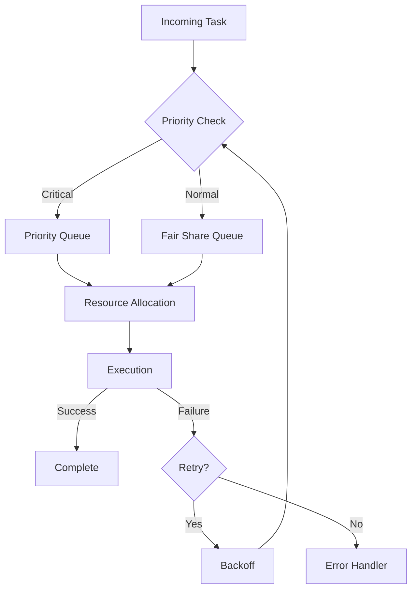

##### Speculative Potential for TDS

Future enhancements could include:

1. **Advanced Routing Capabilities for TDS**

```yaml
future_routing:
  features:
    - ml_based_classification
    - predictive_resource_estimation
    - dynamic_priority_adjustment
    - context_aware_routing
```

2. **Intelligent Load Balancing for TDS**

- ML-powered load prediction
- Automated capacity planning
- Cross-region optimization
- Cost-aware distribution

3. **Enhanced Scheduling for TDS**

```python
class FutureScheduler:
    """
    Potential future scheduler implementation with advanced features
    Note: This is speculative and requires further research
    """
    def __init__(self):
        self.ml_predictor = MLPredictor()  # For predicting task requirements
        self.cost_optimizer = CostOptimizer()  # For optimizing resource costs
        self.context_manager = ContextManager()  # For maintaining task context

    async def schedule(self, task: Task) -> ScheduledTask:
        # Predict resource requirements
        predicted_resources = await self.ml_predictor.predict(task)
        
        # Optimize for cost and performance
        optimal_slot = await self.cost_optimizer.find_optimal_slot(
            task, predicted_resources
        )
        
        # Consider task context and dependencies
        context = await self.context_manager.get_context(task)
        
        return self.create_scheduled_task(task, optimal_slot, context)
```

##### Unknowns and Challenges for TDS

1. **Scaling Considerations for TDS**

- Optimal queue depth determination
- Resource prediction accuracy
- Cross-service dependency management
- State management in distributed scenarios

2. **Performance Optimization for TDS**

```yaml
performance_challenges:
  areas:
    - queue_throughput_optimization
    - resource_prediction_accuracy
    - state_management_overhead
    - failure_recovery_latency
  research_needed:
    - ml_model_selection
    - distributed_state_protocols
    - optimal_retry_strategies
```

##### Vision and Iteration for TDS

The Task Distribution System aims to evolve into an intelligent workload management system that can:

1. **Short-term Goals for TDS**

- Implement basic routing and scheduling
- Establish monitoring and metrics
- Deploy basic load balancing

2. **Medium-term Goals for TDS**

- Add ML-based optimization
- Implement advanced failure recovery
- Enhance resource prediction

3. **Long-term Vision for TDS**

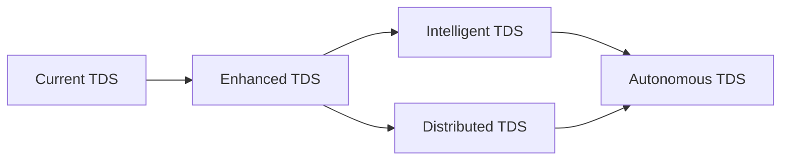

> Note: This documentation represents both implemented features and planned capabilities. Sections marked as speculative require further research and validation before implementation.

#### Resource Management Framework (RMF)

The Resource Management Framework (RMF) serves as the foundation for efficient resource utilization across the NeuroCortex system. This framework integrates with existing components while providing advanced resource optimization capabilities.

##### Current Functionality for RMF

1. **Resource Pools**

```python
class ResourcePool:
    """
    Dynamic resource pool management for NeuroCortex
    Integrates with existing CacheManager and Pipeline components
    """
    def __init__(self, config: Dict[str, Any]):
        self.memory_pool = MemoryManager(config["memory_config"])
        self.cpu_pool = CPUManager(config["compute_resources"])
        self.storage_pool = StorageManager(config["storage_config"])
        self.network_pool = NetworkManager(config["network_config"])
        
    async def allocate_resources(self, task_requirements: ResourceRequirements) -> ResourceAllocation:
        """Allocate resources based on task requirements and current availability"""
        allocation = ResourceAllocation()
        
        # Check resource availability
        if not self._check_availability(task_requirements):
            raise ResourceExhaustedException("Insufficient resources")
            
        # Allocate resources with priority consideration
        allocation.memory = await self.memory_pool.allocate(task_requirements.memory)
        allocation.cpu = await self.cpu_pool.allocate(task_requirements.cpu)
        allocation.storage = await self.storage_pool.allocate(task_requirements.storage)
        
        return allocation
```

2. **Cache Management for RMF**

```python
class DistributedCacheCoordinator:
    """
    Coordinates cache operations across multiple NeuroCortex instances
    """
    def __init__(self, config: Dict[str, Any]):
        self.local_cache = CacheManager(config)
        self.redis_coordinator = RedisCoordinator(config["redis"])
        
    async def coordinate_invalidation(self, cache_key: str):
        """Coordinate cache invalidation across instances"""
        await self.redis_coordinator.publish("cache_invalidate", {
            "key": cache_key,
            "timestamp": datetime.utcnow().isoformat(),
            "source_instance": self.instance_id
        })
```

##### Speculative Potential for RMF

1. **AI-Driven Resource Optimization**

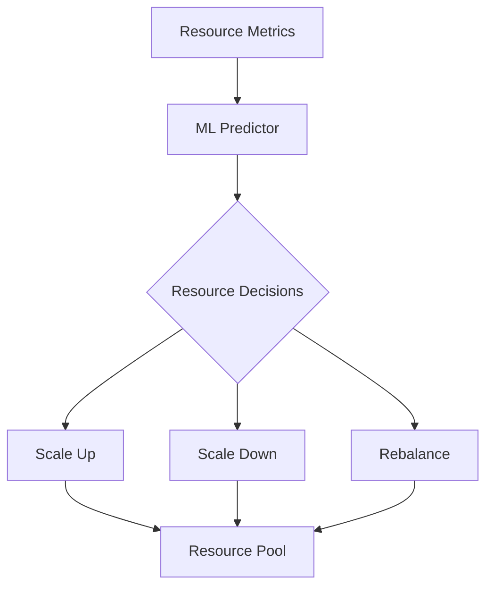

2. **Advanced Resource Management for RMF**

```yaml
future_resource_management:
  ai_optimization:
    enabled: true
    features:
      - predictive_scaling
      - workload_forecasting
      - anomaly_detection
    ml_models:
      - resource_predictor
      - usage_analyzer
      - pattern_detector
```

##### Unknowns and Challenges for RMF

1. **Resource Prediction Accuracy**

- Challenge: Accurate prediction of resource needs for diverse AI workloads
- Potential Solution: Implement progressive learning system that adapts to workload patterns
- Research Needed: Optimal ML models for resource prediction

2. **Distributed State Management**

- Challenge: Maintaining consistent resource state across instances
- Investigation Areas:
  - Consensus protocols
  - State synchronization mechanisms
  - Conflict resolution strategies

##### Vision and Iteration for RMF

The Resource Management Framework aims to evolve into an intelligent system that can:

1. **Short-term Goals**

- Implement basic resource pooling
- Add monitoring and metrics
- Deploy cache coordination

2. **Medium-term Goals**

- Add ML-based optimization
- Implement predictive scaling
- Enhance resource prediction

3. **Long-term Vision**

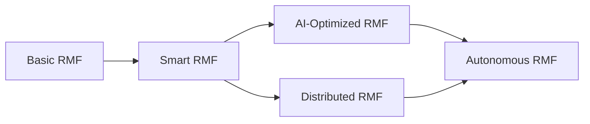

> Note: This framework builds upon existing components while preparing for future enhancements. Integration with the Lake service's storage strategy ensures consistent resource management across the system.

#### Integration Interfaces

1. **Service Connectors**
   - Lake Service Integration
     - Vector storage operations
     - Data transfer patterns
     - Cache synchronization

   - Stream Service Integration
     - Real-time processing
     - Event handling
     - Redis integration

   - Forge Service Integration
     - Model deployment coordination
     - Training feedback loop
     - Resource sharing

2. **External API Gateway**

```yaml
api_gateway:
  rate_limiting:
    enabled: true
    requests_per_second: 1000
  authentication:
    methods: [jwt, api_key]
  monitoring:
    enabled: true
    metrics: [latency, error_rate, throughput]
```

### 1.3 Communication Patterns

1. **Internal Communication**
   - Event-driven architecture
   - Message queuing
   - Pub/sub patterns
   - gRPC for service-to-service

2. **External Communication**
   - RESTful APIs
   - WebSocket connections
   - Streaming interfaces
   - Batch processing endpoints

> Note: The communication patterns between services are partially speculative and may need adjustment based on actual implementation requirements.

### 1.4 State Management

1. **Distributed State**

```yaml
state_management:
  primary_store: redis
  backup_store: postgresql
  sync_interval: "1s"
  consistency_model: "eventual"
```

2. **Session Management**
   - Request tracking
   - Context preservation
   - State recovery
   - Transaction management

## Core Processing Component

### 1. Task Management - Implementation Details

The task management system is implemented through the NeuroCortex class:

```python
class NeuroCortex:
    """Central AI orchestrator for the Datapunk system"""
    
    def __init__(self, config: Dict[str, Any]):
        self.config = config["neurocortex"]
        
        # Initialize core components
        self.cache_manager = CacheManager(self.config["cache"])
        self.model_selector = ModelSelector(self.config["model_selection"])
        
        # Initialize AI engines
        self.haystack_engine = HaystackEngine(
            config=self.config["integrations"]["haystack"],
            cache_manager=self.cache_manager
        )
        self.langchain_engine = LangChainEngine(
            config=self.config["integrations"]["langchain"],
            cache_manager=self.cache_manager
        )
        
        # Initialize pipeline manager
        self.pipeline_manager = PipelineManager(
            config=self.config,
            cache_manager=self.cache_manager,
            model_selector=self.model_selector
        )
```

#### Current Functionality for Task Management

The task management system integrates with both Haystack and LangChain engines, providing unified request processing.

```python
async def process_request(self, input_data: Dict[str, Any]) -> Dict[str, Any]:
    """Process an incoming request through the appropriate pipeline"""
    try:
        # Check cache
        cache_key = f"request:{hash(str(input_data))}"
        cache_result = await self.cache_manager.get(cache_key)
        if cache_result:
            return cache_result

        # Select appropriate model
        selected_model = self.model_selector.select_model(input_data)
        
        # Get appropriate pipeline
        pipeline_type = "realtime" if input_data.get("streaming") else "standard"
        pipeline = self.pipeline_manager.get_pipeline(pipeline_type)
        
        # Process request
        result = await pipeline.run(
            input_data=input_data,
            model=selected_model
        )
        
        # Cache result
        await self.cache_manager.set(cache_key, result)
        
        return result
        
    except Exception as e:
        # Log error and raise appropriate exception
        raise RuntimeError(f"Error processing request: {str(e)}")
```

### 2. Pipeline Management - Implementation Details

The pipeline system is built around the PipelineManager class.

```python
class PipelineManager:
    """Manages processing pipelines for both standard and real-time processing"""
    
    def __init__(self, config: Dict[str, Any], cache_manager: CacheManager, model_selector: ModelSelector):
        self.config = config
        self.cache_manager = cache_manager
        self.model_selector = model_selector
        self.pipelines: Dict[PipelineType, Pipeline] = {}
        
    def get_pipeline(self, pipeline_type: str) -> Pipeline:
        """Get or create pipeline by type"""
        p_type = PipelineType(pipeline_type)
        if p_type not in self.pipelines:
            self.pipelines[p_type] = self._create_pipeline(p_type)
        return self.pipelines[p_type]
        
    def _create_pipeline(self, pipeline_type: PipelineType) -> Pipeline:
        """Create new pipeline based on type"""
        if pipeline_type == PipelineType.STANDARD:
            return self._create_standard_pipeline()
        return self._create_realtime_pipeline()

    def initialize_pipelines(self):
        """Initialize both standard and real-time pipelines"""
        self.pipelines[PipelineType.STANDARD] = self._create_standard_pipeline()
        self.pipelines[PipelineType.REALTIME] = self._create_realtime_pipeline()
```

### 3. Model Management - Integration Architecture

The Haystack integration demonstrates the current model management approach.

```python
class HaystackEngine:
    """Core Haystack integration for document processing and QA"""
    
    def __init__(self, config: Dict[str, Any], cache_manager: CacheManager):
        self.config = config
        self.cache_manager = cache_manager
        self.document_store = self._initialize_document_store()
        self.pipelines: Dict[str, Pipeline] = {}
        
    def _initialize_document_store(self) -> DocumentStore:
        store_config = self.config["document_store"]
        return PostgreSQLDocumentStore(
            host=store_config["host"],
            port=store_config["port"],
            username=store_config["username"],
            password=store_config["password"],
            index=store_config["index"],
            embedding_dim=768  # Default for most transformer models
        )
    
    async def process_documents(self, documents: List[Dict[str, Any]]) -> Dict[str, Any]:
        """Process documents through appropriate Haystack pipeline"""
        pipeline = self._get_pipeline("document_qa")
        return await pipeline.run(documents=documents)
    
    def _get_pipeline(self, pipeline_type: str) -> Pipeline:
        """Get or create pipeline by type"""
        if pipeline_type not in self.pipelines:
            self.pipelines[pipeline_type] = self._create_pipeline(pipeline_type)
        return self.pipelines[pipeline_type]
```

### Speculative Potential for Model Management

1. **Advanced Model Management**

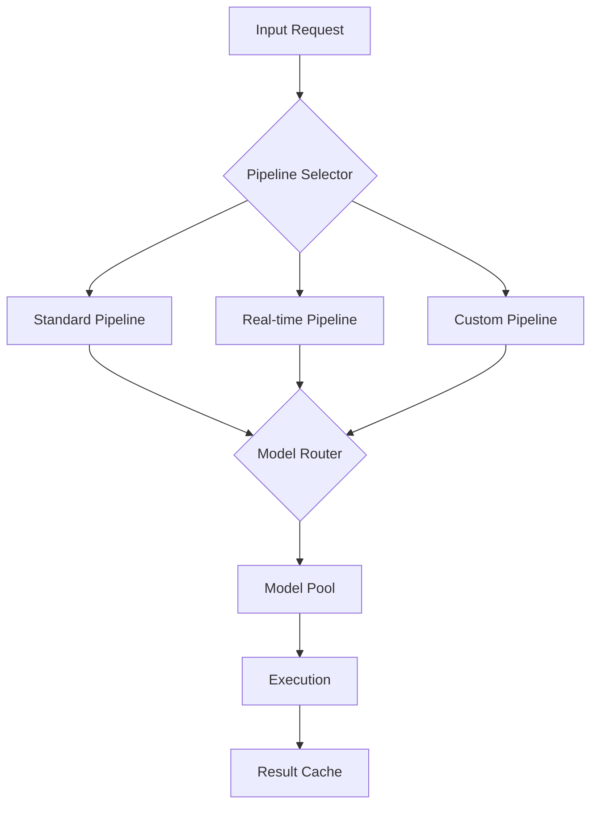

### Intelligent Resource Management

- Dynamic model loading/unloading based on usage patterns
- Predictive resource allocation
- Cross-pipeline optimization

### Unknowns and Challenges for Pipeline Orchestration

1. **Pipeline Optimization**

- Challenge: Optimal pipeline composition for different request types
- Research needed: Performance metrics for various pipeline configurations
- Potential solution: A/B testing framework for pipeline variants

2. **Model Selection Criteria**

- Challenge: Balancing accuracy vs. performance
- Investigation needed: User feedback integration
- Potential approach: Multi-factor scoring system

### Vision and Iteration for Pipeline Orchestration

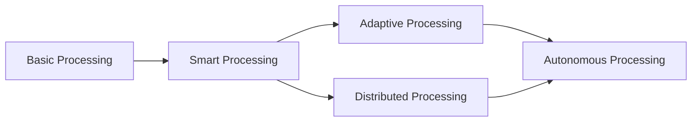

### Development Timeline for Pipeline Orchestration

### Implementation Phases for Pipeline Orchestration

1. **Short-term Goals**
   - Enhance pipeline monitoring
   - Implement basic A/B testing
   - Add performance metrics collection

2. **Medium-term Goals**
   - Develop adaptive pipeline routing
   - Create pipeline templates
   - Implement advanced caching strategies

3. **Long-term Vision**
   - Fully autonomous processing
   - Self-optimizing pipelines
   - Dynamic resource management

### 3. Integration Architecture

#### 1. Lake Service Integration

##### Current Implementation Details of Lake Service Integration

The Lake service integration provides vector storage operations and data management through a dedicated connector system. This enables efficient handling of high-dimensional data while maintaining synchronization with the cache layer.

```python
class LakeServiceConnector:
    """Manages integration with the Lake service for vector operations and data storage"""
    
    def __init__(self, config: Dict[str, Any], cache_manager: CacheManager):
        self.config = config
        self.cache_manager = cache_manager
        self.vector_store = self._initialize_vector_store()
        
    async def store_vectors(self, vectors: List[np.ndarray], metadata: Dict[str, Any]) -> str:
        """Store vectors with metadata in Lake service"""
        cache_key = f"vectors:{hash(str(vectors))}"
        try:
            await self.vector_store.store(
                vectors=vectors,
                metadata=metadata,
                index_name=self.config["index_name"]
            )
            await self.cache_manager.set(cache_key, {"status": "stored"})
            return cache_key
        except Exception as e:
            raise StorageError(f"Vector storage failed: {str(e)}")
```

```yaml
resource_coordination:
  maintenance_window:
    cpu_allocation: "75% available"
    io_priority: high
    memory_reservation: "4GB"
  conflict_resolution:
    - job_prioritization
    - resource_scheduling
    - workload_balancing
```

##### Key Features

- Vectorized data storage with metadata support
- Automatic cache synchronization
- Configurable resource allocation
- Error handling and recovery mechanisms

#### 2. Stream Service Integration

```python
class StreamServiceConnector:
    """Manages real-time data processing with Stream service"""
    
    def __init__(self, config: Dict[str, Any], redis_client: Redis):
        self.config = config
        self.redis_client = redis_client
        self.event_handlers = self._initialize_handlers()
        
    async def process_event(self, event: Dict[str, Any]) -> None:
        """Process incoming real-time events"""
        event_type = event.get("type")
        if handler := self.event_handlers.get(event_type):
            await handler(event)
        else:
            raise UnknownEventError(f"No handler for event type: {event_type}")
```

##### Current Implementation Details of Stream Service Integration

```python
class StreamServiceConnector:
    """Manages real-time data processing with Stream service"""
    
    def __init__(self, config: Dict[str, Any], redis_client: Redis):
        self.config = config
        self.redis_client = redis_client
        self.event_handlers = self._initialize_handlers()
        
    async def process_event(self, event: Dict[str, Any]) -> None:
        """Process incoming real-time events"""
        event_type = event.get("type")
        if handler := self.event_handlers.get(event_type):
            await handler(event)
        else:
            raise UnknownEventError(f"No handler for event type: {event_type}")
```

The Stream service handles real-time data processing through event-driven architecture. It leverages Redis for temporary storage and maintains persistent connections for real-time updates.

##### Key Features of Stream Service Integration

- Event-driven processing pipeline
- Redis-backed temporary storage
- Dynamic event routing
- Scalable event handling

#### 3. Forge Service Integration

##### Current Implementation Details of Forge Service Integration

```python
class ForgeServiceConnector:
    """Coordinates model deployment and training with Forge service"""
    
    def __init__(self, config: Dict[str, Any]):
        self.config = config
        self.model_registry = ModelRegistry(config["registry"])
        
    async def deploy_model(self, model_id: str, version: str) -> Dict[str, Any]:
        """Deploy model from Forge to Cortex"""
        deployment_config = {
            "model_id": model_id,
            "version": version,
            "resource_limits": self.config["deployment"]["resource_limits"],
            "cache_strategy": self.config["deployment"]["cache_strategy"]
        }
        return await self.model_registry.deploy(deployment_config)
```

The Forge service manages model deployment and training feedback loops, ensuring consistent model versioning and resource utilization across the system.

##### Key Features of Forge Service Integration

- Automated model deployment pipeline
- Version-controlled model registry
- Resource sharing optimization
- Training feedback integration

### 4. Cross-Service Integration

#### Current Implementation Details of Cross-Service Integration

The cross-service integration ensures consistent state management and intelligent resource sharing across the system. This includes adaptive routing mechanisms and predictive optimization strategies.

##### Key Features

- Unified state management
- Intelligent resource sharing
- Adaptive routing mechanisms
- Predictive optimization

##### Future Capabilities

- Self-healing integration patterns
- ML-powered resource allocation
- Dynamic service scaling
- Automated performance optimization

#### Speculative Potential of Cross-Service Integration

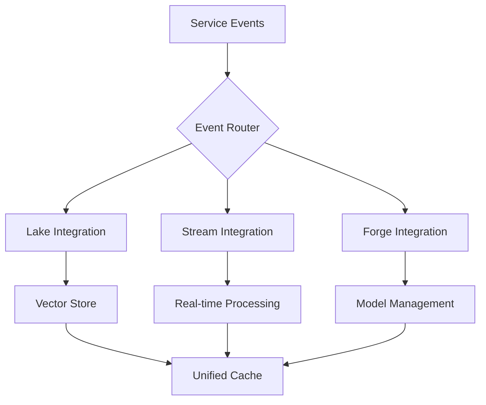

### 5. Cross-Service State Management

- Challenge: Maintaining consistency across services
- Research needed: Distributed state protocols
- Potential solution: Event sourcing pattern

### Resource Optimization

- Challenge: Efficient resource sharing
- Investigation needed: Dynamic allocation strategies
- Potential approach: ML-based resource prediction

## Vision and Iteration

### 6. Development Roadmap

1. **Short-term Goals**
   - Implement basic service connectors
   - Add monitoring and metrics
   - Establish error handling patterns

2. **Medium-term Goals**
   - Develop smart routing
   - Implement predictive caching
   - Add cross-service optimization

3. **Long-term Vision**
   - Fully autonomous service coordination
   - Self-healing integration patterns
   - ML-powered resource optimization

## 4. Resource Management

### # Memory Management in NeuroCortex Orchestrator

## Current Functionality

The Memory Management system in NeuroCortex Orchestrator serves as the central resource controller, optimizing memory allocation across different components while ensuring system stability and performance.

### Core Components

1. **Memory Allocation System**

```yaml
memory_config:
  base_allocation: 2GB
  max_allocation: 8GB
  buffer_pool: 512MB
  cache_reserved: 1GB
  emergency_buffer: 256MB
```

2. **Resource Limiting Framework**

```python
class MemoryManager:
    def __init__(self):
        self.total_memory = get_system_memory()
        self.allocation_map = {}
        self.warning_threshold = 0.85
        self.critical_threshold = 0.95
    
    def allocate(self, service_name: str, requested_memory: int) -> bool:
        if self.current_usage + requested_memory > self.total_memory * self.warning_threshold:
            return self._handle_high_memory_pressure()
        return self._perform_allocation(service_name, requested_memory)
```

### Current Integration Points

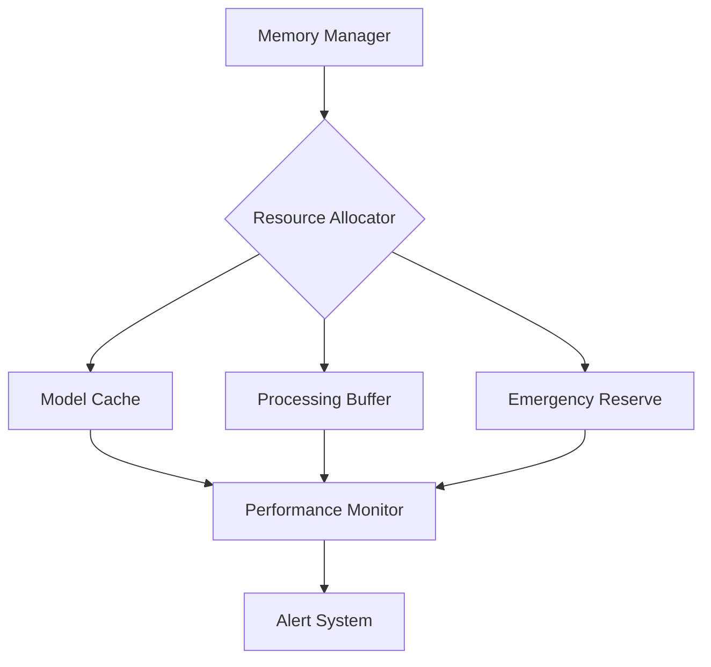

## Speculative Potential

### Advanced Memory Management Features

1. **ML-Powered Memory Optimization**

```python
class MLMemoryOptimizer:
    def predict_allocation(self, service_metrics: Dict) -> float:
        # Use historical data to predict optimal memory allocation
        return self.model.predict(service_metrics)
    
    def adjust_dynamically(self, current_load: float) -> None:
        prediction = self.predict_allocation(self.get_metrics())
        self.memory_manager.reallocate(prediction)
```

2. **Cross-Service Memory Sharing**

```yaml
shared_memory_pool:
  total_size: 4GB
  allocation_strategy: dynamic
  services:
    - cortex_inference
    - model_cache
    - vector_operations
  priority_levels:
    high: 50%
    medium: 30%
    low: 20%
```

## Unknowns and Challenges

### Current Investigation Areas

1. **Memory Fragmentation**

- Challenge: Long-running services causing memory fragmentation
- Potential Solution: Implementing memory compaction during low-usage periods
- Research Needed: Impact on real-time performance

2. **Cross-Service Memory Optimization**

- Challenge: Optimal memory sharing between services
- Investigation: ML-based prediction of memory requirements
- Open Question: Balance between isolation and sharing

### Experimental Approaches

```python
class MemoryOptimizationExperiment:
    def __init__(self):
        self.metrics = []
        self.strategies = {
            'baseline': StandardAllocator(),
            'ml_powered': MLPoweredAllocator(),
            'hybrid': HybridAllocator()
        }
    
    def run_experiment(self, duration: int) -> Dict:
        results = {}
        for name, strategy in self.strategies.items():
            results[name] = self.measure_performance(strategy, duration)
        return results
```

## Vision and Iteration

### Development Roadmap

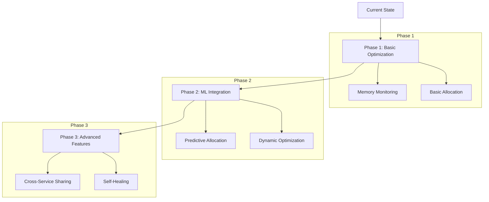

### Implementation Priorities

1. **Short-term Goals**

- Implement basic memory monitoring
- Establish allocation limits
- Deploy alert system

2. **Medium-term Goals**

- Develop ML-based prediction
- Implement dynamic reallocation
- Enhance monitoring metrics

3. **Long-term Vision**

- Self-optimizing memory management
- Cross-service memory sharing
- Predictive scaling

### Integration with Existing Systems

References existing integration patterns from:

```markdown
datapunk/docs/App/Cortex/in-progress/cortex-neurocortex-orchestrator.md
startLine: 831
endLine: 845
```

### Cache Strategy in NeuroCortex Orchestrator

#### Current Functionality (Cache Strategy)

The NeuroCortex Orchestrator implements a sophisticated multi-level caching system designed to optimize performance across different types of AI operations while maintaining data consistency and resource efficiency.

#### Core Architecture (Cache Strategy)

```python
class CacheManager:
    def __init__(self, config: Dict[str, Any]):
        self.l1_cache = MemoryCache(config['l1_cache'])
        self.l2_cache = RedisCache(config['l2_cache'])
        self.l3_cache = DiskCache(config['l3_cache'])
        self.prefetch_manager = PrefetchManager(config['prefetch'])
        self.metrics = CacheMetrics()

    async def get(self, key: str, level: Optional[str] = None) -> Any:
        # Try each cache level in sequence
        for cache in self._get_cache_sequence(level):
            value = await cache.get(key)
            if value is not None:
                self.metrics.record_hit(cache.level)
                return value
        self.metrics.record_miss()
        return None

    async def invalidate(self, pattern: str) -> None:
        # Coordinate invalidation across all cache levels
        tasks = [cache.invalidate(pattern) for cache in self.caches]
        await asyncio.gather(*tasks)
```

#### Cache Levels Configuration (Cache Strategy)

```yaml
cache_config:
  l1_cache:
    type: memory
    size: 2GB
    ttl: 300  # 5 minutes
    eviction_policy: LRU
  
  l2_cache:
    type: redis
    size: 8GB
    ttl: 3600  # 1 hour
    compression: true
    
  l3_cache:
    type: disk
    size: 20GB
    ttl: 86400  # 24 hours
    path: /cache/cortex
```

#### Current Integration Points (Cache Strategy)

References existing integration patterns from:

```markdown:datapunk/docs/App/Cortex/cortex-architecture.md
startLine: 56
endLine: 62
```

#### Speculative Potential (Cache Strategy)

#### Advanced Caching Features (Cache Strategy)

1. **ML-Powered Cache Optimization**

```python
class MLCacheOptimizer:
    def __init__(self, cache_manager: CacheManager):
        self.cache_manager = cache_manager
        self.model = self._load_prediction_model()
        
    async def optimize(self, metrics: Dict[str, float]) -> None:
        prediction = self.model.predict(metrics)
        await self._adjust_cache_parameters(prediction)
        
    async def _adjust_cache_parameters(self, prediction: Dict[str, float]) -> None:
        # Dynamically adjust cache sizes and TTLs based on predictions
        for level, params in prediction.items():
            await self.cache_manager.update_config(level, params)
```

#### Distributed Caching Architecture (Cache Strategy)

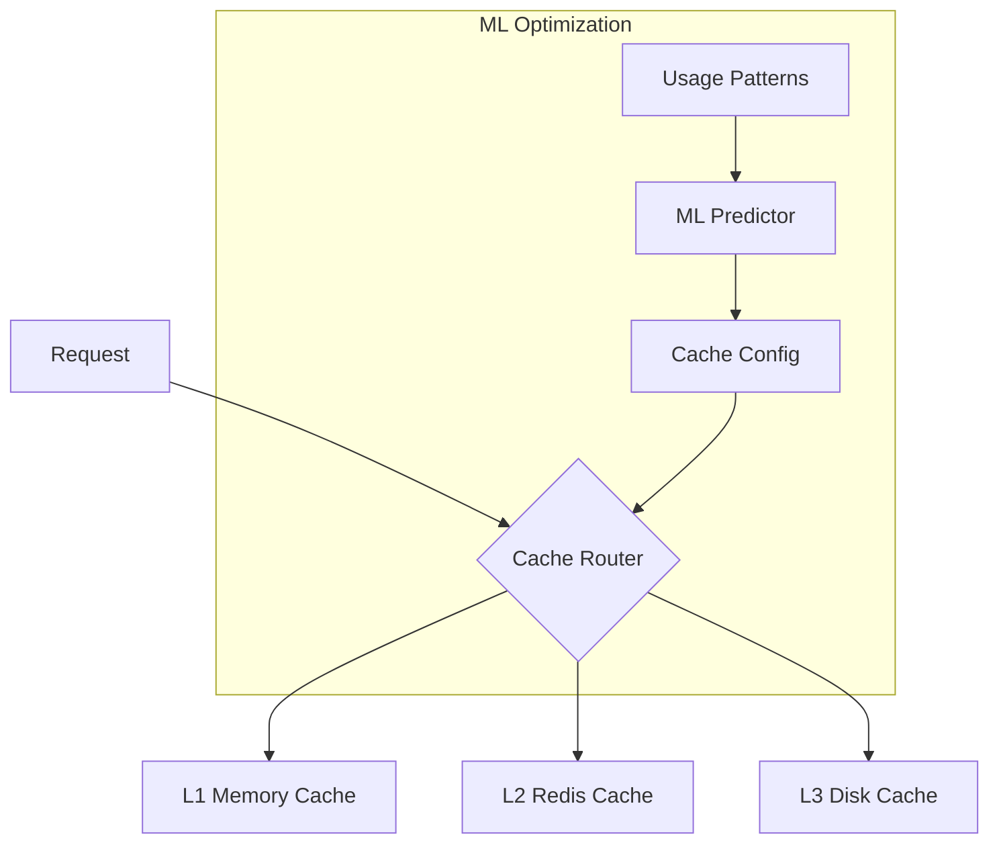

#### Unknowns and Challenges (Cache Strategy)

##### 1. Cache Coherency (Cache Strategy)

Current challenges in maintaining consistency across distributed cache instances:

```yaml
coherency_challenges:
  - concurrent_updates
  - network_partitions
  - invalidation_propagation
  - version_conflicts
```

##### 2. Resource Optimization (Cache Strategy)

Experimental approaches to resource allocation:

```python
class ResourceOptimizer:
    def __init__(self):
        self.experiments = {
            'dynamic_sizing': DynamicCacheSizeExperiment(),
            'smart_prefetch': PredictivePrefetchExperiment(),
            'adaptive_ttl': AdaptiveTTLExperiment()
        }
    
    async def run_experiments(self) -> Dict[str, MetricResults]:
        results = {}
        for name, experiment in self.experiments.items():
            results[name] = await experiment.execute()
        return results
```

#### Vision and Iteration (Cache Strategy)

##### Development Roadmap (Cache Strategy)

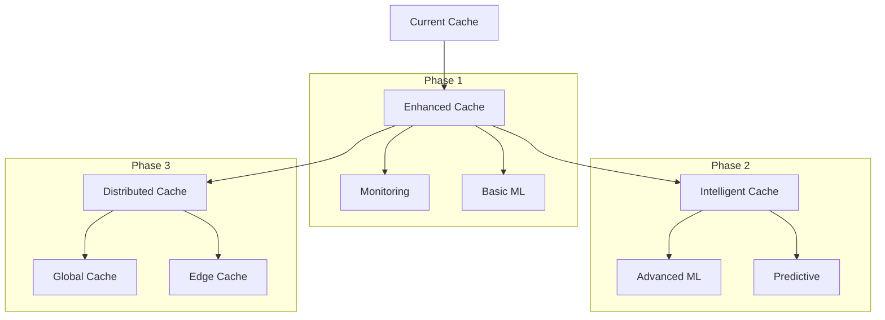

##### Implementation Priorities (Cache Strategy)

1. **Short-term Goals**

```yaml
priorities:
  immediate:
    - enhanced_monitoring
    - basic_ml_integration
    - improved_invalidation
  metrics:
    - cache_hit_ratio
    - latency_reduction
    - memory_efficiency
```

2. **Medium-term Vision**

```yaml
advanced_features:
  - predictive_prefetching
  - dynamic_partitioning
  - cross_service_optimization
  integrations:
    - forge_service_coordination
    - lake_service_synchronization
    - stream_service_realtime
```

##### Integration with Existing Systems (Cache Strategy)

References existing patterns from:

```markdown
datapunk/docs/App/Cortex/in-progress/cortex-lake-integration.md
startLine: 1
endLine: 3
```

### Processing Optimization in NeuroCortex Orchestrator

#### Current Functionality (Processing Optimization)

The Processing Optimization system manages computational resources and workload distribution across the NeuroCortex ecosystem, implementing sophisticated batch processing and queue management strategies.

#### Core Components (Processing Optimization)

1. **Batch Processing Engine**

```python
class BatchProcessor:
    def __init__(self, config: Dict[str, Any]):
        self.max_batch_size = config["max_batch_size"]
        self.timeout = config["batch_timeout"]
        self.queue_manager = QueueManager(config["queue"])
        self.resource_monitor = ResourceMonitor()
        
    async def process_batch(self, items: List[Any]) -> List[Any]:
        optimal_size = await self._calculate_optimal_batch_size()
        batches = self._create_batches(items, optimal_size)
        return await self._process_batches(batches)
        
    async def _calculate_optimal_batch_size(self) -> int:
        resources = await self.resource_monitor.get_current_status()
        return min(
            self.max_batch_size,
            int(resources.available_memory / self.memory_per_item)
        )
```

2. **Queue Management System**

```python
class QueueManager:
    def __init__(self, config: Dict[str, Any]):
        self.queues = {
            'high': PriorityQueue(maxsize=1000),
            'medium': PriorityQueue(maxsize=5000),
            'low': PriorityQueue(maxsize=10000)
        }
        self.backpressure = BackpressureHandler(config["backpressure"])
        
    async def enqueue(self, item: Any, priority: str = 'medium') -> None:
        if await self.backpressure.should_accept():
            await self.queues[priority].put(item)
        else:
            raise QueueFullException("Backpressure applied")
```

#### Current Architecture (Processing Optimization)

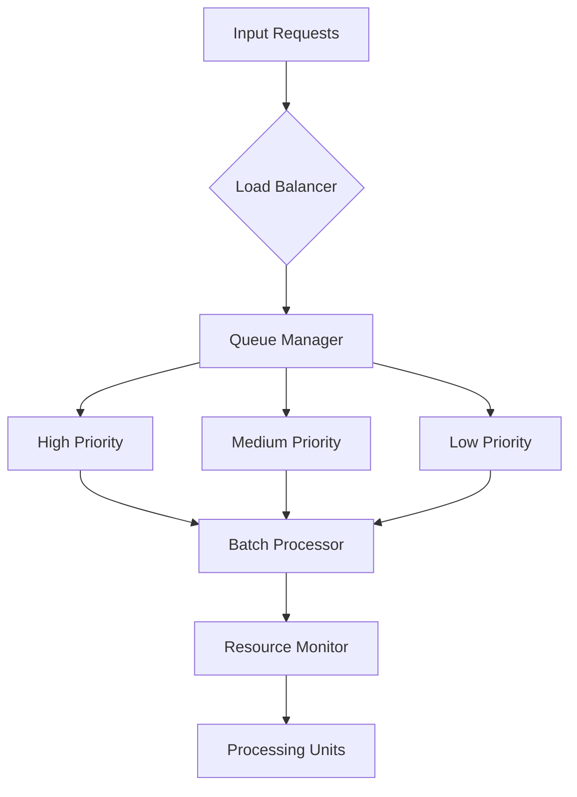

#### Speculative Potential (Processing Optimization)

##### 1. ML-Powered Workload Optimization (Processing Optimization)

```python
class MLWorkloadOptimizer:
    def __init__(self, history_window: int = 1000):
        self.model = self._initialize_model()
        self.history = deque(maxlen=history_window)
        
    async def predict_optimal_config(self, metrics: Dict[str, float]) -> Dict[str, Any]:
        prediction = self.model.predict(self._prepare_features(metrics))
        return {
            'batch_size': prediction.batch_size,
            'queue_limits': prediction.queue_limits,
            'resource_allocation': prediction.resources
        }
```

##### 2. Dynamic Resource Allocation (Processing Optimization)

```yaml
resource_optimization:
  strategies:
    - name: "predictive_scaling"
      enabled: true
      parameters:
        window_size: 300
        update_frequency: 60
        min_resources: 
          cpu: 1
          memory: "1G"
        max_resources:
          cpu: 8
          memory: "16G"
    - name: "load_shedding"
      enabled: true
      parameters:
        threshold: 0.85
        recovery_time: 30
```

#### Unknowns and Challenges (Processing Optimization)

##### 1. Optimal Batch Size Determination (Processing Optimization)

- Challenge: Balancing throughput vs. latency
- Research needed: Impact of varying batch sizes on different workload types
- Potential solution: Adaptive batch sizing based on workload characteristics

##### 2. Queue Priority Management (Processing Optimization)

- Challenge: Fair scheduling with multiple priority levels
- Investigation: Prevention of priority inversion
- Open question: Optimal queue depth per priority level

#### Experimental Framework (Processing Optimization)

```python
class ProcessingOptimizationExperiment:
    def __init__(self):
        self.metrics = MetricsCollector()
        self.experiments = {
            'batch_size': BatchSizeExperiment(),
            'queue_priority': QueuePriorityExperiment(),
            'resource_allocation': ResourceAllocationExperiment()
        }
    
    async def run_experiments(self) -> ExperimentResults:
        results = {}
        for name, experiment in self.experiments.items():
            results[name] = await self._run_single_experiment(experiment)
        return self._analyze_results(results)
```

#### Vision and Iteration (Processing Optimization)

##### Evolution Roadmap (Processing Optimization)

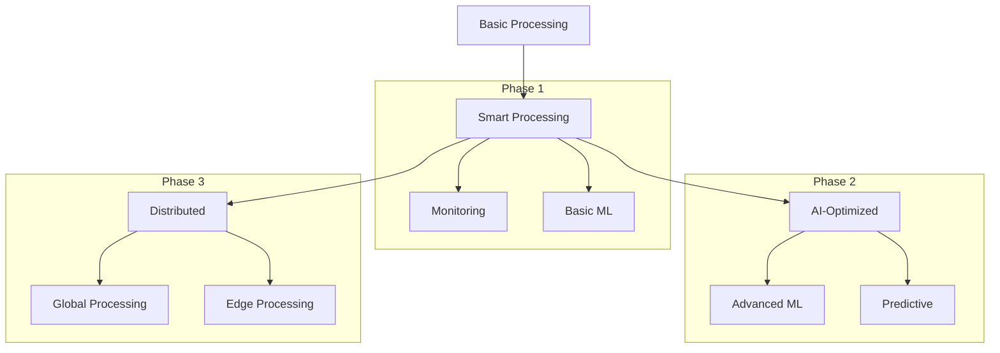

##### Integration with Existing Systems (Processing Optimization)

References existing patterns from:

```markdown
datapunk/docs/App/Cortex/cortex-architecture.md
startLine: 32
endLine: 37
```

##### Resource Optimization Strategy (Processing Optimization)

References configuration from:

```markdown
datapunk/docs/App/architecture.md
startLine: 141
endLine: 154
```

### Security Framework in NeuroCortex Orchestrator

#### Current Functionality (Security Framework)

The Security Framework implements comprehensive protection for data and access control within the NeuroCortex ecosystem, ensuring compliance with industry standards while maintaining system performance.

#### Core Security Architecture (Security Framework)

```python
class SecurityManager:
    def __init__(self, config: Dict[str, Any]):
        self.encryption_manager = EncryptionManager(config['encryption'])
        self.access_controller = AccessController(config['access'])
        self.audit_logger = AuditLogger(config['audit'])
        self.compliance_checker = ComplianceChecker(config['compliance'])
        
    async def protect_data(self, data: Any, context: SecurityContext) -> ProtectedData:
        encryption_level = await self.compliance_checker.get_required_level(context)
        encrypted_data = await self.encryption_manager.encrypt(data, encryption_level)
        await self.audit_logger.log_operation('encrypt', context)
        return encrypted_data
```

#### Current Security Configuration (Security Framework)

```yaml
security_config:
  encryption:
    default_algorithm: "AES-256-GCM"
    key_rotation_period: "30d"
    minimum_key_length: 256
    
  access_control:
    authentication:
      providers: ["oauth2", "jwt"]
      session_timeout: 3600
      max_failed_attempts: 3
    
    authorization:
      model: "RBAC"
      default_role: "reader"
      privilege_escalation: "strict"
      
  audit:
    log_retention: "90d"
    sensitive_operations:
      - model_access
      - data_modification
      - configuration_changes
```

#### Security Flow Architecture (Security Framework)

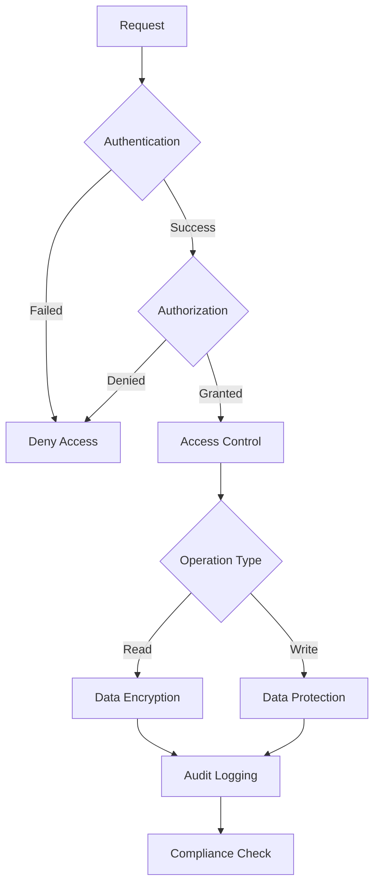

#### Speculative Potential (Security Framework)

##### 1. Zero-Trust Implementation (Security Framework)

```python
class ZeroTrustManager:
    def __init__(self):
        self.context_analyzer = ContextAnalyzer()
        self.risk_evaluator = RiskEvaluator()
        self.policy_engine = PolicyEngine()
        
    async def validate_request(self, request: Request) -> bool:
        context = await self.context_analyzer.analyze(request)
        risk_score = await self.risk_evaluator.calculate(context)
        return await self.policy_engine.evaluate(context, risk_score)
```

##### 2. AI-Powered Security (Security Framework)

```yaml
ai_security:
  features:
    - anomaly_detection:
        model: "transformer-based"
        confidence_threshold: 0.95
    - threat_prediction:
        window_size: "1h"
        update_frequency: "5m"
    - access_pattern_analysis:
        behavioral_baseline: true
        continuous_learning: true
```

#### Unknowns and Challenges (Security Framework)

##### 1. Performance Impact (Security Framework)

- Challenge: Balancing security with system performance
- Research needed: Optimal encryption strategies for AI workloads
- Potential solution: Selective encryption based on data sensitivity

##### 2. Compliance Evolution (Security Framework)

- Challenge: Adapting to changing regulations
- Investigation: Automated compliance checking
- Open question: Integration with external compliance frameworks

#### Experimental Framework (Security Framework)

```python
class SecurityExperiment:
    def __init__(self):
        self.metrics = SecurityMetrics()
        self.experiments = {
            'encryption_performance': EncryptionPerformanceTest(),
            'access_control_overhead': AccessControlOverheadTest(),
            'compliance_automation': ComplianceAutomationTest()
        }
    
    async def run_experiments(self) -> ExperimentResults:
        results = {}
        for name, experiment in self.experiments.items():
            results[name] = await self._run_single_experiment(experiment)
        return self._analyze_results(results)
```

#### Vision and Iteration (Security Framework)

##### Security Evolution Roadmap (Security Framework)

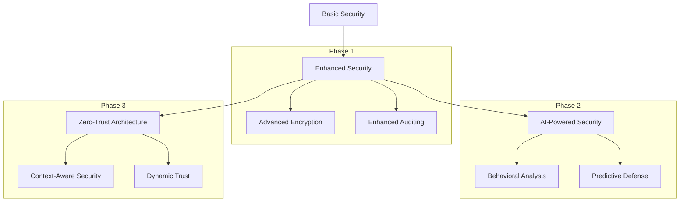

##### Integration with Existing Systems (Security Framework)

References security scanning configuration from:

```markdown
datapunk/docs/App/Cortex/original-datapunk-cortex.md
startLine: 1284
endLine: 1302
```

##### Deployment Validation Strategy (Security Framework)

References deployment validation patterns from:

```markdown
datapunk/docs/App/Cortex/original-datapunk-cortex.md
startLine: 1304
endLine: 1318
```

### Monitoring and Health in NeuroCortex Orchestrator

#### Current Functionality (Monitoring and Health)

The Monitoring and Health system provides comprehensive observability across the NeuroCortex ecosystem, implementing real-time health checks and metrics collection for system reliability and performance optimization.

#### Core Monitoring Architecture (Monitoring and Health)

```python
class HealthMonitor:
    def __init__(self, config: Dict[str, Any]):
        self.metrics_collector = MetricsCollector(config['metrics'])
        self.health_checker = HealthChecker(config['health'])
        self.alert_manager = AlertManager(config['alerts'])
        self.prometheus_client = PrometheusClient()
        
    async def check_system_health(self) -> HealthStatus:
        component_status = await self.health_checker.check_all_components()
        metrics = await self.metrics_collector.get_current_metrics()
        alerts = await self.alert_manager.get_active_alerts()
        
        return HealthStatus(
            components=component_status,
            metrics=metrics,
            alerts=alerts
        )
```

#### Metrics Configuration (Monitoring and Health)

```yaml
monitoring_config:
  metrics:
    collection_interval: 15s
    retention_period: 30d
    exporters:
      - prometheus
      - opentelemetry
      - custom_exporter
    
  health_checks:
    components:
      - name: model_service
        endpoint: /health
        interval: 30s
        timeout: 5s
      - name: cache_service
        endpoint: /health
        interval: 15s
        timeout: 3s
    
  alerting:
    rules:
      - name: high_latency
        threshold: 500ms
        window: 5m
      - name: error_spike
        threshold: 1%
        window: 1m
```

#### Current Monitoring Flow (Monitoring and Health)

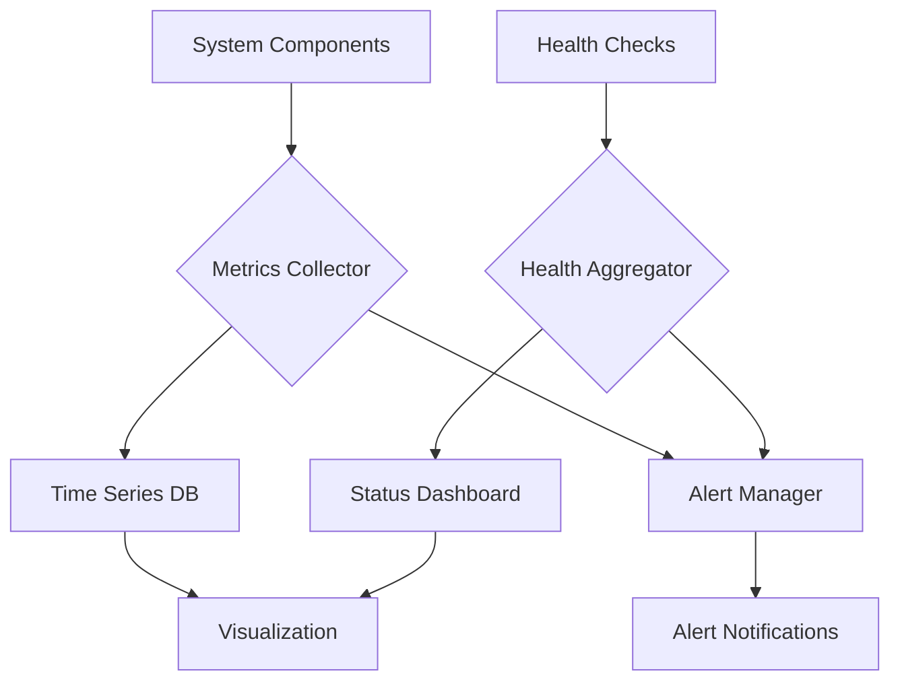

#### Speculative Potential (Monitoring and Health)

##### 1. AI-Powered Monitoring (Monitoring and Health)

```python
class MLMonitoringEnhancement:
    def __init__(self):
        self.anomaly_detector = AnomalyDetector()
        self.prediction_engine = MetricPredictor()
        self.optimization_advisor = OptimizationAdvisor()
        
    async def analyze_metrics(self, metrics: Dict[str, float]) -> Analysis:
        anomalies = await self.anomaly_detector.detect(metrics)
        predictions = await self.prediction_engine.forecast(metrics)
        recommendations = await self.optimization_advisor.suggest(metrics, predictions)
        
        return Analysis(
            anomalies=anomalies,
            predictions=predictions,
            recommendations=recommendations
        )
```

##### 2. Advanced Health Monitoring Features (Monitoring and Health)

```yaml
advanced_monitoring:
  ai_features:
    anomaly_detection:
      models:
        - isolation_forest
        - lstm_detector
      confidence_threshold: 0.95
    
    predictive_maintenance:
      forecast_window: 24h
      update_frequency: 1h
      
    auto_remediation:
      enabled: true
      safety_checks: true
      max_actions_per_hour: 5
```

#### Unknowns and Challenges (Monitoring and Health)

##### 1. Metric Correlation (Monitoring and Health)

- Challenge: Understanding complex relationships between metrics
- Research needed: Causal inference in monitoring data
- Potential solution: Graph-based metric relationship modeling

##### 2. Adaptive Thresholds (Monitoring and Health)

- Challenge: Setting dynamic, context-aware alert thresholds
- Investigation: ML-based threshold adjustment
- Open question: Balance between sensitivity and alert fatigue

#### Experimental Framework (Monitoring and Health)

```python
class MonitoringExperiment:
    def __init__(self):
        self.experiments = {
            'adaptive_thresholds': AdaptiveThresholdExperiment(),
            'correlation_analysis': MetricCorrelationExperiment(),
            'prediction_accuracy': PredictionAccuracyExperiment()
        }
    
    async def run_experiments(self) -> ExperimentResults:
        results = {}
        for name, experiment in self.experiments.items():
            results[name] = await self._run_single_experiment(experiment)
        return self._analyze_results(results)
```

#### Vision and Iteration (Monitoring and Health)

##### Monitoring Evolution Roadmap (Monitoring and Health)

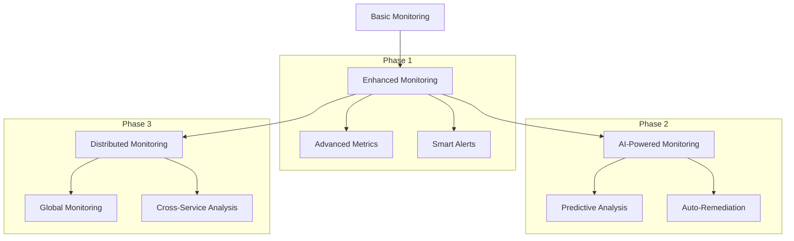

##### Integration with Existing Systems (Monitoring and Health)

References performance benchmarking configuration from:

```markdown:datapunk/docs/App/Cortex/original-datapunk-cortex.md
startLine: 1264
endLine: 1281
```

##### Health Check Implementation (Monitoring and Health)

References health check patterns from:

```markdown:datapunk/docs/App/Services/datapunk-cortex.md
startLine: 80
endLine: 93
```

### Development and Testing in NeuroCortex Orchestrator 

#### Current Functionality (Development and Testing)

The Development and Testing framework provides a comprehensive environment for developing, testing, and debugging the NeuroCortex Orchestrator, ensuring code quality and system reliability.

#### Local Development Environment (Development and Testing)

```python
class DevelopmentEnvironment:
    def __init__(self, config: Dict[str, Any]):
        self.docker_compose = DockerCompose("dev-compose.yml")
        self.hot_reload = HotReloadManager()
        self.debug_tools = DebugToolkit()
        self.test_runners = TestRunnerManager()
        
    async def setup_environment(self) -> None:
        await self.docker_compose.up()
        await self.hot_reload.start()
        await self.debug_tools.initialize()
        
    async def run_test_suite(self, suite: str) -> TestResults:
        return await self.test_runners.run_suite(suite)
```

#### Development Configuration (Development and Testing)

```yaml
development_config:
  environment:
    docker:
      compose_file: docker-compose.dev.yml
      volumes:
        - ./src:/app/src
        - ./tests:/app/tests
        - ./data:/app/data
    
    hot_reload:
      watch_paths:
        - src/
        - config/
      exclude_patterns:
        - "*.pyc"
        - "__pycache__"
        
    debug:
      port: 5678
      remote_debugging: true
      profiling: true
```

#### Testing Architecture (Development and Testing)

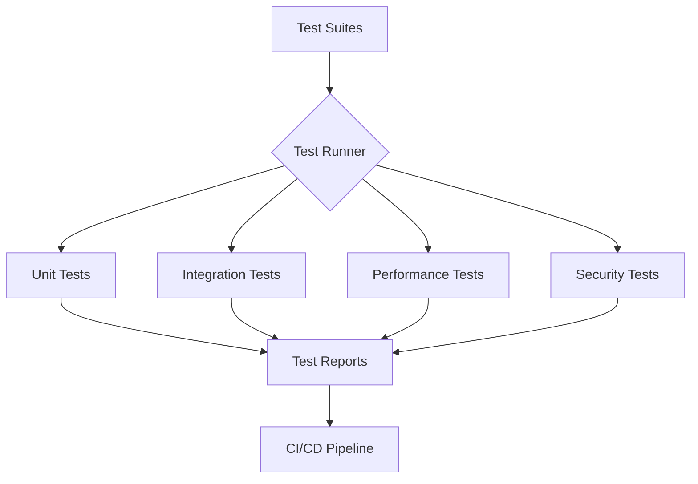

#### Speculative Potential (Development and Testing)

##### 1. Advanced Testing Features (Development and Testing)

1. **AI-Powered Testing**

```python
class AITestEnhancement:
    def __init__(self):
        self.test_generator = TestCaseGenerator()
        self.coverage_optimizer = CoverageOptimizer()
        self.regression_detector = RegressionDetector()
        
    async def generate_tests(self, source_code: str) -> List[TestCase]:
        code_analysis = await self.analyze_code(source_code)
        test_cases = await self.test_generator.generate(code_analysis)
        optimized_cases = await self.coverage_optimizer.optimize(test_cases)
        return optimized_cases
```

##### 2. Intelligent Development Environment (Development and Testing)

```yaml
smart_dev_features:
  code_analysis:
    - real_time_suggestions
    - performance_insights
    - security_checks
  test_automation:
    - ai_generated_tests
    - intelligent_debugging
    - automated_fixes
  monitoring:
    - development_metrics
    - resource_usage
    - test_coverage
```

#### Unknowns and Challenges (Development and Testing)

##### 1. Test Coverage Optimization (Development and Testing)

- Challenge: Achieving comprehensive test coverage without redundancy
- Research needed: AI-driven test case generation
- Potential solution: Genetic algorithms for test optimization

##### 2. Development Environment Performance (Development and Testing)

- Challenge: Balancing development tools with system resources
- Investigation: Resource-efficient debugging methods
- Open question: Optimal configuration for different development scenarios

#### Experimental Framework (Development and Testing)

```python
class DevelopmentExperiment:
    def __init__(self):
        self.experiments = {
            'test_generation': TestGenerationExperiment(),
            'debug_performance': DebugPerformanceExperiment(),
            'coverage_analysis': CoverageAnalysisExperiment()
        }
        
    async def run_experiments(self) -> ExperimentResults:
        results = {}
        for name, experiment in self.experiments.items():
            results[name] = await self._run_single_experiment(experiment)
        return self._analyze_results(results)
```

#### Vision and Iteration (Development and Testing)

##### Development Evolution Roadmap (Development and Testing)

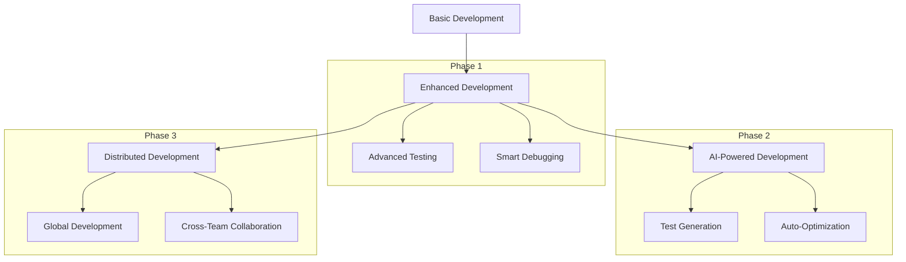

##### Integration with Existing Systems (Development and Testing) 

References performance benchmarking configuration from:

```markdown:datapunk/docs/App/Cortex/original-datapunk-cortex.md
startLine: 1264
endLine: 1281
```

##### Testing Implementation (Development and Testing)

References testing patterns from:

```markdown:datapunk/docs/App/Services/datapunk-cortex.md
startLine: 80
endLine: 93
```

##### Security Testing Integration (Development and Testing)

References security scanning configuration from:

```markdown:datapunk/docs/App/Cortex/original-datapunk-cortex.md
startLine: 1284
endLine: 1302
```

### Future Considerations in NeuroCortex Orchestrator

#### Current Functionality (Future Considerations)

The NeuroCortex Orchestrator currently implements foundational scalability and feature management capabilities, serving as the backbone for future expansions.

#### Core Scaling Architecture (Future Considerations)

```python
class ScalabilityManager:
    def __init__(self, config: Dict[str, Any]):
        self.load_balancer = LoadBalancer(config['load_balancing'])
        self.resource_manager = ResourceManager(config['resources'])
        self.scaling_policy = ScalingPolicy(config['scaling'])
        
    async def evaluate_scaling_needs(self) -> ScalingDecision:
        current_load = await self.load_balancer.get_metrics()
        resource_usage = await self.resource_manager.get_usage()
        return await self.scaling_policy.make_decision(current_load, resource_usage)
```

#### Base Configuration (Future Considerations)

```yaml
scaling_config:
  horizontal_scaling:
    min_instances: 2
    max_instances: 10
    scale_up_threshold: 0.75
    scale_down_threshold: 0.25
    
  load_distribution:
    algorithm: "least_connections"
    health_check_interval: 30s
    failure_threshold: 3
    
  resource_limits:
    cpu_threshold: 0.8
    memory_threshold: 0.75
    storage_threshold: 0.9
```

#### Speculative Potential (Future Considerations)

##### 1. Advanced Scaling Features (Future Considerations)

1. **AI-Powered Resource Management**

```python
class MLResourceOptimizer:
    def __init__(self):
        self.load_predictor = LoadPredictor()
        self.resource_optimizer = ResourceOptimizer()
        self.cost_analyzer = CostAnalyzer()
        
    async def optimize_resources(self) -> OptimizationPlan:
        future_load = await self.load_predictor.forecast_load()
        optimal_resources = await self.resource_optimizer.calculate(future_load)
        cost_impact = await self.cost_analyzer.evaluate(optimal_resources)
        return OptimizationPlan(resources=optimal_resources, cost=cost_impact)
```

##### 2. Feature Evolution Map (Future Considerations)

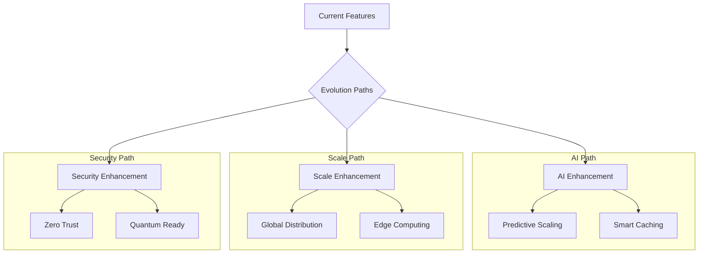

#### Unknowns and Challenges (Future Considerations)

##### 1. Global Distribution Challenges (Future Considerations)

1. **Global Distribution Challenges**

```yaml
distribution_challenges:
  data_consistency:
    - eventual_consistency_limits
    - replication_lag_management
    - conflict_resolution_strategies
  edge_computing:
    - resource_constraints
    - connectivity_issues
    - security_boundaries
  cost_optimization:
    - multi_region_deployment
    - traffic_routing
    - resource_sharing
```

##### 2. Feature Integration Complexity (Future Considerations)

References existing integration patterns from:

```markdown:datapunk/docs/App/Cortex/in-progress/cortex-neurocortex-orchestrator.md
startLine: 831
endLine: 845
```

## Vision and Iteration

#### Evolution Strategy (Future Considerations)

```python
class FeatureEvolutionManager:
    def __init__(self):
        self.feature_gates = FeatureGates()
        self.deployment_strategy = RollingDeployment()
        self.monitoring = EvolutionMonitoring()
        
    async def evolve_feature(self, feature: Feature) -> DeploymentResult:
        gate_status = await self.feature_gates.check(feature)
        if gate_status.ready:
            deployment = await self.deployment_strategy.execute(feature)
            return await self.monitoring.track_evolution(deployment)
```

#### Implementation Roadmap (Future Considerations)

```mermaid
graph TD
    A[Current State] --> B[Foundation]
    B --> C[Intelligence]
    B --> D[Scale]
    
    subgraph "Phase 1: Foundation"
    B --> E[Core Scaling]
    B --> F[Basic Features]
    end
    
    subgraph "Phase 2: Intelligence"
    C --> G[AI Integration]
    C --> H[Smart Features]
    end
    
    subgraph "Phase 3: Scale"
    D --> I[Global Scale]
    D --> J[Edge Computing]
    end
```

#### Integration References (Future Considerations)

References performance benchmarking configuration from:

```markdown
datapunk/docs/App/Cortex/original-datapunk-cortex.md
startLine: 1264
endLine: 1281
```

#### Recovery Strategy (Future Considerations)  

References recovery procedures from:

```markdown
datapunk/docs/App/Lake/recovery-backup.md
startLine: 924
endLine: 941
```
