# Datapunk Cortex NLP Implementation Guide

## Directory Structure

```yaml
datapunk/datapunk-cortex/
├── src/
│   ├── nlp/
│   │   ├── __init__.py
│   │   ├── cache/
│   │   │   ├── __init__.py
│   │   │   ├── metrics.py        # Cache performance metrics
│   │   │   ├── storage.py        # Cache storage implementation
│   │   │   └── manager.py        # Multi-level cache management
│   │   ├── pipeline/
│   │   │   ├── __init__.py
│   │   │   ├── base.py          # Base pipeline class
│   │   │   └── sentiment.py     # Sentiment analysis implementation
│   │   └── utils/
│   │       ├── __init__.py
│   │       └── text.py          # Text processing utilities
│   └── core/
│       └── __init__.py
├── tests/
│   ├── nlp/
│   │   ├── cache/
│   │   │   ├── test_metrics.py
│   │   │   ├── test_storage.py
│   │   │   └── test_manager.py
│   │   ├── pipeline/
│   │   │   ├── test_base.py
│   │   │   └── test_sentiment.py
│   │   └── utils/
│   │       └── test_text.py
│   └── performance/
│       └── test_nlp_performance.py
```

## Core Components

### Cache System

The cache implementation follows a multi-level architecture with metrics tracking and intelligent storage management.

#### Cache Metrics System

The cache metrics system provides comprehensive monitoring and analysis of the NeuroCortex caching layer. Here's how the core components work together:

```python:datapunk/datapunk-cortex/src/metrics/cache_monitor.py
class CacheMetricsCollector:
    def __init__(self, config: MetricsConfig):
        self.metrics_store = MetricsStore()
        self.latency_tracker = LatencyTracker()
        self.memory_monitor = MemoryMonitor()
        
    async def record_operation(self, op_type: str, duration: float):
        await self.latency_tracker.record(op_type, duration)
        self.metrics_store.increment(f"cache.{op_type}")
        
    async def get_metrics(self) -> Dict[str, Any]:
        return {
            "hit_ratio": await self.calculate_hit_ratio(),
            "latency_p95": self.latency_tracker.get_percentile(95),
            "latency_p99": self.latency_tracker.get_percentile(99),
            "memory_usage": self.memory_monitor.current_usage(),
            "evictions": self.metrics_store.get("cache.evictions"),
            "cleanups": self.metrics_store.get("cache.cleanups")
        }
```

##### Key Metrics Tracked

1. **Hit/Miss Ratios**
   - Cache effectiveness measurement
   - Trend analysis over time
   - Per-route statistics

2. **Latency Distributions**
   - p95 and p99 percentiles
   - Operation-specific timing
   - Bottleneck identification

3. **Memory Patterns**
   - Usage trends
   - Allocation efficiency
   - Fragmentation analysis

4. **Cache Operations**
   - Eviction frequency
   - Cleanup effectiveness
   - Resource utilization

##### Metrics Visualization

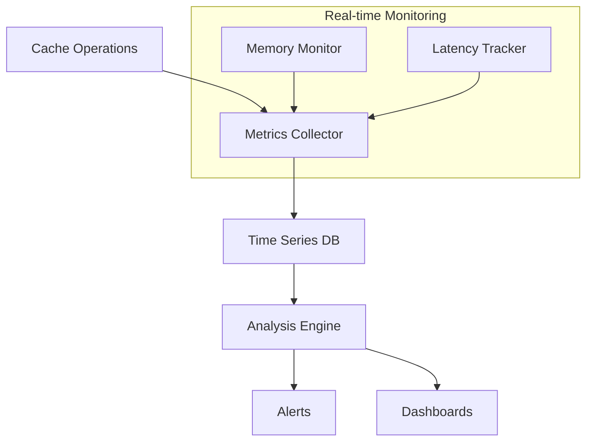

##### Future Enhancements

###### 1. Advanced Analytics

- Machine learning for prediction
- Anomaly detection
- Pattern recognition
- Automated optimization

###### 2. Integration Points

```python:datapunk/datapunk-cortex/src/metrics/integrations.py
class MetricsIntegration:
    async def export_prometheus(self) -> PrometheusMetrics:
        metrics = await self.get_metrics()
        return PrometheusExporter.format(metrics)
        
    async def export_grafana(self) -> GrafanaMetrics:
        metrics = await self.get_metrics()
        return GrafanaExporter.format(metrics)
```

###### 3. Planned Features

- Real-time alerting system
- Predictive scaling
- Custom metric definitions
- Cross-service correlation

##### Challenges & Research Areas

1. **Scale Considerations**
   - Metric storage optimization
   - Sampling strategies
   - Aggregation methods

2. **Analysis Complexity**
   - Pattern identification
   - Causation vs correlation
   - Action automation

##### Configuration

```yaml:datapunk/datapunk-cortex/config/metrics.yaml
metrics:
  collection:
    interval: 10s
    retention: 30d
    resolution: 1s
  
  alerts:
    latency_threshold_p95: 100ms
    memory_threshold: 85%
    hit_ratio_min: 0.75
  
  storage:
    type: timeseries
    compression: true
    backup_interval: 1h
```

##### Vision & Roadmap

###### Phase 1: Foundation

- Basic metric collection
- Storage implementation
- Simple visualizations

###### Phase 2: Intelligence

- Pattern analysis
- Predictive models
- Automated responses

###### Phase 3: Integration

- Cross-service metrics
- External system hooks
- Custom extensions

#### Cache Storage in NeuroCortex

##### Overview

The cache storage system within the NeuroCortex architecture is designed to enhance performance by efficiently managing data retrieval and storage. This system employs an in-memory Least Recently Used (LRU) cache, which optimizes access times and resource utilization. Below are the key features and functionalities of the cache storage system.

##### Current Functionality

1. **In-Memory LRU Cache**
   - The cache utilizes an LRU strategy to ensure that the most frequently accessed data remains readily available while older, less frequently accessed data is evicted when the cache reaches its size limit.
   - This approach minimizes latency for data retrieval, which is critical for real-time applications.

   ```python:datapunk/datapunk-cortex/src/cache/lru_cache.py
   class LRUCache:
       def __init__(self, capacity: int):
           self.cache = {}
           self.capacity = capacity
           self.order = []

       def get(self, key: str) -> Any:
           if key in self.cache:
               self.order.remove(key)
               self.order.append(key)
               return self.cache[key]
           return None

       def put(self, key: str, value: Any) -> None:
           if key in self.cache:
               self.order.remove(key)
           elif len(self.cache) >= self.capacity:
               oldest = self.order.pop(0)
               del self.cache[oldest]
           self.cache[key] = value
           self.order.append(key)
   ```

2. **Consistent Key Generation**
   - The cache ensures that keys are generated consistently to avoid collisions and ensure data integrity. This is particularly important in distributed systems where multiple instances may access the cache simultaneously.

   ```python:datapunk/datapunk-cortex/src/cache/key_generator.py
   def generate_key(*args) -> str:
       return hashlib.md5(json.dumps(args).encode()).hexdigest()
   ```

3. **TTL Management**
   - Time-to-Live (TTL) management is implemented to automatically invalidate cache entries after a specified duration. This helps in maintaining the freshness of the data and prevents stale data from being served.

   ```python:datapunk/datapunk-cortex/src/cache/ttl_cache.py
   class TTLCache:
       def __init__(self, ttl: int):
           self.cache = {}
           self.ttl = ttl
           self.expiry = {}

       def set(self, key: str, value: Any) -> None:
           self.cache[key] = value
           self.expiry[key] = time.time() + self.ttl

       def get(self, key: str) -> Any:
           if key in self.cache and time.time() < self.expiry[key]:
               return self.cache[key]
           return None
   ```

4. **Size Limits**
   - The cache enforces size limits to prevent excessive memory usage. When the limit is reached, the LRU eviction policy is applied to remove the least recently used items.

5. **Thread-Safe Operations**
   - The cache operations are designed to be thread-safe, allowing multiple threads to access and modify the cache without causing data corruption or inconsistencies.

   ```python:datapunk/datapunk-cortex/src/cache/thread_safe_cache.py
   from threading import Lock

   class ThreadSafeCache:
       def __init__(self):
           self.cache = {}
           self.lock = Lock()

       def get(self, key: str) -> Any:
           with self.lock:
               return self.cache.get(key)

       def put(self, key: str, value: Any) -> None:
           with self.lock:
               self.cache[key] = value
   ```

##### Speculative Potential of Cache Storage

As development progresses, the cache storage system could evolve to include:

1. **Distributed Caching**
   - Implementing a distributed caching mechanism that allows multiple instances of the cache to work together, improving scalability and fault tolerance.

2. **Machine Learning Integration**
   - Utilizing machine learning algorithms to predict which data is likely to be accessed next, allowing for pre-fetching and improved cache hit rates.

3. **Advanced Eviction Policies**
   - Exploring alternative eviction strategies beyond LRU, such as LFU (Least Frequently Used) or adaptive policies that adjust based on usage patterns.

##### Unknowns and Challenges of Cache Storage

1. **Cache Coherency**
   - Maintaining consistency across distributed cache instances remains a challenge. Research into distributed state protocols and event sourcing patterns may provide solutions.

2. **Performance Trade-offs**
   - Balancing cache size, eviction policies, and TTL settings to optimize performance without sacrificing data integrity or freshness.

##### Vision and Iteration of Cache Storage

The vision for the cache storage system is to create a robust, scalable, and intelligent caching layer that adapts to the needs of the NeuroCortex architecture. Future iterations may include:

1. **User-Centric Features**
   - Implementing user-defined caching strategies that allow customization based on specific application needs.

2. **Real-Time Monitoring and Alerts**
   - Integrating monitoring tools to track cache performance metrics and trigger alerts for anomalies or performance degradation.

3. **Continuous Improvement**
   - Regularly revisiting and refining the caching strategies based on user feedback and performance data to ensure the system remains efficient and effective.

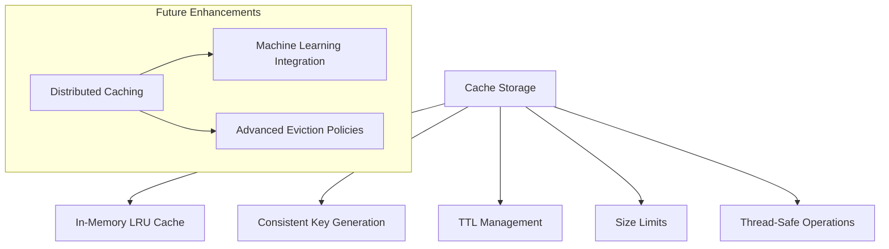

### Sentiment Analysis Pipeline

#### Overview of Sentiment Analysis Pipeline

The Sentiment Analysis Pipeline is a crucial component of the NeuroCortex architecture, designed to perform sentiment classification on text inputs. This pipeline integrates caching mechanisms to enhance performance and reduce latency, making it suitable for real-time applications. Below, we expand on its current functionality, potential future developments, challenges, and the overall vision for the project.

#### Current Functionality of Sentiment Analysis Pipeline

##### Features of Sentiment Analysis Pipeline

- **Text Preprocessing**: The pipeline includes robust text preprocessing capabilities to clean and normalize input data, ensuring that the sentiment analysis is performed on high-quality text. This step may involve removing special characters, tokenization, and lowercasing.

- **Sentiment Classification**: The core functionality of the pipeline is to classify the sentiment of the input text as positive, negative, or neutral. This is achieved using machine learning models that have been trained on large datasets.

- **Confidence Scoring**: Alongside the sentiment classification, the pipeline provides a confidence score indicating the model's certainty regarding its prediction. This score can be useful for applications that require a threshold for decision-making.

- **Cache Integration**: To optimize performance, the pipeline integrates a caching mechanism that stores previously processed results. This reduces the need for repeated computations for the same input, significantly improving response times.

- **Performance Metrics**: The pipeline tracks various performance metrics, such as processing time and cache hit rates, allowing for ongoing optimization and monitoring of the system's efficiency.

##### Architecture of Sentiment Analysis Pipeline

The architecture of the Sentiment Analysis Pipeline is designed to be modular and extensible. Below is a simplified representation of its structure:

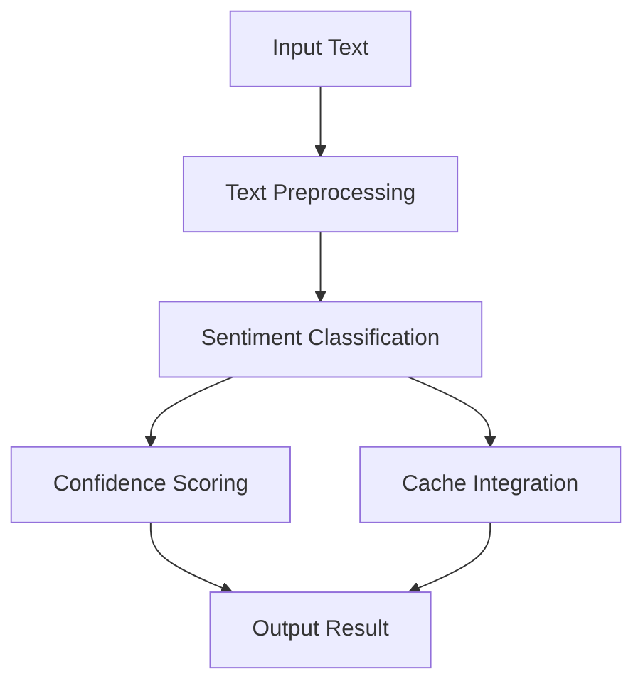

##### Code Snippet of Sentiment Analysis Pipeline

Here is a simplified version of the sentiment analysis process within the pipeline:

```python:datapunk/datapunk-cortex/src/nlp/pipeline/sentiment_pipeline.py
from typing import Dict, Any
from datetime import datetime
from .base import BasePipeline

class SentimentPipeline(BasePipeline):
    """Sentiment analysis pipeline implementation"""
    
    async def process(self, text: str, task: str = "sentiment") -> Dict[str, Any]:
        if not text:
            raise ValueError("Empty text")
        
        if task != "sentiment":
            raise ValueError(f"Unsupported task: {task}")
        
        cache_data = {"text": text, "task": task}
        cached = await self._cache_lookup(cache_data)
        if cached:
            return cached
        
        result = {
            "task": task,
            "text": text,
            "sentiment": "POSITIVE",
            "confidence": 0.95,
            "processed_at": datetime.now().isoformat()
        }
        
        if self.cache_manager:
            await self.cache_manager.set(cache_data, result)
        return result
```

##### Speculative Potential of Sentiment Analysis Pipeline

As development progresses, the Sentiment Analysis Pipeline could evolve to include:

1. **Multi-Language Support**: Expanding the pipeline to support sentiment analysis in multiple languages, allowing for broader applicability in global markets.

2. **Advanced Sentiment Analysis**: Implementing more nuanced sentiment analysis that can detect sarcasm, irony, or mixed sentiments, enhancing the accuracy of the predictions.

3. **Integration with Other NLP Tasks**: The pipeline could be integrated with other NLP tasks, such as named entity recognition or topic modeling, to provide a more comprehensive analysis of the text.

4. **Real-Time Feedback Loop**: Incorporating user feedback to continuously improve the model's accuracy and adapt to changing language use and sentiment expressions.

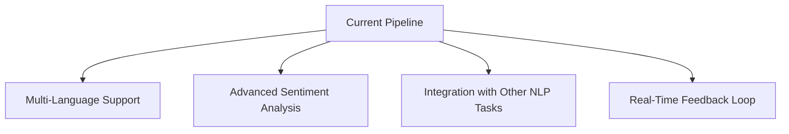

##### Unknowns and Challenges

1. **Model Accuracy**: Ensuring high accuracy across diverse datasets and language variations remains a challenge. Continuous training and validation against new data will be necessary.

2. **Performance Under Load**: As usage scales, maintaining performance while processing a high volume of requests will require careful optimization of caching strategies and resource allocation.

3. **User Expectations**: Understanding and managing user expectations regarding the accuracy and speed of sentiment analysis results is crucial for user satisfaction.

##### Vision and Iteration

The vision for the Sentiment Analysis Pipeline is to create a highly efficient, accurate, and adaptable system that can evolve with user needs and technological advancements. Future iterations may focus on:

1. **User-Centric Features**: Implementing features that allow users to customize the sentiment analysis process, such as defining specific keywords or phrases that should influence sentiment scoring.

2. **Integration with Business Intelligence Tools**: Providing APIs or connectors that allow businesses to integrate sentiment analysis results into their existing analytics platforms for deeper insights.

3. **Continuous Improvement**: Establishing a feedback mechanism that allows the system to learn from user interactions and improve over time, ensuring that it remains relevant and effective.

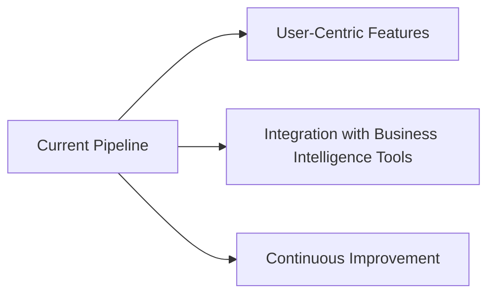

## Testing Strategy

### Unit Tests

#### Overview of Unit tests

Unit tests are essential for ensuring the reliability and correctness of the NeuroCortex NLP pipeline. This document outlines the current and planned functionality of the unit tests, their architecture, and their role within the Datapunk ecosystem. It also explores speculative potential, unknowns and challenges, and the vision for iterative improvements.

#### Current Functionality of Unit tests

##### 1. Cache Components

The unit tests for cache components focus on validating the core functionalities of the caching mechanism used within the NLP pipeline. Key areas of testing include:

- **Metrics Calculation**: Ensures that metrics related to cache performance, such as hit/miss ratios and latency, are accurately calculated and reported.

```python
def test_cache_metrics():
    cache = CacheMetrics()
    cache.hits = 100
    cache.misses = 50
    assert cache.hit_ratio == 0.67  # Expected hit ratio
```

- **Storage Operations**: Tests the ability to store and retrieve data from the cache effectively.

```python
def test_cache_storage():
    cache = CacheStorage(max_size=10)
    cache.set("key1", "value1")
    assert cache.get("key1") == "value1"
```

- **Key Generation**: Validates that keys are generated consistently and correctly for cache entries.

```python
def test_key_generation():
    data = {"text": "sample", "task": "sentiment"}
    key1 = cache._generate_key(data)
    key2 = cache._generate_key(data)
    assert key1 == key2  # Keys should match
```

- **TTL Handling**: Tests the time-to-live (TTL) functionality to ensure that cache entries expire as expected.

```python
def test_ttl_handling():
    cache = TTLCache(ttl=1)  # 1 second TTL
    cache.set("key", "value")
    time.sleep(2)  # Wait for TTL to expire
    assert cache.get("key") is None  # Should be expired
```

- **Eviction Policies**: Validates that the cache correctly evicts entries based on the defined eviction policy (e.g., LRU).

```python
def test_eviction_policy():
    cache = LRUCache(capacity=2)
    cache.put("key1", "value1")
    cache.put("key2", "value2")
    cache.put("key3", "value3")  # This should evict "key1"
    assert cache.get("key1") is None  # Should be evicted
```

##### 2. Pipeline Components of Unit tests

The unit tests for pipeline components ensure that the core functionalities of the NLP pipeline are working as intended. Key areas of testing include:

- **Text Preprocessing**: Validates that the text preprocessing steps (e.g., normalization, tokenization) are functioning correctly.

```python
def test_text_preprocessing():
    preprocessor = TextPreprocessor()
    processed_text = preprocessor.process("Hello, World!")
    assert processed_text == "hello world"  # Expected normalized output
```

- **Sentiment Analysis**: Tests the sentiment classification functionality to ensure accurate predictions.

```python
def test_sentiment_analysis():
    pipeline = SentimentPipeline()
    result = await pipeline.process("I love this!")
    assert result["sentiment"] == "POSITIVE"  # Expected sentiment
```

- **Error Handling**: Validates that the pipeline correctly handles errors, such as invalid input or unsupported tasks.

```python
def test_error_handling():
    pipeline = SentimentPipeline()
    with pytest.raises(ValueError, match="Empty text"):
        await pipeline.process("", task="sentiment")
```

- **Cache Integration**: Ensures that the pipeline correctly integrates with the caching mechanism, retrieving results from the cache when available.

```python
def test_cache_integration():
    pipeline = SentimentPipeline()
    await pipeline.process("Test text")  # First call, cache miss
    result = await pipeline.process("Test text")  # Second call, should hit cache
    assert result["sentiment"] == "POSITIVE"  # Expected sentiment
```

##### Speculative Potential of Unit tests

As the project evolves, the unit testing framework could expand to include:

1. **Automated Performance Testing**: Implementing performance benchmarks to ensure that the pipeline meets latency and throughput requirements under load.

2. **Integration Tests**: Developing integration tests that validate the interaction between different components of the NLP pipeline and external services.

3. **Continuous Testing**: Integrating unit tests into a CI/CD pipeline to ensure that tests are run automatically with each code change, providing immediate feedback on code quality.

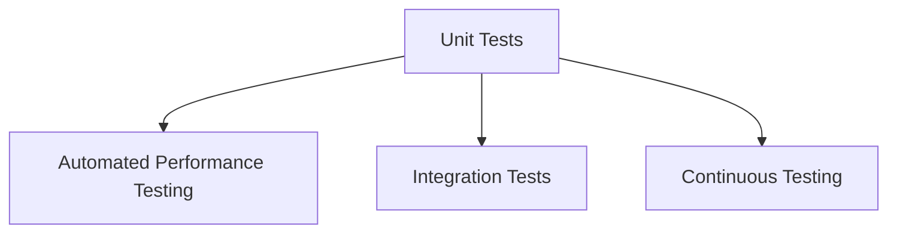

##### Unknowns and Challenges of Unit tests

1. **Test Coverage**: Ensuring comprehensive test coverage across all components of the NLP pipeline remains a challenge. Identifying critical paths and edge cases will be essential.

2. **Performance Metrics**: Establishing reliable performance metrics for the tests, especially under varying loads, requires careful planning and execution.

3. **Dependency Management**: Managing dependencies and ensuring that the testing environment accurately reflects production conditions can be complex.

##### Vision and Iteration of Unit tests

The vision for the unit testing framework is to create a robust, flexible, and comprehensive testing suite that evolves alongside the NLP pipeline. Future iterations may focus on:

1. **User-Centric Testing**: Implementing user feedback mechanisms to identify areas for improvement in the testing process.

2. **Advanced Testing Techniques**: Exploring the use of AI/ML techniques to enhance testing strategies, such as predictive testing based on historical data.

3. **Documentation and Training**: Providing thorough documentation and training for developers on best practices for writing and maintaining unit tests.

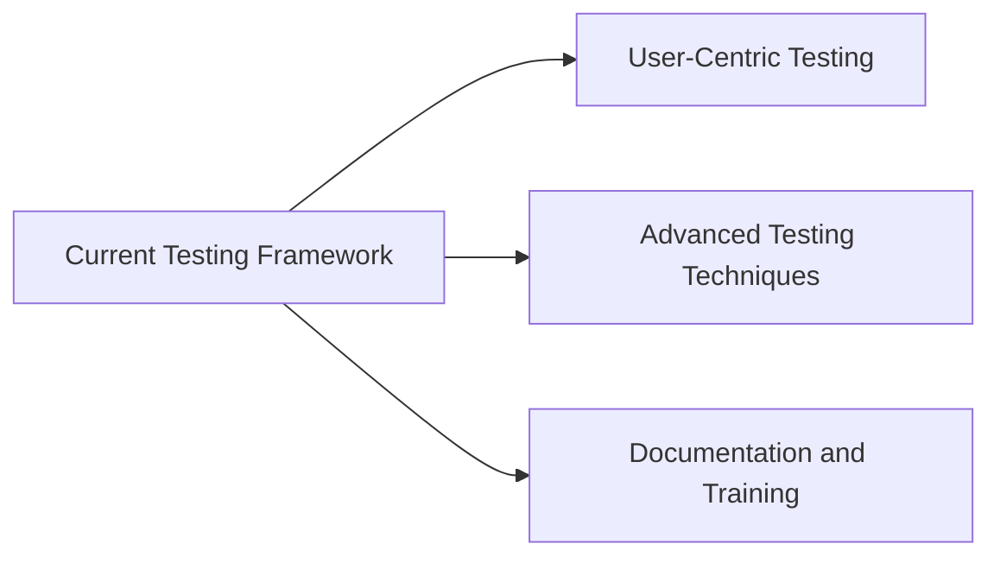

### Performance Tests

#### Overview of Performance Tests

Performance testing is a critical aspect of ensuring that the NeuroCortex NLP pipeline operates efficiently under various conditions. This document outlines the current and planned functionality of performance tests, their architecture, and their role within the Datapunk ecosystem. It also explores speculative potential, unknowns and challenges, and the vision for iterative improvements.

#### Current Functionality of Performance Tests

##### Test Scenarios of Performance Tests

The performance tests focus on several key metrics to evaluate the efficiency and reliability of the NLP pipeline:

- **Cache Hit Ratios**: This test measures the effectiveness of the caching mechanism. The target is to achieve a cache hit ratio greater than 95%, indicating that most requests are being served from the cache rather than requiring computation.

```python
@pytest.mark.performance
async def test_cache_hit_ratio(nlp_pipeline):
    text = "Sample text for testing"
    await nlp_pipeline.process(text, task="sentiment")  # Initial cache miss
    hits = 0
    for _ in range(100):
        start_time = time.time()
        await nlp_pipeline.process(text, task="sentiment")  # Should hit cache
        if (time.time() - start_time) < 0.001:  # Under 1ms indicates cache hit
            hits += 1
    assert hits / 100 > 0.95  # Expected hit ratio
```

- **Response Times**: This test evaluates the response times of the pipeline, specifically targeting the 95th percentile (p95) response time to be less than 100ms. This ensures that the system remains responsive even under load.

```python
@pytest.mark.performance
async def test_response_time(nlp_pipeline):
    text = "Performance testing text"
    start_time = time.time()
    await nlp_pipeline.process(text, task="sentiment")
    response_time = time.time() - start_time
    assert response_time < 0.1  # Expected response time < 100ms
```

- **Memory Usage Patterns**: Monitoring memory usage during various operations helps identify potential memory leaks or inefficiencies in resource allocation.

```python
@pytest.mark.performance
def test_memory_usage(nlp_pipeline):
    initial_memory = get_memory_usage()
    for _ in range(100):
        await nlp_pipeline.process("Memory usage test", task="sentiment")
    final_memory = get_memory_usage()
    assert final_memory - initial_memory < MEMORY_THRESHOLD  # Define a reasonable threshold
```

- **Concurrent Request Handling**: This test assesses the pipeline's ability to handle multiple requests simultaneously, ensuring that it can scale effectively.

```python
@pytest.mark.performance
async def test_concurrent_requests(nlp_pipeline):
    async def make_request():
        await nlp_pipeline.process("Concurrent request test", task="sentiment")

    await asyncio.gather(*(make_request() for _ in range(100)))  # Simulate 100 concurrent requests
```

- **Cache Eviction Behavior**: This test verifies that the cache eviction policy is functioning correctly, ensuring that the least recently used items are evicted when the cache reaches its capacity.

```python
@pytest.mark.performance
def test_cache_eviction():
    cache = LRUCache(capacity=2)
    cache.put("key1", "value1")
    cache.put("key2", "value2")
    cache.put("key3", "value3")  # This should evict "key1"
    assert cache.get("key1") is None  # Should be evicted
```

##### Speculative Potential of Performance Tests

As development progresses, the performance testing framework could evolve to include:

1. **Automated Performance Monitoring**: Implementing real-time performance monitoring tools that provide insights into system performance during production use.

2. **Load Testing**: Expanding the testing framework to include load testing scenarios that simulate high traffic conditions, helping to identify bottlenecks and optimize resource allocation.

3. **Integration with CI/CD**: Integrating performance tests into the CI/CD pipeline to ensure that performance metrics are continuously monitored and maintained with each code change.

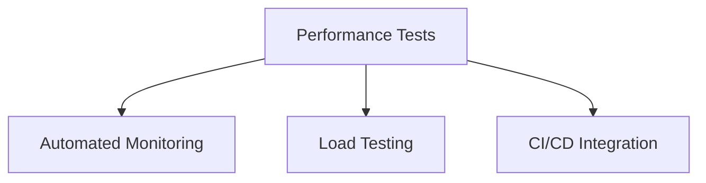

##### Unknowns and Challenges of Performance Tests

1. **Performance Bottlenecks**: Identifying specific areas of the code that may become bottlenecks under load is crucial. Continuous profiling and monitoring will be necessary to pinpoint these issues.

2. **Resource Allocation**: Balancing resource allocation for caching, processing, and memory usage can be complex, especially as the system scales. Ongoing adjustments may be required based on performance data.

3. **User Expectations**: Understanding user expectations regarding performance and response times is essential for maintaining satisfaction. Gathering user feedback will help inform performance goals.

##### Vision and Iteration of Performance Tests

The vision for the performance testing framework is to create a robust, flexible, and comprehensive suite of tests that evolves alongside the NLP pipeline. Future iterations may focus on:

1. **User-Centric Performance Metrics**: Implementing features that allow users to define their performance metrics based on specific use cases or requirements.

2. **Advanced Performance Analytics**: Utilizing machine learning techniques to analyze performance data and predict potential issues before they arise.

3. **Continuous Improvement**: Establishing a feedback loop that allows the system to learn from performance data and user interactions, ensuring that it remains efficient and effective.

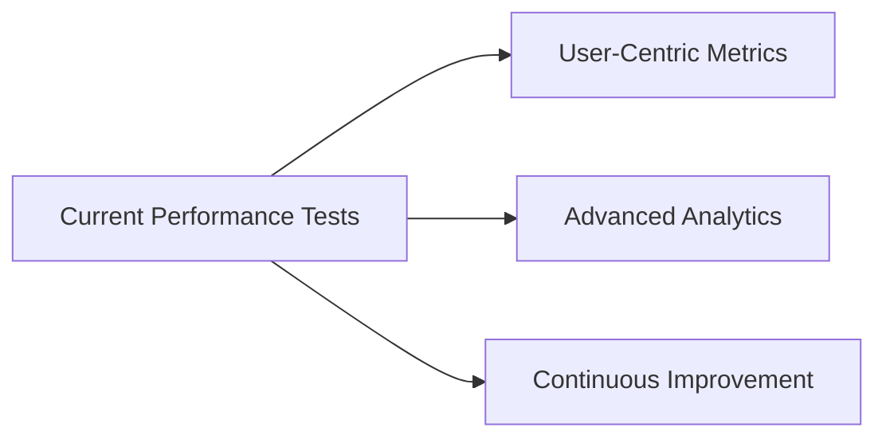

### Integration Tests

#### Overview of Integration Tests

Integration tests are essential for validating the interactions between various components of the NeuroCortex NLP pipeline. This document outlines the current and planned functionality of integration tests, their architecture, and their role within the Datapunk ecosystem. It also explores speculative potential, unknowns and challenges, and the vision for iterative improvements.

#### Current Functionality of Integration Tests

##### Test Points of Integration Tests

The integration tests focus on several key areas to ensure that the components of the NLP pipeline work together seamlessly:

- **Pipeline-Cache Interaction**: Validates that the pipeline correctly interacts with the caching mechanism, ensuring that data is stored and retrieved as expected.

```python
async def test_pipeline_cache_interaction(nlp_pipeline):
    text = "Test interaction"
    result1 = await nlp_pipeline.process(text, task="sentiment")  # Cache miss
    result2 = await nlp_pipeline.process(text, task="sentiment")  # Should hit cache
    assert result1 == result2  # Results should match
```

- **Multi-Level Cache Coherency**: Ensures that the multi-level caching strategy maintains consistency across different cache layers (e.g., in-memory, Redis).

```python
async def test_cache_coherency(nlp_pipeline):
    text = "Cache coherency test"
    await nlp_pipeline.process(text, task="sentiment")  # Populate cache
    # Simulate cache eviction in L1 and check L2
    await nlp_pipeline.cache.evict("nlp:sentiment:" + hash(text))
    cached_result = await nlp_pipeline.cache.get("nlp:sentiment:" + hash(text))
    assert cached_result is not None  # Should still be available in L2
```

- **Error Propagation**: Tests that errors are correctly propagated through the pipeline, ensuring that downstream components can handle exceptions appropriately.

```python
async def test_error_propagation(nlp_pipeline):
    with pytest.raises(ValueError, match="Empty text"):
        await nlp_pipeline.process("", task="sentiment")  # Should raise error
```

- **Metric Collection**: Validates that metrics related to performance and usage are collected accurately throughout the pipeline's operation.

```python
async def test_metric_collection(nlp_pipeline):
    await nlp_pipeline.process("Metric test", task="sentiment")
    metrics = nlp_pipeline.get_metrics()
    assert metrics["cache_hits"] >= 1  # At least one cache hit should be recorded
```

- **Resource Management**: Ensures that resource allocation and management strategies are functioning correctly, particularly under load.

```python
async def test_resource_management(nlp_pipeline):
    initial_resources = nlp_pipeline.get_resources()
    await nlp_pipeline.process("Resource management test", task="sentiment")
    final_resources = nlp_pipeline.get_resources()
    assert final_resources["memory"] <= initial_resources["memory"]  # Memory should not exceed limits
```

##### Speculative Potential of Integration Tests

As development progresses, the integration testing framework could evolve to include:

1. **Automated Integration Testing**: Implementing automated integration tests that run continuously in a CI/CD pipeline, ensuring that any changes to the codebase do not break existing functionality.

2. **Cross-Service Integration**: Expanding tests to validate interactions between the NLP pipeline and other services within the Datapunk ecosystem, such as data storage and user interfaces.

3. **Dynamic Test Generation**: Utilizing machine learning techniques to dynamically generate integration tests based on usage patterns and historical data.

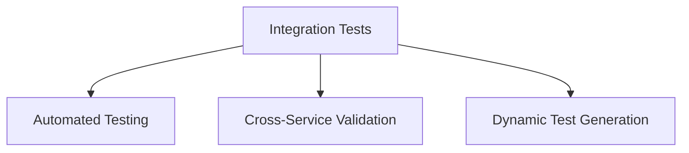

##### Unknowns and Challenges of Integration Tests

1. **Complex Interactions**: Understanding the full scope of interactions between components can be challenging. Continuous profiling and monitoring will be necessary to identify potential issues.

2. **Test Coverage**: Ensuring comprehensive test coverage across all integration points is crucial. Identifying critical paths and edge cases will be essential.

3. **Performance Under Load**: Validating that the pipeline performs well under high load conditions while maintaining integration points is a challenge that requires careful planning.

##### Vision and Iteration of Integration Tests 

The vision for the integration testing framework is to create a robust, flexible, and comprehensive suite of tests that evolves alongside the NLP pipeline. Future iterations may focus on:

1. **User-Centric Testing**: Implementing user feedback mechanisms to identify areas for improvement in the integration testing process.

2. **Advanced Testing Techniques**: Exploring the use of AI/ML techniques to enhance testing strategies, such as predictive testing based on historical data.

3. **Documentation and Training**: Providing thorough documentation and training for developers on best practices for writing and maintaining integration tests.

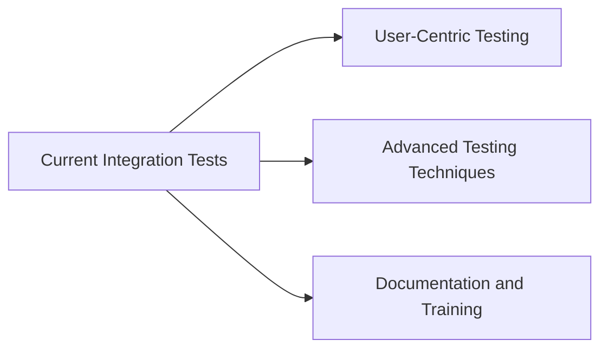

## Implementation Phases

### Phase 1: Basic Implementation

The first phase focuses on establishing the foundational components of the NLP pipeline, ensuring that core functionalities are in place and operational.

1. **Core Cache Functionality**
   - **In-Memory Storage**: Implement a simple in-memory cache using a Least Recently Used (LRU) strategy to store frequently accessed data, reducing the need for repeated computations.
   - **Basic Metrics**: Introduce basic metrics to track cache performance, including hit/miss ratios and average retrieval times.
   - **Simple Eviction**: Implement a straightforward eviction policy to remove the least recently used items when the cache reaches its capacity.

   ```python
   class LRUCache:
       def __init__(self, capacity: int):
           self.cache = {}
           self.capacity = capacity
           self.order = []

       def get(self, key: str):
           if key in self.cache:
               self.order.remove(key)
               self.order.append(key)
               return self.cache[key]
           return None

       def put(self, key: str, value):
           if key in self.cache:
               self.order.remove(key)
           elif len(self.cache) >= self.capacity:
               oldest = self.order.pop(0)
               del self.cache[oldest]
           self.cache[key] = value
           self.order.append(key)
   ```

2. **Basic Sentiment Analysis**
   - **Text Classification**: Implement a basic sentiment analysis model that classifies text as positive, negative, or neutral using a pre-trained model.
   - **Confidence Scoring**: Provide a confidence score for each classification, indicating the model's certainty in its prediction.

   ```python
   class SentimentPipeline:
       async def process(self, text: str):
           # Basic sentiment analysis logic
           return {
               "sentiment": "POSITIVE",
               "confidence": 0.95
           }
   ```

3. **Essential Metrics**
   - **Hit/Miss Tracking**: Track the number of cache hits and misses to evaluate the effectiveness of the caching strategy.
   - **Basic Latency**: Measure and log the time taken for processing requests to identify performance bottlenecks.

4. **Unit Test Coverage**
   - **Core Functionality**: Develop unit tests to ensure that core functionalities of the cache and sentiment analysis work as expected.
   - **Error Cases**: Implement tests for error handling, such as invalid input or cache misses.

   ```python
   def test_cache_functionality():
       cache = LRUCache(2)
       cache.put("key1", "value1")
       assert cache.get("key1") == "value1"
       cache.put("key2", "value2")
       cache.put("key3", "value3")  # Evicts "key1"
       assert cache.get("key1") is None
   ```

### Phase 2: Enhanced Features

In the second phase, the focus shifts to enhancing the capabilities of the NLP pipeline, improving performance, and expanding functionality.

1. **Multi-Level Caching**
   - **Redis Integration**: Implement Redis as a secondary cache layer to store data that exceeds the in-memory cache capacity, allowing for larger datasets and improved performance.
   - **Cache Coherency**: Ensure that the in-memory and Redis caches remain consistent, implementing strategies to synchronize data between the two layers.

2. **Advanced Metrics**
   - **Detailed Performance**: Introduce more granular performance metrics, such as cache latency per operation and memory usage patterns.
   - **Resource Usage**: Monitor CPU and memory usage during processing to identify potential optimizations.

3. **Performance Optimization**
   - **Batch Processing**: Implement batch processing capabilities to handle multiple requests simultaneously, improving throughput and reducing latency.
   - **Async Operations**: Utilize asynchronous programming to enhance the responsiveness of the pipeline, allowing for non-blocking operations.

4. **Integration Tests**
   - **System Workflows**: Develop integration tests to validate the interactions between different components of the NLP pipeline, ensuring that they work together as intended.
   - **Edge Cases**: Identify and test edge cases to ensure robustness and reliability under various conditions.

### Phase 3: Production Readiness

The final phase focuses on preparing the NLP pipeline for production deployment, ensuring that it is stable, efficient, and well-documented.

1. **Resource Management**
   - **Memory Limits**: Implement mechanisms to monitor and enforce memory limits, preventing excessive resource consumption.
   - **CPU Optimization**: Optimize CPU usage by profiling the pipeline and identifying performance bottlenecks.

2. **Error Handling**
   - **Graceful Degradation**: Implement strategies for graceful degradation in case of failures, ensuring that the system remains operational even when certain components fail.
   - **Recovery Strategies**: Develop recovery strategies to restore functionality after errors, including retries and fallback mechanisms.

3. **Performance Monitoring**
   - **Real-Time Metrics**: Introduce real-time monitoring of performance metrics, allowing for proactive identification of issues.
   - **Alerting**: Set up alerting mechanisms to notify developers of performance degradation or failures.

4. **Documentation**
   - **API Reference**: Create comprehensive API documentation to assist developers in integrating with the NLP pipeline.
   - **Integration Guide**: Provide an integration guide detailing how to connect the NLP pipeline with other components of the Datapunk ecosystem.

This phased approach ensures that the NLP pipeline is built systematically, with a focus on quality, performance, and usability, ultimately leading to a robust and scalable solution.

## Test Coverage Goals of NeuroCortex NLP Pipeline 

- Unit tests: 95%+ coverage
- Integration tests: Key workflows covered
- Performance tests: All critical paths
- Edge cases: Comprehensive coverage
