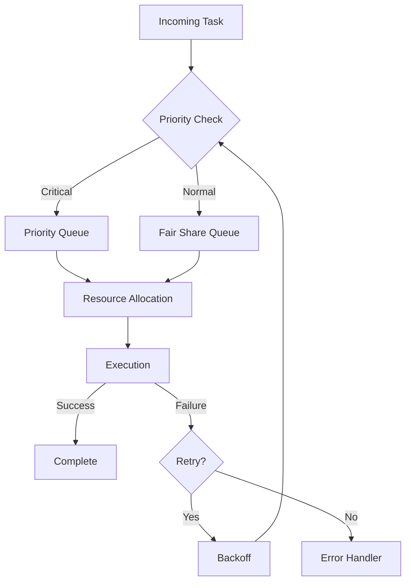
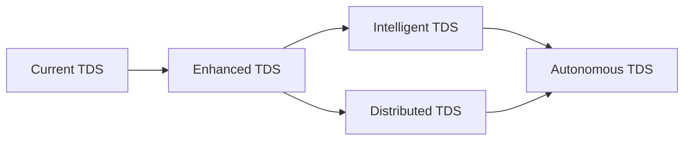
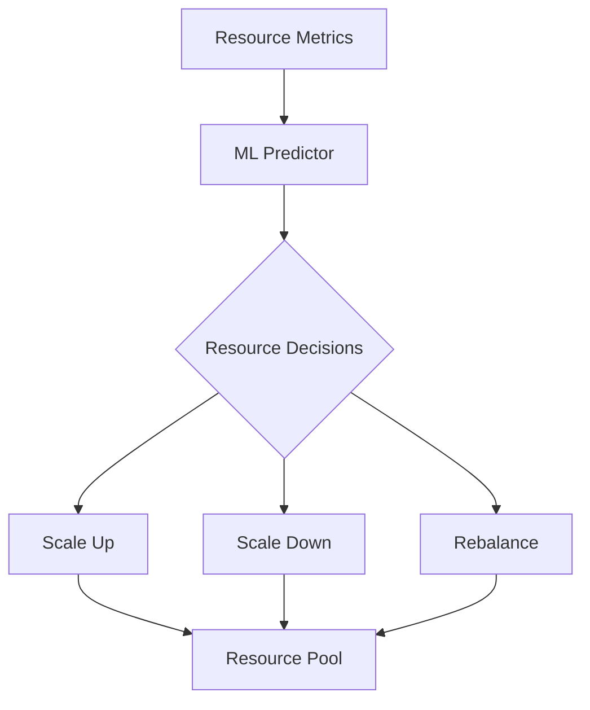
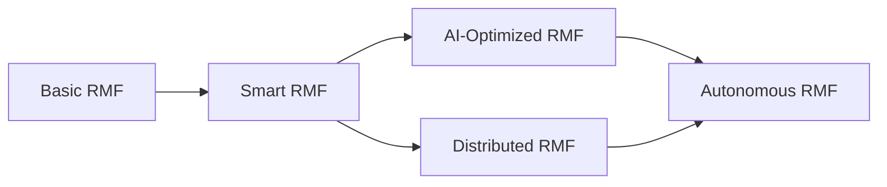

# NeuroCortex Orchestrator Core Architecture

## 1. Core Architecture

### 1.1 System Overview

The NeuroCortex serves as the central nervous system of the Datapunk AI infrastructure, orchestrating all AI-related operations across the platform.

#### Primary Responsibilities

1. **Task Orchestration**
   - Intelligent workload distribution
   - Priority-based scheduling
   - Resource allocation optimization
   - Failure recovery mechanisms

2. **Model Management**
   - Dynamic model selection and routing
   - Model versioning control
   - Cache coordination
   - Resource optimization

3. **Pipeline Coordination**
   - ETL workflow management
   - Real-time stream processing
   - Data validation and quality control
   - Privacy preservation

4. **Integration Management**
   - Lake service coordination
   - Stream service real-time processing
   - Forge service model deployment
   - External API orchestration

### 1.2 Component Architecture

#### Core Processing Engine

The Core Processing Engine serves as the central nervous system of the NeuroCortex, orchestrating all AI operations through three primary components: Task Manager, Resource Allocator, and Pipeline Coordinator. The engine is designed to handle complex AI workloads while maintaining optimal resource utilization and processing efficiency.

```yaml
processing_engine:
  components:
    task_manager:
      priority_levels: [critical, high, medium, low]
      queue_depth: 1000
      scheduling_algorithm: "weighted_fair"
    
    resource_allocator:
      strategy: "dynamic"
      monitoring_interval: "1s"
      reallocation_threshold: 0.8
    
    pipeline_coordinator:
      max_concurrent_pipelines: 100
      buffer_size: 1000
      processing_timeout: "30s"
```

The Task Manager implements priority-based scheduling with four distinct levels, managing request queues and workload distribution. The Resource Allocator employs dynamic allocation strategies, monitoring system resources every second and reallocating when usage reaches 80% threshold. The Pipeline Coordinator handles both standard and real-time processing pipelines, maintaining up to 100 concurrent pipelines with built-in backpressure management.

Integration with Haystack and LangChain enables sophisticated document processing and LLM operations, while coordination with the Lake service facilitates efficient vector storage operations. The engine's modular design allows for future expansion and optimization of AI processing capabilities.

> Note: This section requires further elaboration on specific implementation details, integration patterns, and optimization strategies. Additional documentation will be needed for deployment configurations and scaling considerations.

#### Task Distribution System

The Task Distribution System (TDS) forms the backbone of NeuroCortex's workload management, handling everything from initial request intake to final task execution. This system ensures efficient resource utilization while maintaining service quality and reliability.

##### Current Functionality

1. **Request Router**
   - Input validation and sanitization
   - Task classification
   - Priority assignment
   - Resource requirement estimation

```python
# Example Request Router Configuration
class RequestRouter:
    def __init__(self, config):
        self.validators = {
            'nlp': NLPValidator(),
            'ml': MLValidator(),
            'vector': VectorValidator()
        }
        self.classifiers = TaskClassifierEngine()
        self.priority_engine = PriorityAssignment()
        self.resource_estimator = ResourceEstimator()

    async def route_request(self, request: AIRequest) -> RoutedTask:
        # Validate input based on task type
        validated_input = self.validators[request.type].validate(request.payload)
        
        # Classify task and assign priority
        task_class = self.classifiers.classify(validated_input)
        priority = self.priority_engine.assign_priority(task_class, request.metadata)
        
        # Estimate resource requirements
        resources = self.resource_estimator.estimate(task_class, validated_input)
        
        return RoutedTask(
            validated_input=validated_input,
            classification=task_class,
            priority=priority,
            resource_requirements=resources
        )
```

2. **Workload Balancer**

The Workload Balancer implements dynamic load distribution across available processing nodes:

```yaml
workload_balancer:
  strategies:
    primary: round_robin
    fallback: least_connections
  health_checks:
    interval: 5s
    timeout: 3s
    failure_threshold: 3
  queue_management:
    max_queue_size: 1000
    overflow_strategy: backpressure
```

Key Components:

- Dynamic load distribution using adaptive algorithms
- Real-time health monitoring of processing nodes
- Automated failover handling
- Queue optimization with backpressure mechanisms

3. **Task Scheduler**

```yaml
scheduler:
  algorithms:
    - priority_based
    - fair_share
    - resource_aware
  constraints:
    max_retry_count: 3
    timeout: "5m"
    backoff_multiplier: 1.5
```

The scheduler implements a multi-strategy approach:



##### Speculative Potential for TDS

Future enhancements could include:

1. **Advanced Routing Capabilities for TDS**

```yaml
future_routing:
  features:
    - ml_based_classification
    - predictive_resource_estimation
    - dynamic_priority_adjustment
    - context_aware_routing
```

2. **Intelligent Load Balancing for TDS**

- ML-powered load prediction
- Automated capacity planning
- Cross-region optimization
- Cost-aware distribution

3. **Enhanced Scheduling for TDS**

```python
class FutureScheduler:
    """
    Potential future scheduler implementation with advanced features
    Note: This is speculative and requires further research
    """
    def __init__(self):
        self.ml_predictor = MLPredictor()  # For predicting task requirements
        self.cost_optimizer = CostOptimizer()  # For optimizing resource costs
        self.context_manager = ContextManager()  # For maintaining task context

    async def schedule(self, task: Task) -> ScheduledTask:
        # Predict resource requirements
        predicted_resources = await self.ml_predictor.predict(task)
        
        # Optimize for cost and performance
        optimal_slot = await self.cost_optimizer.find_optimal_slot(
            task, predicted_resources
        )
        
        # Consider task context and dependencies
        context = await self.context_manager.get_context(task)
        
        return self.create_scheduled_task(task, optimal_slot, context)
```

##### Unknowns and Challenges for TDS

1. **Scaling Considerations for TDS**

- Optimal queue depth determination
- Resource prediction accuracy
- Cross-service dependency management
- State management in distributed scenarios

2. **Performance Optimization for TDS**

```yaml
performance_challenges:
  areas:
    - queue_throughput_optimization
    - resource_prediction_accuracy
    - state_management_overhead
    - failure_recovery_latency
  research_needed:
    - ml_model_selection
    - distributed_state_protocols
    - optimal_retry_strategies
```

##### Vision and Iteration for TDS

The Task Distribution System aims to evolve into an intelligent workload management system that can:

1. **Short-term Goals for TDS**

- Implement basic routing and scheduling
- Establish monitoring and metrics
- Deploy basic load balancing

2. **Medium-term Goals for TDS**

- Add ML-based optimization
- Implement advanced failure recovery
- Enhance resource prediction

3. **Long-term Vision for TDS**



> Note: This documentation represents both implemented features and planned capabilities. Sections marked as speculative require further research and validation before implementation.

#### Resource Management Framework (RMF)

The Resource Management Framework (RMF) serves as the foundation for efficient resource utilization across the NeuroCortex system. This framework integrates with existing components while providing advanced resource optimization capabilities.

##### Current Functionality for RMF

1. **Resource Pools**

```python
class ResourcePool:
    """
    Dynamic resource pool management for NeuroCortex
    Integrates with existing CacheManager and Pipeline components
    """
    def __init__(self, config: Dict[str, Any]):
        self.memory_pool = MemoryManager(config["memory_config"])
        self.cpu_pool = CPUManager(config["compute_resources"])
        self.storage_pool = StorageManager(config["storage_config"])
        self.network_pool = NetworkManager(config["network_config"])
        
    async def allocate_resources(self, task_requirements: ResourceRequirements) -> ResourceAllocation:
        """Allocate resources based on task requirements and current availability"""
        allocation = ResourceAllocation()
        
        # Check resource availability
        if not self._check_availability(task_requirements):
            raise ResourceExhaustedException("Insufficient resources")
            
        # Allocate resources with priority consideration
        allocation.memory = await self.memory_pool.allocate(task_requirements.memory)
        allocation.cpu = await self.cpu_pool.allocate(task_requirements.cpu)
        allocation.storage = await self.storage_pool.allocate(task_requirements.storage)
        
        return allocation
```

2. **Cache Management for RMF**

```python
class DistributedCacheCoordinator:
    """
    Coordinates cache operations across multiple NeuroCortex instances
    """
    def __init__(self, config: Dict[str, Any]):
        self.local_cache = CacheManager(config)
        self.redis_coordinator = RedisCoordinator(config["redis"])
        
    async def coordinate_invalidation(self, cache_key: str):
        """Coordinate cache invalidation across instances"""
        await self.redis_coordinator.publish("cache_invalidate", {
            "key": cache_key,
            "timestamp": datetime.utcnow().isoformat(),
            "source_instance": self.instance_id
        })
```

##### Speculative Potential for RMF

1. **AI-Driven Resource Optimization**



2. **Advanced Resource Management for RMF**

```yaml
future_resource_management:
  ai_optimization:
    enabled: true
    features:
      - predictive_scaling
      - workload_forecasting
      - anomaly_detection
    ml_models:
      - resource_predictor
      - usage_analyzer
      - pattern_detector
```

##### Unknowns and Challenges for RMF

1. **Resource Prediction Accuracy**

- Challenge: Accurate prediction of resource needs for diverse AI workloads
- Potential Solution: Implement progressive learning system that adapts to workload patterns
- Research Needed: Optimal ML models for resource prediction

2. **Distributed State Management**

- Challenge: Maintaining consistent resource state across instances
- Investigation Areas:
  - Consensus protocols
  - State synchronization mechanisms
  - Conflict resolution strategies

##### Vision and Iteration for RMF

The Resource Management Framework aims to evolve into an intelligent system that can:

1. **Short-term Goals**

- Implement basic resource pooling
- Add monitoring and metrics
- Deploy cache coordination

2. **Medium-term Goals**

- Add ML-based optimization
- Implement predictive scaling
- Enhance resource prediction

3. **Long-term Vision**



> Note: This framework builds upon existing components while preparing for future enhancements. Integration with the Lake service's storage strategy ensures consistent resource management across the system.

#### Integration Interfaces

1. **Service Connectors**
   - Lake Service Integration
     - Vector storage operations
     - Data transfer patterns
     - Cache synchronization

   - Stream Service Integration
     - Real-time processing
     - Event handling
     - Redis integration

   - Forge Service Integration
     - Model deployment coordination
     - Training feedback loop
     - Resource sharing

2. **External API Gateway**

```yaml
api_gateway:
  rate_limiting:
    enabled: true
    requests_per_second: 1000
  authentication:
    methods: [jwt, api_key]
  monitoring:
    enabled: true
    metrics: [latency, error_rate, throughput]
```

### 1.3 Communication Patterns

1. **Internal Communication**
   - Event-driven architecture
   - Message queuing
   - Pub/sub patterns
   - gRPC for service-to-service

2. **External Communication**
   - RESTful APIs
   - WebSocket connections
   - Streaming interfaces
   - Batch processing endpoints

> Note: The communication patterns between services are partially speculative and may need adjustment based on actual implementation requirements.

### 1.4 State Management

1. **Distributed State**

```yaml
state_management:
  primary_store: redis
  backup_store: postgresql
  sync_interval: "1s"
  consistency_model: "eventual"
```

2. **Session Management**
   - Request tracking
   - Context preservation
   - State recovery
   - Transaction management

## 2. Core Processing Components

### 2.1 Task Management

- Workload distribution
- Priority scheduling
- Resource allocation
- Error handling and recovery

### 2.2 Pipeline Management

- Data flow orchestration
- Pipeline configuration
- State management
- Error handling

### 2.3 Model Management

- Model selection and routing
- Version control
- Resource optimization
- Cache coordination

## 3. Integration Architecture

### 3.1 Lake Service Integration

- Vector storage operations
- Data transfer patterns
- Cache synchronization
- Performance optimization

### 3.2 Stream Service Integration

- Real-time processing
- Event handling
- Redis integration
- Performance optimization

### 3.3 Forge Service Integration

- Model deployment pipeline
- Training feedback loop
- Resource sharing
- Version management

## 4. Resource Management

### 4.1 Memory Management

- Memory allocation
- Resource limits
- Optimization strategies
- Monitoring and alerts

### 4.2 Cache Strategy

- Multi-level caching
- Cache invalidation
- Prefetching
- Performance monitoring

### 4.3 Processing Optimization

- Batch processing
- Queue management
- Load balancing
- Resource allocation

## 5. Security Framework

### 5.1 Data Protection

- Encryption standards
- Data handling policies
- Privacy controls
- Compliance requirements

### 5.2 Access Control

- Authentication
- Authorization
- Audit logging
- Security monitoring

## 6. Monitoring and Health

### 6.1 Health Checks

- Component status
- Dependency health
- Resource monitoring
- Performance metrics

### 6.2 Metrics Collection

- Performance tracking
- Resource utilization
- Cache efficiency
- Error rates

## 7. Development and Testing

### 7.1 Local Development

- Setup procedures
- Development tools
- Testing environment
- Debug capabilities

### 7.2 Testing Strategy

- Unit testing
- Integration testing
- Performance testing
- Security testing

## 8. Future Considerations

### 8.1 Scalability

- Horizontal scaling
- Load distribution
- Resource optimization
- Performance tuning

### 8.2 Feature Expansion

- Advanced model management
- Enhanced caching
- Improved monitoring
- Security enhancements
