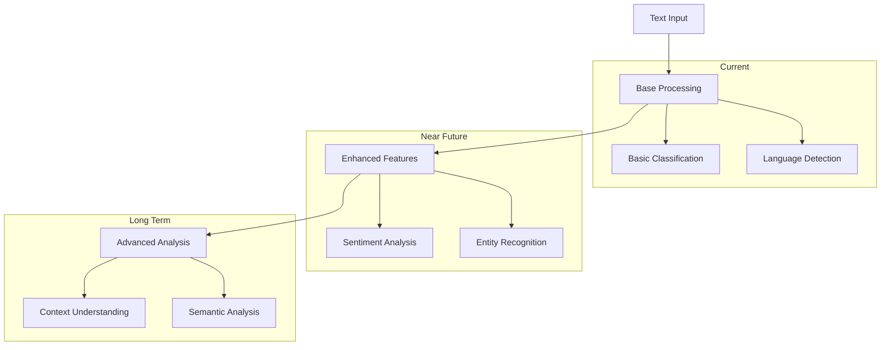
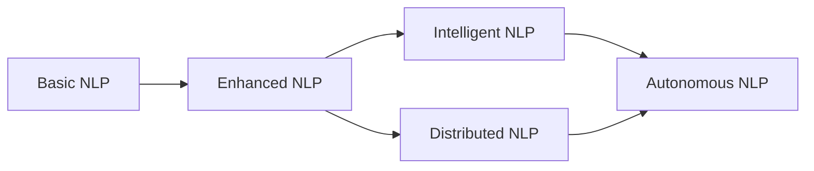
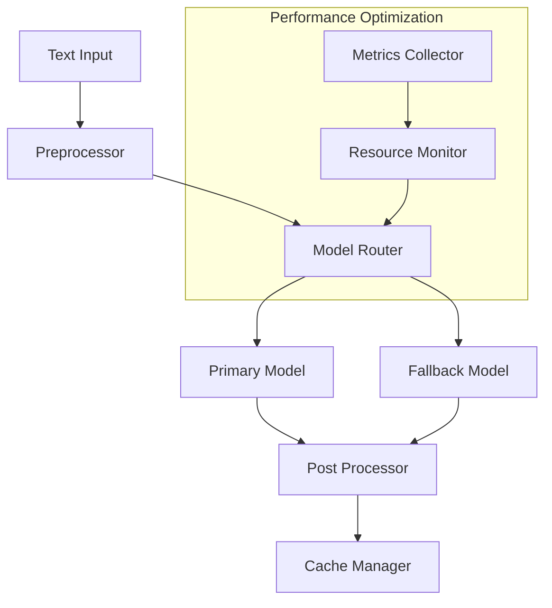
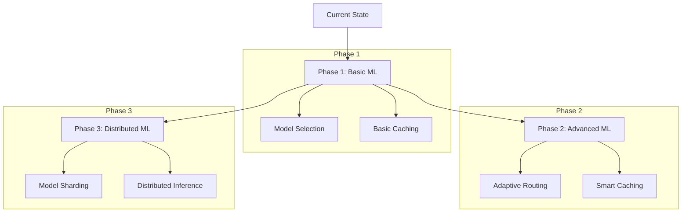

# NLP Pipeline Architecture

## Current Functionality

The NLP pipeline serves as the foundational text processing component within Datapunk, integrating with the NeuroCortex orchestrator (referenced in `cortex-neurocortex-orchestrator.md`).

### Core Components

#### 1. Pipeline Integration

Currently implemented through the PipelineManager class:

```python
class NLPPipelineManager:
    def __init__(self, config: Dict[str, Any]):
        self.preprocessor = TextPreprocessor(config["preprocessing"])
        self.classifier = TextClassifier(config["classification"])
        self.cache = CacheManager(config["cache"])
        
    async def process_text(self, text: str) -> Dict[str, Any]:
        cache_key = f"nlp:{hash(text)}"
        cached = await self.cache.get(cache_key)
        if cached:
            return cached
            
        processed = await self.preprocessor.process(text)
        result = await self.classifier.classify(processed)
        await self.cache.set(cache_key, result)
        return result
```

#### 2. Text Processing Flow

The current implementation leverages Haystack's pipeline architecture:

```python:datapunk/datapunk-cortex/src/core/pipeline.py
startLine: 50
endLine: 71
```

### Integration Points

Currently interfaces with:

- HaystackEngine for document processing
- LangChainEngine for LLM operations
- Cache layer for performance optimization

## Speculative Potential

### 1. Advanced NLP Features



### 2. Integration Opportunities

```yaml
future_integrations:
  llm_providers:
    - openai:
        models: [gpt-4, gpt-3.5-turbo]
        features: [completion, embedding]
    - anthropic:
        models: [claude-3]
        features: [analysis, generation]
  vector_databases:
    - pgvector:
        features: [similarity_search, clustering]
    - milvus:
        features: [vector_indexing, search]
```

## Unknowns and Challenges

### 1. Performance Optimization

- Challenge: Balancing accuracy vs. latency
- Research needed: Optimal model size for different tasks
- Potential solution: Dynamic model selection based on request requirements

### 2. Scaling Considerations

- Challenge: Managing concurrent NLP requests
- Investigation needed: Load balancing strategies
- Open question: Optimal batch size for different operations

## Vision and Iteration

### Short-term Goals

1. Implement basic sentiment analysis
2. Add language detection
3. Integrate with existing cache system

### Medium-term Goals

1. Add named entity recognition
2. Implement advanced text classification
3. Add support for multiple languages

### Long-term Vision



### Implementation Strategy

```python
class NLPEvolutionManager:
    def __init__(self):
        self.feature_gates = FeatureGates()
        self.metrics = MetricsCollector()
        self.experiments = ExperimentManager()
        
    async def evaluate_feature(self, feature: NLPFeature) -> bool:
        metrics = await self.metrics.get_feature_metrics(feature)
        experiments = await self.experiments.get_results(feature)
        return await self.feature_gates.should_enable(feature, metrics, experiments)
```

## Implementation Details

### Current Model Selection Architecture

The model selection system is built on the ModelSelector class which intelligently routes requests based on requirements:

```python:datapunk/datapunk-cortex/src/models/selection.py
startLine: 17
endLine: 39
```

This integrates with the configuration defined in:

```yaml:datapunk/datapunk-cortex/config/settings.yaml
startLine: 14
endLine: 46
```

### Enhanced Processing Pipeline

The NLP pipeline leverages a multi-stage architecture with configurable components:



#### Pipeline Components Integration

The pipeline integrates with both Haystack and LangChain through the NeuroCortex orchestrator:

```python:datapunk/datapunk-cortex/src/core/neurocortex.py
startLine: 10
endLine: 36
```

### Speculative Enhancements

#### 1. Advanced Model Routing

```python
class AdaptiveModelRouter:
    def __init__(self, config: Dict[str, Any]):
        self.performance_tracker = PerformanceTracker()
        self.resource_monitor = ResourceMonitor()
        self.model_pool = ModelPool()
        
    async def select_model(self, request: Dict[str, Any]) -> Model:
        # Analyze request characteristics
        complexity = await self.analyze_complexity(request)
        available_resources = self.resource_monitor.get_current_state()
        
        # Get performance history
        historical_performance = await self.performance_tracker.get_metrics()
        
        # Use ML to predict optimal model
        return await self.model_pool.get_optimal_model(
            complexity=complexity,
            resources=available_resources,
            history=historical_performance
        )
```

#### 2. Dynamic Resource Management

```yaml
resource_management:
  monitoring:
    metrics:
      - cpu_usage
      - memory_usage
      - inference_latency
      - throughput
    thresholds:
      cpu_high: 0.8
      memory_high: 0.75
      latency_max: 100ms
  scaling:
    strategies:
      - horizontal_scaling
      - model_switching
      - batch_size_adjustment
    cooldown_period: 300s
```

### Technical Challenges & Research Areas

1. **Model Warm-up Optimization**
   - Challenge: Cold start latency for large models
   - Potential solution: Predictive model loading based on usage patterns
   - Research needed: Optimal preloading strategies

2. **Cache Invalidation Strategy**
   - Challenge: Maintaining cache freshness without unnecessary invalidation
   - Investigation needed: Time-based vs. usage-based eviction policies
   - Experiment proposal: A/B testing different cache strategies

### Evolution Roadmap



### Integration Strategy

The implementation will build upon existing components:

```python:datapunk/datapunk-cortex/src/core/pipeline.py
startLine: 1
endLine: 19
```

## Integration Points (NLP Pipeline)

### 1. API Endpoints

- POST `/api/nlp/classify` - Text classification
- POST `/api/nlp/analyze` - Basic text analysis

### 2. Example Usage

```python
async def classify_text(text: str) -> Dict[str, float]:
    """Basic text classification endpoint"""
    result = await nlp_pipeline.process({
        "text": text,
        "task": "classification"
    })
    return result.classifications
```

## Next Steps

1. **Short-term**
   - Add basic sentiment analysis
   - Implement caching
   - Add error handling

2. **Medium-term**
   - Add named entity recognition
   - Expand language support
   - Improve classification accuracy
