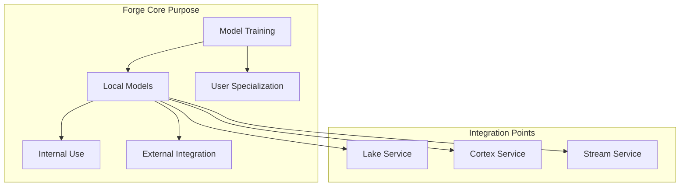

# Datapunk Forge (NeuroMancer) Documentation Strategy

## Current Understanding
From the codebase (referencing lines 5-6 in datapunk/docs/App/Forge/datapunk-forge.md), Forge serves as our AI model factory, but its scope and integration points need clearer definition.

## Documentation Structure Needed

1. **Core Architecture Document**
   - Purpose and scope
   - Service boundaries
   - Integration patterns
   - Resource management

2. **Technical Implementation Docs**
   - Training pipeline details
   - Model lifecycle management
   - Resource optimization
   - Security considerations

3. **Integration Guides**
   - Lake service integration
   - Cortex service integration
   - Stream service integration
   - External system interfaces

## Key Areas to Define

1. **Model Training Scope**
   - What types of models?
   - Training data sources
   - Resource limitations
   - Performance requirements

2. **Service Boundaries**
   - Clear separation from Cortex
   - Data flow patterns
   - State management
   - Resource sharing

3. **Integration Patterns**
   - How other services request training
   - Model deployment process
   - Data pipeline integration
   - Monitoring and metrics

## Core Components

### MLRun Integration

- Model lifecycle management
- Training pipeline orchestration
- Experiment tracking
- Model versioning
- Resource optimization

### Vector Processing

- pgvector integration
- Embedding generation
- Similarity search optimization
- Dimension reduction

### Model Registry

- BentoML implementation
- Model versioning
- Deployment management
- A/B testing support
- Model serving

## Training Pipeline

### 1. Feature Engineering

- Feature extraction
- Data preprocessing
- Feature selection
- Dimensionality reduction
- Feature store integration (Feast)

### 2. Model Development

- Custom model architecture
- Transfer learning
- Model fine-tuning
- Hyperparameter optimization
- Cross-validation

### 3. Training Orchestration

yaml
training_config:
resources:
limits:
cpu: "4"
memory: "8G"
requests:
cpu: "2"
memory: "4G"
scheduling:
max_retries: 3
timeout: 3600

### 4. Model Evaluation

- Performance metrics
- Bias detection (AI Fairness 360)
- Model interpretability (SHAP/LIME)
- A/B testing framework
- Validation pipelines

## Specialized Models

### 1. Recommendation Systems

- Input: Browsing history, search queries, watch history
- Purpose: Content and service recommendations
- Architecture: Collaborative filtering, content-based

### 2. NLP Models

- Input: Emails, documents, chat histories
- Purpose: Text analysis, sentiment detection
- Integration: spaCy, Hugging Face Transformers

### 3. Behavioral Models

- Input: Calendar events, location history
- Purpose: Activity prediction
- Architecture: Time-series forecasting

### 4. Anomaly Detection

- Input: Security logs, account activities
- Purpose: Threat detection
- Architecture: Unsupervised learning

## Integration Points

### 1. Database Connection

- PostgreSQL vector store
- Feature storage
- Model metadata
- Training logs

### 2. Cache Layer

yaml
redis_config:
host: ${REDIS_HOST}
port: 6379
db: 0
cache_ttl: 3600

### 3. API Endpoints

- Model training triggers
- Status monitoring
- Prediction serving
- Model management

## Security Measures

### 1. Model Security

- Model encryption
- Access control
- Version control
- Audit logging

### 2. Training Data Protection

- Data anonymization
- PII detection
- Secure transfer
- Access logging

## Performance Optimization

### 1. Resource Management

- GPU utilization
- Memory optimization
- Batch processing
- Distributed training

### 2. Caching Strategy

- Feature caching
- Prediction caching
- Model caching
- Intermediate results

## Monitoring & Metrics

### 1. Training Metrics

- Loss curves
- Validation metrics
- Resource utilization
- Training duration

### 2. Model Metrics

- Prediction latency
- Memory usage
- Cache hit rates
- Error rates

## Docker Configuration

 @Codebase  Lets goahead and do a doc similar to what we have for data lake stream and cortex, but for the datapunk-forge (also called nueromancer)

I'll help create a detailed architecture document for datapunk-forge/NeuroMancer based on the provided codebase. From the references, I can see that NeuroMancer is analogous to Hephaestus in the Horizon series (reference from datapunk/docs/planning/thoughtsonai.md lines 237-238) and serves as the model training component of the system.
yaml
training_config:
resources:
limits:
cpu: "4"
memory: "8G"
requests:
cpu: "2"
memory: "4G"
scheduling:
max_retries: 3
timeout: 3600
yaml
redis_config:
host: ${REDIS_HOST}
port: 6379
db: 0
cache_ttl: 3600
yaml
services:
datapunk-forge:
image: datapunk/forge:latest
container_name: datapunk_forge
environment:
MLRUN_DBPATH: ${MLRUN_DBPATH}
REDIS_URL: ${REDIS_URL}
POSTGRES_URL: ${POSTGRES_URL}
volumes:
model_storage:/models
training_cache:/cache
deploy:
resources:
limits:
cpus: '4'
memory: 16G
reservations:
cpus: '2'
memory: 8G
networks:
datapunk_network
This architecture document incorporates references from multiple provided files while maintaining consistency with the overall system design and philosophy. It's structured to mirror the format of the datapunk-lake and datapunk-stream documents while focusing on the specific AI model training and management responsibilities of the forge component.
can you rewriteto make it easy to copy into a test file?

Here's the same content formatted as a markdown file that you can easily copy:
datapunk-forge.md
yaml
training_config:
resources:
limits:
cpu: "4"
memory: "8G"
requests:
cpu: "2"
memory: "4G"
scheduling:
max_retries: 3
timeout: 3600
yaml
redis_config:
host: ${REDIS_HOST}
port: 6379
db: 0
cache_ttl: 3600
yaml
services:
datapunk-forge:
image: datapunk/forge:latest
container_name: datapunk_forge
environment:
MLRUN_DBPATH: ${MLRUN_DBPATH}
REDIS_URL: ${REDIS_URL}
POSTGRES_URL: ${POSTGRES_URL}
volumes:
model_storage:/models
training_cache:/cache
deploy:
resources:
limits:
cpus: '4'
memory: 16G
reservations:
cpus: '2'
memory: 8G
networks:
datapunk_network

## Future Considerations

### 1. Scalability

- Distributed training
- Multi-GPU support
- Model parallelization
- Automated scaling

### 2. Advanced Features

- AutoML integration
- Neural architecture search
- Federated learning
- Online learning

### 3. Integration

- Enhanced LangChain integration
- Custom model architectures
- Specialized training pipelines
- Advanced caching strategies

## Ethics & Governance

### 1. Model Transparency

- Model cards
- Decision explanations
- Bias reporting
- Version tracking

### 2. User Controls

- Training preferences
- Model selection
- Privacy settings
- Data usage controls

# Datapunk Forge (NeuroMancer) Documentation Strategy

## Current Understanding
From the codebase (referencing lines 5-6 in datapunk/docs/App/Forge/datapunk-forge.md), Forge serves as our AI model factory, but its scope and integration points need clearer definition.

## Documentation Structure Needed

1. **Core Architecture Document**
   - Purpose and scope
   - Service boundaries
   - Integration patterns
   - Resource management

2. **Technical Implementation Docs**
   - Training pipeline details
   - Model lifecycle management
   - Resource optimization
   - Security considerations
   - Performance optimization
   - Monitoring and metrics
   - Tech Stack
   - Hugging Face Integration for pre-trained models
   - BentoML for model serving
   - Depot AI for versioning
   - Prometheus for metrics
   - Grafana for visualization
   - Pytorch for model training
   - Tensorflow for model training?

   - MLFlow for training orchestration? (instead of MLRun?)
   - Redis for caching?
   - pgvector for vector storage?
   - Feast for feature storage?

3. **Integration Guides**
   - Lake service integration
   - Cortex service integration
   - Stream service integration
   - External system interfaces

## Key Areas to Define

1. **Model Training Scope**
   - What types of models?
   - Training data sources
   - Resource limitations
   - Performance requirements

2. **Service Boundaries**
   - Clear separation from Cortex
   - Data flow patterns
   - State management
   - Resource sharing

3. **Integration Patterns**
   - How other services request training
   - Model deployment process
   - Data pipeline integration
   - Monitoring and metrics

Would you like me to:
1. Create a detailed outline for any of these sections?
2. Define specific integration patterns?
3. Detail the service boundaries?