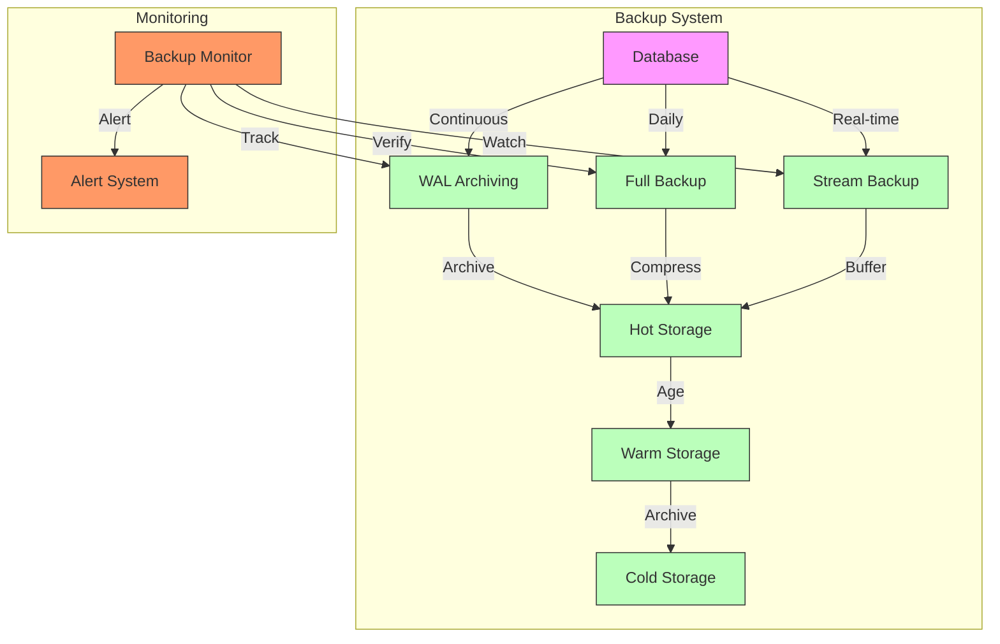
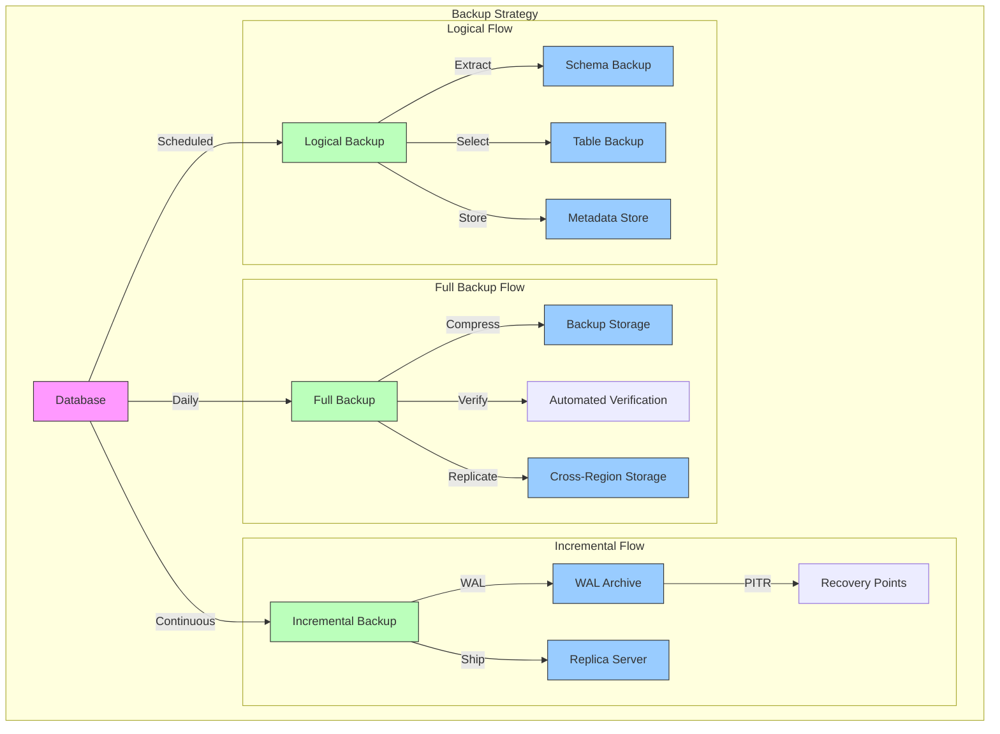
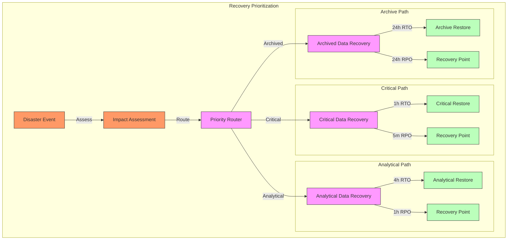
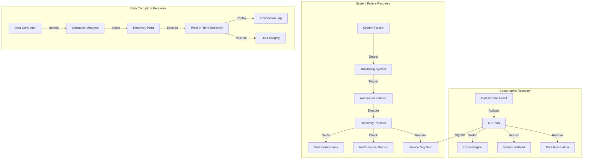
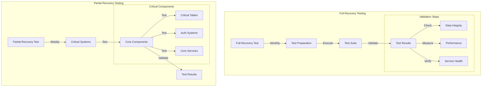
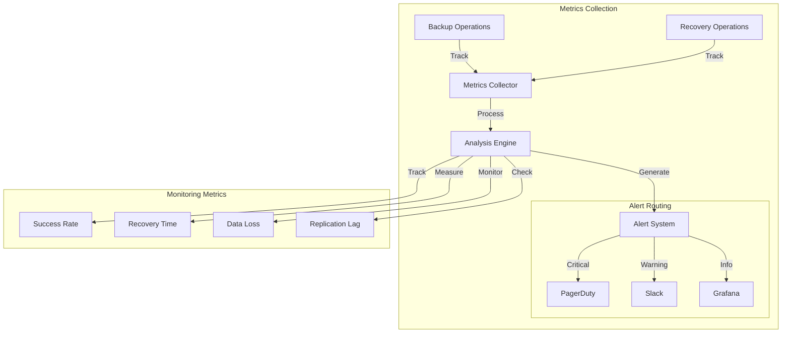

# Comprehensive Backup and Disaster Recovery Framework

## Architecture Overview



## Implementation Details

### Continuous Backup Strategy

References architecture patterns from:

```markdown
datapunk/docs/App/Lake/Architecture-Lake.md
startLine: 452
endLine: 464
```

```yaml
backup_implementation:
  wal_archiving:
    configuration:
      enabled: true
      compression: 
        algorithm: "zstd"
        level: 3
        chunk_size: "16MB"
      retention:
        duration: "7d"
        cleanup_schedule: "0 3 * * *"
      monitoring:
        - archival_success_rate
        - compression_ratio
        - latency_metrics
    
  full_backup:
    schedule: 
      cron: "0 2 * * *"  # Daily at 2 AM
      timezone: "UTC"
      max_duration: "4h"
    resources:
      parallel_jobs: 4
      io_priority: "low"
      cpu_limit: "50%"
    storage_tiers:
      hot:
        retention: "7d"
        storage_class: "ssd"
        replication: 2
      warm:
        retention: "30d"
        storage_class: "hybrid"
        replication: 2
      cold:
        retention: "365d"
        storage_class: "hdd"
        replication: 3
```

#### Integration Considerations for Backup System  

1. **Stream Service Integration**

```yaml
stream_backup_coordination:
  real_time_backup:
    - transaction_log_shipping
    - change_data_capture
    - point_in_time_recovery
  monitoring:
    - replication_lag
    - data_consistency
    - backup_completeness
```

2. **Cortex Service Integration**
References vector storage patterns from:

```markdown
datapunk/docs/App/Lake/work-queue/schema-organization.md
startLine: 976
endLine: 985
```

3. **Recovery Integration**

```yaml
recovery_coordination:
  automated_procedures:
    - health_verification
    - service_restoration
    - data_validation
  monitoring:
    - recovery_progress
    - system_health
    - performance_metrics
```

#### Performance Optimization for Backup System

```yaml
backup_optimization:
  compression:
    adaptive_algorithm:
      - data_type_analysis
      - compression_ratio_monitoring
      - performance_impact_tracking
  resource_management:
    scheduling:
      - off_peak_hours
      - load_based_throttling
      - priority_queuing
    monitoring:
      - system_load
      - io_utilization
      - network_bandwidth
```

### Backup Types Framework

#### Architecture Overview for Backup Types



#### Implementation Details for Backup Types

1. Full Backups

References implementation from:

```markdown
datapunk/docs/App/Lake/work-queue/recovery-backup.md
startLine: 32
endLine: 46
```

```yaml
full_backup_implementation:
  schedule:
    timing: "0 2 * * *"  # Daily at 2 AM
    max_duration: "4h"
    priority: high
  
  compression:
    algorithm: "zstd"
    level: 3
    chunk_size: "256MB"
    parallel_compression: true
  
  verification:
    checksum_algorithm: "SHA-256"
    parallel_verification: true
    integrity_checks:
      - block_level_validation
      - metadata_verification
      - index_consistency
  
  replication:
    regions:
      - primary: "us-east"
      - secondary: ["us-west", "eu-central"]
    sync_strategy: "async"
    validation_frequency: "hourly"
```

2. Incremental Backups

References WAL configuration from:

```markdown
datapunk/docs/App/Lake/work-queue/recovery-backup.md
startLine: 48
endLine: 59
```

```yaml
incremental_backup_implementation:
  wal_archiving:
    mode: "continuous"
    compression: "lz4"
    retention: "7d"
    monitoring:
      - archival_lag
      - compression_ratio
      - storage_usage
  
  log_shipping:
    sync_mode: "async"
    max_delay: "30s"
    bandwidth_limit: "50MB/s"
    priority: "high"
  
  pitr_capability:
    granularity: "1s"
    recovery_targets:
      - timestamp
      - transaction_id
      - named_restore_point
```

3. Logical Backups

References logical backup patterns from:

```markdown
datapunk/docs/App/Lake/work-queue/recovery-backup.md
startLine: 61
endLine: 74
```

```yaml
logical_backup_implementation:
  schema_backup:
    components:
      - table_definitions
      - indexes
      - constraints
      - stored_procedures
    frequency: "weekly"
    
  selective_backup:
    strategy: "incremental"
    table_selection:
      - priority_level
      - data_sensitivity
      - update_frequency
    
  metadata_management:
    tracking:
      - schema_versions
      - dependency_maps
      - configuration_history
    retention: "365d"
```

#### Integration Considerations for Backup Types

1. **Stream Service Integration**
References patterns from:

```markdown
datapunk/docs/App/Lake/work-queue/data-processing-pipeline.md
startLine: 67
endLine: 88
```

2. **Performance Optimization**
References settings from:

```markdown
datapunk/docs/App/Lake/Architecture-Lake.md
startLine: 334
endLine: 354
```

## Disaster Recovery

### Disaster Recovery Framework

#### Architecture Overview for Disaster Recovery



#### Implementation Details for Disaster Recovery  

```yaml
disaster_recovery:
  recovery_objectives:
    critical_data:
      rto: 1h
      rpo: 5m
      implementation:
        primary_strategy: "hot_standby"
        failover_automation: true
        data_sync: "synchronous"
      monitoring:
        - replication_lag
        - data_consistency
        - service_health
      validation:
        - integrity_checks
        - performance_baselines
        - application_testing
        
    analytical_data:
      rto: 4h
      rpo: 1h
      implementation:
        primary_strategy: "warm_standby"
        failover_automation: true
        data_sync: "asynchronous"
      monitoring:
        - batch_processing_status
        - data_freshness
        - system_performance
      validation:
        - aggregation_accuracy
        - query_performance
        - data_completeness
        
    archived_data:
      rto: 24h
      rpo: 24h
      implementation:
        primary_strategy: "cold_backup"
        restore_priority: "sequential"
        data_sync: "batch"
      monitoring:
        - restore_progress
        - storage_availability
        - retrieval_speed
      validation:
        - archive_integrity
        - metadata_consistency
        - compliance_verification
```

## Integration Considerations

1. **Backup System Integration**
References implementation from:

```markdown
datapunk/docs/App/Lake/work-queue/backup-recovery.md
startLine: 48
endLine: 74
```

2. **Storage Strategy Integration**
References configuration from:

```markdown
datapunk/docs/App/Lake/expanded/storage-strategy.md
startLine: 53
endLine: 124
```

3. **Recovery Procedures**

```yaml
recovery_procedures:
  automation:
    health_checks:
      - service_availability
      - data_consistency
      - performance_metrics
    restoration_sequence:
      - critical_services
      - dependent_services
      - auxiliary_services
    validation_steps:
      - integrity_verification
      - performance_validation
      - application_testing
      
  monitoring_integration:
    metrics:
      - recovery_progress
      - data_consistency
      - service_health
    alerts:
      - recovery_delays
      - validation_failures
      - performance_issues
```

### Recovery Procedures Framework

#### Architecture Overview for Recovery Procedures



#### Implementation Details for Recovery Procedures

1. System Failure Recovery

References implementation from:

```markdown
datapunk/docs/App/Lake/work-queue/recovery-backup.md
startLine: 101
endLine: 111
```

```yaml
system_failure_recovery:
  automated_failover:
    detection:
      - health_check_interval: 10s
      - failure_threshold: 3
      - service_dependencies: ["postgresql", "redis", "stream"]
    execution:
      - priority_services_first
      - parallel_recovery_where_possible
      - dependency_order_respect
    
  service_restoration:
    procedures:
      - connection_pool_reset
      - cache_warm_up
      - query_plan_refresh
    validation:
      - service_health_check
      - connection_verification
      - resource_availability

  consistency_verification:
    checks:
      - transaction_logs
      - replication_status
      - data_checksums
    resolution:
      - automatic_repair
      - manual_intervention_triggers
      - rollback_capabilities
```

2. Data Corruption Recovery

References patterns from:

```markdown
datapunk/docs/App/Lake/work-queue/recovery-backup.md
startLine: 115
endLine: 125
```

```yaml
corruption_recovery:
  pitr_implementation:
    granularity: 1s
    max_recovery_window: "7d"
    validation_steps:
      - pre_recovery_verification
      - post_recovery_validation
      - application_consistency
    
  transaction_replay:
    strategy:
      - parallel_replay_where_possible
      - dependency_tracking
      - conflict_resolution
    monitoring:
      - replay_progress
      - data_consistency
      - performance_impact
```

3. Catastrophic Recovery

References configuration from:

```markdown
datapunk/docs/App/Lake/work-queue/recovery-backup.md
startLine: 130
endLine: 140
```

```yaml
catastrophic_recovery:
  cross_region_failover:
    regions:
      primary: "us-east"
      secondary: ["us-west", "eu-central"]
    automation:
      - dns_failover
      - traffic_routing
      - data_sync_verification
    
  system_rebuild:
    priority_order:
      - core_infrastructure
      - data_services
      - application_services
    validation:
      - infrastructure_health
      - security_compliance
      - performance_baselines
```

#### Integration Considerations for Recovery Procedures

1. **Stream Service Integration**
References patterns from:

```markdown
datapunk/docs/App/Lake/work-queue/data-processing-pipeline.md
startLine: 67
endLine: 88
```

2. **Monitoring Integration**
References metrics from:

```markdown
datapunk/docs/App/Lake/Architecture-Lake.md
startLine: 214
endLine: 222
```

### Testing and Validation Framework

#### Architecture Overview of Testing and Validation



#### Implementation Details of Testing and Validation

```yaml
testing_validation_framework:
  full_recovery_testing:
    schedule:
      frequency: "monthly"
      timing: "first_sunday_3am"
      duration: "4h"
      notification:
        pre_test: "48h"
        stakeholders: ["ops_team", "data_team", "service_owners"]
    
    validation_steps:
      data_integrity:
        tests:
          - checksum_verification
          - record_count_validation
          - relationship_verification
          - data_consistency_check
        thresholds:
          accuracy: "100%"
          completeness: "99.99%"
          
      performance_metrics:
        benchmarks:
          - query_response_time
          - throughput_rates
          - resource_utilization
        baseline_comparison:
          tolerance: "±5%"
          historical_window: "90d"
          
      service_availability:
        checks:
          - api_endpoints
          - database_connections
          - cache_services
          - background_jobs
        sla_requirements:
          availability: "99.99%"
          response_time: "200ms"
          
  partial_recovery_testing:
    schedule:
      frequency: "weekly"
      timing: "sunday_1am"
      duration: "1h"
      parallel_execution: true
      
    components:
      critical_tables:
        priority: "highest"
        tests:
          - crud_operations
          - index_effectiveness
          - constraint_validation
          
      auth_systems:
        priority: "highest"
        tests:
          - authentication_flow
          - authorization_rules
          - session_management
          
      core_services:
        priority: "high"
        tests:
          - service_dependencies
          - api_functionality
          - data_processing_pipeline
```

### Integration Considerations for Testing and Validation

1. **Stream Service Integration**
References patterns from:

```markdown:datapunk/docs/App/Lake/work-queue/data-processing-pipeline.md
startLine: 517
endLine: 560
```

2. **Quality Control Integration**
References validation framework from:

```markdown:datapunk/docs/App/Lake/expanded/data-processing-pipeline.md
startLine: 1054
endLine: 1087
```

3. **Monitoring Integration**

```yaml
monitoring_integration:
  test_execution:
    metrics:
      - test_success_rate
      - recovery_time
      - data_accuracy
    alerts:
      - test_failures
      - performance_degradation
      - validation_errors
  reporting:
    formats:
      - detailed_logs
      - executive_summary
      - trend_analysis
    distribution:
      - automated_notifications
      - stakeholder_dashboards
      - compliance_documentation
```

### Backup Monitoring and Alerting Framework

#### Architecture Overview of Backup Monitoring and Alerting



#### Implementation Details of Backup Monitoring and Alerting

```yaml
monitoring_framework:
  metrics:
    backup_success_rate:
      type: gauge
      collection_interval: 5m
      thresholds:
        warning: 0.95  # 95% success rate
        critical: 0.90 # 90% success rate
      retention: 90d
      
    recovery_time:
      type: histogram
      buckets: [30s, 1m, 5m, 15m, 30m, 1h]
      labels:
        - recovery_type
        - data_size
        - priority_level
      sla_target: "15m"
      
    data_loss_events:
      type: counter
      labels:
        - cause
        - severity
        - affected_service
      alert_threshold: 1
      window: 24h
      
    replication_lag:
      type: gauge
      collection_interval: 30s
      thresholds:
        warning: 180s
        critical: 300s
      labels:
        - replica_id
        - datacenter

  alerts:
    backup_failure:
      threshold: 1
      window: 24h
      severity: critical
      channels:
        - pagerduty
        - slack
      runbook_url: "docs/backup/failure-recovery.md"
      
    replication_delay:
      threshold: 300s
      window: 5m
      severity: warning
      channels:
        - slack
        - email
      auto_remediation:
        enabled: true
        max_attempts: 3
        actions:
          - check_network_connectivity
          - restart_replication
          - escalate_to_dba
```

### Integration Considerations for Backup Monitoring and Alerting

1. **Prometheus Integration**
References configuration from:

```markdown
datapunk/docs/App/Lake/work-queue/monitoring-alerting.md
startLine: 91
endLine: 103
```

2. **Grafana Dashboards**
References dashboard configuration from:

```markdown
datapunk/docs/App/Lake/work-queue/monitoring-alerting.md
startLine: 105
endLine: 126
```

3. **Auto-Remediation Integration**

```yaml
remediation_integration:
  triggers:
    - metric: replication_lag
      threshold: 300s
      actions:
        - verify_network_connectivity
        - check_disk_space
        - restart_replication_slot
    - metric: backup_failure
      threshold: 1
      actions:
        - verify_backup_dependencies
        - cleanup_staging_area
        - retry_backup_operation
```