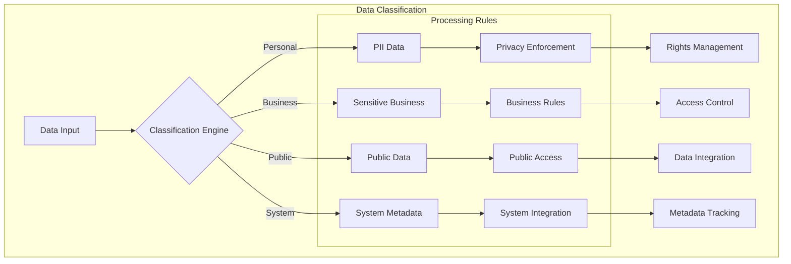
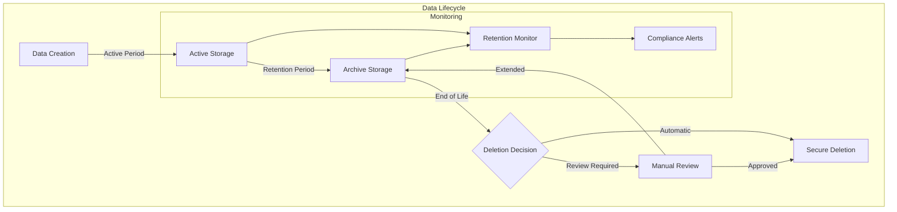
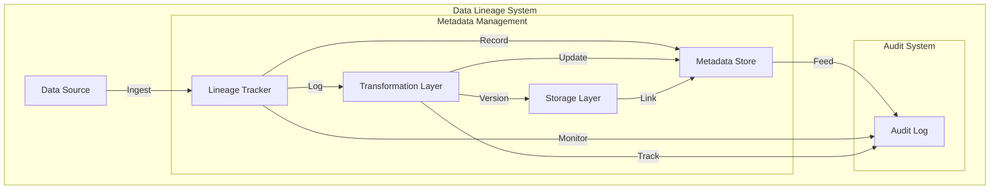
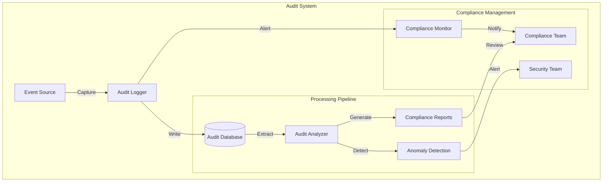

# Data Governance and Compliance

## Overview

This document outlines the data governance policies, compliance measures, and data lineage tracking for the Datapunk Lake component.

## Data Governance Framework

### Data Classification System



### Classification Details

#### Personal Identifiable Information (PII)

- Security Level: Highest
- Requirements:
  - End-to-end encryption
  - Mandatory access logging
  - GDPR/CCPA compliance
  - Regular audit trails

#### Sensitive Business Data

- Security Level: High
- Requirements:
  - Role-based access control (RBAC)
  - Audit logging
  - Impact assessment tracking
  - Competitive data protection

#### Public Data

- Security Level: Moderate
- Requirements:
  - Access monitoring
  - Cache optimization
  - Rate limit controls
  - Quality validation

#### System Metadata

- Security Level: Internal
- Requirements:
  - Performance tracking
  - Health monitoring
  - Integration metrics
  - System analytics

## Compliance Framework

### GDPR Implementation

```yaml
gdpr_compliance:
  data_subject_rights:
    access:
      response_time: "30 days"
      format_options:
        - json
        - csv
        - pdf
      verification_required: true
    
    deletion:
      cascade_deletion: true
      backup_handling: "mark_for_deletion"
      verification_process:
        - identity_confirmation
        - impact_assessment
        - dependency_check
    
    portability:
      supported_formats:
        - json
        - xml
        - csv
      metadata_inclusion: true
      relationship_preservation: true
    
    consent_management:
      granular_consent:
        - data_collection
        - processing_purposes
        - third_party_sharing
      consent_tracking:
        storage: "immutable_log"
        audit_trail: true
        version_control: true
```

### CCPA Implementation

```yaml
ccpa_compliance:
  consumer_rights:
    opt_out:
      mechanisms:
        - web_interface
        - api_endpoint
        - manual_request
      verification:
        method: "multi_factor"
        expiry: "12_months"
    
    data_collection:
      transparency:
        - collection_purpose
        - data_categories
        - sharing_practices
      notification:
        timing: "at_collection"
        format: "clear_conspicuous"
    
    processing_controls:
      sale_prevention:
        tracking: true
        verification: true
      third_party_management:
        contracts_required: true
        compliance_verification: true
```

## Data Retention Framework



### Retention Policies

```yaml
retention_implementation:
  personal_data:
    active_storage:
      duration: "2_years"
      storage_type: "hot"
      encryption: "aes-256-gcm"
      access_logging: true
    
    archive_storage:
      duration: "5_years"
      storage_type: "cold"
      compression: true
      audit_trail: true
    
    deletion:
      method: "secure_wipe"
      cascade: true
      notification: true
      verification: true

  system_logs:
    active_storage:
      duration: "6_months"
      indexing: "time-series"
      compression: true
    
    archive_storage:
      duration: "2_years"
      format: "compressed_json"
      searchable: true
    
    deletion:
      method: "batch_delete"
      verification: false

  analytics_data:
    active_storage:
      duration: "1_year"
      aggregation: true
      sampling: "adaptive"
    
    archive_storage:
      duration: "3_years"
      compression: "high"
      access_pattern: "infrequent"
    
    deletion:
      method: "review_required"
      criteria:
        - business_value
        - regulatory_requirements
        - storage_costs
```

## System Integration Points

### Stream Processing

- Real-time data classification
- Dynamic consent tracking
- Compliance verification
- Retention enforcement

### AI/ML Integration

- Automated classification
- PII detection
- Risk assessment
- Retention optimization

### Security Controls

- Access management
- Encryption services
- Audit logging
- Deletion verification

### Monitoring Services

- Compliance tracking
- Policy monitoring
- Access analytics
- Anomaly detection

## Data Lineage Framework

### System Architecture of Data Lineage



### Source Attribution Mechanisms

```yaml
source_attribution:
  tracking_mechanisms:
    origin_capture:
      - system_identifier
      - data_format
      - ingestion_timestamp
      - source_metadata
    
    authentication:
      - source_verification
      - integrity_checks
      - signature_validation
    
    classification:
      - data_type_detection
      - sensitivity_level
      - compliance_requirements

  metadata_collection:
    technical_metadata:
      - schema_version
      - encoding_format
      - size_metrics
      - quality_indicators
    
    business_metadata:
      - data_owner
      - purpose
      - retention_period
      - access_restrictions
```

## Transformation Tracking

```yaml
transformation_logging:
  operation_tracking:
    capture_level: "detailed"
    elements:
      - transformation_type
      - parameters_used
      - execution_context
      - performance_metrics
    
  version_control:
    strategy: "immutable_history"
    tracking:
      - version_number
      - change_description
      - responsible_entity
      - timestamp
    
  change_management:
    tracking_detail:
      - before_state
      - after_state
      - transformation_logic
      - validation_results
```

### Database Schema of Data Lineage

```sql
-- Core Lineage Tracking
CREATE TABLE data_lineage (
    lineage_id UUID PRIMARY KEY,
    source_system VARCHAR(255) NOT NULL,
    transformation_steps JSONB NOT NULL,
    created_at TIMESTAMPTZ DEFAULT CURRENT_TIMESTAMP,
    updated_at TIMESTAMPTZ DEFAULT CURRENT_TIMESTAMP,
    version INTEGER NOT NULL DEFAULT 1,
    checksum VARCHAR(64) NOT NULL,
    metadata JSONB,
    status VARCHAR(50) DEFAULT 'active'
);

-- Transformation History
CREATE TABLE transformation_history (
    history_id UUID PRIMARY KEY,
    lineage_id UUID REFERENCES data_lineage(lineage_id),
    transformation_type VARCHAR(100) NOT NULL,
    parameters JSONB,
    executed_at TIMESTAMPTZ DEFAULT CURRENT_TIMESTAMP,
    executed_by VARCHAR(255),
    status VARCHAR(50),
    performance_metrics JSONB
);

-- Version Control
CREATE TABLE version_control (
    version_id UUID PRIMARY KEY,
    lineage_id UUID REFERENCES data_lineage(lineage_id),
    version_number INTEGER NOT NULL,
    change_description TEXT,
    changed_by VARCHAR(255),
    changed_at TIMESTAMPTZ DEFAULT CURRENT_TIMESTAMP,
    previous_version UUID REFERENCES version_control(version_id)
);
```

### Service Integration

#### Stream Processing Integration

```yaml
stream_integration:
  real_time_tracking:
    - event_capture
    - transformation_logging
    - lineage_updates
  performance_optimization:
    - batch_updates
    - async_logging
    - metadata_caching
```

#### AI/ML Integration for Data Lineage

```yaml
cortex_integration:
  lineage_analysis:
    - pattern_detection
    - anomaly_identification
    - impact_analysis
  metadata_enrichment:
    - automated_classification
    - relationship_discovery
    - context_enhancement
```

### Monitoring Framework

```yaml
monitoring_framework:
  metrics:
    - lineage_completeness
    - transformation_accuracy
    - version_consistency
  alerts:
    - lineage_gaps
    - transformation_failures
    - version_conflicts
```

## Roadmap of Future Capabilities

```yaml
future_capabilities:
  advanced_tracking:
    - ml_powered_lineage_detection
    - automated_impact_analysis
    - predictive_data_quality
  visualization:
    - interactive_lineage_graphs
    - dependency_mapping
    - impact_visualization
  automation:
    - automated_documentation
    - smart_versioning
    - intelligent_metadata_generation
```

## Audit Trail Framework

### System Overview of Audit Trail



### Database Schema of Audit Trail

```sql
CREATE TABLE audit_logs (
    audit_id UUID PRIMARY KEY DEFAULT gen_random_uuid(),
    event_type VARCHAR(50) NOT NULL,
    user_id UUID NOT NULL,
    action_timestamp TIMESTAMPTZ DEFAULT CURRENT_TIMESTAMP,
    affected_data JSONB,
    source_ip INET,
    success BOOLEAN,
    metadata JSONB,
    severity_level VARCHAR(20),
    retention_period INTERVAL
);

CREATE INDEX idx_audit_timestamp ON audit_logs(action_timestamp);
CREATE INDEX idx_audit_user ON audit_logs(user_id);
CREATE INDEX idx_audit_type ON audit_logs(event_type);

-- Partitioning for efficient data management
CREATE TABLE audit_logs_partition OF audit_logs
PARTITION BY RANGE (action_timestamp);

-- Create partitions
CREATE TABLE audit_logs_y2024m01 PARTITION OF audit_logs_partition
    FOR VALUES FROM ('2024-01-01') TO ('2024-02-01');
```

### Event Classification

```yaml
audit_events:
  data_access:
    - record_view
    - bulk_export
    - search_operation
    - report_generation
  
  data_modification:
    - record_create
    - record_update
    - record_delete
    - batch_operation
  
  security_events:
    - login_attempt
    - permission_change
    - role_modification
    - api_key_generation
  
  system_events:
    - configuration_change
    - schema_modification
    - backup_operation
    - maintenance_task
```

### Retention Configuration

```yaml
retention_policies:
  security_events:
    retention: 7_years
    storage_tier: "cold_storage"
    encryption: "aes-256-gcm"
  
  data_modifications:
    retention: 5_years
    storage_tier: "warm_storage"
    compression: true
  
  access_logs:
    retention: 2_years
    storage_tier: "warm_storage"
    sampling: "adaptive"
```

### Compliance Reporting

```yaml
report_generation:
  schedules:
    daily_summary:
      time: "00:00 UTC"
      format: "pdf"
      distribution: ["security_team"]
    
    weekly_compliance:
      day: "Monday"
      time: "01:00 UTC"
      format: ["pdf", "csv"]
      distribution: ["compliance_team", "auditors"]
    
    monthly_analysis:
      day: "1"
      time: "02:00 UTC"
      format: ["pdf", "excel"]
      distribution: ["management", "compliance_team"]

  report_types:
    security_analysis:
      - access_patterns
      - failed_attempts
      - permission_changes
      - unusual_activity
    
    compliance_metrics:
      - gdpr_compliance
      - data_retention
      - consent_management
      - access_requests
    
    operational_insights:
      - data_volume_trends
      - user_activity_patterns
      - system_usage_metrics
      - performance_indicators
```

### Incident Response Framework

```yaml
incident_response:
  documentation:
    template:
      - incident_id
      - detection_time
      - severity_level
      - affected_systems
      - impact_assessment
      - resolution_steps
      - preventive_measures
    
    workflows:
      detection:
        - automated_detection
        - manual_reporting
        - third_party_notification
      
      response:
        - initial_assessment
        - containment_measures
        - investigation_process
        - remediation_steps
      
      review:
        - incident_analysis
        - policy_updates
        - training_requirements
        - system_improvements
```

### Service Integration for Audit Trail

#### Stream Processing Integration for Audit Trail

```yaml
stream_integration:
  audit_streaming:
    - real_time_event_capture
    - event_correlation
    - anomaly_detection
  performance:
    batch_size: 1000
    flush_interval: "5s"
    buffer_size: "100MB"
```

#### AI/ML Integration for Audit Trail

```yaml
cortex_integration:
  analysis:
    - pattern_recognition
    - behavior_analysis
    - risk_assessment
  machine_learning:
    - anomaly_detection
    - predictive_analytics
    - user_behavior_modeling
```

### Monitoring Framework for Audit Trail

```yaml
monitoring_integration:
  metrics:
    - audit_log_volume
    - processing_latency
    - storage_utilization
  alerts:
    critical:
      - log_failure
      - compliance_violation
      - security_breach
    warning:
      - unusual_activity
      - storage_threshold
      - performance_degradation
```
