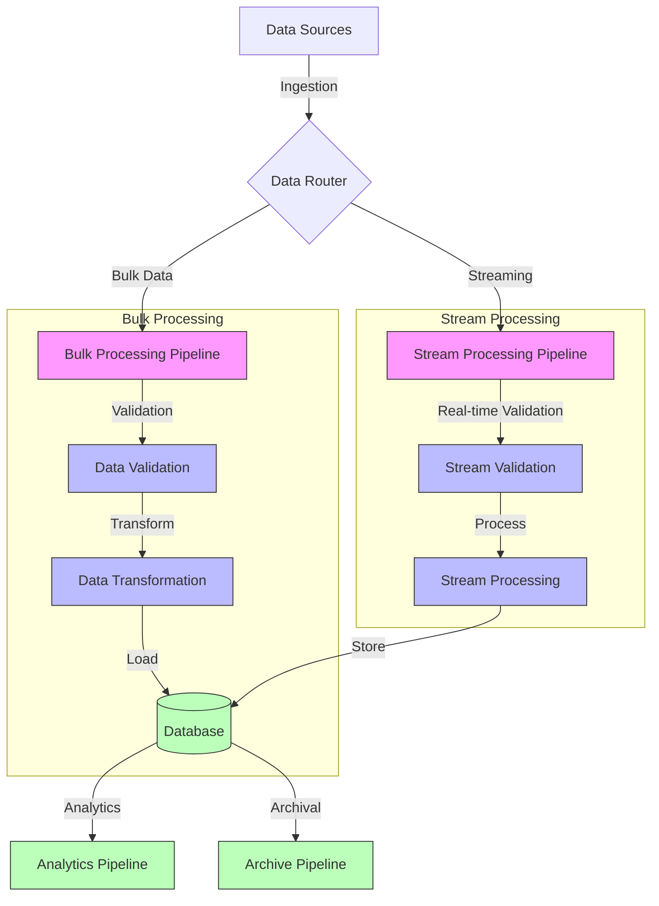
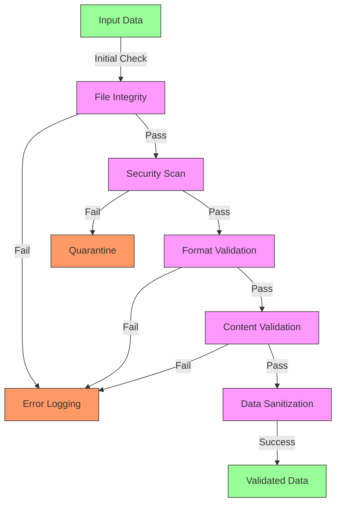
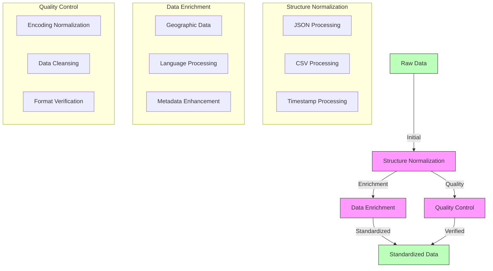
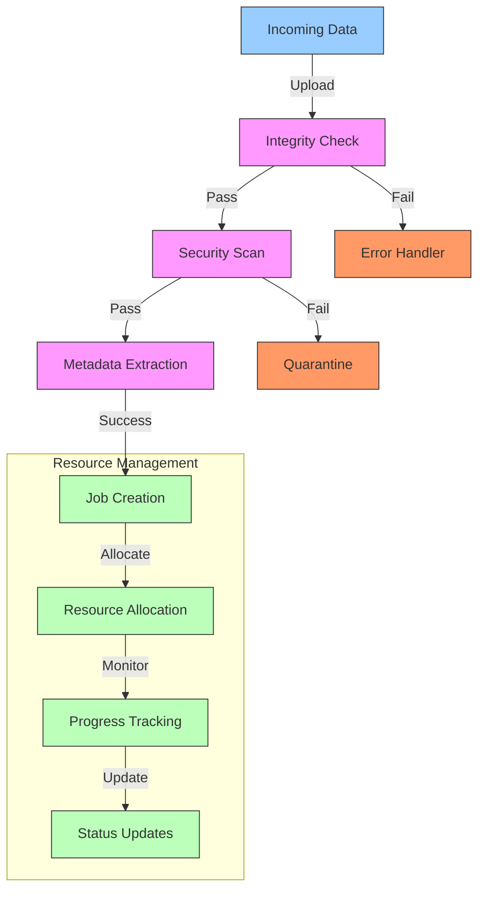
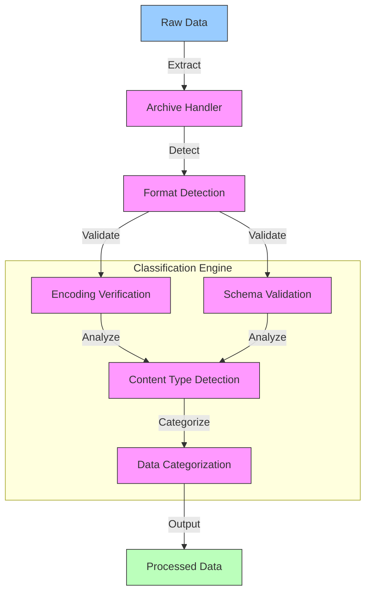
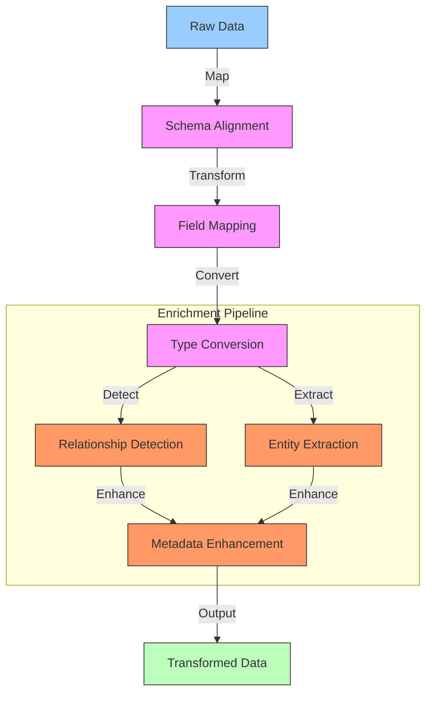
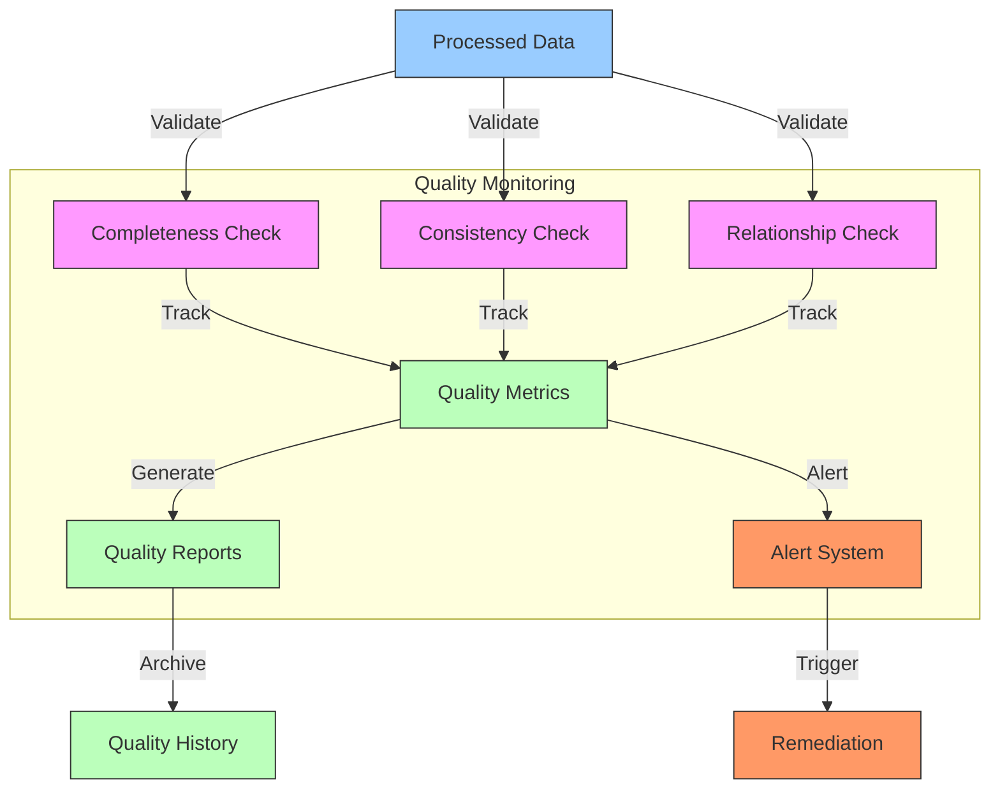
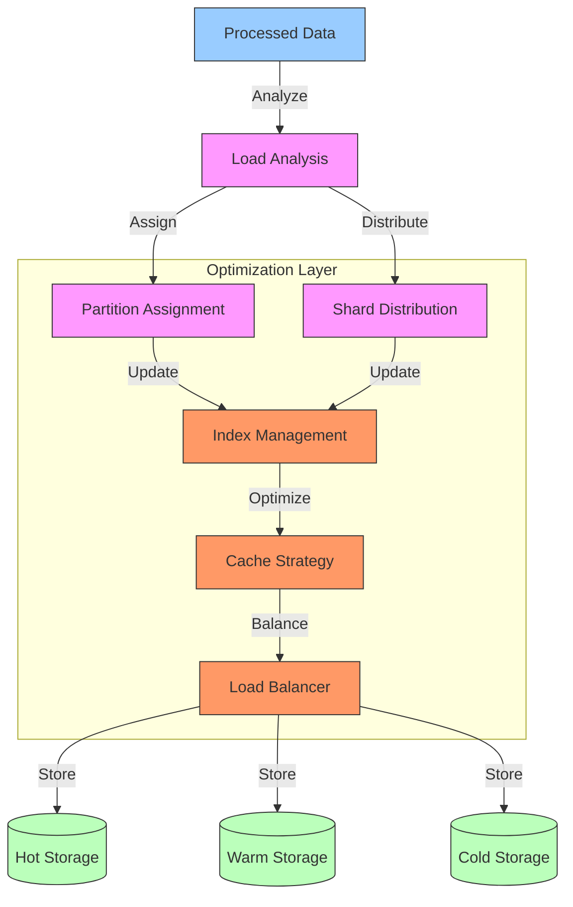
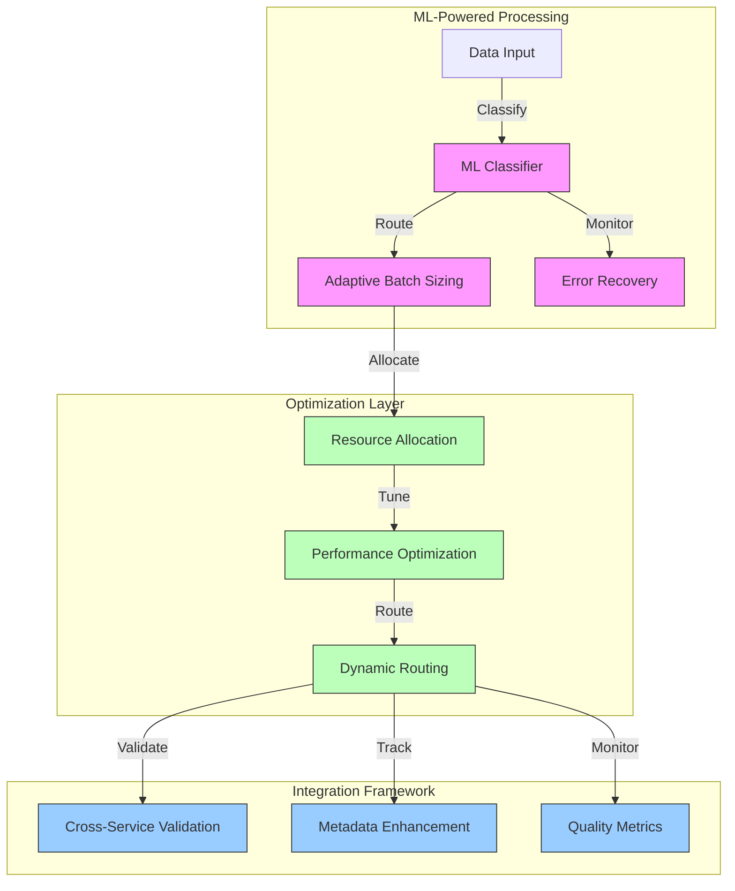

# Data Processing Pipeline

## Overview

The Data Processing Pipeline serves as the central nervous system of Datapunk Lake's data processing capabilities. This pipeline is designed to handle diverse data types while ensuring data quality, performance, and compliance with privacy regulations.

### Core Pipeline Architecture



## Bulk Import Processing

### Data Ingestion Intent

The ingestion system implements a resilient approach to handling large-scale data imports, particularly focused on user data exports and continuous streams. This implementation is based on the architecture detailed in:

```markdown:
datapunk/docs/App/Lake/Architecture-Lake.md
startLine: 119
endLine: 126
```

#### Ingestion Capabilities Implementation

```yaml
ingestion_capabilities:
  primary_focus:
    large_scale_exports:
      intent: "Handle complete user data exports"
      formats: ["Google Takeout", "Facebook Export", "Twitter Archive"]
      size_limit: "No practical limit"
      
    streaming_support:
      intent: "Enable continuous data ingestion"
      protocols: ["gRPC", "WebSocket", "Server-Sent Events"]
      buffer_size: "Configurable based on memory"
      
    chunked_processing:
      intent: "Manage large datasets efficiently"
      chunk_size: "Dynamically adjusted (default: 100MB)"
      parallel_chunks: "Configurable (default: 4)"
      
  reliability:
    automatic_retries:
      max_attempts: 3
      backoff_strategy: "exponential"
      failure_threshold: "Configurable per import type"
      
    progress_tracking:
      granularity: "Chunk level"
      metrics:
        - processed_records
        - validation_failures
        - processing_time
        
    resumable_operations:
      checkpoint_frequency: "Every successful chunk"
      state_persistence: "Redis + PostgreSQL"
      recovery_strategy: "Last successful checkpoint"
```

#### Integration Considerations

1. **Stream Service Coordination**
   - Coordinate with Datapunk Stream for real-time data handling
   - Implement backpressure mechanisms
   - Share processing metrics for system optimization

2. **Storage Layer Integration**
   - Buffer large imports in staging area
   - Implement efficient write patterns
   - Maintain consistency with existing data

3. **Resource Management**
   - Dynamic resource allocation based on import size
   - Coordinate with other system processes
   - Cache management for frequent operations

#### Performance Monitoring

```yaml
monitoring_metrics:
  ingestion_performance:
    - throughput_rate
    - error_rate
    - processing_latency
  resource_utilization:
    - memory_usage
    - disk_io
    - cpu_utilization
  quality_metrics:
    - validation_success_rate
    - data_completeness
    - format_compliance
```

## Validation & Sanitization Framework

The validation and sanitization framework implements a comprehensive approach to ensuring data quality, security, and integrity within the Datapunk Lake ecosystem. This framework serves as the first line of defense in our data processing pipeline.

### Core Architecture for Validation & Sanitization



### Implementation Details

#### File Integrity Framework for Validation & Sanitization

```yaml
file_integrity_implementation:
  checksum_verification:
    algorithms:
      primary: "sha256"
      fallback: "sha1"
    verification_points:
      - upload_completion
      - pre_processing
      - post_processing
    
  format_validation:
    mime_type_verification:
      enabled: true
      strict_matching: true
    magic_number_check:
      enabled: true
      custom_signatures: true
    
  encoding_checks:
    text_files:
      - utf8_validation
      - bom_detection
      - character_set_normalization
    binary_files:
      - header_validation
      - structure_verification
      - corruption_detection
```

#### Security Implementation for Validation & Sanitization

```yaml
security_framework:
  malware_scanning:
    engines:
      - clamav:
          update_frequency: "1h"
          scan_timeout: "5m"
      - custom_yara_rules:
          rule_sets: ["datapunk_security", "file_patterns"]
    
  pii_detection:
    engines:
      - presidio:
          confidence_threshold: 0.85
          supported_entities:
            - EMAIL_ADDRESS
            - PHONE_NUMBER
            - CREDIT_CARD
            - SSN
      - custom_patterns:
          pattern_sets: ["healthcare", "financial"]
    
  duplicate_prevention:
    methods:
      - content_hashing:
          algorithm: "xxhash64"
          chunk_size: "1MB"
      - fuzzy_matching:
          threshold: 0.95
          field_specific: true
```

### Format Support Implementation for Validation & Sanitization

#### Structured Data Processing for Validation & Sanitization

```yaml
structured_data_handling:
  json:
    schema_validation: true
    max_depth: 10
    max_size: "100MB"
    compression: true
  csv:
    dialect_detection: true
    encoding_detection: true
    header_validation: true
    type_inference: true
```

#### Media Processing for Validation & Sanitization

```yaml
media_processing:
  image:
    supported_formats:
      jpeg:
        max_resolution: "8192x8192"
        color_space_check: true
      png:
        max_size: "50MB"
        transparency_handling: true
      webp:
        quality_validation: true
        animation_support: true
    
  video:
    supported_formats:
      mp4:
        codec_validation: ["h264", "h265"]
        max_duration: "4h"
      mov:
        quality_check: true
        metadata_extraction: true
```

### Integration Considerations for Validation & Sanitization

1. **Stream Service Coordination**

```yaml
stream_integration:
  validation_events:
    - validation_start
    - security_scan_complete
    - format_verification
    - content_validation
  error_handling:
    - immediate_notification
    - error_categorization
    - remediation_workflows
```

2. **Performance Optimization**

```yaml
performance_tuning:
  parallel_processing:
    - file_integrity_checks
    - malware_scanning
    - format_validation
  resource_allocation:
    cpu_intensive:
      - video_processing
      - image_validation
    memory_intensive:
      - large_json_validation
      - duplicate_detection
```

3. **Monitoring Integration**

```yaml
monitoring_framework:
  metrics:
    - validation_success_rate
    - processing_time_per_stage
    - error_distribution
    - resource_utilization
  alerts:
    - high_failure_rate
    - processing_bottlenecks
    - security_threats
```

This validation framework integrates with our broader data processing pipeline as detailed in:

```markdown:
datapunk/docs/App/Lake/Architecture-Lake.md
startLine: 165
startLine: 190
```

## Format Standardization Framework

The Format Standardization framework implements a comprehensive approach to ensuring data consistency across all ingested data within the Datapunk Lake ecosystem. This standardization is crucial for maintaining data quality and enabling efficient cross-source analysis.

### Process Flow for Format Standardization



### Implementation Details for Format Standardization

#### Data Normalization Layer

```yaml
data_normalization_implementation:
  json_structure:
    flattening:
      max_depth: 10
      array_handling: "preserve_order"
      null_handling: "omit_empty"
    standardization:
      key_case: "snake_case"
      date_format: "iso8601"
      number_precision: "preserve"
      
  csv_processing:
    header_standardization:
      case: "lowercase"
      special_chars: "remove"
      spaces: "underscore"
    column_typing:
      inference_sample_size: 1000
      type_confidence: 0.95
      
  timestamp_handling:
    target_timezone: "UTC"
    formats:
      input_detection: ["auto", "iso8601", "unix", "custom"]
      output_format: "iso8601"
    precision: "millisecond"
```

#### Enrichment Processing

```yaml
enrichment_implementation:
  geographic_standardization:
    coordinate_system: "WGS84"
    precision: 6
    validation:
      bounds_check: true
      format_verification: true
    
  language_detection:
    confidence_threshold: 0.85
    fallback_lang: "en"
    supported_languages: ["en", "es", "fr", "de", "zh", "ja"]
    
  metadata_extraction:
    file_metadata:
      - creation_time
      - modification_time
      - mime_type
      - size
    content_metadata:
      - author
      - title
      - keywords
      - encoding
```

#### Quality Control Implementation for Format Standardization

```yaml
quality_implementation:
  encoding_normalization:
    target_encoding: "UTF-8"
    detection_confidence: 0.95
    fallback_encoding: "ASCII"
    
  data_cleansing:
    text:
      - trim_whitespace
      - normalize_unicode
      - remove_control_chars
    numeric:
      - standardize_decimals
      - normalize_scientific_notation
    
  format_verification:
    validation_rules:
      - schema_compliance
      - type_consistency
      - relationship_integrity
```

### Integration Considerations for Format Standardizatio

1. **Stream Processing Integration**

```yaml
stream_coordination:
  real_time_standardization:
    - incremental_processing
    - streaming_validation
    - immediate_feedback
  performance_metrics:
    - throughput_monitoring
    - error_tracking
    - latency_measurement
```

2. **Cortex Service Integration**

```yaml
cortex_integration:
  text_processing:
    - language_detection_sync
    - encoding_verification
    - metadata_enhancement
  vector_generation:
    - standardized_input_format
    - quality_verification
```

3. **Archive Coordination**

```yaml
archive_coordination:
  standardization_tracking:
    - version_control
    - transformation_history
    - quality_metrics
```

This standardization framework aligns with our data processing pipeline as detailed in:

```markdown
datapunk/docs/App/Lake/Architecture-Lake.md
startLine: 141
startLine: 149
```

## Processing Pipeline Stages

### Initial Receipt Processing Stage

The Initial Receipt stage serves as the critical entry point for all data entering the Datapunk Lake ecosystem. This stage implements comprehensive validation and job management to ensure data integrity and processing efficiency from the moment data arrives.

#### Process Flow for Initial Receipt Processing Stage



#### Validation Framework

```yaml
initial_validation:
  upload_integrity:
    checksum_verification:
      algorithms: ["sha256", "xxhash64"]
      verification_points:
        - pre_processing
        - post_upload
        - chunk_boundaries
    size_validation:
      max_single_file: "10GB"
      max_batch_size: "100GB"
      chunk_size: "100MB"
      
  security_scanning:
    virus_scan:
      engines: ["clamav", "yara"]
      scan_timeout: "5m"
      update_frequency: "1h"
    pii_detection:
      enabled: true
      confidence_threshold: 0.85
      scan_depth: "comprehensive"
      
  metadata_extraction:
    file_metadata:
      - mime_type
      - file_size
      - creation_date
      - modification_date
    content_metadata:
      - schema_detection
      - encoding_identification
      - compression_detection
```

#### Job Management System

```yaml
job_management:
  tracking_system:
    job_creation:
      unique_identifier: "uuid-v4"
      priority_levels: ["critical", "high", "normal", "low"]
      dependencies_tracking: true
    status_tracking:
      update_frequency: "real-time"
      persistence: "redis + postgresql"
      history_retention: "30d"
      
  progress_monitoring:
    metrics:
      - processed_bytes
      - validation_status
      - processing_stage
      - error_count
    alerting:
      thresholds:
        error_rate: "5%"
        processing_delay: "5m"
        resource_usage: "80%"
        
  resource_allocation:
    dynamic_scaling:
      cpu_allocation:
        min_cores: 2
        max_cores: 16
      memory_allocation:
        min_memory: "4GB"
        max_memory: "32GB"
    optimization:
      - load_balancing
      - priority_based_scheduling
      - resource_pooling
```

### Integration Considerations for Initial Receipt Processing Stage

1. **Stream Service Integration**
References implementation details from:

```markdown
datapunk/docs/App/Stream/datapunk-stream.md
startLine: 92
startLine: 144
```

2. **Cortex Service Integration**
Aligns with pipeline configuration from:

```yaml
datapunk/datapunk-cortex/config/pipeline_config.yaml
startLine: 1
startLine: 42
```

3. **Data Quality Framework**
Implements validation rules from:

```markdown
datapunk/docs/App/Lake/expanded/data-quality.md
startLine: 45
startLine: 59
```

### Key Integration Points

1. **Real-time Processing Coordination**

```yaml
stream_coordination:
  event_handling:
    - upload_notifications
    - status_updates
    - error_reporting
  resource_sharing:
    - processing_capacity
    - memory_allocation
    - queue_management
```

2. **Security Framework Integration**

```yaml
security_integration:
  compliance:
    - gdpr_validation
    - pii_detection
    - audit_logging
  access_control:
    - permission_verification
    - resource_authorization
    - activity_tracking
```

This initial receipt stage forms the foundation for all subsequent processing, ensuring data quality and security while maintaining efficient resource utilization and processing flow.

## Preprocessing Framework

The Preprocessing stage serves as the initial data transformation layer within the Datapunk Lake pipeline, implementing comprehensive data extraction, validation, and classification capabilities.

### Process Flow for Preprocessing  



### Implementation Details for Preprocessing  

#### Extraction Framework

```yaml
extraction_implementation:
  archive_handling:
    supported_formats:
      - zip:
          max_depth: 5
          max_size: "50GB"
          password_protected: true
      - tar:
          compression: ["gzip", "bzip2", "xz"]
          integrity_check: true
      - rar:
          version_support: ["4", "5"]
          recovery_record: true
    processing:
      parallel_extraction: true
      memory_efficient: true
      temp_storage: "configurable"
      
  format_detection:
    methods:
      - magic_numbers:
          database: "custom_extended"
          confidence_threshold: 0.95
      - content_analysis:
          sampling_size: "4KB"
          pattern_matching: true
      - extension_verification:
          trust_level: "low"
          fallback: true
```

#### Validation Framework for Preprocessing

```yaml
validation_implementation:
  encoding_verification:
    text_handling:
      - utf8_detection:
          bom_check: true
          fallback: "ascii"
      - charset_analysis:
          confidence_threshold: 0.9
          normalization: true
    binary_handling:
      - structure_validation
      - integrity_check
      
  schema_validation:
    strategies:
      - json_schema:
          strict_mode: false
          custom_validators: true
      - csv_inference:
          sample_size: 1000
          confidence_level: 0.95
      - xml_dtd:
          external_entities: false
          schema_caching: true
```

### Classification Framework

```yaml
classification_implementation:
  content_type_detection:
    engines:
      - ml_classifier:
          model: "custom_trained"
          confidence_threshold: 0.85
      - rule_based:
          pattern_matching: true
          header_analysis: true
    features:
      - content_sampling
      - metadata_analysis
      - format_verification
      
  data_categorization:
    categories:
      - personal_data:
          pii_detection: true
          sensitivity_level: "high"
      - system_data:
          source_tracking: true
          integrity_requirements: "medium"
      - analytics_data:
          aggregation_level: "raw"
          time_sensitivity: "low"
```

### Integration Considerations for Preprocessing

1. **Stream Service Integration**
References implementation patterns from:

```markdown
datapunk/docs/App/Stream/datapunk-stream.md
startLine: 92
endLine: 112
```

2. **Cortex Service Integration**
Aligns with pipeline configuration from:

```yaml
datapunk/datapunk-cortex/config/pipeline_config.yaml
startLine: 1
endLine: 17
```

### Key Integration Points for Preprocessing

1. **Performance Optimization**

```yaml
performance_tuning:
  resource_allocation:
    cpu_bound:
      - archive_extraction
      - format_detection
    memory_bound:
      - schema_validation
      - content_analysis
  caching_strategy:
    - schema_definitions
    - format_signatures
    - classification_models
```

2. **Error Handling**

```yaml
error_management:
  recovery_strategies:
    - partial_extraction_recovery
    - format_fallback_handling
    - schema_relaxation
  logging:
    - detailed_error_context
    - failure_analysis
    - recovery_tracking
```

This preprocessing framework integrates with our broader data processing pipeline while maintaining system performance and data quality standards.

## Data Transformation Framework

The Data Transformation stage implements a sophisticated approach to data normalization and enrichment within the Datapunk Lake ecosystem. This framework ensures consistent data structures while enhancing data value through relationship detection and metadata augmentation.

### Process Flow for Data Transformation



### Implementation Details for Data Transformation

#### Mapping Framework

```yaml
mapping_implementation:
  schema_alignment:
    strategies:
      source_target_mapping:
        validation: strict
        fallback_handling: true
        version_tracking: enabled
      field_normalization:
        naming_convention: snake_case
        null_handling: explicit
        default_values: configurable
      schema_evolution:
        backwards_compatible: true
        migration_tracking: enabled
        
  field_mapping:
    operations:
      - field_concatenation:
          separator: " "
          trim: true
      - field_splitting:
          delimiter: configurable
          max_splits: unlimited
      - value_transformation:
          case_conversion: true
          format_standardization: true
          
  type_conversion:
    rules:
      numeric:
        precision_handling: preserve
        scale_standardization: true
      temporal:
        timezone_normalization: UTC
        format_standardization: ISO8601
      text:
        encoding: UTF-8
        length_validation: true
```

#### Enrichment Framework

```yaml
enrichment_implementation:
  relationship_detection:
    methods:
      - foreign_key_analysis:
          confidence_threshold: 0.85
          validation_required: true
      - pattern_matching:
          custom_rules: enabled
          ml_assisted: true
    tracking:
      - relationship_type
      - confidence_score
      - detection_method
      
  entity_extraction:
    engines:
      - named_entity_recognition:
          model: "custom_trained"
          languages: ["en", "es", "fr"]
      - pattern_based:
          custom_patterns: true
          regex_library: enabled
    categories:
      - person_names
      - organizations
      - locations
      - dates
      
  metadata_enhancement:
    enrichment_types:
      - data_lineage:
          source_tracking: true
          transformation_history: true
      - quality_metrics:
          completeness_score: true
          accuracy_metrics: true
      - usage_patterns:
          access_frequency: true
          query_patterns: true
```

### Integration Considerations for Data Transformation

1. **Stream Processing Integration**
References implementation details from:

```markdown:datapunk/docs/App/Stream/datapunk-stream.md
startLine: 92
endLine: 144
```

2. **Cortex Service Integration**

```yaml
cortex_integration:
  entity_extraction:
    - model_synchronization
    - batch_processing
    - real_time_inference
  relationship_detection:
    - graph_analysis
    - similarity_matching
    - pattern_recognition
```

3. **Performance Optimization**

```yaml
performance_tuning:
  batch_processing:
    - adaptive_batch_sizes
    - parallel_transformation
    - memory_optimization
  caching_strategy:
    - schema_cache
    - mapping_rules_cache
    - frequently_used_transformations
```

This transformation framework integrates with our broader data processing pipeline while maintaining system performance and data quality standards. It implements patterns from our architecture documentation as referenced in:

```markdown
datapunk/docs/App/Lake/Architecture-Lake.md
startLine: 178
endLine: 182
```

## Quality Control Framework

The Quality Control stage implements a comprehensive approach to ensuring data quality and integrity within the Datapunk Lake ecosystem. This framework serves as the final validation layer before data is committed to permanent storage.

### Process Flow for Quality Control



### Implementation Details for Quality Control

#### Validation Framework for Quality Control

```yaml
quality_control_implementation:
  validation_rules:
    data_completeness:
      checks:
        - null_value_detection:
            threshold: 0.01  # Max 1% null values
            critical_fields: "strict"
        - required_field_validation:
            mode: "enforced"
            exceptions_documented: true
        - data_volume_verification:
            min_threshold: "configurable"
            trend_analysis: true
            
    consistency_checks:
      data_rules:
        - type_consistency:
            strict_validation: true
            automatic_conversion: false
        - value_range_validation:
            numeric_bounds: true
            temporal_ranges: true
        - format_consistency:
            date_formats: "ISO8601"
            numeric_precision: "preserve"
            
    relationship_verification:
      integrity_checks:
        - foreign_key_validation:
            mode: "strict"
            orphan_detection: true
        - cardinality_validation:
            relationship_types: ["1:1", "1:n", "n:n"]
            violation_logging: true
```

#### Monitoring Implementation

```yaml
monitoring_framework:
  error_tracking:
    collection:
      - error_categorization
      - severity_classification
      - impact_assessment
    analysis:
      - pattern_detection
      - trend_analysis
      - root_cause_identification
      
  quality_metrics:
    measurements:
      - completeness_score:
          calculation: "weighted_average"
          threshold: 0.95
      - consistency_score:
          calculation: "composite_index"
          components: ["type", "range", "format"]
      - relationship_score:
          calculation: "integrity_index"
          weights: "configurable"
          
  validation_reporting:
    report_types:
      - daily_summary:
          format: ["pdf", "json"]
          distribution: ["email", "api"]
      - real_time_alerts:
          channels: ["slack", "webhook"]
          severity_based: true
```

### Integration Considerations for Quality Control  

This implementation aligns with our data quality framework as detailed in:

```markdown
datapunk/docs/App/Lake/expanded/data-quality.md
startLine: 1
endLine: 30
```

1. **Stream Processing Integration**

```yaml
stream_integration:
  real_time_validation:
    - inline_quality_checks
    - streaming_metrics
    - immediate_alerting
  performance_optimization:
    - sampling_strategies
    - parallel_validation
    - cached_rule_evaluation
```

2. **Cortex Service Integration**

```yaml
cortex_integration:
  quality_analysis:
    - ml_based_anomaly_detection
    - pattern_recognition
    - predictive_quality_scoring
  vector_validation:
    - embedding_quality_checks
    - similarity_thresholds
    - model_consistency
```

3. **Archive Integration**

```yaml
archive_integration:
  quality_history:
    - temporal_analysis
    - trend_tracking
    - compliance_documentation
  retention_rules:
    - quality_metrics_retention
    - validation_results_history
    - error_log_preservation
```

This quality control framework implements patterns from our monitoring framework:

```markdown
datapunk/docs/App/Lake/expanded/data-quality.md
startLine: 75
endLine: 100
```

## Load Distribution Framework

The Load Distribution framework implements a sophisticated approach to data distribution and optimization within the Datapunk Lake ecosystem. This system ensures efficient data placement, access, and resource utilization across the storage infrastructure.

### Process Flow for Load Distribution



### Implementation Details for Load Distribution

#### Partitioning Strategy

```yaml
intelligent_partition_assignment:
  strategies:
    time_based:
      interval: "monthly"
      retention_policy: "configurable"
      hot_partition_count: 3
    user_based:
      distribution_key: "user_id"
      shard_count: "dynamic"
      rebalance_threshold: 0.2
    data_type:
      categories:
        - structured_data
        - media_files
        - vector_embeddings
      optimization_rules:
        - access_pattern_analysis
        - size_distribution
        - locality_grouping

shard_distribution:
  logic:
    distribution_algorithm: "consistent_hashing"
    replication_factor: 2
    balance_threshold: 0.1
    migration_strategy:
      - gradual_rebalancing
      - background_copying
      - version_tracking
```

#### Optimization Framework for Load Distribution

```yaml
optimization_implementation:
  index_management:
    strategies:
      - adaptive_indexing:
          monitor_query_patterns: true
          auto_create_threshold: 100
      - partial_indexes:
          hot_data_focus: true
          temporal_boundaries: true
      - concurrent_maintenance:
          background_workers: 4
          io_concurrency: 200
          
  cache_strategy:
    layers:
      - memory_cache:
          size: "25% of RAM"
          eviction_policy: "LRU"
      - disk_cache:
          size: "100GB"
          type: "SSD"
    warming:
      - predictive_loading
      - access_pattern_analysis
      - priority_based_retention
      
  load_balancing:
    methods:
      - query_routing:
          read_write_split: true
          replica_selection: "least_loaded"
      - connection_pooling:
          min_size: 10
          max_size: 100
      - resource_limits:
          cpu_threshold: 0.8
          memory_threshold: 0.85
```

### Integration Considerations for Load Distribution

This implementation aligns with our storage strategy as detailed in:

```markdown
datapunk/docs/App/Lake/Architecture-Lake.md
startLine: 240
endLine: 281
```

1. **Storage Layer Integration**

```yaml
storage_coordination:
  hot_tier:
    - active_partition_placement
    - index_locality
    - cache_proximity
  warm_tier:
    - batch_processing_location
    - intermediate_results
  cold_tier:
    - archive_management
    - compliance_storage
```

2. **Performance Monitoring**

```yaml
monitoring_integration:
  metrics:
    - partition_balance
    - cache_hit_rates
    - query_distribution
    - storage_utilization
  alerts:
    - imbalance_detection
    - performance_degradation
    - resource_constraints
```

3. **Cortex Service Integration**
References vector storage optimization patterns from:

```markdown
datapunk/docs/App/Cortex/datapunk-cortex.md
startLine: 810
endLine: 818
```

This load distribution framework ensures efficient data placement and access while maintaining system performance and reliability.

## Future Enhancements Framework

The future capabilities roadmap outlines advanced features and optimizations planned for the Datapunk Lake data processing pipeline, focusing on automation, intelligence, and enhanced integration.

### Architecture Evolution



### Detailed Implementation Strategy

#### Processing Enhancements

```yaml
ml_powered_processing:
  data_classification:
    capabilities:
      - content_type_detection:
          confidence_threshold: 0.95
          multi_label_support: true
      - sensitivity_analysis:
          pii_detection: true
          compliance_categorization: true
      - format_identification:
          custom_formats: true
          binary_analysis: true
    
  adaptive_batch_sizing:
    optimization_factors:
      - system_load:
          cpu_threshold: 0.75
          memory_threshold: 0.80
      - data_characteristics:
          complexity_analysis: true
          volume_patterns: true
      - resource_availability:
          dynamic_scaling: true
          priority_based: true
    
  intelligent_error_recovery:
    capabilities:
      - pattern_recognition:
          error_categorization: true
          root_cause_analysis: true
      - automated_resolution:
          retry_strategies: "adaptive"
          fallback_mechanisms: true
```

#### Optimization Framework

```yaml
optimization_capabilities:
  predictive_resource_allocation:
    features:
      - workload_forecasting:
          time_window: "24h"
          accuracy_threshold: 0.90
      - resource_optimization:
          auto_scaling: true
          cost_optimization: true
    
  automated_performance_tuning:
    components:
      - query_optimization:
          plan_analysis: true
          index_suggestions: true
      - storage_optimization:
          compression_selection: true
          partition_strategy: true
    
  dynamic_pipeline_routing:
    capabilities:
      - load_balancing:
          algorithm: "weighted_round_robin"
          health_checks: true
      - priority_routing:
          sla_based: true
          resource_aware: true
```

#### Integration Enhancements

```yaml
integration_framework:
  cross_service_validation:
    features:
      - consistency_checks:
          real_time: true
          eventual: true
      - service_health_monitoring:
          dependency_tracking: true
          cascade_analysis: true
    
  metadata_enhancement:
    capabilities:
      - lineage_tracking:
          source_to_destination: true
          transformation_history: true
      - context_enrichment:
          business_metadata: true
          technical_metadata: true
    
  quality_metrics:
    monitoring:
      - real_time_validation:
          latency_threshold: "100ms"
          accuracy_metrics: true
      - trend_analysis:
          pattern_detection: true
          anomaly_identification: true
```

### Integration Considerations for Future Enhancements

This implementation aligns with our existing architecture as detailed in:

```markdown
datapunk/docs/App/architecture.md
startLine: 156
endLine: 178
```

And builds upon our current processing pipeline patterns from:

```markdown
datapunk/docs/App/Lake/work-queue/data-processing-pipeline.md
startLine: 1
endLine: 30
```

### Key Integration Points

1. **Cortex Service Integration**

- ML model deployment coordination
- Real-time inference optimization
- Resource sharing strategies

2. **Stream Service Integration**

- Real-time data classification
- Dynamic routing optimization
- Performance metric sharing

3. **Forge Service Integration**

- Model training feedback loops
- Feature engineering optimization
- Pattern recognition enhancement
