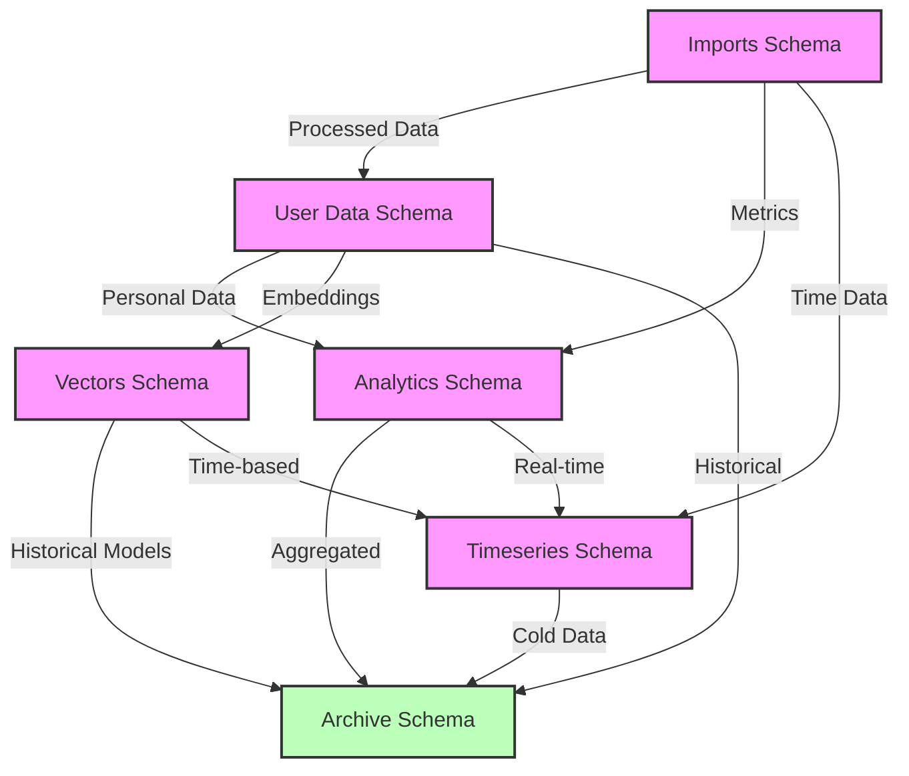
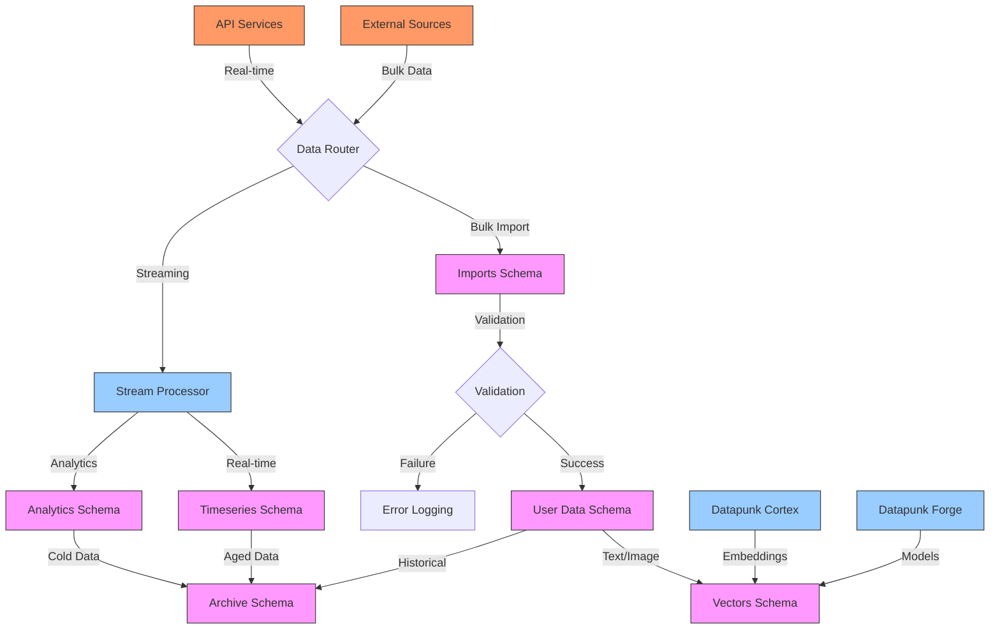
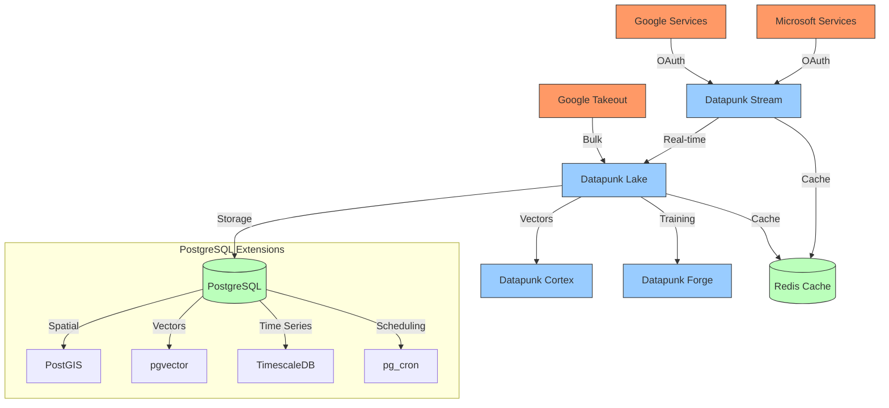
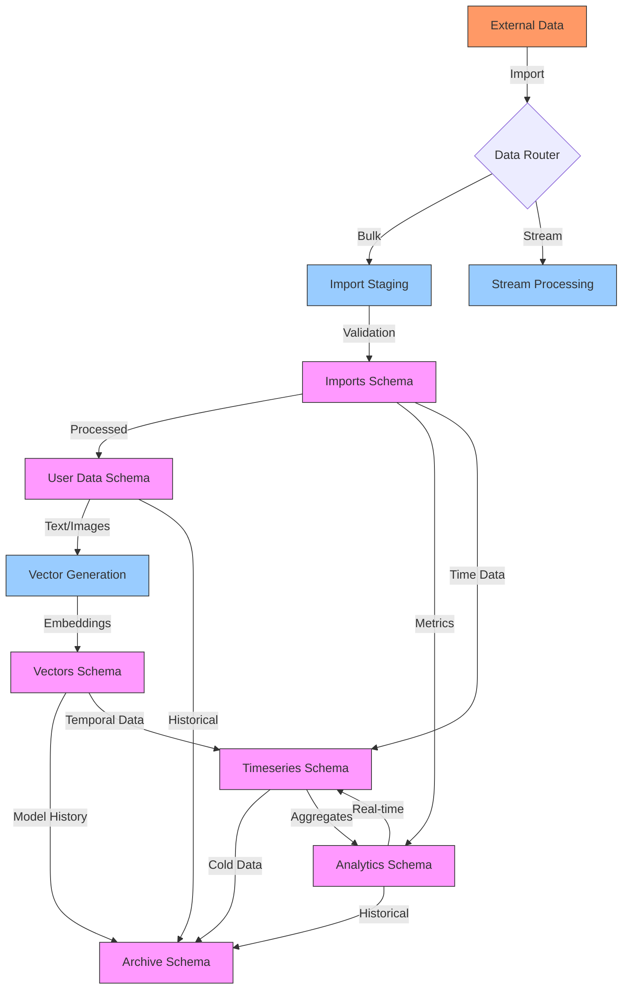
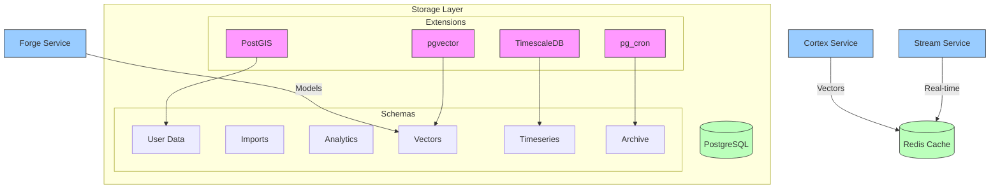
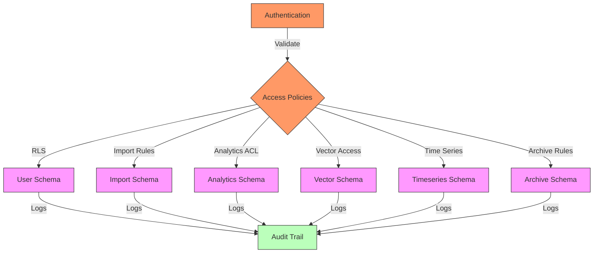

# Schema Organization

## Overview

The schema organization within Datapunk Lake implements a strategic approach to data organization, ensuring data integrity, performance optimization, and efficient retrieval patterns while maintaining strict security boundaries.

## Core Schemas

#### User Data Schema

```yaml
schema_purpose:
  name: user_data
  intent:
    - data_isolation
    - privacy_enforcement
    - compliance_management
  structure:
    - profile_tables
    - preference_storage
    - user_settings
  security:
    - row_level_security
    - schema_isolation
    - access_control
```

###### User Data Schema Design Intent

The User Data Schema represents a foundational component of the Datapunk Lake architecture, implementing a robust approach to personal data management with privacy and security at its core. This schema design reflects our commitment to data isolation and regulatory compliance while maintaining system performance and scalability.

###### Core Design Principles for User Data Schema

##### Data Isolation Strategy for User Data Schema

The schema implements strict data isolation through dedicated user namespaces, preventing data leakage between users while enabling efficient data management. This isolation is achieved through PostgreSQL's native schema capabilities and custom security policies.

##### Privacy Enforcement for User Data Schema

Privacy enforcement is implemented through multiple layers:

- Row-level security policies that automatically filter data based on user context
- Schema-level isolation that creates physical boundaries between user data
- Granular access controls that enforce least-privilege principles
- Automated PII detection and handling

##### Structure Implementation for User Data Schema

The schema structure is organized into three primary components:

1. **Profile Tables**

```yaml
profile_implementation:
  core_tables:
    personal_information:
      encryption: column_level
      audit: full_history
    contact_details:
      encryption: full_table
      access: restricted
    account_metadata:
      caching: enabled
      replication: async
```

2. **Preference Storage**

```yaml
preference_management:
  storage_patterns:
    - hierarchical_settings
    - versioned_preferences
    - context_aware_defaults
  optimization:
    - cached_access
    - batch_updates
    - change_tracking
```

3. **User Settings**

```yaml
settings_framework:
  implementation:
    - real_time_updates
    - cross_device_sync
    - conflict_resolution
  validation:
    - schema_enforcement
    - type_checking
    - dependency_validation
```

###### Security Implementation for User Data Schema

The security model is implemented through multiple complementary mechanisms:

```yaml
security_layers:
  row_level_security:
    - dynamic_policy_enforcement
    - context_aware_filtering
    - automated_policy_generation
  schema_isolation:
    - dedicated_namespaces
    - cross_schema_protection
    - metadata_isolation
  access_control:
    - role_based_permissions
    - attribute_based_access
    - temporal_restrictions
```

###### Future Enhancements for User Data Schema

```yaml
future_capabilities:
  privacy:
    - automated_privacy_impact_assessment
    - dynamic_data_masking
    - consent_management_integration
  performance:
    - adaptive_partitioning
    - intelligent_caching
    - query_optimization
  compliance:
    - automated_gdpr_workflows
    - regulatory_reporting
    - data_residency_management
```

This schema design ensures robust data protection while maintaining system performance and scalability, forming a crucial component of our broader data management strategy.

#### Imports Schema

```yaml
schema_purpose:
  name: imports
  intent:
    - staging_environment
    - bulk_processing
    - data_validation
  structure:
    - temporary_tables
    - metadata_tracking
    - validation_workspace
  lifecycle:
    - automated_cleanup
    - status_tracking
    - error_logging
```

###### Imports Schema Design Intent

The Imports Schema serves as a critical staging and processing environment within the Datapunk Lake architecture, specifically designed to handle bulk data imports while ensuring data quality and system stability. This schema implements a robust approach to data ingestion and validation, particularly focused on handling large-scale data exports like Google Takeout, as referenced in

```markdown
:datapunk/docs/App/Lake/Architecture-Lake.md
startLine: 78
endLine: 84
```

###### Core Design Principles for Imports Schema

##### Staging Environment Strategy for Imports Schema

The schema implements a dedicated staging area that isolates incoming data during processing:

```yaml
staging_implementation:
  isolation:
    - dedicated_workspace
    - process_separation
    - resource_management
  performance:
    - parallel_processing
    - batch_optimization
    - memory_management
```

##### Bulk Processing Framework for Imports Schema

The bulk processing system implements efficient data handling strategies:

```yaml
bulk_processing:
  capabilities:
    - chunked_processing
    - streaming_support
    - parallel_execution
  optimization:
    - configurable_batch_sizes
    - memory_efficient_operations
    - performance_monitoring
```

##### Structure Implementation for Imports Schema

The schema structure is organized into three primary components:

1. **Temporary Tables**

```yaml
temporary_tables:
  implementation:
    staging_tables:
      lifetime: session
      cleanup: automatic
    processing_tables:
      partitioning: enabled
      indexes: minimal
    validation_tables:
      constraints: deferred
      triggers: disabled
```

2. **Metadata Tracking**

```yaml
metadata_tracking:
  components:
    - import_status
    - processing_metrics
    - validation_results
  tracking:
    - timestamps
    - error_states
    - progress_indicators
```

3. **Validation Workspace**

```yaml
validation_workspace:
  features:
    - data_quality_checks
    - format_validation
    - relationship_verification
  implementation:
    - isolated_validation
    - parallel_processing
    - error_collection
```

###### Lifecycle Management for Imports Schema

The lifecycle system ensures efficient resource utilization:

```yaml
lifecycle_management:
  automated_cleanup:
    - failed_imports
    - completed_processes
    - temporary_resources
  status_tracking:
    - import_progress
    - validation_states
    - resource_usage
  error_handling:
    - detailed_logging
    - error_categorization
    - recovery_procedures
```

#### Future Enhancements for Imports Schema

```yaml
future_capabilities:
  processing:
    - ml_powered_validation
    - adaptive_resource_allocation
    - intelligent_batching
  monitoring:
    - predictive_analytics
    - automated_optimization
    - real_time_metrics
  integration:
    - enhanced_streaming_support
    - cross_service_validation
    - distributed_processing
```

This schema design ensures efficient data ingestion and processing while maintaining system stability and data quality. It integrates with our bulk import processing pipeline as detailed in

```markdown
:datapunk/docs/App/Lake/Architecture-Lake.md
startLine: 119
endLine: 126
```

### Analytics Schema

```yaml
schema_purpose:
  name: analytics
  intent:
    - derived_insights
    - aggregated_metrics
    - performance_optimization
  structure:
    - aggregation_tables
    - materialized_views
    - time_series_support
  optimization:
    - view_materialization
    - partition_strategy
    - index_management
```

#### Analytics Schema Design Intent

The Analytics Schema serves as a critical component for deriving insights and optimizing performance within the Datapunk Lake architecture. This schema implements a sophisticated approach to data aggregation and analysis, as referenced in

```markdown:
datapunk/docs/App/Lake/Architecture-Lake.md
startLine: 86
endLine: 92
```

##### Core Design Principles

###### Derived Insights Strategy

The schema implements a comprehensive analytics framework:

```yaml
insights_implementation:
  aggregation_patterns:
    - temporal_analysis
    - user_behavior_metrics
    - system_performance_stats
  computation:
    - real_time_calculations
    - historical_trends
    - predictive_modeling
```

###### Performance Optimization Framework

The optimization system implements efficient data access patterns:

```yaml
optimization_framework:
  caching:
    - materialized_view_refresh
    - incremental_updates
    - cache_invalidation
  partitioning:
    - time_based_segments
    - user_based_sharding
    - access_pattern_optimization
```

###### Structure Implementation

The schema structure is organized into three primary components:

1. **Aggregation Tables**

```yaml
aggregation_implementation:
  table_types:
    summary_tables:
      refresh: scheduled
      granularity: configurable
    metric_tables:
      update: real_time
      partitioning: enabled
    trend_tables:
      computation: incremental
      retention: policy_based
```

2. **Materialized Views**

```yaml
materialized_views:
  implementation:
    refresh_strategy:
      - continuous
      - scheduled
      - on_demand
    optimization:
      - concurrent_refresh
      - partial_refresh
      - indexed_views
```

3. **Time Series Support**

```yaml
time_series:
  features:
    - continuous_aggregates
    - automated_rollups
    - retention_management
  integration:
    - timescaledb_optimization
    - custom_aggregation_functions
    - parallel_execution
```

###### Performance Management for Analytics Schema

The performance system ensures efficient query execution:

```yaml
performance_management:
  view_materialization:
    - incremental_refresh
    - concurrent_updates
    - dependency_tracking
  partition_strategy:
    - time_based_partitioning
    - access_pattern_sharding
    - automated_maintenance
  index_optimization:
    - selective_indexing
    - automated_reindexing
    - usage_analysis
```

###### Future Enhancements for Analytics Schema

```yaml
future_capabilities:
  analytics:
    - ml_powered_insights
    - automated_trend_detection
    - anomaly_identification
  optimization:
    - adaptive_materialization
    - intelligent_partitioning
    - predictive_caching
  integration:
    - real_time_analytics
    - cross_schema_analysis
    - distributed_computing
```

This schema design ensures efficient analytics processing while maintaining system performance and data accessibility. It integrates with our monitoring and metrics system as detailed in

```markdown
datapunk/docs/App/Lake/Architecture-Lake.md
startLine: 214
endLine: 221
```

#### Vectors Schema

```yaml
schema_purpose:
  name: vectors
  intent:
    - embedding_storage
    - similarity_search
    - ml_operations
  structure:
    - embedding_tables
    - metadata_tracking
    - version_control
  indexing:
    - hnsw_indexes
    - ivfflat_support
    - custom_operators
```

###### Vectors Schema Design Intent

The Vectors Schema serves as a specialized storage and processing layer for machine learning operations within the Datapunk Lake architecture. This schema implements sophisticated vector embedding management while ensuring efficient similarity searches and version control.

##### Core Design Principles for Vectors Schema

###### Embedding Storage Strategy for Vectors Schema

The schema implements an optimized approach to storing high-dimensional vector data:

```yaml
embedding_implementation:
  storage_patterns:
    vector_types:
      text_embeddings:
        dimensions: 768
        model: "all-MiniLM-L6-v2"
      image_embeddings:
        dimensions: 512
        model: "clip-ViT-B-32"
      audio_embeddings:
        dimensions: 192
        model: "wav2vec2"
    optimization:
      - compressed_storage
      - batch_processing
      - dimension_reduction
```

###### Similarity Search Framework for Vectors Schema

The search system implements efficient nearest neighbor search capabilities:

```yaml
similarity_framework:
  index_types:
    hnsw:
      m: 16
      ef_construction: 128
      ef_search: 64
    ivfflat:
      lists: 100
      probes: 10
  optimization:
    - approximate_search
    - parallel_processing
    - distance_metrics
```

###### Structure Implementation for Vectors Schema

The schema structure is organized into three primary components:

1. **Embedding Tables**

```yaml
embedding_tables:
  implementation:
    storage:
      type: pgvector
      index: hnsw
      compression: enabled
    operations:
      - cosine_similarity
      - euclidean_distance
      - dot_product
    monitoring:
      - query_performance
      - index_efficiency
      - storage_metrics
```

2. **Metadata Tracking**

```yaml
metadata_management:
  tracking:
    - model_versions
    - embedding_provenance
    - generation_parameters
  indexing:
    - metadata_search
    - relationship_tracking
    - usage_statistics
```

3. **Version Control**

```yaml
version_control:
  features:
    - model_versioning
    - embedding_updates
    - compatibility_tracking
  management:
    - version_migration
    - backward_compatibility
    - rollback_support
```

###### Performance Management for Vectors Schema

The performance system ensures efficient vector operations:

```yaml
performance_management:
  indexing:
    hnsw_optimization:
      - dynamic_ef_construction
      - parallel_index_building
      - memory_efficient_search
    ivfflat_tuning:
      - automated_list_selection
      - probe_optimization
      - centroid_refinement
  operations:
    - batch_similarity_search
    - approximate_knn
    - distance_caching
```

###### Future Enhancements for Vectors Schema

```yaml
future_capabilities:
  vector_operations:
    - multi_modal_embeddings
    - dynamic_quantization
    - automated_dimension_reduction
  search_optimization:
    - hybrid_indexes
    - adaptive_search_parameters
    - distributed_similarity_search
  integration:
    - streaming_vector_updates
    - real_time_embedding
    - cross_modal_search
```

This schema design ensures efficient vector operations while maintaining system performance and search accuracy, forming a crucial component of our machine learning infrastructure.

#### Timeseries Schema

```yaml
schema_purpose:
  name: timeseries
  intent:
    - temporal_analysis
    - trend_forecasting
    - real_time_insights
  structure:
    - continuous_aggregates
    - hypertables
    - retention_policies
  optimization:
    - chunk_management
    - compression_policies
    - automated_rollups
```

###### Timeseries Schema Design Intent

The Timeseries Schema serves as a specialized storage and processing layer for temporal data within the Datapunk Lake architecture. This schema implements TimescaleDB optimizations while ensuring efficient data lifecycle management and real-time analytics capabilities.

##### Core Design Principles for Timeseries Schema

###### Temporal Analysis Strategy for Timeseries Schema

The schema implements an optimized approach to time-series data management:

```yaml
temporal_implementation:
  storage_patterns:
    data_types:
      metrics:
        retention: configurable
        aggregation: continuous
      events:
        retention: compliance_based
        ordering: strictly_temporal
      states:
        retention: sliding_window
        tracking: state_changes
    optimization:
      - chunk_interval_tuning
      - automated_compression
      - selective_retention
```

###### Trend Analysis Framework for Timeseries Schema

The forecasting system implements sophisticated time-series analysis capabilities:

```yaml
forecasting_framework:
  analysis_types:
    statistical:
      - moving_averages
      - seasonal_decomposition
      - trend_detection
    predictive:
      - arima_models
      - prophet_integration
      - ml_forecasting
  optimization:
    - parallel_computation
    - incremental_updates
    - cached_results
```

##### Structure Implementation for Timeseries Schema

The schema structure is organized into three primary components:

1. **Continuous Aggregates**

```yaml
continuous_aggregates:
  implementation:
    refresh_policies:
      real_time:
        window: 1h
        lag: 5m
      daily:
        window: 24h
        lag: 1h
    materialization:
      - incremental_refresh
      - parallel_execution
      - dependency_tracking
```

2. **Hypertables**

```yaml
hypertable_management:
  configuration:
    chunk_time_interval: adaptive
    compression_interval: 7d
    replication_factor: 2
  partitioning:
    - time_based_chunks
    - space_partitioning
    - distributed_chunks
```

3. **Retention Policies**

```yaml
retention_management:
  policies:
    raw_data:
      duration: 30d
      compression: enabled
    aggregated_data:
      duration: 365d
      compression: aggressive
    compliance_data:
      duration: 7y
      compression: optimized
```

###### System Interactions and Considerations for Timeseries Schema

##### Analytics Schema Integration

```yaml
analytics_integration:
  considerations:
    - materialized_view_synchronization
    - aggregation_pipeline_coordination
    - cache_invalidation_strategy
  potential_issues:
    - query_contention
    - refresh_scheduling_conflicts
    - storage_space_management
```

##### Vector Schema Interaction

```yaml
vector_temporal_handling:
  considerations:
    - embedding_version_tracking
    - temporal_similarity_search
    - historical_model_performance
  potential_issues:
    - version_compatibility
    - storage_requirements
    - query_performance_impact
```

##### Archive Schema Coordination

```yaml
archival_coordination:
  workflow:
    - policy_alignment
    - data_migration_scheduling
    - compliance_verification
  potential_issues:
    - retention_policy_conflicts
    - archival_timing_coordination
    - recovery_point_objectives
```

###### Performance Management for Timeseries Schema

```yaml
performance_management:
  chunk_management:
    - adaptive_chunk_intervals
    - automated_recompression
    - space_reclamation
  compression_policies:
    - tiered_compression
    - columnar_optimization
    - dictionary_encoding
  rollup_strategies:
    - continuous_aggregation
    - materialized_computation
    - downsampling_policies
```

###### Future Enhancements for Timeseries Schema

```yaml
future_capabilities:
  scalability:
    - distributed_hypertables
    - multi_node_deployment
    - cross_datacenter_replication
  analytics:
    - ml_powered_forecasting
    - anomaly_detection
    - pattern_recognition
  integration:
    - streaming_analytics
    - real_time_visualization
    - automated_capacity_planning
```

This schema design ensures efficient temporal data management while maintaining system performance and analytical capabilities. It requires careful coordination with other schemas to prevent resource contention and ensure consistent data lifecycle management.

###### Key Integration Considerations for Timeseries Schema

1. Coordinate compression policies with the Archive schema to prevent I/O contention
2. Align retention policies across Analytics and Timeseries schemas
3. Monitor vector embedding versioning impact on temporal analysis
4. Balance real-time aggregation with system resources
5. Manage cache invalidation across interconnected schemas

### Archive Schema

```yaml
schema_purpose:
  name: archive
  intent:
    - historical_preservation
    - compliance_requirements
    - audit_support
  structure:
    - archived_records
    - metadata_tracking
    - compliance_logs
  management:
    - retention_policies
    - access_controls
    - recovery_procedures
```

###### Archive Schema Design Intent

The Archive Schema serves as the long-term storage and compliance management layer within the Datapunk Lake architecture. This schema implements a comprehensive approach to historical data preservation while ensuring regulatory compliance and efficient data lifecycle management.

##### Core Design Principles for Archive Schema

###### Historical Preservation Strategy

The schema implements a sophisticated approach to long-term data storage:

```yaml
preservation_implementation:
  storage_patterns:
    data_types:
      user_records:
        retention: compliance_based
        encryption: column_level
      system_logs:
        retention: regulatory
        compression: aggressive
      analytics_history:
        retention: business_value
        aggregation: summarized
    optimization:
      - columnar_storage
      - tiered_compression
      - selective_encryption
```

###### Compliance Management Framework

The compliance system implements comprehensive regulatory requirements:

```yaml
compliance_framework:
  requirements:
    gdpr:
      - data_deletion_tracking
      - consent_history
      - access_logs
    hipaa:
      - audit_trails
      - access_controls
      - encryption_verification
    sox:
      - financial_records
      - change_history
      - control_documentation
```

##### Structure Implementation for Archive Schema

The schema structure is organized into three primary components:

1. **Archived Records**

```yaml
archived_records:
  implementation:
    storage_strategy:
      type: columnar
      compression: zstd
      encryption: aes-256
    organization:
      - time_based_partitioning
      - type_based_segmentation
      - compliance_categorization
    accessibility:
      - read_only_by_default
      - audit_on_access
      - recovery_procedures
```

2. **Metadata Tracking**

```yaml
archive_metadata:
  tracking:
    - archival_timestamp
    - retention_period
    - compliance_category
    - data_classification
  indexing:
    - temporal_indexing
    - compliance_tagging
    - source_tracking
```

3. **Compliance Logs**

```yaml
compliance_logging:
  components:
    audit_trail:
      - access_history
      - modification_records
      - deletion_tracking
    compliance_reports:
      - retention_compliance
      - access_control_verification
      - encryption_status
```

## System Interactions and Considerations

###### Analytics Schema Integration for Archive Schema

```yaml
analytics_archival:
  considerations:
    - historical_trend_preservation
    - aggregation_level_decisions
    - storage_optimization
  potential_issues:
    - query_performance_degradation
    - storage_space_management
    - data_accessibility_balance
```

###### Timeseries Schema Interaction for Archive Schema

```yaml
timeseries_archival:
  considerations:
    - downsampling_strategies
    - retention_period_alignment
    - recovery_point_granularity
  potential_issues:
    - data_resolution_loss
    - storage_cost_optimization
    - query_complexity_management
```

###### Vector Schema Coordination for Archive Schema

```yaml
vector_archival:
  workflow:
    - embedding_version_preservation
    - model_history_tracking
    - search_capability_maintenance
  potential_issues:
    - version_compatibility
    - search_performance_impact
    - storage_requirements
```

###### Performance Management for Archive Schema

```yaml
archive_performance:
  storage_optimization:
    - tiered_storage_management
    - compression_strategy_selection
    - automated_data_movement
  access_patterns:
    - cold_storage_integration
    - cache_warming_strategies
    - selective_restoration
  maintenance:
    - automated_compliance_checks
    - storage_optimization_tasks
    - index_maintenance
```

###### Future Enhancements for Archive Schema

```yaml
future_capabilities:
  compliance:
    - ai_powered_compliance_monitoring
    - automated_retention_management
    - smart_data_classification
  storage:
    - intelligent_compression_selection
    - predictive_access_patterns
    - automated_tiering
  integration:
    - unified_compliance_dashboard
    - cross_schema_lifecycle_management
    - automated_regulatory_reporting
```

This schema design ensures efficient historical data management while maintaining compliance requirements and system performance. It requires careful coordination with other schemas to prevent operational issues and ensure consistent data lifecycle management.

###### Key Integration Considerations for Archive Schema

1. Balance compression ratios with query performance requirements
2. Coordinate archival operations with active system workloads
3. Maintain search capabilities for archived vector data
4. Ensure compliance with cross-schema data relationships
5. Optimize storage costs while meeting retention requirements

### 1. Core Schema Relationships



### 2. Data Flow and Processing



### 3. Integration Points and Services



These diagrams are based on the architecture details found in:

```markdown
datapunk/docs/App/Lake/Architecture-Lake.md
startLine: 68
endLine: 98
```

And the integration patterns from:

```markdown:
datapunk/docs/App/Lake/expanded/integration.md
startLine: 7
endLine: 37
```

### 4. Data Processing and Schema Interactions



### 5. Schema Storage and Extension Integration



### 6. Security and Access Control Flow



These diagrams are based on our schema organization documentation and architecture details. Would you like me to elaborate on any specific aspect or create additional views for specific components?

## Future Considerations

```yaml
future_enhancements:
  schema_evolution:
    - dynamic_schema_generation
    - automated_migration_paths
    - version_control_integration
  performance_optimization:
    - adaptive_partitioning
    - intelligent_caching
    - automated_maintenance
  security_enhancements:
    - enhanced_isolation
    - granular_permissions
    - audit_improvements
```