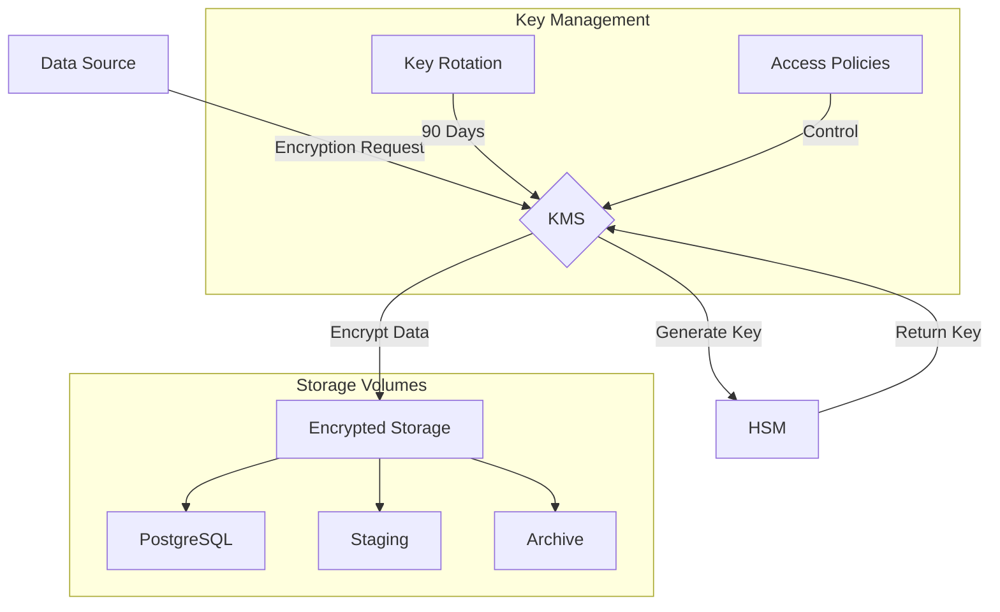
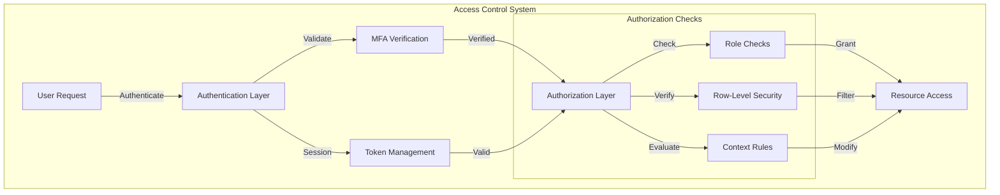
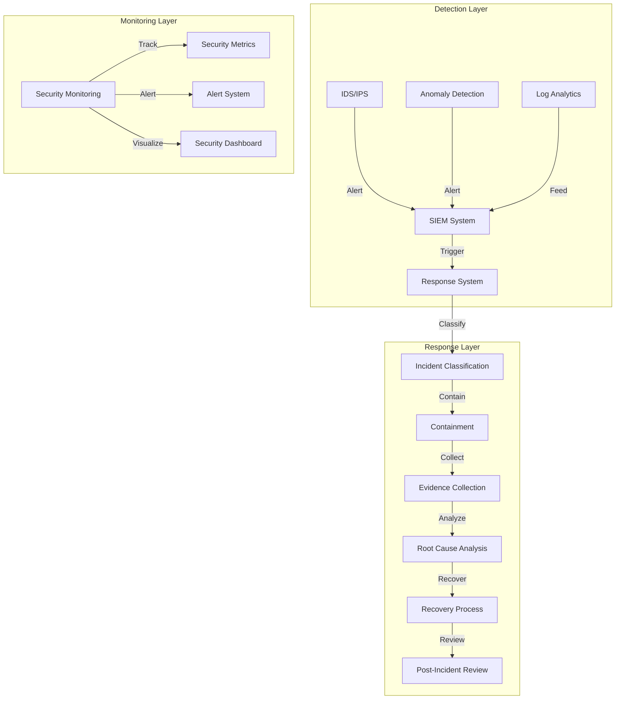

# Security Architecture

## Overview

The security architecture for Datapunk Lake implements a comprehensive defense-in-depth strategy, focusing on protecting sensitive data while maintaining system performance and usability. This architecture is designed to support Datapunk's goal of secure personal data management and AI-driven insights.

## Encryption Framework

### Data at Rest

The encryption framework for data at rest employs enterprise-grade security measures:

```yaml
encryption:
  algorithm: AES-256-GCM  # Military-grade encryption
  key_rotation: 90_days   # Regular key rotation for enhanced security
  storage:
    type: HSM            # Hardware Security Module for key protection
    provider: AWS_KMS    # AWS Key Management Service integration
  volumes:               # Critical data storage locations
    - /data/postgresql   # Primary database storage
    - /data/staging      # Data processing workspace
    - /data/archive      # Long-term storage
```



### Data in Transit

The TLS configuration for data in transit ensures secure communication between components:

```yaml
tls_configuration:
  version: "1.3"                           # Latest TLS version
  cipher_suites:                           # Strong cipher preferences
    - TLS_AES_256_GCM_SHA384              # Primary cipher
    - TLS_CHACHA20_POLY1305_SHA256        # Secondary cipher
  certificate_rotation: 30_days            # Regular cert rotation
  certificate_management:
    automated_renewal: true
    validation_checks:
      - certificate_expiry
      - cipher_strength
      - protocol_compliance
    monitoring:
      - cert_expiration_alerts
      - validation_failures
      - usage_analytics
```

### Integration Considerations

#### 1. Stream Processing Integration

```yaml
stream_security:
  encryption_pipeline:
    - real_time_encryption
    - key_synchronization
    - performance_optimization
  monitoring:
    - encryption_latency
    - key_usage_metrics
    - throughput_impact
```

### 2. AI/ML Integration

```yaml
ai_security:
  model_protection:
    - input_encryption
    - output_encryption
    - weight_protection
  privacy_preserving_ml:
    - federated_learning
    - differential_privacy
    - secure_aggregation
```

### 3. Compliance Integration

```yaml
compliance_integration:
  standards:
    - GDPR
    - CCPA
    - HIPAA
  automated_controls:
    - encryption_verification
    - key_rotation_compliance
    - audit_trail_generation
  reporting:
    - compliance_status
    - security_metrics
    - incident_reports
```

This security architecture aligns with the broader goals of Datapunk by providing robust protection for personal data while enabling AI-driven insights and maintaining system performance. The implementation details can be found in the data governance framework and security monitoring systems.

## Access Control Framework Documentation

### Overview of Access Control Framework

The Access Control framework for Datapunk Lake implements a comprehensive security model balancing robust protection with usability, specifically designed for handling sensitive personal data while enabling AI-driven insights. This framework maintains data privacy and regulatory compliance while allowing efficient data processing and analysis.



### Authentication

```yaml
authentication_framework:
  methods:
    jwt:
      algorithm: "RS256"
      token_lifetime: "1h"
      refresh_token_lifetime: "7d"
      rotation_policy:
        enabled: true
        rotation_window: "15m"
      claims:
        required:
          - sub
          - iat
          - exp
        optional:
          - preferred_username
          - email
          - groups
    
    oauth2:
      providers:
        - google:
            client_id: ${GOOGLE_CLIENT_ID}
            scopes: ["profile", "email"]
            user_info_mapping:
              id: "sub"
              email: "email"
              name: "name"
        - microsoft:
            client_id: ${MS_CLIENT_ID}
            scopes: ["User.Read"]
            tenant_id: ${MS_TENANT_ID}
    
    saml:
      metadata_url: "https://idp.datapunk.ai/metadata"
      assertion_signing: true
      encryption_required: true
      name_id_format: "persistent"
      attribute_mapping:
        username: "NameID"
        email: "mail"
        groups: "memberOf"

  mfa:
    required: true
    grace_period: "30s"
    methods:
      totp:
        issuer: "Datapunk Lake"
        algorithm: "SHA256"
        digits: 6
        period: 30
        backup_codes: 10
      hardware_token:
        supported_protocols: ["FIDO2", "U2F"]
        registration_timeout: "5m"
        authentication_timeout: "1m"
```

### Authorization

```yaml
authorization_framework:
  rbac:
    roles:
      admin:
        permissions: ["*"]
        max_session_duration: "4h"
      data_scientist:
        permissions: 
          - "read:*"
          - "write:analytics"
          - "execute:models"
        max_session_duration: "8h"
      user:
        permissions:
          - "read:own_data"
          - "write:own_data"
        max_session_duration: "24h"
    
  row_level_security:
    policies:
      user_data:
        default: "user_id = current_user_id()"
        exceptions:
          - role: "admin"
            condition: "true"
          - role: "support"
            condition: "current_timestamp < access_expiry"
      analytics_data:
        default: "organization_id = current_org_id()"
        aggregated_access: "is_aggregated = true"
    
  context_rules:
    time_based:
      business_hours:
        condition: "EXTRACT(HOUR FROM CURRENT_TIME) BETWEEN 9 AND 17"
        permissions: ["write:sensitive_data"]
    location_based:
      internal_network:
        condition: "client_ip <<= '10.0.0.0/8'"
        elevated_access: true
    risk_based:
      suspicious_activity:
        condition: "risk_score > 80"
        restrictions: ["read:sensitive_data", "write:any"]
```

### Integration Considerations

#### Stream Service Integration

```yaml
stream_security_integration:
  authentication:
    token_validation:
      cache_duration: "5m"
      max_cache_size: "10000"
    session_tracking:
      enabled: true
      cleanup_interval: "15m"
  
  authorization:
    real_time_updates:
      permission_sync: true
      role_changes: true
    streaming_access:
      rate_limiting: true
      quota_management: true
```

#### AI/ML Service Integration

```yaml
ai_security_integration:
  model_access:
    authentication_required: true
    rate_limiting:
      requests_per_minute: 100
      burst_size: 20
  
  data_access:
    privacy_preserving:
      differential_privacy: true
      anonymization: true
    audit_logging:
      model_usage: true
      data_access: true
```

### Monitoring Integration

```yaml
security_monitoring:
  metrics:
    authentication:
      - login_attempts
      - mfa_success_rate
      - token_usage
    authorization:
      - permission_denials
      - policy_evaluations
      - access_patterns
  
  alerts:
    critical:
      - multiple_mfa_failures
      - unusual_access_patterns
      - permission_escalation
    warning:
      - high_denial_rate
      - token_expiry_approaching
      - unusual_login_times
```

## SQL Implementation Examples

```sql
-- Role-Based Access Control (RBAC)
CREATE TABLE role_permissions (
    role_id UUID PRIMARY KEY,
    permissions JSONB,
    created_at TIMESTAMPTZ DEFAULT CURRENT_TIMESTAMP,
    updated_at TIMESTAMPTZ DEFAULT CURRENT_TIMESTAMP
);

-- Row-Level Security Policies
CREATE POLICY data_access_policy ON user_data
    USING (user_id = current_user_id())
    WITH CHECK (user_id = current_user_id());

-- Audit Logging
CREATE TABLE access_logs (
    log_id UUID DEFAULT gen_random_uuid() PRIMARY KEY,
    user_id UUID NOT NULL,
    action_type TEXT NOT NULL,
    resource_type TEXT NOT NULL,
    resource_id UUID NOT NULL,
    timestamp TIMESTAMPTZ DEFAULT CURRENT_TIMESTAMP,
    success BOOLEAN NOT NULL,
    error_message TEXT,
    client_ip INET,
    user_agent TEXT
);
```

## Security Incident Response Framework

### Architecture Overview



### Implementation Details

```yaml
incident_response:
  detection:
    ids_implementation:
      engine: "Suricata"
      mode: "inline"
      rules_update: "hourly"
      custom_rules:
        - data_exfiltration
        - privilege_escalation
        - unauthorized_access
        
    anomaly_detection:
      algorithms:
        - isolation_forest
        - lstm_prediction
        - statistical_analysis
      baselines:
        learning_period: "30d"
        update_frequency: "weekly"
        
    siem_integration:
      platform: "ELK Stack"
      retention: "365d"
      correlation_rules:
        - multi_factor_auth_failures
        - brute_force_attempts
        - unusual_data_access

  response_procedures:
    incident_classification:
      severity_levels:
        critical:
          response_time: "15m"
          escalation: "immediate"
        high:
          response_time: "1h"
          escalation: "4h"
        medium:
          response_time: "4h"
          escalation: "24h"
        
    containment_measures:
      automated_actions:
        - network_isolation
        - account_suspension
        - system_snapshot
      manual_procedures:
        - forensic_analysis
        - stakeholder_communication
        - legal_consultation
        
    evidence_collection:
      types:
        - system_logs
        - network_traffic
        - database_audit_logs
      preservation:
        format: "forensic_image"
        chain_of_custody: true
        encryption: "AES-256"

  security_monitoring:
    tools:
      prometheus:
        metrics:
          - authentication_attempts
          - encryption_operations
          - access_patterns
        retention: "90d"
        
      grafana:
        dashboards:
          - security_overview
          - incident_tracking
          - compliance_status
        refresh_rate: "5m"
        
      elk_stack:
        components:
          - elasticsearch
          - logstash
          - kibana
        data_sources:
          - application_logs
          - system_logs
          - network_logs
```

### Integration Considerations for Security Incident Response

#### 1. Data Lake Integration

```yaml
lake_security_integration:
  audit_logging:
    - data_access_events
    - schema_modifications
    - privilege_changes
  encryption:
    - data_at_rest
    - data_in_transit
    - key_rotation
```

#### 2. Stream Processing Integration

```yaml
stream_security:
  real_time_analysis:
    - traffic_patterns
    - access_anomalies
    - data_flow_monitoring
  incident_correlation:
    - event_aggregation
    - pattern_matching
    - threat_detection
```

#### 3. Recovery Procedures

```yaml
recovery_integration:
  automated_procedures:
    - service_restoration
    - data_validation
    - integrity_checks
  validation:
    - security_posture
    - system_health
    - data_consistency
```
