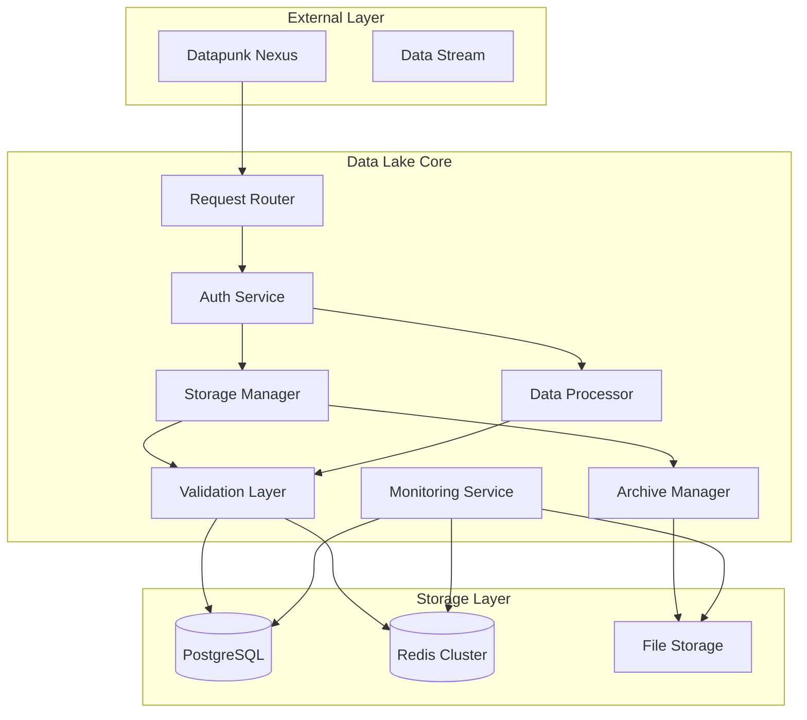

# Data Lake Architecture Overview

## Purpose & Context

The data-lake module serves as the primary data storage and processing layer within the Datapunk ecosystem, providing centralized data management, processing, and storage services through the nexus gateway.

## System Architecture



## Core Services

### 1. Storage Management

```yaml
storage_config:
  postgresql:
    extensions:
      - name: "pgvector"
        version: "0.5.1+"
      - name: "postgis"
        version: "3.4+"
      - name: "timescaledb"
        version: "latest"
    partitioning:
      strategy: "time-based"
      interval: "1 month"
      retention: "12 months"

  redis_cluster:
    deployment:
      mode: "cluster"
      nodes: 3
      replication_factor: 2
    configuration:
      maxmemory: "8GB"
      maxmemory_policy: "volatile-lru"
    usage_patterns:
      hot_data:
        ttl: 3600
        max_size: "2GB"
```

### 2. Authentication Service

```yaml
auth_service:
  oauth2:
    enabled: true
    providers: ["google", "github"]
    scopes: ["read", "write"]
  
  service_auth:
    type: "mTLS"
    cert_rotation: "7d"
    backup: "API_KEY"
  
  row_level_security:
    enabled: true
    policies:
      - name: "user_isolation"
        schema: "user_data"
        condition: "user_id = current_user_id()"
```

### 3. Monitoring Integration

```yaml
monitoring:
  metrics:
    collector: "prometheus"
    exporters:
      - "postgres_exporter"
      - "redis_exporter"
      - "node_exporter"
    custom_metrics:
      - name: "data_quality_score"
        type: "gauge"
        labels: ["table", "check_type"]
      - name: "storage_usage"
        type: "gauge"
        labels: ["storage_type", "schema"]
  
  health_checks:
    endpoints:
      - path: "/health/live"
        interval: "5s"
      - path: "/health/ready"
        interval: "10s"
    dependencies:
      - service: "postgresql"
        timeout: "2s"
      - service: "redis"
        timeout: "1s"
```

## Integration Standards

### 1. Event Communication

```yaml
event_handling:
  cdc:
    provider: "Debezium"
    topics:
      - name: "data_changes"
        retention: "7d"
  streaming:
    type: "Change Streams"
    batch_size: 1000
    buffer_timeout: "5s"
```

### 2. Cache Strategy

```yaml
cache_strategy:
  write_through:
    enabled: true
    sync_interval: "1s"
  invalidation:
    method: "pub_sub"
    channels:
      - "cache.invalidate"
      - "cache.update"
```

## Implementation Details

### 1. Data Processing Pipeline

References core processing framework from:

```markdown:datapunk/docs/App/Lake/data-processing-pipeline.md
startLine: 1306
endLine: 1351
```

### 2. Storage Strategy

#### Volume Management

References configuration from:

```markdown:datapunk/docs/App/Lake/Architecture-Lake.md
startLine: 254
endLine: 364
```

#### Maintenance & Operations

```yaml
maintenance:
  schedules:
    vacuum: "0 3 * * *"
    analyze: "0 4 * * *"
    reindex: "0 1 * * 0"
  retention:
    hot_data: "30d"
    warm_data: "90d"
    cold_data: "365d"
  monitoring:
    metrics:
      - volume_utilization
      - io_performance
      - cache_hit_rates
      - write_amplification
      - storage_growth
```

### 3. Error Handling & Recovery

```yaml
error_management:
  logging:
    level: "INFO"
    format: "JSON"
    retention: "30d"
  quarantine:
    enabled: true
    review_period: "24h"
  retry_policy:
    max_attempts: 3
    backoff: "exponential"
    initial_delay: "1s"
  
  recovery:
    checkpoints:
      interval: "1h"
      retention: "24h"
    rollback:
      enabled: true
      max_points: 5
```

### 4. Security Implementation

```yaml
security_controls:
  encryption:
    at_rest:
      provider: "LUKS"
      key_rotation: "90d"
    in_transit:
      protocol: "TLS 1.3"
      cert_rotation: "30d"
  
  access_control:
    audit_logging: true
    retention: "365d"
    pii_handling:
      detection: true
      encryption: true
      masking: true
```

### 5. Integration Points

#### External APIs

References integration list from:

```markdown:datapunk/docs/App/Lake/Architecture-Lake.md
startLine: 406
endLine: 421
```

#### Service Communication

```yaml
service_integration:
  nexus:
    protocol: "gRPC"
    timeout: "30s"
    retry_policy:
      max_attempts: 3
      backoff: "exponential"
  
  stream:
    protocol: "gRPC"
    events: "RabbitMQ"
    cdc: "Debezium"
  
  cortex:
    vector_store: "pgvector"
    cache: "redis"
    batch_size: 1000
```

### 6. Performance Optimization

References optimization strategies from:

```markdown:datapunk/docs/App/Lake/Architecture-Lake.md
startLine: 216
endLine: 224
```

### 7. Monitoring & Metrics

```yaml
observability:
  tracing:
    provider: "Jaeger"
    sampling_rate: 0.1
  metrics:
    collection_interval: "15s"
    retention: "30d"
    custom_metrics:
      - name: "data_processing_duration"
        type: "histogram"
        labels: ["operation", "status"]
      - name: "storage_latency"
        type: "gauge"
        labels: ["tier", "operation"]
  alerting:
    providers: ["prometheus-alertmanager"]
    rules:
      - name: "high_latency"
        threshold: "5s"
        window: "5m"
      - name: "error_rate"
        threshold: "1%"
        window: "15m"
```

## Resource Requirements

```yaml
resources:
  compute:
    cpu:
      limit: "4"
      request: "2"
    memory:
      limit: "8Gi"
      request: "4Gi"
  storage:
    postgresql:
      size: "100Gi"
      class: "ssd"
    redis:
      size: "8Gi"
      class: "memory"
    archive:
      size: "500Gi"
      class: "standard"
