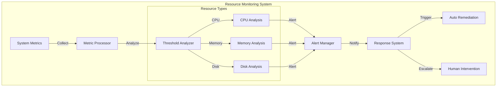
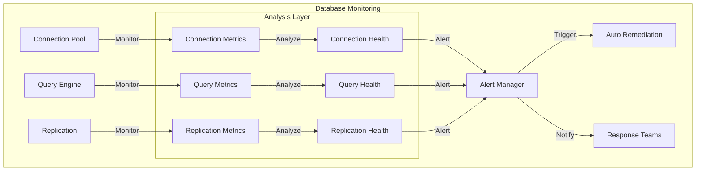
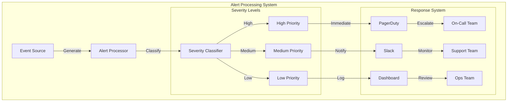

# Monitoring and Alerting Strategy

## Overview

Comprehensive monitoring and alerting framework for Datapunk Lake, leveraging existing PostgreSQL extensions and monitoring tools.

## Core Metrics

### System Health Monitoring

#### System Architecture for Monitoring



#### Resource Monitoring Configuration

```yaml
system_metrics:
  resource_monitoring:
    cpu_usage:
      threshold_warning: 70
      threshold_critical: 85
      interval: 30s
      collection:
        method: "avg_load"
        cores: "all"
        process_groups:
          - database
          - application
          - background_tasks
      remediation:
        auto_scale: true
        process_priority: dynamic
        cooling_period: 300s

    memory_usage:
      threshold_warning: 75
      threshold_critical: 90
      interval: 30s
      monitoring_areas:
        - heap_memory
        - stack_usage
        - shared_memory
        - buffer_pools
      optimization:
        gc_trigger: true
        swap_prevention: true
        cache_adjustment: dynamic

    disk_usage:
      threshold_warning: 80
      threshold_critical: 90
      interval: 5m
      monitored_paths:
        - /data
        - /indexes
        - /logs
        - /temp
      cleanup_policies:
        temp_files: 24h
        old_logs: 7d
        backup_rotation: 30d
```

#### Integration Configuration for Monitoring 

```yaml
monitoring_integration:
  prometheus:
    endpoint: "/metrics"
    labels:
      environment: "production"
      component: "datapunk-lake"
    custom_metrics:
      - name: "resource_usage_score"
      - name: "system_health_index"
      
  grafana:
    dashboards:
      - "system-health"
      - "resource-trends"
      - "capacity-planning"
    alerts:
      - "resource-exhaustion"
      - "performance-degradation"

  alert_manager:
    routes:
      cpu_alerts:
        receiver: "ops-team"
        group_wait: 30s
      memory_alerts:
        receiver: "sys-admin"
        group_wait: 45s
      disk_alerts:
        receiver: "storage-team"
        group_wait: 60s
```

#### Auto-Remediation Configuration

```yaml
remediation_actions:
  cpu_high:
    - action: "scale_compute"
      threshold: 85
      cooldown: 300s
    - action: "terminate_idle"
      threshold: 80
      grace_period: 60s
    
  memory_pressure:
    - action: "clear_caches"
      threshold: 85
      target: "application"
    - action: "adjust_buffer_pools"
      threshold: 80
      increment: "dynamic"
    
  disk_space:
    - action: "cleanup_temp"
      threshold: 85
      target: "/temp"
    - action: "compress_logs"
      threshold: 80
      age: "7d"
```

#### Service Integration Points for Monitoring

```yaml
service_integration:
  stream_processing:
    metrics:
      - stream_throughput
      - processing_latency
      - backpressure_status
    controls:
      - rate_limiting
      - resource_allocation
  
  vector_operations:
    metrics:
      - computation_load
      - memory_utilization
      - operation_latency
    optimization:
      - scheduling_priority
      - resource_limits
  
  storage_management:
    metrics:
      - io_operations
      - storage_latency
      - capacity_trending
    controls:
      - tiering_rules
      - cleanup_policies
  
  query_processing:
    metrics:
      - query_resource_usage
      - execution_time
      - concurrent_queries
    controls:
      - resource_limits
      - priority_queuing
```

### Database Metrics Framework

#### System Architecture



#### Database Metrics Configuration

```yaml
database_metrics:
  connection_pools:
    max_connections: 100
    threshold_warning: 70
    threshold_critical: 85
    monitoring:
      interval: 15s
      metrics:
        - active_connections
        - waiting_connections
        - idle_connections
      actions:
        warning:
          - log_connection_details
          - notify_monitoring_team
        critical:
          - terminate_idle_connections
          - scale_connection_pool

  query_performance:
    long_running_threshold: 30s
    deadlock_check_interval: 5m
    monitoring:
      slow_query_logging: true
      execution_plans: true
      metrics:
        - query_duration
        - rows_affected
        - index_usage
      analysis:
        - pattern_detection
        - resource_impact
        - optimization_suggestions

  replication:
    lag_threshold_warning: 1000
    lag_threshold_critical: 5000
    monitoring:
      interval: 30s
      metrics:
        - write_ahead_log_position
        - replay_position
        - replication_slots
      health_checks:
        - network_latency
        - disk_throughput
        - cpu_utilization
```

### Stream Processing Integration

```yaml
stream_integration:
  metrics:
    - stream_processing_lag
    - buffer_utilization
    - throughput_rate
  controls:
    - backpressure_management
    - resource_allocation
    - priority_queuing
```

### Vector Operations Integration

```yaml
vector_integration:
  metrics:
    - vector_query_performance
    - index_efficiency
    - cache_hit_ratio
  optimization:
    - dynamic_resource_allocation
    - query_routing
    - cache_management
```

### Monitoring Systems Integration

```yaml
monitoring_integration:
  prometheus:
    metrics:
      - pg_stat_activity
      - pg_stat_replication
      - pg_stat_database
    alerts:
      - connection_saturation
      - replication_delay
      - query_timeout
  grafana:
    dashboards:
      - connection_pool_status
      - query_performance
      - replication_health
```

## Alerting Framework

### System Architecture for Alerting



### Alert Rules Configuration

```yaml
alert_rules:
  high_severity:
    response_time:
      threshold: 1000ms
      window: 5m
      action: page_on_call
      remediation:
        auto_restart: true
        scale_resources: true
        notify_stakeholders: true
      monitoring:
        frequency: 30s
        consecutive_failures: 3
        recovery_threshold: 800ms
    
    disk_space:
      threshold: 90%
      window: 5m
      action: page_on_call
      remediation:
        cleanup_temp: true
        compress_logs: true
        archive_old_data: true
      monitoring:
        frequency: 1m
        prediction_window: 6h
        trend_analysis: true

  medium_severity:
    connection_count:
      threshold: 80%
      window: 15m
      action: notify_slack
      remediation:
        terminate_idle: true
        connection_pooling: optimize
        load_balancing: true
      monitoring:
        frequency: 5m
        connection_trends: true
        peak_analysis: true
    
    replication_lag:
      threshold: 1000
      window: 10m
      action: notify_slack
      remediation:
        network_optimization: true
        replica_resources: scale
        sync_priority: adjust
      monitoring:
        frequency: 2m
        lag_trending: true
        bandwidth_analysis: true
```

### Stream Processing Integration for Alerting

```yaml
stream_integration:
  alert_handling:
    backpressure_events:
      - threshold_breach
      - queue_overflow
      - processing_delay
    metrics_collection:
      - throughput_rates
      - error_rates
      - latency_patterns
```

### Vector Operations Integration for Alerting

```yaml
vector_integration:
  performance_monitoring:
    - query_latency
    - index_efficiency
    - resource_utilization
  alert_correlation:
    - pattern_matching
    - anomaly_detection
    - impact_analysis
```

### Monitoring Systems Integration for Alerting

```yaml
monitoring_integration:
  metrics_aggregation:
    window_size: 5m
    retention: 30d
    aggregation_functions:
      - avg
      - max
      - percentile_95
  alert_correlation:
    cross_service: true
    root_cause_analysis: true
    impact_assessment: true
```

### Notification Channels Configuration

```yaml
notification_channels:
  slack:
    channel: "#datapunk-alerts"
    mention_group: "@dba-team"
  pagerduty:
    service_key: "${PAGERDUTY_KEY}"
    escalation_policy: "database-incidents"
  email:
    recipients:
      - dba@datapunk.com
      - ops@datapunk.com
```

#### Integration with Existing Tools

##### PostgreSQL Extensions

References existing extensions from datapunk-lake.md:

```markdown
datapunk/docs/planning/App/datapunk-lake.md
startLine: 30
endLine: 35
```

### Prometheus Integration

```yaml
prometheus_config:
  scrape_interval: 15s
  evaluation_interval: 15s
  rules:
    - name: database_rules
      interval: 30s
      rules:
        - alert: HighConnectionUsage
          expr: pg_stat_activity_count > 80
        - alert: LongRunningQueries
          expr: pg_stat_activity_max_tx_duration > 300
```

#### Grafana Dashboards Configuration

```yaml
dashboards:
  overview:
    refresh: 1m
    panels:
      - name: Connection Pool Status
        type: gauge
      - name: Query Performance
        type: graph
      - name: Disk Usage
        type: gauge
  performance:
    refresh: 30s
    panels:
      - name: Active Queries
        type: table
      - name: Cache Hit Ratio
        type: graph
      - name: IO Utilization
        type: graph
```

#### Automated Responses Configuration

##### Auto-Remediation Configuration

```yaml
auto_remediation:
  actions:
    - trigger: high_connection_count
      action: terminate_idle_connections
      threshold: 90%
    - trigger: long_running_query
      action: kill_query
      threshold: 30m
    - trigger: low_cache_hit_ratio
      action: analyze_tables
      threshold: 50%
```

##### Escalation Procedures Configuration

```yaml
escalation_procedures:
  levels:
    - level: 1
      responder: on_call_dba
      timeout: 15m
    - level: 2
      responder: senior_dba
      timeout: 30m
    - level: 3
      responder: engineering_manager
      timeout: 1h
```

#### Performance Monitoring Configuration

##### Query Performance

```sql
CREATE MATERIALIZED VIEW monitoring.slow_queries AS
SELECT query,
       calls,
       total_time / calls as avg_time,
       rows / calls as avg_rows
FROM pg_stat_statements
WHERE total_time / calls > 1000
WITH DATA;

CREATE INDEX idx_slow_queries_time ON monitoring.slow_queries(avg_time DESC);
```

### Resource Utilization

```yaml
resource_monitoring:
  collection_interval: 15s
  retention_period: 30d
  metrics:
    - name: cpu_usage
      type: gauge
    - name: memory_usage
      type: gauge
    - name: disk_io
      type: counter
```

#### Compliance and Audit

##### Audit Logging Configuration

```yaml
audit_config:
  enabled: true
  log_level: INFO
  retention: 90d
  events:
    - schema_changes
    - permission_changes
    - authentication_failures
    - data_access_violations
```

##### Compliance Reporting Configuration

```yaml
compliance_reporting:
  schedule: "0 0 * * 0"  # Weekly
  reports:
    - access_patterns
    - security_violations
    - performance_metrics
    - resource_utilization
```
