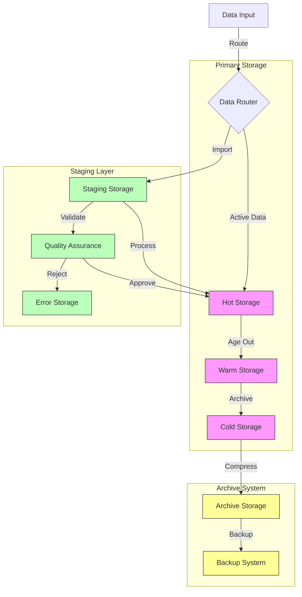
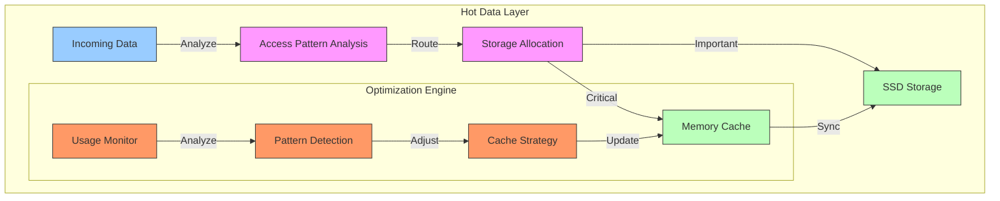
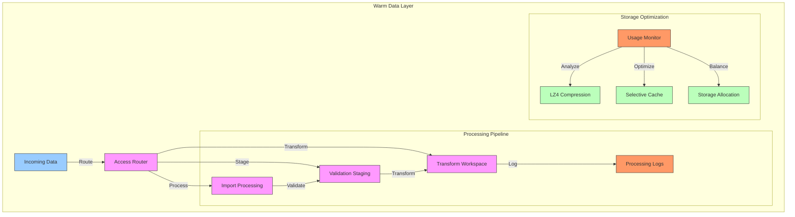
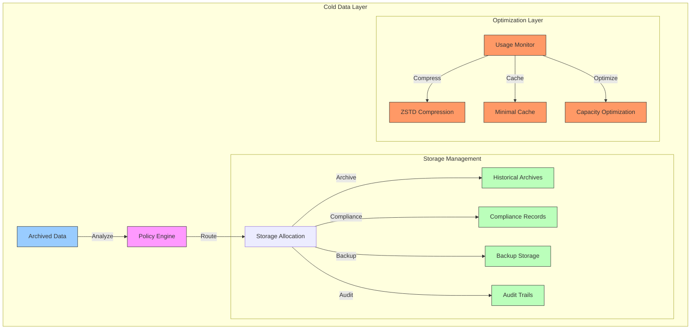
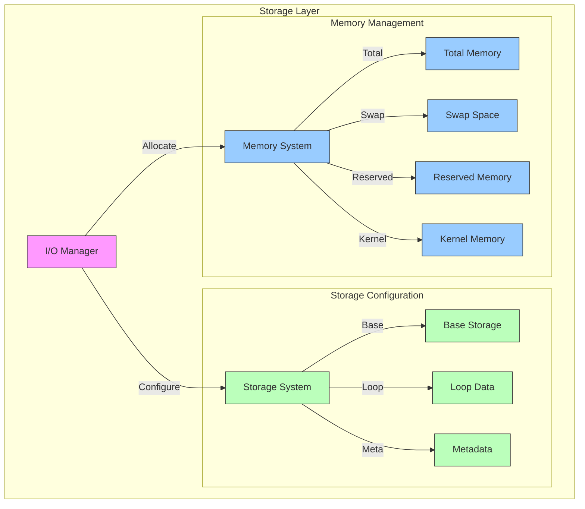
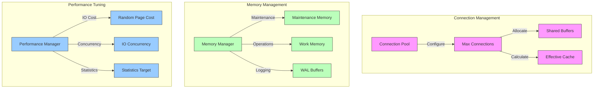
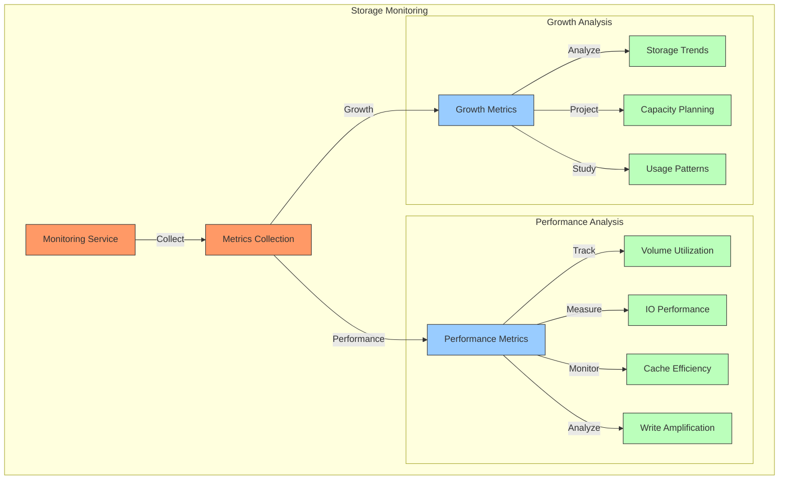
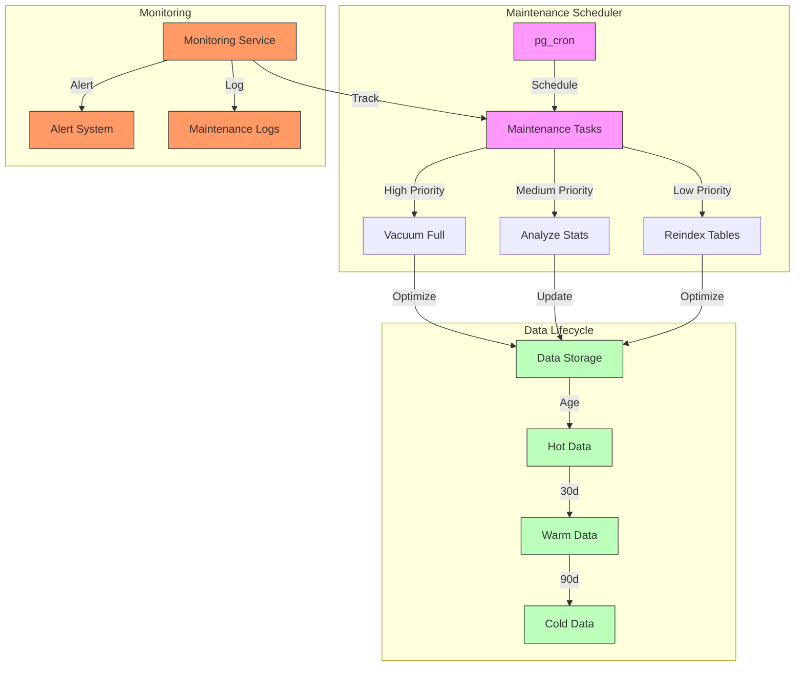
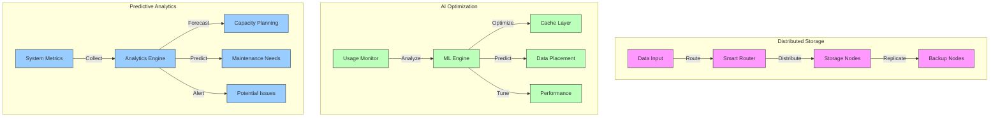

# Storage Strategy

## Overview

The Storage Strategy implements a sophisticated multi-tiered approach to data management within the Datapunk Lake ecosystem. This strategy is designed to balance performance, cost-efficiency, and data lifecycle requirements while maintaining data integrity and accessibility.

### Storage Architecture Overview



## Volume Configuration

The storage infrastructure implements a carefully orchestrated volume management system that aligns with our processing pipeline requirements referenced in:

```markdown:datapunk/docs/App/Lake/work-queue/data-processing-pipeline.md
startLine: 1189
endLine: 1221
```

### Detailed Volume Implementation

```yaml
storage_volumes:
  primary_storage:
    intent:
      - active_data_management
      - high_performance_access
      - real_time_operations
    configuration:
      driver: local
      mount: /data/postgresql
      optimization: performance_focused
    performance_tuning:
      io_priority: high
      read_ahead: 16384
      write_back: enabled
      direct_io: enabled
    monitoring:
      metrics:
        - iops
        - throughput
        - latency
        - queue_depth
    integration:
      cortex_service: true
      stream_service: true
      
  staging_storage:
    intent:
      - import_processing
      - validation_workspace
      - temporary_operations
    configuration:
      driver: local
      mount: /data/staging
      optimization: balanced
    performance_tuning:
      io_priority: medium
      read_ahead: 8192
      write_back: enabled
      direct_io: disabled
    cleanup:
      retention: "7d"
      schedule: "0 2 * * *"
    monitoring:
      metrics:
        - space_utilization
        - processing_queue
        - validation_status
        
  archive_storage:
    intent:
      - historical_preservation
      - compliance_storage
      - backup_management
    configuration:
      driver: local
      mount: /data/archive
      optimization: capacity_focused
    compression:
      algorithm: "zstd"
      level: 3
      chunk_size: "1GB"
    retention:
      policy:
        default: "365d"
        compliance: "7y"
        custom: configurable
    monitoring:
      metrics:
        - compression_ratio
        - retrieval_time
        - storage_efficiency
```

### Integration Considerations

1. **Stream Service Integration**

```yaml
stream_coordination:
  real_time_storage:
    - buffer_management
    - write_optimization
    - latency_monitoring
  volume_interaction:
    - staging_coordination
    - processing_handoff
    - error_handling
```

### Cortex Service Integration

```yaml
cortex_integration:
  vector_storage:
    - embedding_optimization
    - index_placement
    - cache_strategy
  processing_requirements:
    - temp_space_allocation
    - model_storage
    - batch_processing
```

### Performance Optimization

References configuration patterns from:

```markdown
datapunk/docs/App/Lake/Architecture-Lake.md
startLine: 334
endLine: 354
```

This volume configuration framework provides the foundation for efficient data management while maintaining system performance and reliability

## Storage Hierarchy

### Hot Data Management Framework

The Hot Data Management strategy implements a high-performance, memory-optimized approach for frequently accessed data within the Datapunk Lake ecosystem, as referenced in:

```markdown
datapunk/docs/App/Lake/Architecture-Lake.md
startLine: 284
endLine: 290
```

#### Architecture Overview for Hot Data Management



#### Implementation Details for Hot Data Management  

```yaml
hot_data_management:
  characteristics:
    high_access_frequency:
      threshold: "10 accesses/hour"
      measurement_window: "24h"
      decay_factor: 0.95
    performance_critical:
      latency_target: "<10ms"
      availability_target: "99.99%"
      consistency_level: "strong"
    recent_data_focus:
      time_window: "7d"
      priority_weighting: true
      adaptive_sizing: true
      
  components:
    active_user_records:
      storage_strategy:
        primary: "memory_cache"
        secondary: "nvme_ssd"
        replication_factor: 2
      optimization:
        index_type: "covering"
        partition_scheme: "user_id_hash"
        
    current_imports:
      processing_strategy:
        buffer_size: "256MB"
        parallel_streams: 4
        checkpoint_interval: "5m"
      monitoring:
        metrics:
          - throughput
          - latency
          - error_rate
          
    vector_embeddings:
      storage_configuration:
        index_type: "ivfflat"
        dimensions: 1536
        lists: 1000
      cache_strategy:
        preload_recent: true
        eviction_policy: "lru"
        
    operational_indexes:
      management:
        update_strategy: "immediate"
        maintenance_window: "rolling"
        replication: "async"
```

#### Integration Considerations for Hot Data Management

### Stream Service Integration

References implementation patterns from:

```markdown
datapunk/docs/App/Lake/work-queue/data-processing-pipeline.md
startLine: 92
endLine: 105
```

### Performance Optimization Patterns

```yaml
optimization_strategy:
  memory_management:
    shared_buffers: "25% of RAM"
    effective_cache_size: "75% of RAM"
    work_mem: "64MB per connection"
    
  storage_configuration:
    io_concurrency: 200
    random_page_cost: 1.1
    effective_io_concurrency: 200
    
  monitoring_integration:
    metrics:
      - cache_hit_ratio
      - buffer_usage
      - io_utilization
    alerts:
      - cache_miss_spike
      - memory_pressure
      - io_bottleneck
```

### Resource Management

```yaml
resource_allocation:
  compute:
    cpu_priority: "high"
    numa_affinity: true
    process_scheduling: "realtime"
  memory:
    huge_pages: "try"
    transparent_hugepage: "madvise"
    swappiness: 0
```

### Warm Data Management Framework

The Warm Data Management strategy implements a balanced approach for intermediate data storage and processing within the Datapunk Lake ecosystem, bridging the gap between hot and cold storage tiers.

#### Architecture Overview for Warm Data Management



#### Implementation Details for Warm Data Management  

```yaml
warm_data_management:
  characteristics:
    moderate_access:
      threshold: "1-10 accesses/hour"
      measurement_window: "72h"
      decay_factor: 0.85
    processing_focused:
      batch_size: "512MB"
      parallel_processing: true
      io_priority: "medium"
    intermediate_storage:
      retention_period: "90d"
      migration_policy: "access_based"
      storage_tier: "balanced"

  components:
    import_processing:
      buffer_configuration:
        size: "1GB"
        flush_interval: "5m"
        parallel_streams: 8
      monitoring:
        metrics:
          - processing_throughput
          - queue_depth
          - error_rate
          
    validation_staging:
      workspace_config:
        temp_storage: "local_ssd"
        cleanup_interval: "24h"
        max_size: "5TB"
      validation_rules:
        - schema_compliance
        - data_quality
        - relationship_integrity
        
    transform_workspace:
      processing_config:
        max_concurrent_jobs: 16
        memory_per_job: "4GB"
        temp_storage_path: "/data/transform"
      optimization:
        - pipeline_parallelization
        - resource_allocation
        - io_scheduling
        
    processing_logs:
      retention:
        duration: "90d"
        compression: "enabled"
        archival_policy: "rolling"
      monitoring:
        - operation_tracking
        - performance_metrics
        - error_analysis
```

#### Integration Considerations for Warm Data Management

1. **Stream Service Integration**
References implementation patterns from:

```markdown
datapunk/docs/App/Lake/work-queue/data-processing-pipeline.md
startLine: 92
endLine: 105
```

### Storage Optimization Patterns

```yaml
optimization_strategy:
  compression:
    algorithm: "lz4"
    level: "balanced"
    chunk_size: "64MB"
    
  caching:
    policy: "selective"
    max_size: "25% of available RAM"
    eviction: "lru"
    
  storage_management:
    tiering:
      promotion_threshold: "10 accesses/hour"
      demotion_threshold: "1 access/day"
    monitoring:
      metrics:
        - storage_utilization
        - access_patterns
        - compression_ratio
```

### Performance Configuration

References settings from:

```markdown
datapunk/docs/App/Lake/Architecture-Lake.md
startLine: 266
endLine: 281
```

This warm data management framework provides efficient intermediate storage while maintaining system performance and data accessibility.

### Cold Data Management Framework

The Cold Data Management strategy implements a storage-efficient, compliance-focused approach for rarely accessed data within the Datapunk Lake ecosystem, integrating with our archival and compliance systems.

#### Architecture Overview for Cold Data Management



#### Implementation Details for Cold Data Management

```yaml
cold_data_management:
  characteristics:
    infrequent_access:
      threshold: "<1 access/week"
      measurement_window: "90d"
      access_patterns:
        - regulatory_compliance
        - historical_analysis
        - audit_requirements
    
    archive_focused:
      storage_strategy:
        primary: "object_storage"
        backup: "tape_archive"
        replication_factor: 3
      data_organization:
        - time_based_partitioning
        - compliance_categorization
        - source_classification
    
    compliance_driven:
      retention_policies:
        gdpr: "7y"
        hipaa: "6y"
        sox: "7y"
        custom: configurable
      audit_requirements:
        - access_logging
        - modification_tracking
        - deletion_records

  components:
    historical_archives:
      implementation:
        storage_type: "columnar"
        compression_ratio: "high"
        access_pattern: "sequential"
      organization:
        partitioning: "yearly"
        subpartitioning: "monthly"
        clustering: "compliance_category"
        
    compliance_records:
      structure:
        record_format: "immutable"
        encryption: "AES-256"
        integrity_checks: "SHA-256"
      tracking:
        - retention_periods
        - access_history
        - compliance_status
        
    backup_storage:
      configuration:
        type: "incremental"
        frequency: "weekly"
        retention: "7y"
      verification:
        - integrity_checks
        - recovery_testing
        - audit_logging
        
    audit_trails:
      implementation:
        format: "append-only"
        indexing: "temporal"
        replication: 3
      requirements:
        - tamper_proof
        - searchable
        - compliance_ready

  optimization:
    compression:
      algorithm: "zstd"
      level: 19
      chunk_size: "256MB"
      dictionary_size: "32MB"
    
    caching:
      strategy: "minimal"
      max_size: "5% of RAM"
      eviction_policy: "lru"
      prefetch: "disabled"
    
    capacity:
      deduplication: true
      thin_provisioning: true
      automatic_archival: true
```

#### Integration Considerations for Cold Data Management  

### Compliance Framework Integration

References compliance requirements from:

```markdown
datapunk/docs/App/Lake/expanded/data-quality.md
startLine: 636
endLine: 645
```

### Archive Schema Integration

References archive patterns from:

```markdown
datapunk/docs/App/Lake/work-queue/schema-organization.md
startLine: 897
endLine: 911
```

### Performance Configuration Patterns

References settings from:

```markdown
datapunk/docs/App/Lake/Architecture-Lake.md
startLine: 334
endLine: 354
```

### I/O Performance Optimization Framework

The I/O configuration implements a sophisticated approach to storage and memory management within the Datapunk Lake ecosystem, optimizing for high-throughput data operations while maintaining system stability.

#### Architecture Overview for I/O Performance Optimization



#### Implementation Details for I/O Performance Optimization  

```yaml
io_optimization:
  storage_configuration:
    base_size:
      value: 20G
      intent: "Core system storage"
      monitoring:
        - utilization_threshold: 80%
        - growth_rate_tracking
        - performance_metrics
    
    loop_data_size:
      value: 200G
      intent: "Active data processing"
      optimization:
        - dynamic_allocation
        - performance_tuning
        - io_scheduling
    
    metadata_size:
      value: 4G
      intent: "System metadata storage"
      requirements:
        - high_availability
        - quick_access
        - integrity_checks
    
    deferred_operations:
      enabled: true
      configuration:
        batch_size: "64MB"
        flush_interval: "5s"
        priority_levels: ["critical", "normal", "background"]

  memory_allocation:
    total_memory:
      value: 8G
      allocation_strategy:
        - dynamic_scaling
        - workload_based
        - performance_optimized
    
    swap_memory:
      value: 16G
      configuration:
        swappiness: 10
        pressure_threshold: "high"
        monitoring_interval: "1s"
    
    reserved_memory:
      value: 4G
      purpose:
        - system_operations
        - critical_processes
        - emergency_buffer
    
    kernel_memory:
      value: 2G
      optimization:
        - kernel_parameters
        - system_calls
        - device_drivers
```

#### Integration Considerations for I/O Performance Optimization

### PostgreSQL Integration

References configuration patterns from:

```markdown
datapunk/docs/App/Lake/Architecture-Lake.md
startLine: 266
endLine: 281
```

### Performance Monitoring

References metrics from:

```markdown
datapunk/docs/App/Lake/work-queue/performance-tuning.md
startLine: 8
endLine: 50
```

### Resource Management Patterns

```yaml
resource_coordination:
  compute_allocation:
    cpu_scheduling:
      priority: high
      numa_affinity: true
    memory_management:
      huge_pages: enabled
      transparent_hugepage: madvise
  
  monitoring_integration:
    metrics:
      - io_latency
      - throughput
      - queue_depth
    alerts:
      - storage_pressure
      - memory_exhaustion
      - io_bottleneck
```

### Database Performance Optimization Framework

The Database Tuning configuration implements a sophisticated approach to PostgreSQL optimization within the Datapunk Lake ecosystem, balancing resource utilization with performance requirements.

#### Architecture Overview for Database Performance Optimization



#### Implementation Details for Database Performance Optimization

```yaml
postgresql_optimization:
  connections:
    max_connections:
      value: 200
      considerations:
        - memory_per_connection: "~10MB"
        - connection_pooling: "pgbouncer"
        - scaling_factor: "CPU cores * 25"
      monitoring:
        - active_connections
        - waiting_connections
        - connection_duration
    
    shared_buffers:
      value: 2GB
      calculation: "25% of total RAM"
      optimization:
        - cache_hit_ratio_target: "99%"
        - dirty_page_threshold: "30%"
        - bgwriter_settings:
            delay: "200ms"
            lru_maxpages: 100
    
    effective_cache:
      value: 6GB
      calculation: "75% of total RAM"
      purpose:
        - query_plan_optimization
        - index_scan_decisions
        - caching_strategy
        
  memory_settings:
    maintenance_work_mem:
      value: 512MB
      usage:
        - vacuum_operations
        - index_creation
        - batch_operations
      scaling: "RAM / 16"
    
    work_mem:
      value: 16MB
      per_operation:
        - sort_operations
        - hash_operations
        - complex_queries
      adjustment:
        - based_on_query_complexity
        - concurrent_operations
        - available_memory
    
    wal_buffers:
      value: 16MB
      optimization:
        - write_performance
        - transaction_throughput
        - crash_recovery
        
  performance_settings:
    random_page_cost:
      value: 1.1
      storage_type: "SSD"
      considerations:
        - disk_access_speed
        - io_subsystem_performance
        - query_plan_optimization
    
    effective_io_concurrency:
      value: 200
      scaling:
        - disk_type: "SSD"
        - concurrent_sessions
        - io_capacity
    
    statistics_target:
      value: 100
      balance:
        - query_planning_quality
        - analyze_overhead
        - storage_requirements
```

#### Integration Considerations for Database Performance Optimization

1. **Resource Management**
References configuration from:

```markdown:datapunk/docs/App/Lake/Architecture-Lake.md
startLine: 521
endLine: 529
```

### Extension Configuration

References settings from:

```markdown:datapunk/docs/App/Lake/expanded/extension-config.txt
startLine: 70
endLine: 89
```

### Monitoring Integration

```yaml
monitoring_framework:
  metrics:
    - buffer_hit_ratio
    - cache_hit_ratio
    - index_usage
    - query_execution_time
  alerts:
    - connection_saturation
    - memory_pressure
    - io_bottlenecks
  integration:
    - prometheus_metrics
    - grafana_dashboards
    - pganalyze_collector
```

### Storage Metrics Monitoring Framework

#### Overview for Storage Metrics Monitoring

The Storage Metrics monitoring system implements a comprehensive approach to tracking and analyzing storage performance within the Datapunk Lake ecosystem, integrating with existing monitoring tools referenced in:

```markdown
datapunk/docs/App/Lake/work-queue/monitoring-alerting.md
startLine: 8
endLine: 24
```

#### Architecture Overview for Storage Metrics Monitoring



#### Implementation Details for Storage Metrics Monitoring  

```yaml
monitoring_metrics:
  performance:
    volume_utilization:
      metrics:
        - total_space_used
        - available_space
        - allocation_efficiency
      thresholds:
        warning: 80%
        critical: 90%
      monitoring_interval: 5m
    
    io_performance:
      metrics:
        - read_iops
        - write_iops
        - latency_percentiles
        - throughput_mbps
      baseline_monitoring:
        window: 24h
        sampling_rate: 1m
    
    cache_efficiency:
      metrics:
        - hit_ratio
        - eviction_rate
        - cache_pressure
      optimization:
        target_hit_ratio: 95%
        adjustment_interval: 15m
    
    write_amplification:
      metrics:
        - write_ratio
        - compaction_impact
        - space_amplification
      optimization:
        threshold: 3.0
        monitoring_window: 1h
        
  growth:
    storage_trends:
      analysis:
        - daily_growth_rate
        - peak_usage_patterns
        - seasonal_variations
      retention:
        metrics_history: 90d
        trend_analysis: 12m
    
    capacity_planning:
      projections:
        - linear_growth
        - seasonal_adjustment
        - usage_spikes
      thresholds:
        planning_horizon: 6m
        buffer_capacity: 20%
    
    usage_patterns:
      analysis:
        - access_frequency
        - data_lifecycle
        - hot_spot_detection
      optimization:
        pattern_window: 7d
        adjustment_period: 1d
```

#### Integration Considerations for Storage Metrics Monitoring

### Prometheus Integration

References configuration from:

```markdown
datapunk/docs/App/Lake/work-queue/monitoring-alerting.md
startLine: 91
endLine: 103
```

### PostgreSQL Monitoring

References extensions from:

```markdown
datapunk/docs/postgresetx.md
startLine: 132
endLine: 152
```

### Alerting Configuration

```yaml
alert_rules:
  storage:
    capacity_warning:
      threshold: 80%
      window: 15m
      action: notify_team
    performance_degradation:
      threshold: 
        latency_increase: 50%
        cache_hit_ratio_drop: 10%
      window: 5m
      action: page_oncall
```

### Maintenance Procedures Framework

The maintenance procedures implement a comprehensive approach to database health and performance optimization within the Datapunk Lake ecosystem, integrating with existing monitoring systems and operational workflows.

#### Architecture Overview for Maintenance Procedures



#### Implementation Details for Maintenance Procedures

```yaml
maintenance_procedures:
  routines:
    vacuum_full:
      schedule: "0 3 * * *"  # Daily at 3 AM
      priority: high
      configuration:
        parallel_workers: 4
        analyze: true
        freeze: true
      monitoring:
        - table_bloat
        - dead_tuple_ratio
        - vacuum_effectiveness
        
    analyze_stats:
      schedule: "0 4 * * *"  # Daily at 4 AM
      priority: medium
      configuration:
        parallel_workers: 2
        verbose: true
        skip_locked: true
      targets:
        - frequently_modified_tables
        - query_intensive_tables
        - system_catalogs
        
    reindex_tables:
      schedule: "0 1 * * 0"  # Weekly on Sunday at 1 AM
      priority: low
      configuration:
        concurrent: true
        tablespace: maintenance_space
        wait_timeout: 3600
      monitoring:
        - index_bloat
        - index_usage
        - query_performance
        
  retention:
    hot_data:
      duration: 30d
      storage_tier: ssd
      compression: none
      backup_frequency: daily
      
    warm_data:
      duration: 90d
      storage_tier: hybrid
      compression: lz4
      backup_frequency: weekly
      
    cold_data:
      duration: 365d
      storage_tier: hdd
      compression: zstd
      backup_frequency: monthly
```

#### Integration Considerations for Maintenance Procedures

### PostgreSQL Extension Integration

References configuration from:

```markdown:datapunk/docs/postgresetx.md
startLine: 319
endLine: 334
```

### Monitoring Integration for Maintenance Procedures

References metrics from:

```markdown:datapunk/docs/App/Lake/work-queue/monitoring-alerting.md
startLine: 177
endLine: 188
```

### Recovery Procedures

References backup configuration from:

```markdown:datapunk/docs/App/Lake/work-queue/recovery-backup.md
startLine: 48
endLine: 74
```

### Resource Management Patterns for Lake

```yaml
resource_coordination:
  maintenance_window:
    cpu_allocation: "75% available"
    io_priority: high
    memory_reservation: "4GB"
  conflict_resolution:
    - job_prioritization
    - resource_scheduling
    - workload_balancing
```

## Future Considerations Framework

The future enhancements roadmap outlines advanced capabilities planned for the Datapunk Lake storage system, focusing on scalability, intelligent optimization, and predictive monitoring.

### Architecture Evolution for Future Enhancements



#### Implementation Details for Future Enhancements

```yaml
future_enhancements:
  scalability:
    distributed_storage_support:
      implementation:
        - sharding_strategy: "consistent_hashing"
        - replication_factor: "configurable"
        - node_management: "automated"
      integration:
        - cross_datacenter_coordination
        - latency_optimization
        - fault_tolerance
        
    automated_tiering_policies:
      intelligence:
        - access_pattern_learning
        - cost_optimization
        - performance_balancing
      rules:
        - data_temperature_analysis
        - compliance_requirements
        - business_value_metrics
        
    dynamic_volume_expansion:
      capabilities:
        - zero_downtime_scaling
        - predictive_capacity_planning
        - automated_resource_allocation
      monitoring:
        - growth_rate_tracking
        - utilization_patterns
        - performance_impact
        
  optimization:
    ai_driven_caching:
      features:
        - pattern_recognition
        - prefetch_optimization
        - eviction_strategy
      integration:
        - ml_model_training
        - real_time_adaptation
        - resource_efficiency
        
    predictive_data_placement:
      algorithms:
        - access_forecasting
        - locality_optimization
        - workload_analysis
      implementation:
        - automated_migration
        - tiering_decisions
        - performance_optimization
        
    automated_performance_tuning:
      capabilities:
        - query_pattern_analysis
        - index_optimization
        - resource_allocation
      monitoring:
        - performance_metrics
        - bottleneck_detection
        - improvement_validation
        
  monitoring:
    advanced_analytics:
      metrics:
        - ml_powered_insights
        - anomaly_detection
        - trend_analysis
      visualization:
        - interactive_dashboards
        - real_time_monitoring
        - predictive_alerts
        
    predictive_maintenance:
      capabilities:
        - failure_prediction
        - optimal_maintenance_scheduling
        - resource_optimization
      integration:
        - automated_remediation
        - alert_correlation
        - impact_analysis
        
    capacity_forecasting:
      features:
        - ml_based_prediction
        - seasonal_analysis
        - growth_modeling
      planning:
        - resource_allocation
        - budget_optimization
        - expansion_timing
```

#### Integration Considerations for Future Enhancements

### Stream Service Integration Patterns

References implementation patterns from:

```markdown:datapunk/docs/App/Lake/work-queue/data-processing-pipeline.md
startLine: 1431
endLine: 1458
```

### Cortex Service Integration Patterns

References vector storage patterns from:

```markdown:datapunk/docs/App/Lake/work-queue/schema-organization.md
startLine: 593
endLine: 606
```

### Archive Integration Patterns

References archive patterns from:

```markdown:datapunk/docs/App/Lake/work-queue/schema-organization.md
startLine: 989
endLine: 1021
```
