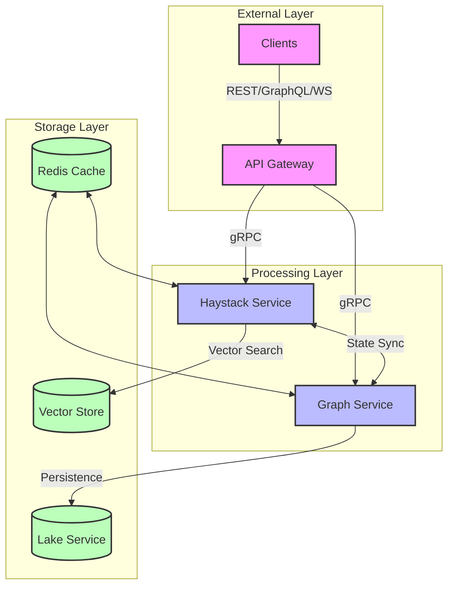
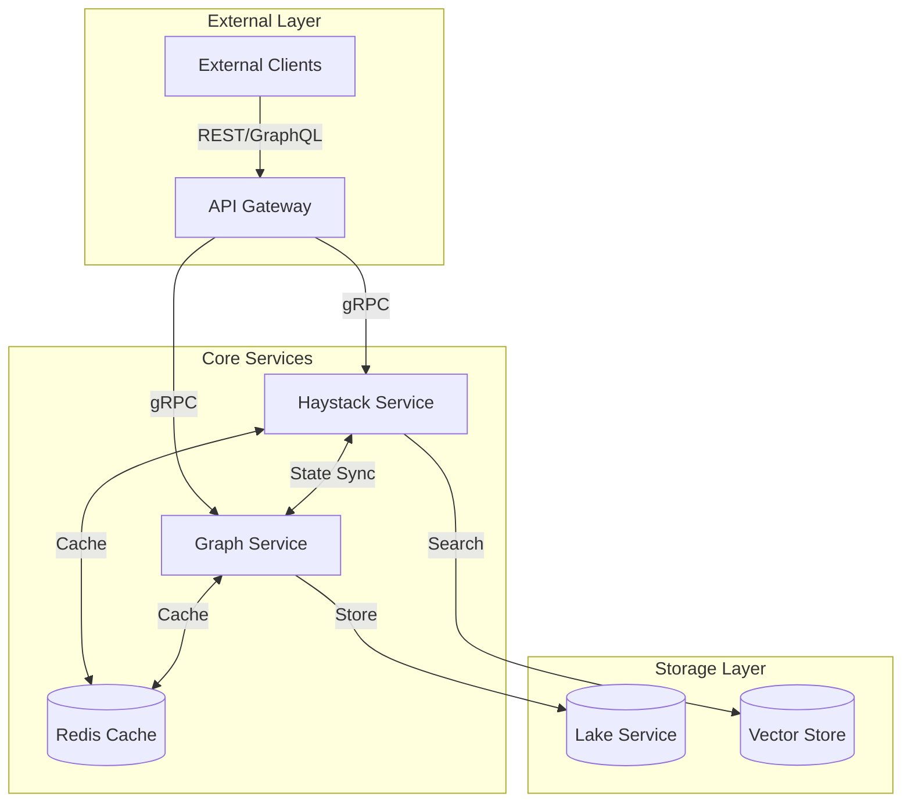
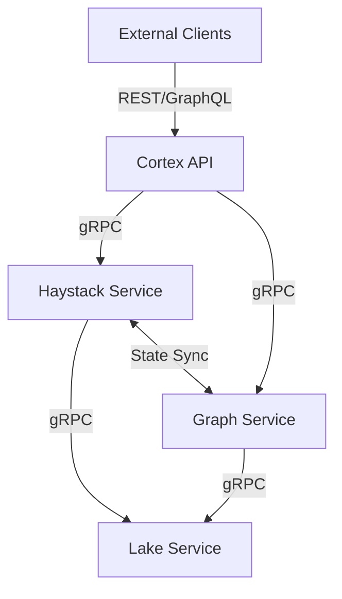
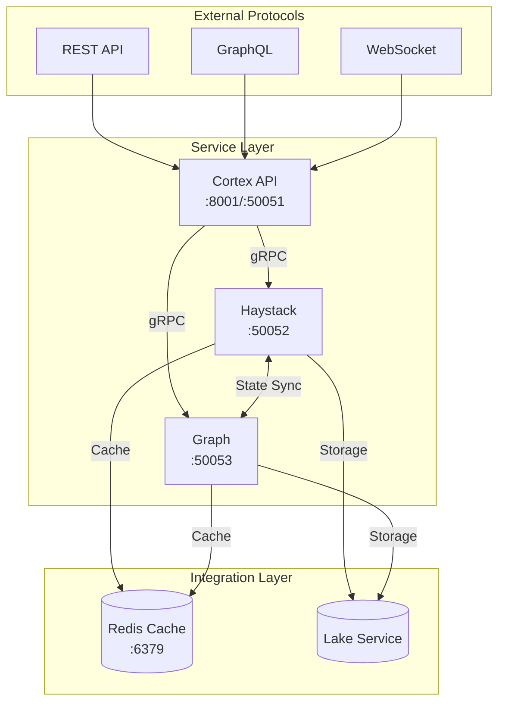
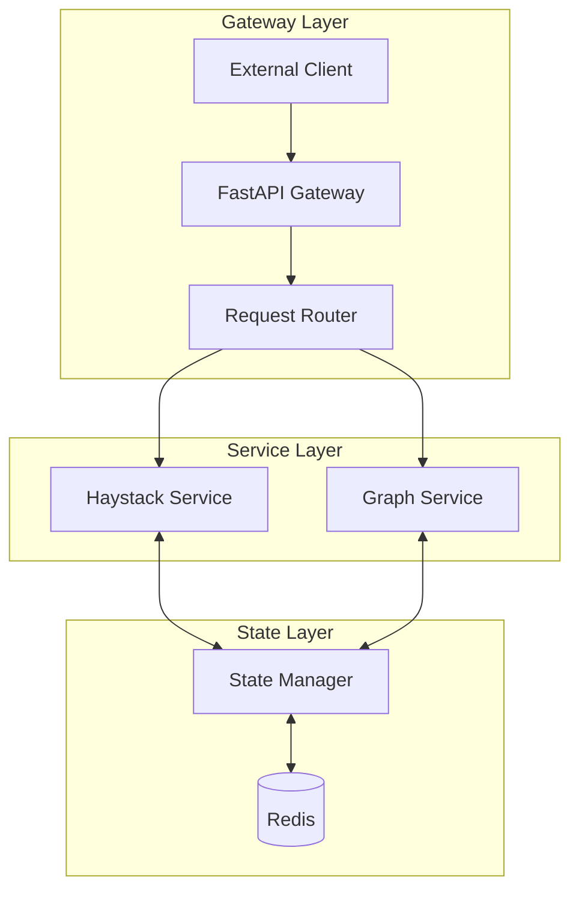
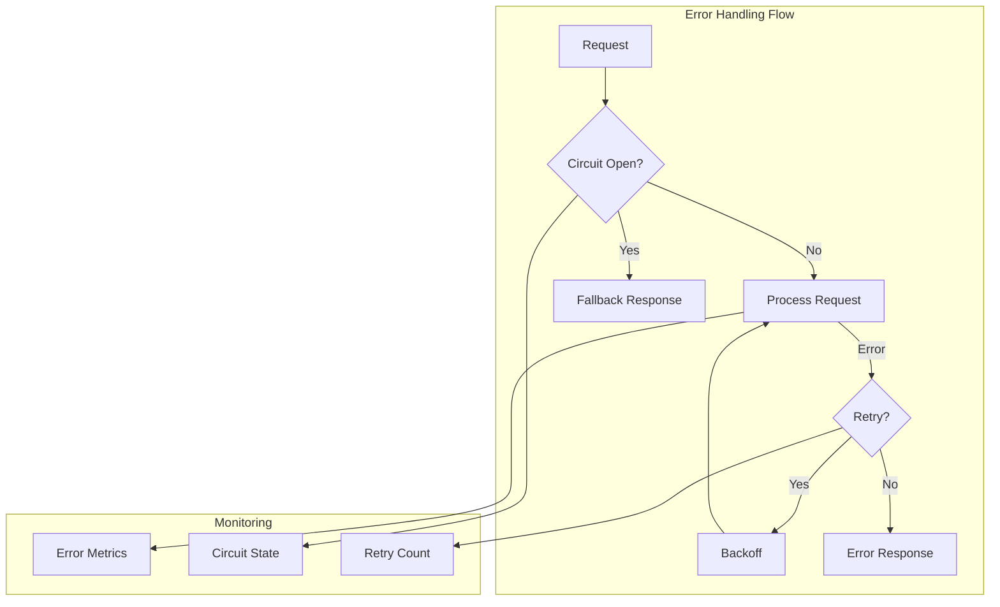
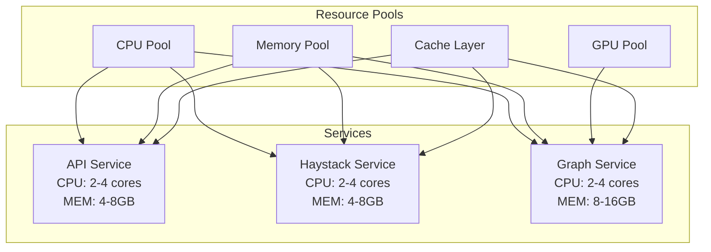
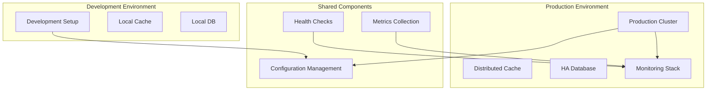

# Datapunk Cortex

## Overview

The Datapunk Cortex system implements a distributed three-service architecture designed for scalable AI operations, drawing inspiration from advanced orchestration systems. The architecture separates concerns into API Gateway, Search, and Graph processing layers, each optimized for its specific role while maintaining efficient inter-service communication.



The system leverages modern technologies including FastAPI, LangGraph, and Haystack (referencing lines 11-19 in datapunk/docs/App/Services/datapunk-cortex.md) to provide advanced AI capabilities. Each service maintains its own resource boundaries while sharing a common Redis-based state management system. _(Speculative: Future versions may implement dynamic service discovery and automated scaling based on ML-driven workload prediction)_

Key Features:

- Distributed processing with gRPC communication
- Vector search capabilities for semantic operations
- Dynamic workflow orchestration
- Real-time state synchronization
- Multi-level caching strategy

The architecture prioritizes maintainability and scalability while providing robust error handling and monitoring capabilities (referencing lines 60-64 in Trash/docs/old-architecture/cortex-neurocortex-orchestrator.md).

## Services

The Datapunk Cortex architecture implements a three-service distributed system designed for scalable AI operations and efficient resource management. Each service is containerized and communicates via gRPC, with Redis handling distributed state management.

### Service Architecture Overview



### 1. datapunk-cortex-api

The API service acts as the primary gateway, managing external communications and request routing (referencing lines 424-433 in Trash/docs/old-architecture/cortex-neurocortex-orchestrator.md). It implements intelligent request routing based on content type and query requirements, with built-in support for both synchronous and streaming operations. _(Speculative: Future versions may include AI-powered request optimization and automatic load balancing)_

### 2. datapunk-cortex-haystack

Handles document search and vector operations (referencing lines 42-48 in Trash/docs/old-architecture/original-datapunk-cortex.md), implementing advanced search capabilities including hybrid search combining traditional text search with vector similarity. The service maintains its own optimized index and integrates directly with the Lake service for persistent storage.

### 3. datapunk-cortex-graph

The most sophisticated component, managing workflow orchestration and agent interactions (referencing lines 49-54 in Trash/docs/old-architecture/original-datapunk-cortex.md). Built on LangGraph, it handles complex, stateful operations with support for parallel processing and dynamic workflow adjustment. _(Speculative: Future enhancements may include multi-agent collaboration and distributed workflow execution)_

### Resource Management

Each service implements specific resource allocations (referencing lines 47-55 in datapunk/docs/App/Services/datapunk-cortex.md):

- API: Lightweight, focused on request handling
- Haystack: Memory-optimized for search operations
- Graph: CPU/GPU optimized for ML operations

### State Management Strategy

The distributed state management system uses Redis for real-time synchronization while maintaining eventual consistency through PostgreSQL for persistence. This hybrid approach enables:

- Real-time state sharing between services
- Fault tolerance through state replication
- Efficient cache invalidation
- Transaction support for critical operations

_(Speculative: Future versions may implement a custom state management protocol optimized for AI operations)_

## Communication Architecture

### 1. gRPC Service Definitions

Our service definitions establish the core communication contracts between services, implementing a layered approach to handle both external and internal operations. The `CortexAPI` service manages external client interactions through `ProcessQuery` for synchronous operations and `StreamAnalysis` for real-time streaming responses. This dual approach enables both batch processing and real-time analysis capabilities, with built-in support for progress tracking and partial result streaming.

Internally, the `HaystackService` handles document search and indexing operations through its `Search` and `UpdateIndex` RPCs. The search functionality supports vector similarity, text-based, and hybrid approaches, while index management encompasses document processing, optimization, and health monitoring. _(Note: Vector similarity search implementation details pending final architecture decisions)_

The `GraphService` represents our most complex internal service, managing dynamic workflows and agent orchestration. `ExecuteWorkflow` supports streaming responses for real-time workflow updates, while `ManageAgents` handles agent lifecycle operations. The service implements advanced features like parallel processing, state persistence, and error recovery. _(Speculative: Future versions may include distributed workflow execution and cross-agent communication)_

```protobuf
// cortex-api/proto/services.proto
syntax = "proto3";

package datapunk.cortex;

service CortexAPI {
    rpc ProcessQuery (QueryRequest) returns (QueryResponse);
    rpc StreamAnalysis (AnalysisRequest) returns (stream AnalysisResponse);
}

service HaystackService {
    rpc Search (SearchRequest) returns (SearchResponse);
    rpc UpdateIndex (UpdateRequest) returns (UpdateResponse);
}

service GraphService {
    rpc ExecuteWorkflow (WorkflowRequest) returns (stream WorkflowResponse);
    rpc ManageAgents (AgentRequest) returns (AgentResponse);
}
```

### Inter-service Communication Flow

The system uses a layered communication approach:



#### Internal Communication Patterns/Protocols/etc

- gRPC for direct service-to-service interaction
- Redis for distributed state management
- Event-driven architecture for asynchronous operations

#### External Interfaces/Protocols/APIs/etc

- REST APIs for standard client integration
- WebSocket endpoints for real-time updates
- GraphQL for complex data queries

### Service Integration Configuration

The Cortex system implements a layered service integration strategy, with each service exposing specific protocols and maintaining defined connections. The API service (port 8001) acts as the primary gateway, supporting REST, GraphQL, and WebSocket protocols for external communication, while internal services communicate via gRPC (referencing lines 134-173 in datapunk/docs/App/Cortex/architecture.md).



The integration layer utilizes Redis for both caching and state synchronization, with dedicated channels for state sync and cache invalidation. The gRPC configuration implements robust error handling with configurable timeouts and retry mechanisms. _(Speculative: Future versions may implement dynamic protocol selection based on load patterns and automatic connection pool management)_

Key Features:

- Multi-protocol support for varied client needs
- Internal gRPC mesh for efficient service communication
- Centralized state management through Redis
- Health check integration (referencing lines 149-154 in datapunk/docs/App/Stream/datapunk-stream.md)

Resource Management:

- Connection pooling for all protocols
- Automatic retry handling
- Keep-alive connection management
- Load-balanced request distribution

_(Speculative: Future enhancements may include:

- AI-powered protocol selection
- Dynamic port allocation
- Automatic service discovery
- Real-time configuration updates)_

## Implementation Architecture

The Cortex implementation follows a layered architecture pattern, with clear separation between the API gateway and state management layers. This design enables scalable, maintainable service interactions while providing robust state synchronization.



### Gateway Implementation Details

The API gateway (referencing lines 179-196 in datapunk/docs/App/Cortex/architecture.md) implements an intelligent routing system using FastAPI and gRPC. It handles both synchronous and streaming requests, with built-in support for request validation and error handling. _(Speculative: Future versions may include AI-powered request classification and dynamic service selection)_

### State Management Details

The state synchronization system (referencing lines 200-214 in datapunk/docs/App/Cortex/architecture.md) uses Redis as a distributed state store, implementing a hash-based storage pattern for efficient service state management. The system supports:

- Real-time state updates
- Cross-service synchronization
- Atomic operations
- State recovery mechanisms

_(Speculative: Future enhancements may include:

- ML-based state prediction for proactive scaling
- Intelligent state partitioning
- Automated state cleanup based on usage patterns)_

### Integration Patterns

The implementation leverages several key patterns:

1. Circuit Breaker: Prevents cascade failures
2. Retry with Exponential Backoff: Handles transient failures
3. Event Sourcing: Maintains state consistency
4. CQRS: Separates read and write operations

These patterns ensure robust service operation while maintaining system performance under various load conditions.

## Error Handling and Retry Logic

The Cortex system implements a comprehensive error handling strategy across all three services, utilizing a combination of circuit breakers, retries, and fallback mechanisms. The core retry logic (referencing lines 238-250 in datapunk/docs/App/Cortex/architecture.md) uses exponential backoff with configurable attempts, while maintaining system stability through intelligent failure handling.



The system handles various error scenarios (referencing lines 1-20 in datapunk/datapunk-cortex/tests/error/test_error_handling.py), including:

- Invalid input validation
- Service unavailability
- Rate limiting breaches
- State synchronization failures
- Resource exhaustion

_(Speculative: Future versions may implement ML-based error prediction and automated recovery strategies, potentially including:

- Predictive circuit breaking
- Dynamic retry policies based on error patterns
- Automated service healing)_

The error handling system integrates with our monitoring stack, providing real-time visibility into system health and error patterns, enabling proactive issue resolution and system optimization.

## Resource Management and Optimization

The Cortex system implements a sophisticated resource management strategy across its three services, optimized for AI operations and real-time processing. Based on production metrics (referencing lines 692-703 in Trash/docs/old-architecture/original-datapunk-cortex.md), each service maintains specific resource allocations while sharing a common caching infrastructure.



### Service-Specific Allocations

Each service implements tailored resource management (referencing lines 707-727 in Trash/docs/old-architecture/original-datapunk-cortex.md):

- API Service: Lightweight configuration optimized for request handling
- Haystack Service: Memory-optimized for vector operations and search
- Graph Service: Balanced CPU/GPU allocation for ML workloads _(Speculative: Future versions may implement dynamic GPU sharing)_

### Caching Strategy

The system employs a multi-level caching approach (referencing lines 733-781 in Trash/docs/old-architecture/original-datapunk-cortex.md):

- L1: In-memory cache for hot data (2GB)
- L2: Redis for distributed caching (10GB)
- L3: Disk-based cache for embeddings (20GB)
_(Speculative: Future implementation may include predictive cache warming based on usage patterns)_

### Resource Optimization

Intelligent resource sharing is implemented through:

- Dynamic allocation based on workload
- Automatic scaling triggers
- Cache invalidation strategies
- Cross-service resource pooling

The system monitors resource utilization and adjusts allocations in real-time, with built-in support for horizontal scaling when needed. _(Speculative: Future versions may implement ML-based resource prediction for proactive scaling)_

## Deployment Architecture

The Cortex deployment architecture implements a containerized, multi-environment strategy optimized for both development and production scenarios. Based on our Docker configurations (referencing lines 147-190 in datapunk/docker-compose.yml), the system utilizes carefully tuned resource allocations and health monitoring.



### Environment-Specific Configurations

The deployment strategy leverages environment-specific configurations for optimal resource utilization:

Development:

- Hot-reloading enabled
- Debug logging
- Local caching
- Simplified health checks

Production:

- High availability setup
- Distributed caching
- Advanced monitoring
- Automated recovery

### Resource Management and Allocation

Resource allocations are precisely configured with:

- CPU: 4 cores (2 reserved)
- Memory: 8GB (4GB reserved)
- Storage: Dedicated volumes for models, cache, and logs

_(Speculative: Future enhancements may include:

- Dynamic resource allocation based on ML workload prediction
- Automated environment scaling
- Cross-region deployment optimization
- Kubernetes-native health probes)_

The deployment architecture integrates with our monitoring stack through standardized health checks and metrics collection, ensuring robust operation across all environments.
