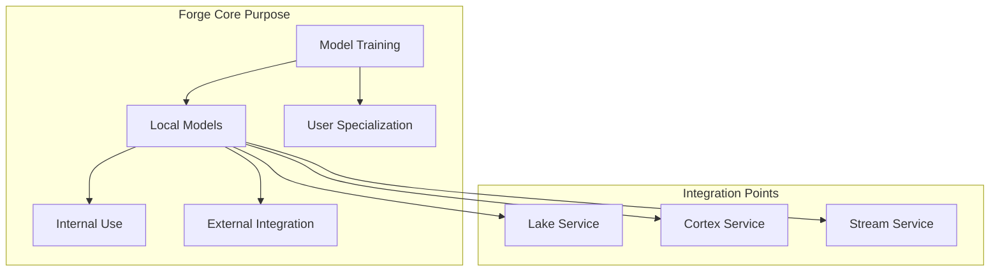

# Datapunk Forge (NeuroMancer) Documentation Strategy

## Current Understanding
From the codebase (referencing lines 5-6 in datapunk/docs/App/Forge/datapunk-forge.md), Forge serves as our AI model factory, but its scope and integration points need clearer definition.

## Documentation Structure Needed

1. **Core Architecture Document**
   - Purpose and scope
   - Service boundaries
   - Integration patterns
   - Resource management

2. **Technical Implementation Docs**
   - Training pipeline details
   - Model lifecycle management
   - Resource optimization
   - Security considerations

3. **Integration Guides**
   - Lake service integration
   - Cortex service integration
   - Stream service integration
   - External system interfaces

## Key Areas to Define

1. **Model Training Scope**
   - What types of models?
   - Training data sources
   - Resource limitations
   - Performance requirements

2. **Service Boundaries**
   - Clear separation from Cortex
   - Data flow patterns
   - State management
   - Resource sharing

3. **Integration Patterns**
   - How other services request training
   - Model deployment process
   - Data pipeline integration
   - Monitoring and metrics

Would you like me to:
1. Create a detailed outline for any of these sections?
2. Define specific integration patterns?
3. Detail the service boundaries?