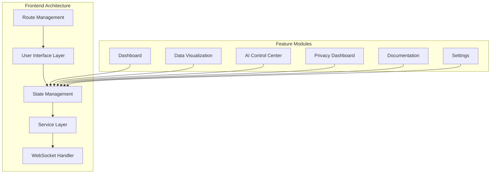
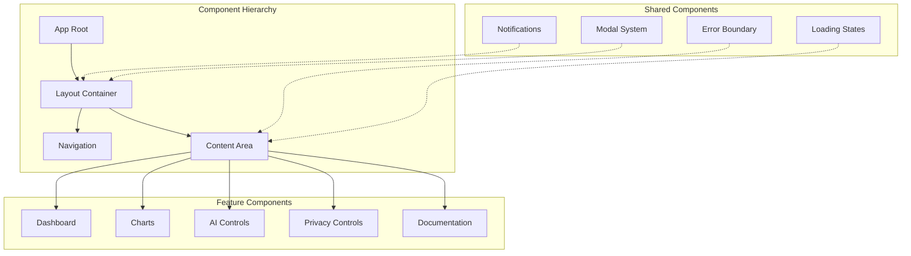
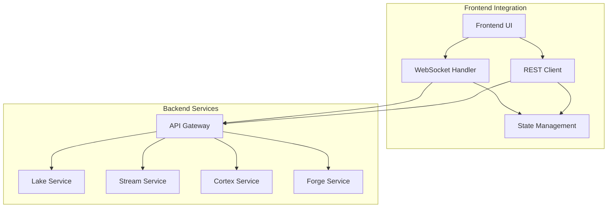

# Datapunk Frontend Architecture

## Overview
Datapunk's frontend implements a feature-based modular architecture with real-time data visualization capabilities, AI system controls, and comprehensive monitoring features.

## Design System

### Color Palette

```scss
// Core Colors
$background-primary: #0a0a0f;
$background-secondary: #141419;
$background-tertiary: #1c1c24;

// Neon Colors with Glow
$neon-pink: #ff1b6b;
$neon-amber: #ffac06;
$neon-green: #0fff4f;
$neon-white: #ffffff;
$neon-purple: #bf00ff;

// Glow Effects
@mixin neon-glow($color) {
  text-shadow: 0 0 7px rgba($color, 0.7),
               0 0 10px rgba($color, 0.5),
               0 0 21px rgba($color, 0.3);
}

// Background Gradient
.app-background {
  background: linear-gradient(
    135deg,
    $background-primary 0%,
    $background-secondary 50%,
    $background-tertiary 100%
  );
}
```

## Architecture Diagram



## Directory Structure

```bash
src/
├── app.html                    # Main HTML template
├── app.css                     # Global styles
├── features/
│   ├── dashboard/             # Main dashboard
│   │   ├── components/        # Dashboard-specific components
│   │   ├── stores/           # Dashboard state management
│   │   └── types/            # Dashboard TypeScript types
│   ├── data-visualization/    # Data visualization features
│   │   ├── components/       
│   │   ├── stores/
│   │   └── charts/           # Chart components
│   ├── ai-control/           # AI system management
│   │   ├── cortex/          # Cortex control interface
│   │   ├── forge/           # Forge management
│   │   └── stores/
│   ├── privacy/              # Privacy controls
│   ├── documentation/        # Documentation system
│   └── settings/             # App settings
├── shared/
│   ├── components/           # Shared UI components
│   ├── styles/              # Global styles & themes
│   ├── utils/               # Utility functions
│   └── stores/              # Global state management
└── lib/
    ├── api/                 # API integration
    ├── websocket/           # WebSocket handlers
    └── types/               # Shared TypeScript types
```

## Key Features

### 1. Real-time Data Visualization
- Configurable dashboards
- Live data streaming
- Interactive charts
- Custom visualization layouts

### 2. AI Control Center

```typescript
interface AIControlCenter {
    cortex: {
        status: 'active' | 'training' | 'idle';
        models: Model[];
        performance: PerformanceMetrics;
        queue: InferenceQueue;
    };
    forge: {
        activeTraining: TrainingJob[];
        modelRegistry: RegisteredModel[];
        resources: ResourceUtilization;
        deployments: Deployment[];
    };
}
```

### 3. Privacy Dashboard
- Data stream controls
- Permission management
- Audit logging
- Data retention settings

### 4. Documentation System
- Interactive tutorials
- System documentation
- API references
- Best practices guides

### 5. Settings & Configuration
- User preferences
- System configuration
- Integration settings
- Theme customization

## Component Architecture



## State Management Strategy

```typescript
// Global app state
interface AppState {
    user: UserProfile;
    theme: ThemeSettings;
    notifications: Notification[];
    activeFeatures: Feature[];
    systemStatus: SystemStatus;
}

// Feature-specific states
interface DataVisualizationState {
    layouts: DashboardLayout[];
    dataSources: DataSource[];
    refreshRates: Record<string, number>;
    filters: Filter[];
}

interface AIControlState {
    models: AIModel[];
    trainingJobs: TrainingJob[];
    inferenceQueue: QueueItem[];
    performance: PerformanceMetrics;
}
```

## Integration Points



## Performance Considerations
- Code splitting per feature
- Lazy loading of components
- WebSocket connection management
- Efficient state updates
- Chart rendering optimization

## Accessibility Features
- ARIA labels
- Keyboard navigation
- Screen reader support
- High contrast mode
- Focus management

## Development Guidelines
- Component-first development
- TypeScript for type safety
- Consistent styling patterns
- Error boundary implementation
- Performance monitoring

## Theme Implementation

```scss
// Theme Variables
:root {
    // Background Colors
    --bg-primary: #0a0a0f;
    --bg-secondary: #141419;
    --bg-tertiary: #1c1c24;
    
    // Neon Colors
    --neon-pink: #ff1b6b;
    --neon-amber: #ffac06;
    --neon-green: #0fff4f;
    --neon-white: #ffffff;
    --neon-purple: #bf00ff;
    
    // Glow Effects
    --text-glow-strong: 0 0 7px rgba(255, 255, 255, 0.7);
    --text-glow-medium: 0 0 10px rgba(255, 255, 255, 0.5);
    --text-glow-weak: 0 0 21px rgba(255, 255, 255, 0.3);
    
    // UI Elements
    --border-primary: 1px solid rgba(255, 255, 255, 0.1);
    --shadow-primary: 0 4px 6px rgba(0, 0, 0, 0.3);
}

// Component Theme Examples
.card {
    background: var(--bg-secondary);
    border: var(--border-primary);
    box-shadow: var(--shadow-primary);
}

.text-glow-pink {
    color: var(--neon-pink);
    text-shadow: var(--text-glow-strong);
}

.text-glow-amber {
    color: var(--neon-amber);
    text-shadow: var(--text-glow-medium);
}

.gradient-background {
    background: linear-gradient(
        135deg,
        var(--bg-primary) 0%,
        var(--bg-secondary) 50%,
        var(--bg-tertiary) 100%
    );
}
```
