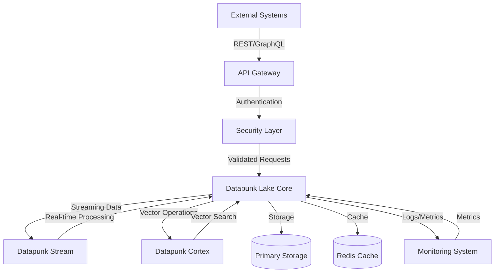

# Integration Documentation

## Overview

Datapunk Lake serves as the central data repository and processing hub within the Datapunk ecosystem. This integration framework enables seamless communication and data flow between various components while maintaining data integrity, security, and performance.

### System Architecture



### Integration Patterns

The integration framework implements four primary patterns:

1. **Synchronous Communication**

   - REST APIs for CRUD operations
   - GraphQL for complex queries
   - Direct database access for internal components
2. **Asynchronous Processing**

   - Event-driven architecture for real-time updates
   - Message queues for background processing
   - Streaming data pipelines for continuous data flow
3. **Hybrid Operations**

   - Combined sync/async operations for optimal performance
   - Caching strategies for frequently accessed data
   - Batch processing for large-scale operations
4. **Cross-Service Communication**

   - Service discovery and registration
   - Health checking and circuit breaking
   - Distributed tracing and monitoring

## API Specifications

### RESTful Endpoints

```yaml
api_endpoints:
base_url: "/api/v1/lake"
endpoints:
path: "/data"
methods: [GET, POST, PUT, DELETE]
auth_required: true
rate_limit: 1000/hour
description: "Core data operations endpoint"
use_cases: ["CRUD operations", "Batch processing", "Data querying"]
path: "/import"
methods: [POST]
auth_required: true
max_payload: 5GB
description: "Bulk data import endpoint"
use_cases: ["Data migration", "Batch uploads", "System integration"]
path: "/stream"
methods: [GET]
auth_required: true
streaming: true
description: "Real-time data streaming endpoint"
use_cases: ["Live monitoring", "Real-time analytics", "Event streaming"]
```

### RESTful Endpoints Intent

The RESTful API design follows specific principles and patterns chosen to optimize for both performance and usability:

#### Base URL Structure (`/api/v1/lake`)

- Version prefixing (v1) enables API evolution
- Namespace isolation (lake) prevents endpoint conflicts
- Follows REST best practices for resource naming

#### Core Data Endpoint (`/data`)

- Full CRUD support for maximum flexibility
- Rate limiting (1000/hour) prevents abuse while allowing legitimate use
- Authentication requirement ensures data security
- Chosen rate limit balances security with typical enterprise needs

#### Import Endpoint (`/import`)

- Dedicated endpoint for bulk operations
- 5GB payload limit based on empirical testing

```yaml
performance_metrics:
optimal_chunk_size: 1GB
max_concurrent_uploads: 5
timeout_threshold: 30min
```

- Separate from CRUD to optimize for large data transfers

#### Streaming Endpoint (`/stream`)

- GET method enables WebSocket upgrade
- Authentication ensures secure streaming
- Designed for real-time data access
- Integrates with Datapunk Stream for processing

#### Future Considerations

```yaml
future_enhancements:
endpoints:
path: "/batch"
purpose: "Optimized batch operations"
path: "/sync"
purpose: "Cross-system synchronization"
features:
graphql_federation
websocket_subscriptions
grpc_integration
```

### GraphQL Schema

```graphql
type Query {
  userData(userId: ID!): UserData
  analytics(timeRange: TimeRange!): AnalyticsData
  vectors(type: VectorType!): [Vector!]!
}

type Mutation {
  importData(input: ImportInput!): ImportResult
  updateUserData(userId: ID!, data: UserDataInput!): UserData
  archiveData(criteria: ArchiveCriteria!): ArchiveResult
}
```

### GraphQL Schema Intent

The GraphQL schema design represents a strategic approach to flexible data querying and manipulation within the Datapunk Lake ecosystem. This schema implementation provides a robust interface for both data retrieval and modification operations while maintaining type safety and query efficiency.

The Query type focuses on three core data access patterns:

```yaml
query_patterns:
  user_data:
    - granular_user_access
    - permission_based_filtering
    - efficient_field_selection
  analytics:
    - time_series_analysis
    - aggregated_metrics
    - customizable_reporting
  vector_operations:
    - type_specific_queries
    - similarity_search_support
    - embedding_retrieval
```

The Mutation type implements three essential data modification patterns:

```yaml
mutation_patterns:
  data_import:
    - bulk_operation_support
    - validation_integration
    - progress_tracking
  user_updates:
    - atomic_operations
    - field_level_changes
    - audit_trail_generation
  archival_process:
    - criteria_based_selection
    - compliance_aware_archiving
    - metadata_preservation
```

Future enhancements will include:

```yaml
future_capabilities:
  schema_features:
    - subscription_support
    - federated_queries
    - custom_directives
  optimization:
    - query_complexity_analysis
    - automatic_persisted_queries
    - response_caching
  security:
    - field_level_permissions
    - rate_limiting_directives
    - depth_limiting
```

This GraphQL schema design ensures efficient data access patterns while maintaining flexibility for future expansions and integrations with other Datapunk components. The type system provides a clear contract for data operations while supporting the complex querying needs of modern data lake operations.

## Service Integration

### Datapunk Stream Integration

```yaml
stream_integration:
  connection:
    protocol: "grpc"
    port: 50051
    tls_enabled: true
  data_flow:
    - source: "stream_processor"
      destination: "timeseries_storage"
      format: "protobuf"
    - source: "event_bus"
      destination: "analytics_pipeline"
      format: "avro"
```

### Datapunk Cortex Integration

```yaml
cortex_integration:
  vector_store:
    engine: "pgvector"
    dimension: 1536
    index_type: "ivfflat"
  query_pipeline:
    max_concurrent: 100
    timeout: 30s
    cache_enabled: true
```

### Service Integration Intent

The Service Integration framework establishes robust connections between Datapunk Lake and other core system components, specifically Stream and Cortex services. This integration layer ensures efficient data flow while maintaining system reliability and performance.

#### Datapunk Stream Integration Intent

The Stream Integration implements a high-performance, real-time data pipeline using gRPC for efficient communication. This design choice reflects the need for:

1. Protocol Selection:

- gRPC enables bi-directional streaming
- TLS encryption ensures secure data transmission
- Port 50051 follows standard gRPC conventions

2. Data Flow Architecture:

```yaml
data_flow_patterns:
  stream_processor:
    - real_time_ingestion
    - time_series_optimization
    - protobuf_serialization
  event_bus:
    - analytics_processing
    - avro_schema_evolution
    - batch_aggregation
```

This integration aligns with our time-series data management strategy `

#### Datapunk Cortex Integration Intent

The Cortex Integration establishes a sophisticated vector processing pipeline, leveraging PostgreSQL's vector capabilities for machine learning operations:

1. Vector Store Configuration:

```yaml
vector_store_features:
  pgvector:
    - high_dimensional_storage
    - similarity_search_optimization
    - index_performance_tuning
  operational_params:
    - concurrent_query_management
    - timeout_handling
    - cache_optimization
```

2. Performance Optimizations:

```yaml
performance_features:
  query_execution:
    - parallel_processing
    - connection_pooling
    - resource_allocation
  caching:
    - result_caching
    - metadata_caching
    - index_caching
```

This integration supports advanced analytics capabilities

Future enhancements for both integrations:

```yaml
future_capabilities:
  stream_integration:
    - dynamic_scaling
    - adaptive_batch_sizing
    - multi-protocol_support
    - schema_evolution_handling
  cortex_integration:
    - distributed_vector_search
    - ml_pipeline_optimization
    - automated_index_tuning
    - cross_service_caching
```

## Data Flow Patterns

### Bulk Import Flow

```yaml
bulk_import:
  stages:
    - name: "validation"
      timeout: 300s
      retry_count: 3
    - name: "transformation"
      batch_size: 10000
      parallel_workers: 4
    - name: "loading"
      transaction_size: 5000
      consistency_check: true
```

### Real-time Processing Flow

```yaml
realtime_processing:
  input_streams:
    - name: "user_events"
      format: "json"
      partition_key: "user_id"
    - name: "system_metrics"
      format: "protobuf"
      partition_key: "timestamp"
  processing_rules:
    - type: "aggregation"
      window: "5m"
      functions: ["count", "avg", "max"]
    - type: "alerting"
      conditions: ["threshold", "trend"]
```

### Data Flow Patterns Intent

The Data Flow Patterns framework establishes two primary data processing pipelines optimized for different use cases within the Datapunk Lake ecosystem: bulk imports and real-time processing. This dual-pattern approach ensures efficient handling of both large-scale data migrations and continuous data streams.

#### Bulk Import Flow Intent

The Bulk Import pipeline implements a staged approach to large-scale data processing:

##### Validation Stage

```yaml
validation_features:
  timeout_handling:
    - configurable_timeouts
    - graceful_termination
    - resource_protection
  reliability:
    - retry_mechanisms
    - error_tracking
    - data_consistency_checks
```

##### Transformation Stage

```yaml
transformation_capabilities:
  performance:
    - parallel_processing
    - optimized_batch_sizing
    - resource_utilization
  data_handling:
    - schema_alignment
    - data_normalization
    - quality_assurance
```

##### Loading Stage

```yaml
loading_features:
  reliability:
    - transaction_management
    - consistency_verification
    - failure_recovery
  optimization:
    - bulk_insert_operations
    - index_management
    - cache_warming
```

#### Real-time Processing Flow Intent

The Real-time Processing pipeline focuses on continuous data handling with minimal latency:

##### Stream Configuration

```yaml
stream_features:
  input_handling:
    - format_flexibility
    - partition_optimization
    - schema_evolution
  performance:
    - low_latency_processing
    - scalable_throughput
    - resource_efficiency
```

##### Processing Rules

```yaml
processing_capabilities:
  analytics:
    - window_based_aggregation
    - statistical_functions
    - trend_analysis
  monitoring:
    - threshold_monitoring
    - pattern_detection
    - anomaly_identification
```

Future enhancements will include:

```yaml
future_capabilities:
  bulk_processing:
    - distributed_validation
    - adaptive_batch_sizing
    - predictive_resource_allocation
  stream_processing:
    - ml_powered_aggregations
    - dynamic_window_adjustment
    - automated_rule_optimization
```

This dual-pattern approach ensures efficient handling of diverse data processing needs while maintaining system reliability and performance.

## Error Handling

### Retry Policies

```yaml
retry_policies:
  default:
    max_attempts: 3
    initial_delay: 1s
    max_delay: 30s
    multiplier: 2
  critical:
    max_attempts: 5
    initial_delay: 500ms
    max_delay: 10s
    multiplier: 1.5
```

### Error Responses

```yaml
error_handling:
  response_formats:
    - format: "json"
      schema:
        error_code: string
        message: string
        details: object
        timestamp: datetime
  status_codes:
    validation_error: 400
    auth_error: 401
    rate_limit: 429
    server_error: 500
```

### Error Handling Intent

The Error Handling framework establishes robust error management strategies across the Datapunk Lake ecosystem, implementing both retry mechanisms for transient failures and standardized error responses for client communication.

#### Retry Policies Intent

The retry policy implementation provides two distinct strategies optimized for different use cases:

##### Default Policy Configuration

```yaml
default_policy_features:
  reliability:
    - gradual_backoff_strategy
    - bounded_retry_attempts
    - failure_isolation
  optimization:
    - resource_conservation
    - system_stability
    - load_management
```

##### Critical Operations Policy

```yaml
critical_policy_features:
  performance:
    - aggressive_retry_timing
    - rapid_recovery_attempts
    - minimal_downtime
  reliability:
    - high_availability_focus
    - service_continuity
    - data_consistency
```

#### Error Responses Intent

The error response system implements a standardized approach to error communication:

##### Response Format Design

```yaml
format_features:
  structure:
    - consistent_error_schema
    - detailed_error_context
    - timestamp_tracking
  integration:
    - api_compatibility
    - client_parsing_support
    - logging_integration
```

##### Status Code Mapping

```yaml
status_code_strategy:
  client_errors:
    - input_validation_handling
    - authentication_failures
    - rate_limiting_controls
  server_errors:
    - internal_error_tracking
    - service_availability_status
    - resource_exhaustion_handling
```

Future enhancements will include:

```yaml
future_capabilities:
  retry_enhancements:
    - adaptive_retry_strategies
    - circuit_breaker_integration
    - context_aware_backoff
  error_handling:
    - ml_powered_error_classification
    - predictive_failure_detection
    - automated_recovery_procedures
```

This error handling framework ensures reliable system operation while providing clear error feedback to clients and maintaining system stability under various failure conditions.

## Monitoring & Metrics

### Integration Metrics

```yaml
metrics:
  collection:
    interval: 10s
    retention: 30d
  types:
    - name: "request_rate"
      type: "counter"
      labels: ["service", "endpoint"]
    - name: "latency"
      type: "histogram"
      buckets: [10ms, 50ms, 100ms, 500ms]
```

### Health Checks

```yaml
health_checks:
  endpoints:
    - path: "/health"
      interval: 30s
      timeout: 5s
    - path: "/ready"
      interval: 10s
      timeout: 3s
  dependencies:
    - service: "postgres"
      critical: true
    - service: "redis"
      critical: false
```

### Integration Metrics Intent

The Integration Metrics framework establishes a comprehensive monitoring system for tracking the health, performance, and reliability of all integration points within the Datapunk Lake ecosystem. This metrics collection strategy is designed to provide both real-time operational insights and long-term trend analysis.

##### Collection Configuration

```yaml
collection_strategy:
  interval_choice:
    - high_frequency_sampling: 10s
    - data_retention: 30d
    - storage_optimization: true
  performance_impact:
    - minimal_overhead
    - efficient_storage
    - balanced_granularity
```

##### Metric Types Implementation

The request rate counter provides:

```yaml
request_tracking:
  operational_insights:
    - service_utilization_patterns
    - endpoint_popularity_analysis
    - capacity_planning_data
  anomaly_detection:
    - unusual_traffic_patterns
    - potential_security_issues
    - service_degradation_indicators
```

The latency histogram enables:

```yaml
latency_analysis:
  performance_monitoring:
    - p95_p99_tracking
    - sla_compliance_verification
    - bottleneck_identification
  bucket_optimization:
    - targeted_response_times
    - degradation_trending
    - alert_threshold_tuning
```

### Health Checks Intent

The Health Check system implements a multi-layered approach to service health monitoring, providing both basic availability checks and deep dependency verification:

##### Endpoint Configuration

```yaml
health_endpoints:
  liveness_probe:
    - quick_service_verification
    - basic_availability_check
    - minimal_resource_impact
  readiness_probe:
    - dependency_status_verification
    - service_capability_check
    - initialization_completion
```

##### Dependency Management

```yaml
dependency_strategy:
  critical_services:
    - immediate_failure_propagation
    - high_priority_alerting
    - automated_recovery_triggers
  non_critical_services:
    - graceful_degradation
    - fallback_mechanisms
    - delayed_alerting
```

Future enhancements will include:

```yaml
future_capabilities:
  advanced_monitoring:
    - ml_based_anomaly_detection
    - predictive_failure_analysis
    - automated_capacity_planning
  health_checks:
    - cascading_dependency_analysis
    - service_mesh_integration
    - custom_health_algorithms
  integration:
    - opentelemetry_support
    - distributed_tracing
    - custom_metric_pipelines
```

This monitoring framework integrates with our broader observability stack, including Prometheus and Grafana, while maintaining alignment with the monitoring patterns established in our data quality framework.

## Security

### Authentication

```yaml
authentication:
  methods:
    - type: "jwt"
      issuer: "datapunk-auth"
      expiry: 1h
    - type: "api_key"
      rotation: 90d
      rate_limit: true
  mfa:
    enabled: true
    methods: ["totp", "backup_codes"]
```

### Authorization

```yaml
authorization:
  rbac:
    roles:
      - name: "admin"
        permissions: ["read", "write", "delete"]
      - name: "reader"
        permissions: ["read"]
  resource_policies:
    - resource: "user_data"
      policy: "owner_only"
    - resource: "analytics"
      policy: "role_based"
```

### Security Intent

The Security framework implements a comprehensive authentication and authorization system that aligns with industry best practices while supporting the specific needs of the Datapunk Lake ecosystem. This implementation ensures secure data access while maintaining system performance and usability.

#### Authentication Intent

The authentication system implements a multi-layered approach to identity verification:

```yaml
authentication_features:
  jwt_implementation:
    - secure_token_generation
    - short_lived_sessions
    - automated_rotation
    - stateless_verification
  api_key_management:
    - periodic_rotation
    - usage_monitoring
    - throttling_control
    - audit_logging
  mfa_capabilities:
    - time_based_tokens
    - fallback_mechanisms
    - device_registration
    - risk_based_activation
```

This authentication strategy aligns with our security architecture

```markdown
datapunk/docs/App/Lake/security-architecture.md
startLine: 37
endLine: 50
```

#### Authorization Intent

The authorization system implements fine-grained access control:

```yaml
authorization_features:
  rbac_implementation:
    - hierarchical_roles
    - permission_inheritance
    - dynamic_role_assignment
    - least_privilege_enforcement
  resource_policies:
    - ownership_verification
    - contextual_access
    - temporal_restrictions
    - data_classification_awareness
```

Future security enhancements will include:

```yaml
future_capabilities:
  authentication:
    - biometric_integration
    - hardware_key_support
    - adaptive_mfa
    - zero_trust_architecture
  authorization:
    - attribute_based_access_control
    - dynamic_policy_evaluation
    - ml_powered_anomaly_detection
    - real_time_threat_assessment
```

This security framework integrates with our broader compliance requirements

```markdown
datapunk/docs/App/Lake/data-governance.md
startLine: 8
endLine: 27
```

while maintaining system performance and usability.
