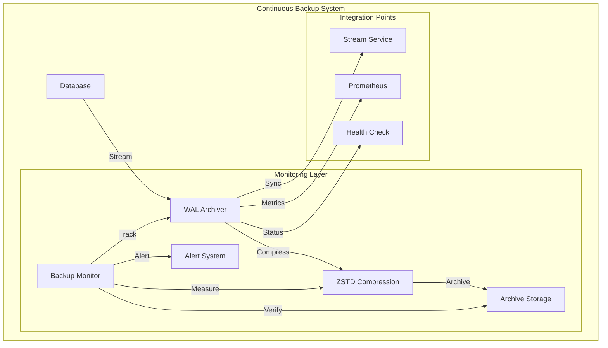
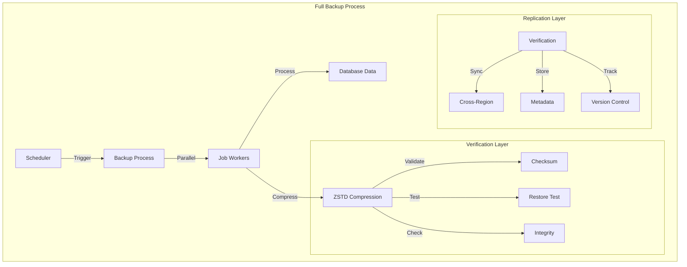
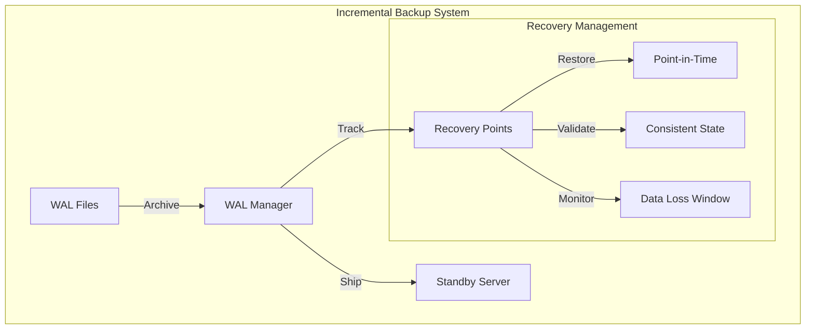
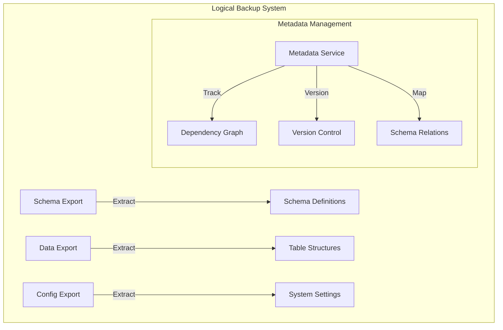
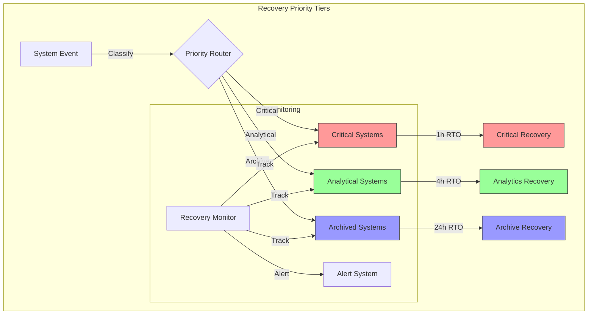
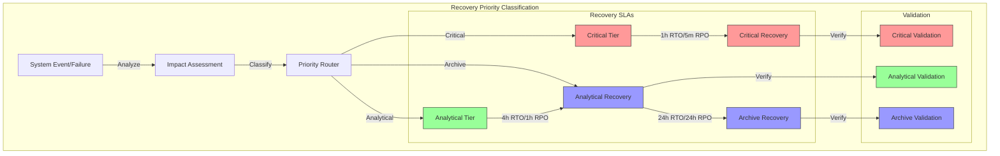
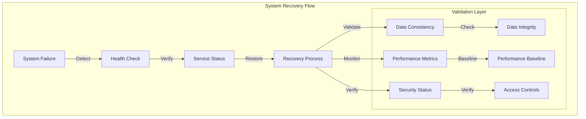
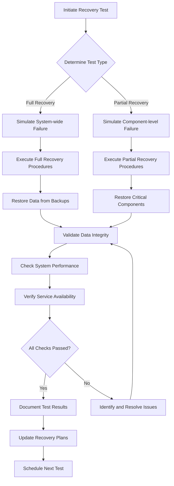

# Recovery and Backup Strategy

## Overview

The Recovery and Backup framework implements a comprehensive approach to data protection and system resilience within the Datapunk Lake ecosystem. This implementation ensures data durability, system availability, and compliance with recovery time objectives while maintaining operational efficiency.

## Recovery and Backup Strategy Framework

### Architecture Overview



### Implementation Details

```yaml
backup_strategy:
  wal_archiving:
    intent:
      real_time_data_protection:
        description: "Continuous transaction log capture"
        priority: "critical"
        consistency_level: "immediate"
        
      point_in_time_recovery:
        granularity: "1 second"
        retention_window: "7 days"
        recovery_targets:
          - timestamp
          - transaction_id
          - named_restore_point
          
      transaction_preservation:
        durability: "synchronous"
        validation: "checksum"
        ordering: "strict"
        
    configuration:
      compression:
        algorithm: "zstd"
        level: 3
        chunk_size: "16MB"
        parallel_compression: true
        
      retention:
        duration: "7d"
        cleanup_schedule: "0 2 * * *"
        emergency_retention: "14d"
        
      archive_path:
        primary: "/archive/wal"
        replica: "/archive/wal_replica"
        structure:
          - timeline
          - date
          - sequence
          
    monitoring:
      archival_success_rate:
        threshold: 99.99%
        window: "5m"
        alert_channel: "critical"
        
      compression_ratio:
        target: ">= 3:1"
        monitoring_interval: "1h"
        optimization_trigger: "< 2:1"
        
      storage_utilization:
        warning_threshold: 80%
        critical_threshold: 90%
        forecast_window: "24h"
```

### Integration Considerations

1. **Stream Service Integration**
References patterns from:

```markdown
datapunk/docs/App/Lake/work-queue/data-processing-pipeline.md
startLine: 67
endLine: 88
```

2. **Monitoring Integration**
References configuration from:

```markdown
datapunk/docs/App/Lake/work-queue/monitoring-alerting.md
startLine: 8
endLine: 24
```

3. **Storage Integration**

```yaml
storage_coordination:
  archive_management:
    - volume_allocation
    - retention_policies
    - cleanup_procedures
  performance_optimization:
    - io_scheduling
    - compression_tuning
    - parallel_processing
  monitoring_integration:
    metrics:
      - write_throughput
      - compression_efficiency
      - storage_consumption
    alerts:
      - archival_failures
      - compression_degradation
      - storage_pressure
```

## Backup Types

### Full Backup Implementation Framework

#### Architecture Overview of Full Backup Implementation



#### Implementation Details of Full Backup

```yaml
full_backup_implementation:
  schedule:
    timing: "0 2 * * *"  # Daily at 2 AM
    execution_window: "4h"
    pre_backup_tasks:
      - check_storage_space
      - verify_target_availability
      - notify_maintenance_window
    
  parallel_processing:
    jobs: 4
    resource_allocation:
      cpu_per_job: "25%"
      memory_per_job: "4GB"
      io_priority: "high"
    
  compression:
    algorithm: "zstd"
    level: 3
    chunk_size: "256MB"
    parallel_compression: true
    
  verification:
    checksum_validation:
      algorithm: "SHA-256"
      parallel_verification: true
      retention: "90d"
      
    restore_testing:
      sample_size: "10%"
      test_environment: "isolated"
      validation_queries:
        - record_counts
        - index_validity
        - constraint_checks
        
    integrity_checks:
      block_level: true
      page_verification: true
      index_validation: true
      
  replication:
    cross_region_sync:
      regions:
        primary: "us-east"
        secondary: ["us-west", "eu-central"]
      sync_strategy: "parallel"
      verification: "checksum"
      
    metadata_preservation:
      format: "json"
      contents:
        - schema_version
        - dependencies
        - configuration
        - statistics
        
    version_control:
      retention:
        full_backups: "30d"
        incremental: "7d"
      tagging:
        - timestamp
        - backup_type
        - source_version
```

### Integration Considerations for Full Backup

1. **Stream Service Integration**
References patterns from:

```markdown
datapunk/docs/App/Lake/work-queue/data-processing-pipeline.md
startLine: 67
endLine: 88
```

2. **Storage Strategy Integration**
References configuration from:

```markdown
datapunk/docs/App/Lake/expanded/storage-strategy.md
startLine: 137
endLine: 154
```

3. **Monitoring Integration**

```yaml
monitoring_integration:
  metrics:
    - backup_duration
    - compression_ratio
    - verification_success_rate
  alerts:
    - backup_failure
    - verification_error
    - replication_delay
  dashboards:
    - backup_status
    - storage_utilization
    - replication_health
```

### Incremental Backup Implementation

#### Architecture Overview of Incremental Backup



#### Implementation Details of Incremental Backup

```yaml
incremental_backup_implementation:
  wal_management:
    continuous_archiving:
      mode: "streaming"
      buffer_size: "256MB"
      compression: "lz4"
      retention_window: "7d"
      monitoring:
        - archival_lag
        - compression_ratio
        - disk_usage
    
    log_shipping:
      transport: "async"
      max_delay: "30s"
      bandwidth_limit: "50MB/s"
      encryption: "aes-256-gcm"
      verification:
        - checksum_validation
        - sequence_verification
        - timestamp_ordering
    
    transaction_tracking:
      granularity: "1s"
      metadata:
        - transaction_id
        - timestamp
        - user_context
      consistency_checks:
        - gap_detection
        - overlap_prevention
        - ordering_validation

  recovery_points:
    granular_restore:
      precision: "1s"
      validation_steps:
        - pre_restore_check
        - post_restore_verify
        - data_consistency_check
      
    minimal_data_loss:
      target_rpo: "5m"
      monitoring:
        - replication_lag
        - data_gap_detection
        - consistency_markers
      
    consistent_state:
      verification:
        - transaction_boundaries
        - foreign_key_integrity
        - index_consistency
```

### Integration Considerations for Incremental Backup

1. **Stream Service Integration**
References patterns from:

```markdown
datapunk/docs/App/Lake/work-queue/data-processing-pipeline.md
startLine: 67
endLine: 88
```

2. **Monitoring Integration**

```yaml
monitoring_integration:
  metrics:
    - backup_progress
    - data_consistency
    - resource_utilization
  alerts:
    - backup_failures
    - consistency_violations
    - resource_constraints
```

### Logical Backup Implementation

#### Architecture Overview of Logical Backup



#### Implementation Details of Logical Backup

```yaml
logical_backup_implementation:
  components:
    schema_definitions:
      elements:
        - tables
        - views
        - functions
        - triggers
      versioning:
        enabled: true
        retention: "90d"
        
    table_structures:
      export_format: "custom"
      include:
        - constraints
        - indexes
        - partitioning
      optimization:
        parallel_workers: 4
        chunk_size: "100MB"
        
    stored_procedures:
      tracking:
        - dependencies
        - execution_stats
        - version_history
      validation:
        - syntax_check
        - dependency_check
        - permission_verification
        
    configuration_data:
      scope:
        - system_settings
        - user_preferences
        - security_policies
      format: "yaml"
      encryption: true

  preservation:
    metadata_tracking:
      elements:
        - schema_version
        - object_dependencies
        - access_patterns
      storage:
        format: "json"
        compression: true
        
    dependency_mapping:
      analysis:
        - direct_dependencies
        - indirect_dependencies
        - circular_references
      visualization:
        enabled: true
        format: "dot"
        
    version_history:
      tracking:
        - change_type
        - timestamp
        - author
      retention:
        duration: "365d"
        pruning_strategy: "selective"
```

### Integration Considerations for Logical Backup

1. **Storage Strategy Integration**
References configuration from:

```markdown
datapunk/docs/App/Lake/expanded/storage-strategy.md
startLine: 137
endLine: 154
```

2. **Monitoring Integration**

```yaml
monitoring_integration:
  metrics:
    - schema_changes
    - dependency_health
    - version_tracking
  alerts:
    - schema_drift
    - dependency_breaks
    - version_conflicts
  dashboards:
    - schema_evolution
    - dependency_graphs
    - version_timeline
```

## Recovery Implementation Framework

### Overview of Recovery Implementation Framework

The recovery implementation framework for Datapunk Lake provides a tiered approach to system recovery, balancing the critical nature of different data types with resource optimization and business continuity requirements.



### Recovery Time Objectives

The RTO/RPO framework is structured around three distinct tiers, each aligned with Datapunk's data processing requirements:

```yaml
recovery_objectives:
  critical_systems:
    rto: 1h    
    rpo: 5m    
    priority: highest
    components:
      - user_authentication
      - core_data_services
      - real_time_processing
    monitoring:
      - service_health
      - data_consistency
      - performance_metrics
    validation:
      - integrity_checks
      - security_verification
      - compliance_validation

  analytical_systems:
    rto: 4h
    rpo: 1h
    priority: medium
    components:
      - batch_processing
      - data_warehousing
      - reporting_services
    monitoring:
      - job_completion
      - data_freshness
      - resource_utilization
    validation:
      - data_accuracy
      - processing_completeness
      - historical_consistency

  archived_systems:
    rto: 24h
    rpo: 24h
    priority: low
    components:
      - historical_data
      - compliance_archives
      - backup_repositories
    monitoring:
      - archive_integrity
      - retrieval_speed
      - storage_efficiency
    validation:
      - archive_completeness
      - metadata_consistency
      - retention_compliance
```

### Recovery Procedures

#### Recovery Tier Architecture

The recovery implementation uses a sophisticated tiered approach that balances business needs with technical capabilities:  



#### System Failure Recovery

The system failure recovery process is designed to handle unexpected system outages while maintaining data integrity:



```yaml
system_recovery:
  automated_procedures:
    health_check_verification:
      frequency: 30s
      timeout: 5s
      retries: 3
      services:
        - database_cluster
        - cache_layer
        - api_endpoints
        
    service_restoration:
      priority_order:
        - authentication_services
        - core_data_services
        - auxiliary_services
      parallel_recovery: true
      max_attempts: 3
      
    data_consistency_validation:
      checks:
        - transaction_logs
        - replication_status
        - index_integrity
      repair_strategies:
        - automatic_correction
        - manual_intervention
        
    performance_baseline_check:
      metrics:
        - query_response_time
        - throughput_rate
        - resource_utilization
      thresholds:
        response_time_ms: 100
        throughput_qps: 1000
        cpu_usage_percent: 80
```

#### Data Corruption Recovery

```yaml
corruption_recovery:
  isolation:
    detection:
      - checksum_verification
      - logical_consistency_check
      - anomaly_detection
    containment:
      - affected_partition_isolation
      - transaction_boundary_identification
      - dependency_mapping
      
  restoration:
    pitr_implementation:
      granularity: 1s
      max_recovery_window: "7d"
      validation_steps:
        - pre_recovery_verification
        - post_recovery_validation
        - application_consistency
    
    transaction_replay:
      strategy:
        - parallel_replay_where_possible
        - dependency_tracking
        - conflict_resolution
      monitoring:
        - replay_progress
        - data_consistency
        - performance_impact
```

#### Catastrophic Recovery

```yaml
catastrophic_recovery:
  assessment:
    impact_analysis:
      - service_availability
      - data_integrity
      - infrastructure_status
    priority_mapping:
      - critical_services_first
      - data_dependencies
      - resource_requirements
      
  execution:
    infrastructure_rebuild:
      - core_services
      - dependent_services
      - auxiliary_systems
    data_restoration:
      - critical_datasets
      - analytical_data
      - archived_information
    service_migration:
      - traffic_routing
      - dns_updates
      - cache_warming
      
  verification:
    system_integrity:
      - component_health
      - integration_tests
      - security_validation
    data_completeness:
      - record_counts
      - relationship_verification
      - consistency_checks
    performance_validation:
      - response_times
      - throughput_metrics
      - resource_utilization
```

### Integration Considerations for Recovery

1. **Stream Service Integration**

```yaml
stream_recovery_integration:
  real_time_coordination:
    - event_replay_synchronization
    - transaction_log_shipping
    - state_recovery_coordination
  monitoring:
    metrics:
      - replication_lag
      - event_processing_delay
      - recovery_progress
    alerts:
      - synchronization_failures
      - data_loss_warnings
      - performance_degradation
```

### 2. Storage Layer Integration

```yaml
storage_recovery_integration:
  tiered_recovery:
    hot_storage:
      priority: highest
      recovery_method: "immediate"
      validation: "strict"
    warm_storage:
      priority: medium
      recovery_method: "batch"
      validation: "normal"
    cold_storage:
      priority: low
      recovery_method: "scheduled"
      validation: "relaxed"
```

## Testing and Validation

### Recovery Testing Framework

#### Overview of Testing Framework

```yaml
testing_framework:
  full_recovery:
    frequency: monthly
    duration: 4h
    components:
      - data_integrity
      - system_performance
      - service_availability
  partial_recovery:
    frequency: weekly
    duration: 1h
    components:
      - critical_services
      - core_data
      - auth_systems
```

#### Detailed Component Breakdown

##### Full Recovery Components

- **Data Integrity**
  - Backup validation of PostgreSQL databases
  - Extension recovery (PostGIS, pgvector, TimescaleDB)
  - Bulk import verification
  - Real-time stream data consistency
  - Archive data validation

- **System Performance**
  - Processing speed benchmarks
  - Response time validation
  - System throughput metrics
  - Resource utilization checks

- **Service Availability**
  - API endpoint verification
  - UI accessibility testing
  - Integration point validation
  - Service health checks

##### Partial Recovery Components

- **Critical Services**
  - Authentication system
  - API gateways
  - Data ingestion pipelines
  - Core processing services

- **Core Data**
  - Recent dataset restoration
  - Critical table verification
  - Index rebuilding
  - Cache warming

- **Auth Systems**
  - OAuth integration testing
  - RBAC verification
  - Token validation
  - Permission synchronization

#### Recovery Testing Workflow



### Integration Points for Recovery

#### Core System Integration

- **datapunk-lake**: Data storage and retrieval validation
- **datapunk-stream**: Stream processing recovery
- **datapunk-cortex**: AI service restoration
- **datapunk-forge**: Model training resumption

#### External Service Integration

- OAuth provider connectivity
- API endpoint availability
- Webhook functionality
- Third-party service synchronization

#### Data Pipeline Integration

- Batch processing verification
- Stream processing continuity
- Message queue integrity
- Data transformation validation

### Monitoring and Alerts

```yaml
monitoring:
  metrics:
    - recovery_time
    - data_integrity_score
    - service_availability
    - performance_benchmarks
  alerts:
    critical:
      - backup_failure
      - restoration_error
      - integrity_breach
    warning:
      - performance_degradation
      - partial_service_outage
```

### Implementation Guidelines

#### Automation Requirements

- Automated test triggers
- Recovery script execution
- Validation procedures
- Results reporting

#### Environment Specifications

- Isolated testing environment
- Production-like configuration
- Data sampling methodology
- Resource allocation

#### Communication Protocol

- Stakeholder notification
- Status updates
- Incident reporting
- Results distribution

### Success Criteria

#### Full Recovery

- 100% data integrity
- < 4 hour recovery time
- All services operational
- Performance within 95% of baseline

#### Partial Recovery

- Critical services restored
- < 1 hour recovery time
- Core data accessible
- Auth systems functional

### Documentation Requirements

#### Test Results

- Execution summary
- Component status
- Performance metrics
- Issue documentation

#### Recovery Procedures Documentation

- Step-by-step guides
- Troubleshooting procedures
- Configuration templates
- Recovery scripts

### Compliance and Reporting

#### Audit Requirements

- Test frequency adherence
- Recovery time objectives
- Data integrity verification
- Service level agreements

#### Reporting Structure

- Executive summaries
- Technical details
- Improvement recommendations
- Compliance status

### Future Considerations

#### Enhancement Areas

- Chaos engineering integration
- Multi-region recovery
- Automated recovery optimization
- ML-powered predictive recovery

#### Technology Roadmap

- Advanced monitoring tools
- Automated testing frameworks
- Infrastructure as code integration
- AI-assisted recovery procedures
