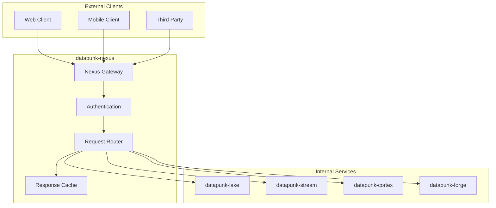
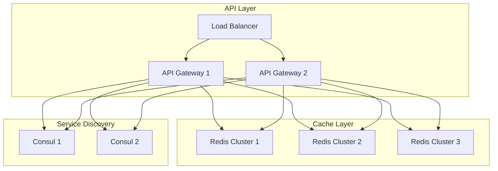

# Datapunk Nexus Module Proposal

## Purpose & Context

Currently, API responsibilities are split between forge and cortex containers. This proposal creates a dedicated nexus container (`datapunk-nexus`) to handle all external and inter-service communications, providing a unified interface for all Datapunk services.

## High-Level Architecture

### System Overview



### High Availability Design



## Core Implementation Strategies

### 1. Service Routing

```python
service_routes = {
    "lake": {
        "prefix": "/storage",
        "service_url": "http://datapunk-lake:8001",
        "timeout": 30,
        "retry_attempts": 3
    },
    "stream": {
        "prefix": "/stream",
        "service_url": "http://datapunk-stream:8002",
        "timeout": 5,
        "retry_attempts": 2
    },
    "cortex": {
        "prefix": "/ai",
        "service_url": "http://datapunk-cortex:8003",
        "timeout": 10,
        "retry_attempts": 2
    },
    "forge": {
        "prefix": "/model",
        "service_url": "http://datapunk-forge:8004",
        "timeout": 20,
        "retry_attempts": 3
    }
}
```

**Implementation Strategy:**

- Use FastAPI's router groups for service segregation
- Implement middleware for request/response transformation
- Add circuit breakers for each service route
- Monitor route health and performance

### 2. Caching Architecture

```yaml
cache_strategy:
  distributed_cache:
    primary:
      type: "redis_cluster"
      nodes: 3
      replication_factor: 2
      configuration:
        maxmemory: "4gb"
        maxmemory-policy: "volatile-lru"
        
    secondary:
      type: "local_memory"
      size: "2gb"
      eviction: "lru"
```

**Implementation Strategy:**

- Deploy Redis in cluster mode for high availability
- Implement write-through caching with local memory cache
- Use cache versioning for conflict resolution
- Set up event-driven cache invalidation

### 3. High Availability Setup

```yaml
api_gateway:
  load_balancer:
    type: "nginx"
    algorithm: "least_connections"
    health_check:
      interval: "5s"
      timeout: "3s"
  
  high_availability:
    mode: "active_active"
    instances:
      min: 2
      max: 5
```

**Implementation Strategy:**

- Deploy multiple gateway instances behind NGINX
- Use Consul for service discovery and health checks
- Implement automatic scaling based on metrics
- Set up failover procedures

### 4. Network Optimization

```yaml
network_optimization:
  connection_pooling:
    enabled: true
    min_size: 10
    max_size: 100
  
  compression:
    enabled: true
    algorithm: "gzip"
    min_size: 1024
```

**Implementation Strategy:**

- Implement connection pooling for all services
- Use gzip compression for large payloads
- Set up keep-alive connections
- Monitor network performance metrics

## Deployment Configuration

### Docker Setup

```dockerfile
FROM python:3.11-slim

WORKDIR /app
COPY requirements.txt .
RUN pip install --no-cache-dir -r requirements.txt

COPY ./app .

CMD ["uvicorn", "main:app", "--host", "0.0.0.0", "--port", "8000"]
```

### Docker Compose Integration

```yaml
services:
  datapunk-nexus:
    build: 
      context: ./nexus
      dockerfile: Dockerfile
    ports:
      - "8000:8000"
    depends_on:
      - datapunk-lake
      - datapunk-stream
      - datapunk-cortex
      - datapunk-forge
```

## Monitoring and Operations

### Metrics Collection

```python
metrics = {
    "request_metrics": [
        "total_requests",
        "request_duration",
        "error_rate"
    ],
    "service_metrics": [
        "service_availability",
        "response_times"
    ],
    "cache_metrics": [
        "cache_hit_rate",
        "cache_size"
    ]
}
```

### Error Handling Strategy

```python
error_handling = {
    "client_errors": {
        "rate_limit": "429 Too Many Requests",
        "validation": "400 Bad Request",
        "auth": "401/403 Unauthorized/Forbidden"
    },
    "service_errors": {
        "timeout": "504 Gateway Timeout",
        "service_down": "502 Bad Gateway",
        "internal": "500 Internal Server Error"
    }
}
```

## Security Implementation

### Authentication Flow

- JWT validation for external requests
- Service-to-service authentication using API keys
- Rate limiting per client/service

### Request/Response Security

- Input validation
- Response sanitization
- TLS termination
- Error message security

## Performance Optimization

### Caching Strategy

- Multi-level caching (Redis + local memory)
- Cache warming for frequently accessed data
- Intelligent cache invalidation

### Load Distribution

- Active-active configuration
- Load balancing across instances
- Automatic scaling based on metrics

## Implementation Phases

### Phase 1: Core Setup

1. Basic API gateway with routing
2. Service discovery implementation
3. Initial security measures

### Phase 2: High Availability

1. Multiple gateway instances
2. Load balancer configuration
3. Health check implementation

### Phase 3: Performance Optimization

1. Caching implementation
2. Network optimization
3. Monitoring setup

### Phase 4: Advanced Features

1. Circuit breakers
2. Advanced security measures
3. Detailed monitoring and alerting

## Maintenance and Operations

### Daily Operations

- Monitor service health
- Review error logs
- Check performance metrics

### Weekly Tasks

- Review security logs
- Update API keys
- Analyze performance patterns

### Monthly Tasks

- Security audits
- Performance optimization
- Capacity planning
