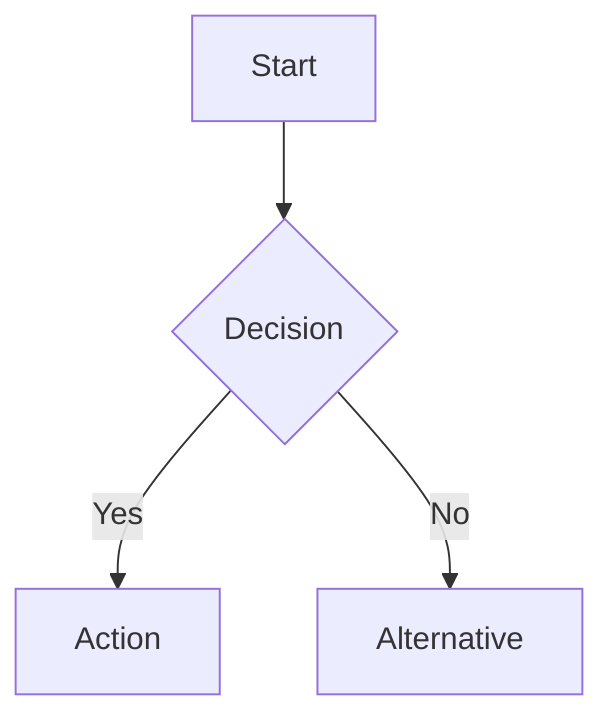
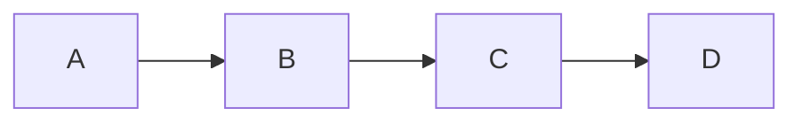
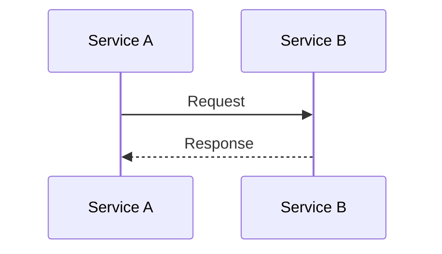
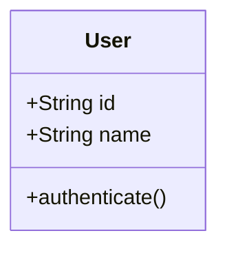
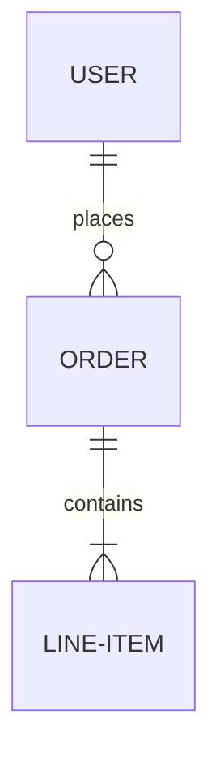
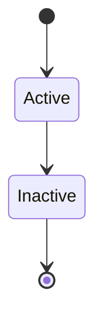
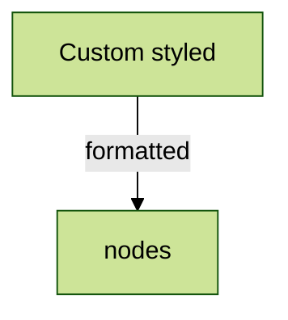
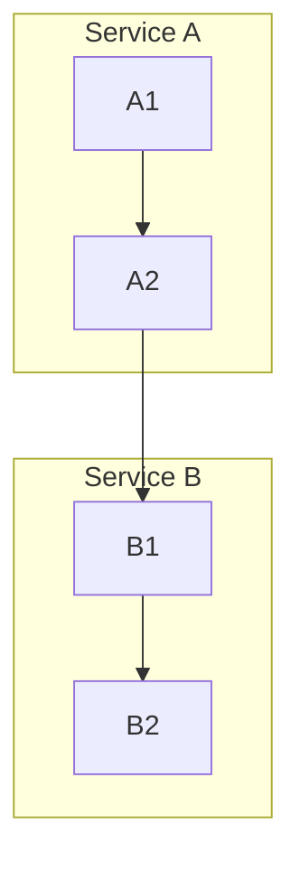
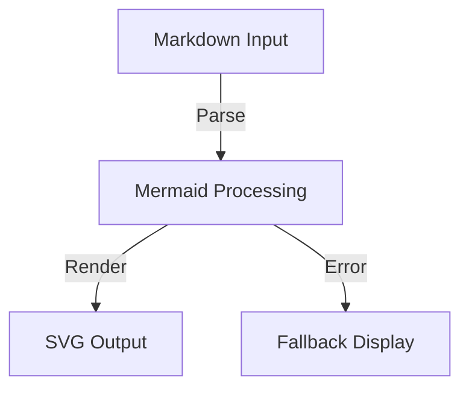

# Mermaid Integration Guide

## Purpose

This document provides comprehensive guidance for implementing and using Mermaid diagrams within our codebase, ensuring consistent diagram creation and maintenance across projects.

## Context

Mermaid is integrated into our documentation and code visualization workflow, enabling dynamic diagram generation directly from markdown-style text.([1](https://github.com/mermaid-js/mermaid/tree/develop/packages/mermaid/src/docs/intro))

## Design/Details

### Basic Syntax Structure

### Supported Diagram Types

1. **Flowcharts**

2. **Sequence Diagrams**

3. **Class Diagrams**

4. **Entity Relationship Diagrams**

5. **State Diagrams**

### Advanced Techniques

#### Custom Styling

#### Subgraphs

## Prerequisites

- Mermaid.js library integration
- Compatible markdown processor
- Proper syntax highlighting support

## Testing Notes

- Verify diagram rendering in all supported platforms
- Test complex diagrams with multiple relationships
- Validate custom styling across themes

## Dependencies

- Mermaid.js version compatibility
- Markdown processor requirements
- Browser/platform support matrix

## Error Handling and Logging

- Syntax validation before rendering
- Fallback display for unsupported features
- Error messaging for malformed diagrams

## Known Issues

- Complex diagrams may have performance impact
- Some advanced features may not work in all environments
- Mobile rendering limitations

## Performance Considerations

- Limit diagram complexity for optimal rendering
- Consider lazy loading for multiple diagrams
- Cache rendered diagrams when possible

## Security Considerations

- Sanitize user input for dynamic diagrams
- Validate diagram source in collaborative environments
- Consider XSS protection for embedded diagrams

## Data Flow

## Cross-Container Communication

- API endpoints for dynamic diagram generation
- WebSocket support for live updates
- Message format specifications

## Compliance and Legal Considerations

- Accessibility requirements for generated diagrams
- License compliance for commercial use
- Data privacy considerations

## Resource Usage

- Memory footprint for complex diagrams
- CPU usage during rendering
- Network bandwidth for dynamic loading

## Deployment Pipeline

- Integration testing requirements
- Build process modifications
- Version control considerations

## Dependencies Matrix

| Component          | Version | Purpose          |
| ------------------ | ------- | ---------------- |
| Mermaid.js         | ^10.x   | Core rendering   |
| Markdown Processor | Latest  | Text processing  |
| Browser Support    | Modern  | Display platform |

## Trade-Offs and Design Decisions

- SVG vs Canvas rendering
- Static vs Dynamic generation
- Styling approach selection

## Future Implementations

- Real-time collaborative editing
- Enhanced mobile support
- Additional diagram types
- Custom theme creation

## References

1. [Mermaid Documentation](https://github.com/mermaid-js/mermaid/tree/develop/packages/mermaid/src/docs)
2. [Mermaid Syntax Guide](https://github.com/mermaid-js/mermaid/tree/develop/packages/mermaid/src/docs/syntax)
3. [Configuration Options](https://github.com/mermaid-js/mermaid/tree/develop/packages/mermaid/src/docs/config)
