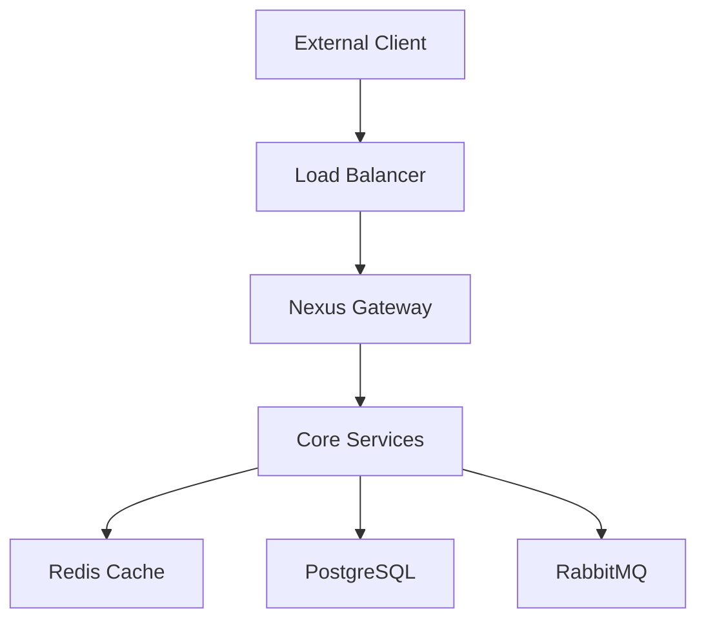

# Datapunk Container Strategy

## Purpose

To define an optimized container architecture that supports the complex microservices structure shown in the system architecture while maintaining performance, scalability, and reliability.

## Context

Based on the system architecture diagram (referencing lines 1-325 in datapunk/docs/graphs/sys-arch.mmd), we need to organize our containers to support multiple layers:
- Frontend Layer
- Gateway Layer
- Core Services Layer
- Infrastructure Layer
- Service Mesh Layer

## Design/Details

### 1. Base Images Strategy

```dockerfile
# Common base image for Python services
FROM python:3.11-slim as python-base
ENV PYTHONUNBUFFERED=1 \
    PYTHONDONTWRITEBYTECODE=1 \
    PIP_NO_CACHE_DIR=1 \
    PIP_DISABLE_PIP_VERSION_CHECK=1 \
    POETRY_VERSION=1.7.1 \
    POETRY_HOME="/opt/poetry" \
    POETRY_VIRTUALENVS_IN_PROJECT=true \
    POETRY_NO_INTERACTION=1 \
    PYSETUP_PATH="/opt/pysetup" \
    VENV_PATH="/opt/pysetup/.venv"

ENV PATH="$POETRY_HOME/bin:$VENV_PATH/bin:$PATH"

# Common base image for Node.js services
FROM node:20-slim as node-base
ENV NODE_ENV=production \
    NPM_CONFIG_LOGLEVEL=warn \
    NPM_CONFIG_CACHE=/tmp/.npm
```

### 2. Multi-Stage Build Pattern

```dockerfile
# Example for Python service (e.g., Cortex)
FROM python-base as builder

WORKDIR $PYSETUP_PATH
COPY poetry.lock pyproject.toml ./
RUN pip install poetry && \
    poetry install --no-dev

FROM python-base as runtime
COPY --from=builder $PYSETUP_PATH/.venv $PYSETUP_PATH/.venv
COPY ./src /app/src

HEALTHCHECK --interval=30s --timeout=10s --start-period=30s --retries=3 \
    CMD curl -f http://localhost:${PORT}/health || exit 1
```

### 3. Docker Compose Configuration

```yaml
version: "3.9"

x-logging: &default-logging
  driver: "json-file"
  options:
    max-size: "100m"
    max-file: "5"

x-healthcheck: &default-healthcheck
  interval: 30s
  timeout: 10s
  retries: 3
  start_period: 30s

services:
  datapunk-nexus:
    build:
      context: ./nexus
      target: runtime
    deploy:
      resources:
        limits:
          cpus: '2'
          memory: 4G
        reservations:
          cpus: '1'
          memory: 2G
    healthcheck:
      <<: *default-healthcheck
    logging: *default-logging

  datapunk-cortex:
    build:
      context: ./cortex
      target: runtime
    deploy:
      resources:
        limits:
          cpus: '4'
          memory: 16G
        reservations:
          cpus: '2'
          memory: 8G
    volumes:
      - model-cache:/models
      - vector-cache:/vectors
```

## Prerequisites

- Docker Engine 24.0+
- Docker Compose V2
- At least 32GB RAM for full stack
- 100GB storage minimum
- NVIDIA Container Toolkit (for GPU support)

## Testing Notes

```bash
# Health check test
curl -f http://localhost:${PORT}/health

# Resource monitoring
docker stats --format "table {{.Name}}\t{{.CPUPerc}}\t{{.MemUsage}}"

# Container logs
docker compose logs -f service_name
```

## Dependencies

- Redis Cluster for caching
- PostgreSQL with extensions
- RabbitMQ for messaging
- Consul for service discovery
- NGINX for load balancing

## Error Handling and Logging

```yaml
logging:
  driver: loki
  options:
    loki-url: "http://localhost:3100/loki/api/v1/push"
    loki-retries: "5"
    loki-batch-size: "400"
```

## Performance Considerations

1. Layer Optimization:
   - Minimal base images
   - Multi-stage builds
   - Shared layers where possible

2. Resource Allocation:
   - CPU pinning for critical services
   - Memory limits based on service profiles
   - Proper swap configuration

## Security Considerations

1. Container Hardening:
   - Non-root users
   - Read-only root filesystem
   - Drop unnecessary capabilities
   - Resource limits enforcement

2. Network Security:
   - Internal network isolation
   - mTLS between services
   - Secrets management via Docker secrets

## Metrics and Monitoring

```yaml
x-monitoring: &default-monitoring
  labels:
    prometheus.io/scrape: "true"
    prometheus.io/port: "${METRICS_PORT:-9090}"
    prometheus.io/path: "/metrics"
```

## Data Flow

