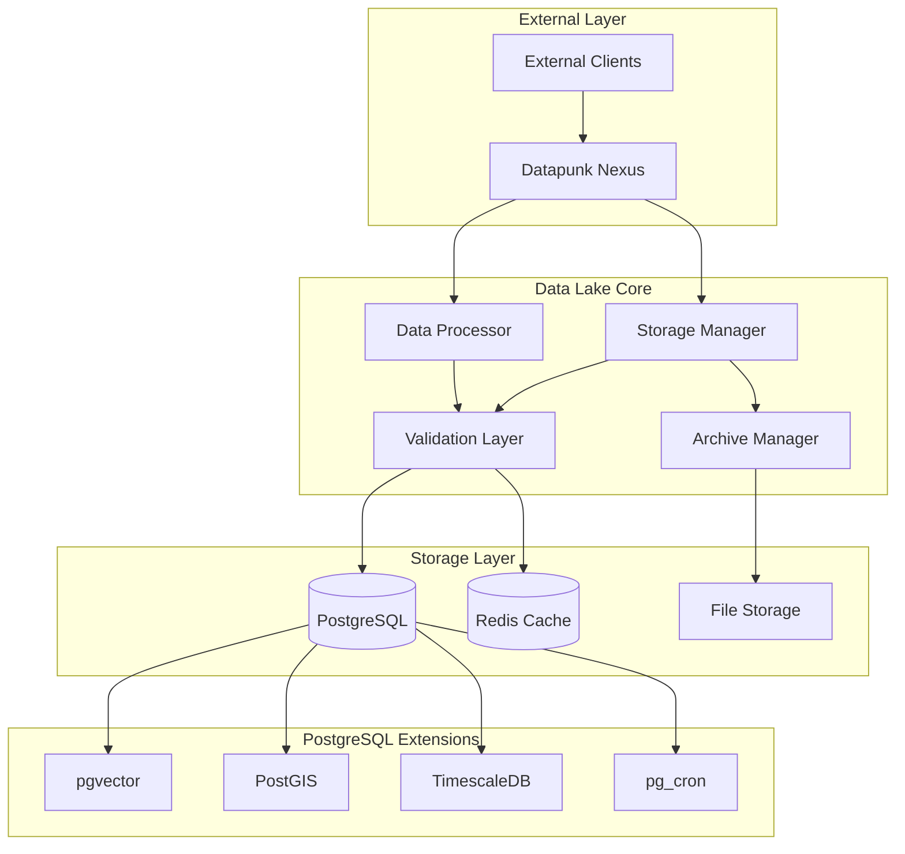
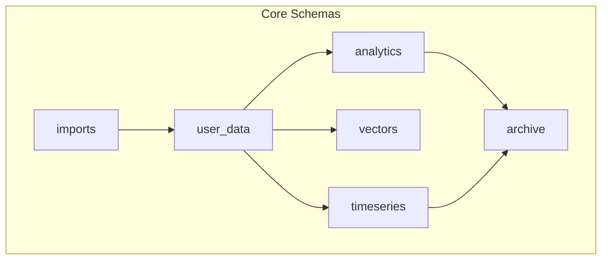

# Data Lake Architecture Overview

## Purpose

The data-lake module serves as the primary data storage and processing layer within the Datapunk ecosystem, handling bulk data imports, maintaining core database infrastructure, and providing data services to other modules through the nexus gateway.

## System Context



## Core Components

### 1. Storage Manager
- Handles bulk data imports (Google Takeout, etc.)
- Manages schema evolution and migrations
- Implements data lifecycle policies
- Coordinates with archive system

### 2. Data Processor
- Validates and sanitizes incoming data
- Handles format standardization
- Manages data transformations
- Implements processing pipelines

### 3. PostgreSQL Extensions
Built from source:
- pgvector (0.5.1+): Vector embeddings storage
- pg_partman (5.0+): Partition management

Package installations:
- PostGIS (3.4+): Spatial data
- TimescaleDB: Time series optimization
- pg_cron: Automated maintenance

### 4. Schema Organization



## Integration Points

### 1. Nexus Integration
- RESTful API endpoints for data operations
- Streaming support for large datasets
- Event notifications for data changes
- Health check endpoints

### 2. Service Communication
- Direct database access for internal services
- Cache synchronization through Redis
- File system access for bulk storage
- Event-driven updates

## Security Implementation

### 1. Data Protection
- Row-level security policies
- Schema-level isolation
- Encrypted storage at rest
- Audit logging

### 2. Access Control
```sql
CREATE POLICY user_isolation_policy ON user_data
    USING (user_id = current_user_id());

CREATE SCHEMA user_{id} AUTHORIZATION user_{id};
```

## Resource Requirements

```yaml
resources:
  limits:
    cpu: '4'
    memory: '8G'
  reservations:
    cpu: '2'
    memory: '4G'
  storage:
    data: '100G'
    archive: '500G'
    temp: '50G'
```

## Performance Considerations

### 1. Caching Strategy
- Redis for hot data access
- Materialized views for analytics
- Query result caching
- Buffer management

### 2. Optimization Techniques
- Partitioned tables for large datasets
- Optimized indexes for common queries
- Automated vacuum and analyze
- Connection pooling
