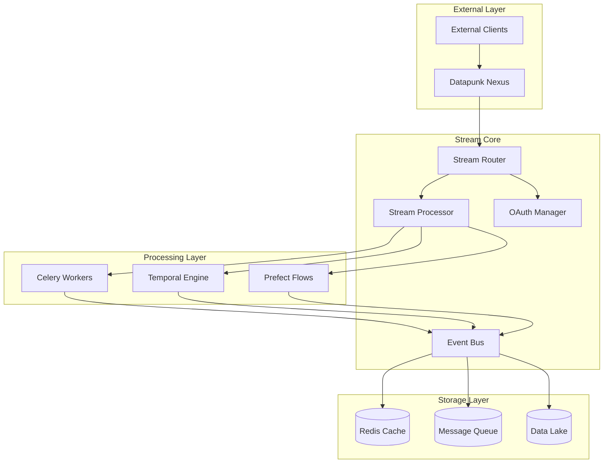

# Data Stream Architecture Overview

## Purpose & Context

The data-stream module serves as the real-time data processing and API integration layer within the Datapunk ecosystem, managing streaming data, webhooks, and API integrations through the nexus gateway.

## System Architecture



## Core Components

### 1. Stream Processing Framework

```yaml
processing_framework:
  celery:
    workers: 
      min_instances: 3
      max_instances: 10
    tasks:
      - async_processing
      - data_transformation
      - batch_operations
  
  temporal:
    workflows:
      - data_pipeline
      - error_handling
      - retry_logic
    activities:
      timeout: "30s"
      retry_policy:
        initial_interval: "1s"
        max_attempts: 3
  
  prefect:
    flows:
      - etl_pipeline
      - data_validation
      - quality_checks
```

### 2. Event Bus Configuration

```yaml
event_bus:
  rabbitmq:
    exchanges:
      - name: "stream.events"
        type: "topic"
      - name: "stream.commands"
        type: "direct"
    queues:
      - name: "processing.tasks"
        durable: true
      - name: "dead.letter"
        ttl: 86400
```

### 3. Cache Implementation

```yaml
cache_strategy:
  redis:
    stream_cache:
      ttl: 3600
      max_size: "2GB"
    rate_limit:
      window: 60
      max_requests: 1000
  local:
    buffer_size: "500MB"
    flush_interval: "5s"
```

## Integration Standards

### 1. Authentication Flow

```yaml
auth_flow:
  oauth2:
    providers:
      - name: "google"
        scopes: ["profile", "email"]
      - name: "github"
        scopes: ["user", "repo"]
  service_auth:
    type: "mTLS"
    cert_rotation: "7d"
    backup: "API_KEY"
```

### 2. Data Lake Integration

```yaml
lake_integration:
  cdc:
    provider: "Debezium"
    topics:
      - "stream_changes"
      - "state_updates"
  bulk_transfer:
    batch_size: 1000
    interval: "5m"
```

## Error Handling & Recovery

### 1. Retry Mechanisms

```yaml
retry_policy:
  default:
    max_attempts: 3
    backoff: "exponential"
    initial_delay: "1s"
  
  dead_letter:
    queue: "dead.letter"
    retry_after: "15m"
    max_retries: 5
```

### 2. Circuit Breakers

```yaml
circuit_breakers:
  default:
    failure_threshold: 5
    reset_timeout: "60s"
  endpoints:
    failure_threshold: 3
    reset_timeout: "30s"
```

## Monitoring & Metrics

### 1. Health Checks

```yaml
health_checks:
  endpoints:
    - path: "/health/live"
      interval: "5s"
    - path: "/health/ready"
      interval: "10s"
  dependencies:
    - service: "rabbitmq"
      timeout: "2s"
    - service: "redis"
      timeout: "1s"
```

### 2. Metrics Collection

```yaml
metrics:
  collection:
    engine: "prometheus"
    interval: "15s"
    retention: "15d"
  custom_metrics:
    - name: "stream_processing_duration"
      type: "histogram"
      labels: ["stream_type", "status"]
    - name: "event_queue_depth"
      type: "gauge"
      labels: ["queue", "priority"]
```

## Resource Requirements

```yaml
resources:
  compute:
    cpu:
      limit: "4"
      request: "2"
    memory:
      limit: "8Gi"
      request: "4Gi"
  storage:
    redis:
      size: "8Gi"
      class: "memory"
    rabbitmq:
      size: "20Gi"
      class: "ssd"
```

## Future Considerations

### 1. Advanced Features

```yaml
future_enhancements:
  streaming:
    - "GraphQL subscriptions"
    - "WebSocket scaling"
    - "Real-time analytics"
  processing:
    - "ML pipeline integration"
    - "Advanced event correlation"
    - "Predictive scaling"
```

References implementation details from:

```markdown
datapunk/docs/App/Stream/datapunk-stream.md
startLine: 389
endLine: 398
```
