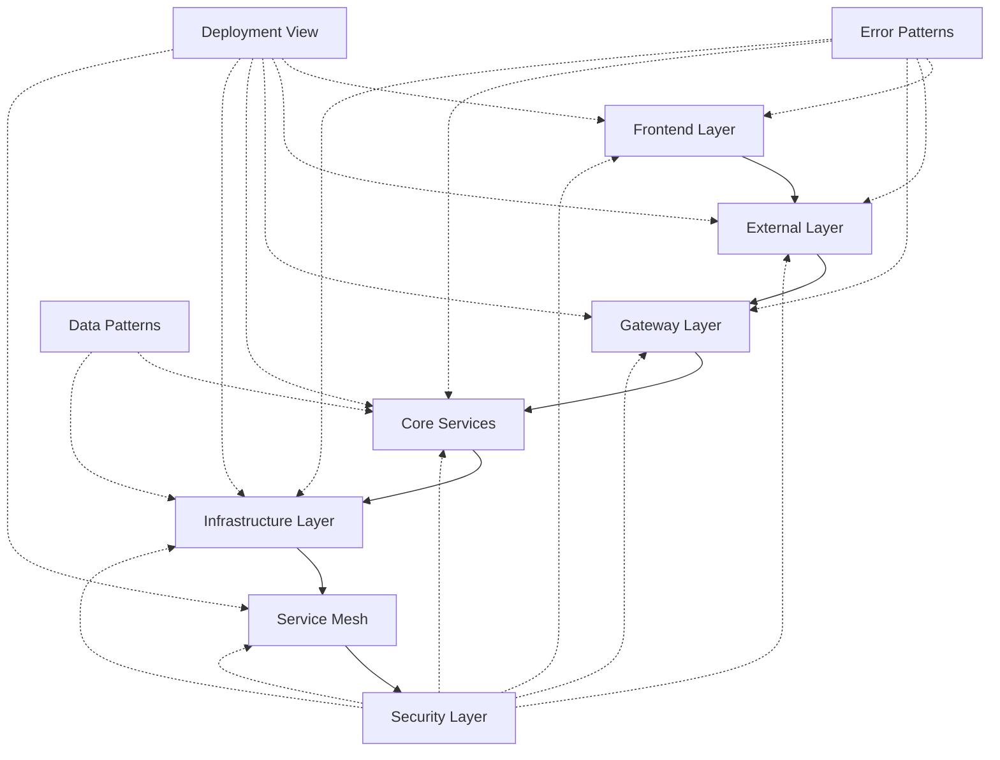

# Detailed Architectural Views

This directory contains detailed architectural diagrams that break down each major layer of the Datapunk system architecture. These diagrams provide in-depth views of specific architectural concerns and patterns.

## Purpose

The detailed views serve several key purposes:

1. Break down complex system architecture into manageable, focused views
2. Provide specific implementation guidance for each architectural domain
3. Document patterns, flows, and relationships within each layer
4. Support architectural decision-making and system evolution

## Directory Structure

```bash
detailed-views/
├── frontend-layer.mmd # Frontend architecture and UI patterns
├── external-layer.mmd # External integrations and client protocols
├── gateway-layer.mmd # API gateway and request handling
├── core-services.mmd # Core business services and processing
├── infrastructure-layer.mmd # Infrastructure and platform services
├── service-mesh.mmd # Service mesh and communication patterns
├── security-layer.mmd # Security patterns and controls
├── error-patterns.mmd # Error handling and resilience
├── data-patterns.mmd # Data management and storage
├── deployment-view.mmd # Deployment and infrastructure
└── README.md # This documentation
```

## Diagram Relationships

### Layer Dependencies



### Cross-Cutting Concerns

- **Security Layer**: Applies across all other layers
- **Error Patterns**: Implemented within each layer
- **Data Patterns**: Primarily affects Core and Infrastructure
- **Deployment View**: Encompasses all runtime components

## Usage Guidelines

### 1. Navigation

- Start with `sys-arch.mmd` in the parent directory for the high-level view
- Drill down into specific layers using these detailed views
- Cross-reference between views using the port interfaces

### 2. Style Conventions

- **Ports**: Marked with double brackets `[[Port]]`
- **External Connections**: Shown with labeled arrows
- **Layer Gradients**: Used to show component hierarchy
- **Color Coding**: Consistent across all diagrams
  - Frontend: Purple (#9933cc)
  - Gateway: Blue (#004d99)
  - Core: Green (#006600)
  - Infrastructure: Magenta (#cc00cc)
  - Security: Red (#cc6666)

### 3. Implementation Mapping

Each diagram provides:

- Component relationships
- Flow patterns
- Integration points
- Configuration requirements
- Monitoring touchpoints

## Maintenance and Updates

### Adding New Components

1. Identify the appropriate layer diagram
2. Follow existing style conventions
3. Update external ports if needed
4. Document new relationships
5. Update this README if adding new patterns

### Modifying Existing Views

1. Maintain consistent styling
2. Preserve existing ports
3. Update related diagrams if changing interfaces
4. Document changes in commit messages

## Common Use Cases

### Architecture Planning

- Use these views to plan new features
- Identify integration points
- Understand dependencies
- Plan security controls

### Implementation Guidance

- Reference pattern implementations
- Understand error handling requirements
- Follow data flow patterns
- Apply security controls

### Operations Support

- Troubleshoot issues
- Plan monitoring
- Implement alerting
- Manage deployments

## Best Practices

1. **Consistency**
   - Follow established naming conventions
   - Maintain consistent styling
   - Use standard patterns

2. **Documentation**
   - Update diagrams when architecture changes
   - Keep relationships current
   - Document new patterns

3. **Review Process**
   - Peer review architectural changes
   - Validate pattern implementations
   - Ensure security compliance

## Related Documentation

- [System Architecture Overview](../sys-arch.mmd)
- [Project Status](../../project_status.md)
- [Implementation Guidelines](../../implementation/README.md)
- [Security Guidelines](../../security/README.md)

## Contributing

1. Fork the repository
2. Create a feature branch
3. Update relevant diagrams
4. Follow style guidelines
5. Submit pull request

## License

This architectural documentation is part of the Datapunk project and is subject to its licensing terms.
