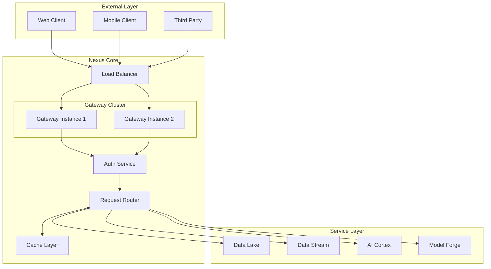

# Datapunk Nexus Module Overview

## Purpose

The nexus module serves as the central communication hub within the Datapunk ecosystem, providing a unified interface for all inter-service communications and external client interactions. It consolidates API responsibilities previously split between forge and cortex containers.

## System Context



## Core Components

### 1. Gateway Manager

References implementation from:

```markdown:datapunk/docs/MVP/APimod.md
startLine: 75
endLine: 111
```

### 2. Authentication System

- JWT validation for external requests
- Service-to-service API key authentication
- OAuth2 integration for third-party services
- Rate limiting per client/service

### 3. Request Router

```python
router_config = {
    "routing_rules": {
        "data_operations": "lake",
        "stream_processing": "stream",
        "ai_inference": "cortex",
        "model_management": "forge"
    },
    "timeout_policies": {
        "default": 30,
        "streaming": 5,
        "ai_ops": 10,
        "training": 20
    }
}
```

## High Availability Architecture

References implementation from:

```markdown:datapunk/docs/MVP/APimod.md
startLine: 47
endLine: 71
```

## Integration Points

### 1. Service Communication

```yaml
protocols:
  internal:
    primary: "gRPC"
    fallback: "REST"
    timeout: 30
    retry_attempts: 3
    circuit_breaker:
      enabled: true
      threshold: 5
      reset_time: 60
  
  service_mesh:
    enabled: true
    provider: "istio"
    mtls: true
    timeout: 30
    
  event_bus:
    provider: "rabbitmq"
    exchanges:
      - name: "service.events"
        type: "topic"
      - name: "service.commands"
        type: "direct"
```

### 2. Cache Coherency

```yaml
cache_strategy:
  write_through:
    enabled: true
    sync_interval: "1s"
  
  invalidation:
    method: "pub_sub"
    channels:
      - "cache.invalidate"
      - "cache.update"
    
  consistency:
    level: "eventual"
    max_lag: "5s"
    conflict_resolution: "last_write_wins"
```

## Performance Considerations

### 1. Load Distribution

- Active-active configuration
- NGINX load balancing
- Automatic scaling based on metrics
- Connection pooling

### 2. Caching Architecture

- Multi-level caching (Redis + local)
- Write-through strategy
- Cache warming for hot paths
- Distributed cache invalidation

## Security Implementation

### 1. Authentication Flow

- External request validation
- Service-to-service authentication
- Rate limiting implementation
- Token management

### 2. Data Protection

- TLS termination
- Request/Response sanitization
- PII detection
- Audit logging

## Monitoring and Operations

### 1. Health Checks

```python
health_checks = {
    "components": [
        "gateway_status",
        "auth_service",
        "router_health",
        "cache_status"
    ],
    "dependencies": [
        "redis_cluster",
        "service_discovery",
        "load_balancer"
    ],
    "metrics": [
        "request_latency",
        "error_rates",
        "cache_hits",
        "service_availability"
    ]
}
```

### 2. Operational Tasks

References implementation from:

```markdown:datapunk/docs/MVP/APimod.md
startLine: 315
endLine: 331
```

## Implementation Phases

### Phase 1: Core Setup

1. Basic gateway implementation
2. Service discovery integration
3. Authentication system

### Phase 2: High Availability

1. Load balancer configuration
2. Multiple gateway instances
3. Cache cluster setup

### Phase 3: Advanced Features

1. Circuit breakers
2. Advanced monitoring
3. Performance optimization

## Future Considerations

### 1. Scalability

- Service mesh integration
- Dynamic routing rules
- Automated scaling policies
- Geographic distribution

### 2. Feature Expansion

- GraphQL federation
- WebSocket scaling
- Real-time analytics
- AI-powered routing

## Integration Standards

### 1. Service Communication

```yaml
protocols:
  internal:
    primary: "gRPC"
    fallback: "REST"
    timeout: 30
    retry_attempts: 3
    circuit_breaker:
      enabled: true
      threshold: 5
      reset_time: 60
  
  service_mesh:
    enabled: true
    provider: "istio"
    mtls: true
    timeout: 30
    
  event_bus:
    provider: "rabbitmq"
    exchanges:
      - name: "service.events"
        type: "topic"
      - name: "service.commands"
        type: "direct"
```

### 2. Cache Coherency

```yaml
cache_strategy:
  write_through:
    enabled: true
    sync_interval: "1s"
  
  invalidation:
    method: "pub_sub"
    channels:
      - "cache.invalidate"
      - "cache.update"
    
  consistency:
    level: "eventual"
    max_lag: "5s"
    conflict_resolution: "last_write_wins"
```

## Standardized Security

### 1. Authentication Flow

```yaml
auth_flow:
  external_requests:
    primary: "JWT"
    session:
      store: "redis"
      ttl: 86400
    oauth2:
      enabled: true
      providers: ["google", "github"]
  
  service_auth:
    type: "mTLS"
    cert_rotation: "7d"
    backup: "API_KEY"
```

### 2. Unified Monitoring

```yaml
monitoring:
  metrics:
    collector: "prometheus"
    exporters:
      - "node_exporter"
      - "redis_exporter"
    custom_metrics:
      - "request_duration_seconds"
      - "cache_hit_ratio"
      - "error_rate_total"
  
  logging:
    format: "json"
    correlation_id: true
    required_fields:
      - "timestamp"
      - "service"
      - "trace_id"
      - "level"
```

### 3. Health Check Standards

```yaml
health_standards:
  endpoints:
    live: "/health/live"
    ready: "/health/ready"
    startup: "/health/startup"
  
  checks:
    interval: "5s"
    timeout: "3s"
    threshold: 3
    
  dependencies:
    required:
      - "redis"
      - "rabbitmq"
      - "consul"
    optional:
      - "metrics"
      - "tracing"
```
