# Datapunk MVP Timeline

```python
WEEK_1 = {
    "Day 1-2": {
        "core_setup": {
            "database": """
                # PostgreSQL with pgvector ready to go
                CREATE EXTENSION IF NOT EXISTS vector;
                
                # Core tables with vector columns ready for later
                CREATE TABLE documents (
                    id SERIAL PRIMARY KEY,
                    content TEXT,
                    embedding vector(768),  # Ready for BERT embeddings
                    metadata JSONB,
                    created_at TIMESTAMP DEFAULT CURRENT_TIMESTAMP
                );
                """,
            "fastapi": {
                "main.py": "Basic CRUD endpoints",
                "auth.py": "Simple JWT authentication",
                "schemas.py": "Pydantic models with vector field support"
            }
        }
    },
    "Day 3-5": {
        "data_ingestion": {
            "google_takeout": {
                "parser.py": "Basic JSON/HTML parsing",
                "processor.py": "Async bulk upload support",
                "endpoints.py": "Upload and processing endpoints"
            }
        }
    }
}

WEEK_2 = {
    "Day 1-3": {
        "search_foundation": {
            "basic_search.py": """
                # Ready for both keyword and vector search
                async def search(
                    query: str,
                    search_type: Literal["keyword", "semantic"] = "keyword",
                    limit: int = 10
                ):
                    if search_type == "semantic":
                        # Placeholder for future AI embedding
                        pass
                    return await keyword_search(query, limit)
            """,
            "indexing.py": "Basic indexing utilities"
        }
    },
    "Day 4-5": {
        "visualization": {
            "timeline.py": "Basic timeline view of data",
            "stats.py": "Simple analytics endpoints"
        }
    }
}

WEEK_3 = {
    "Day 1-3": {
        "ui_basics": {
            "dashboard": "Simple data overview",
            "search": "Search interface with type toggle",
            "upload": "Drag-and-drop upload interface"
        }
    },
    "Day 4": {
        "testing": {
            "integration_tests": "Core functionality tests",
            "load_tests": "Basic performance validation"
        }
    },
    "Day 5": {
        "documentation": {
            "api_docs": "OpenAPI documentation",
            "setup_guide": "Installation instructions",
            "future_ai": "AI integration points documented"
        }
    }
}
```

```mermaid
graph TD
    %% Main Layout Direction: Top to Bottom
    %% Layer 1: Frontend Layer
    subgraph "Frontend Layer"
        direction LR
        subgraph "Web Applications"
            WebApp[Web Application]
            AdminUI[Admin Dashboard]
            AnalyticsUI[Analytics Dashboard]
        end
        
        subgraph "Mobile Applications"
            MobileApp[Mobile Application]
            TabletApp[Tablet Application]
        end

        subgraph "Frontend Services"
            StateManager[State Management]
            UICache[UI Cache]
            ErrorBoundary[Error Handling]
        end
    end

    %% Layer 2: External Layer
    subgraph "External Layer"
        direction LR
        subgraph "Client Layer"
            WebClient[Web Client]
            MobileClient[Mobile Client]
            ThirdParty[Third Party Apps]
        end

        subgraph "Client Protocols"
            REST[REST API]
            GraphQL[GraphQL API]
            WS[WebSocket]
        end

        subgraph "Third Party Services"
            direction LR
            subgraph "Google Services"
                YouTube & Maps & Fit & Photos & Play --> GOAuth
                GOAuth --> GToken
            end
            
            subgraph "Microsoft Services"
                MSGraph & OneDrive & Teams --> MSOAuth
                MSOAuth --> MSToken
            end
            
            subgraph "Entertainment Services"
                Spotify & Discord & Twitch --> EntOAuth
                EntOAuth --> EntToken
            end
        end
    end

    %% Layer 3: Gateway Layer
    subgraph "Gateway Layer"
        direction LR
        subgraph "Load Balancing"
            LB[NGINX Load Balancer]
            SSL[SSL Termination]
            WAF[Web Application Firewall]
            RateLimit[Rate Limiting]
        end

        subgraph "Authentication"
            subgraph "External Auth"
                OAuth --> JWT --> TokenMgmt
                GOAuth & MSOAuth & EntOAuth --> OAuth
                GToken & MSToken & EntToken --> TokenMgmt
            end
            
            subgraph "Internal Auth"
                MTLS & APIKey --> ServiceAuth
                ServiceAuth --> ServiceReg
            end
        end

        subgraph "Nexus Service"
            Router[Request Router]
            APIGateway[API Gateway]
            StateManager[State Manager]
            Validator[Request Validator]
            
            subgraph "Router Rules"
                DataOps[Data Operations]
                StreamOps[Stream Operations]
                AIops[AI Operations]
            end
        end
    end

    %% Layer 4: Core Services
    subgraph "Core Services"
        direction LR
        subgraph "Lake Service"
            LakeRouter[Lake Router]
            
            subgraph "Data Processing"
                DataValidator[Data Validator]
                SchemaManager[Schema Manager]
                ETLPipeline[ETL Pipeline]
            end
            
            subgraph "Storage"
                VectorStore[Vector Storage]
                TimeSeriesStore[TimeSeries Storage]
                BlobStore[Blob Storage]
                ArchiveStore[Archive Storage]
            end
        end

        subgraph "Stream Service"
            StreamRouter[Stream Router]
            
            subgraph "Event Processing"
                EventProcessor[Event Processor]
                PubSubManager[PubSub Manager]
                StreamCache[Stream Cache]
            end
        end

        subgraph "Cortex Service"
            CortexRouter[Cortex Router]
            
            subgraph "Inference Pipeline"
                LangGraph[LangGraph Controller]
                HaystackOrch[Haystack Orchestrator]
                
                subgraph "Models"
                    MixtralSvc[Mixtral Service]
                    LlamaSvc[Llama Service]
                    OpenAISvc[OpenAI Service]
                    AnthropicSvc[Anthropic Service]
                end
            end
            
            subgraph "Vector Processing"
                VectorProcessor[Vector Processor]
                QueryEngine[Query Engine]
            end
        end

        subgraph "Forge Service"
            ForgeRouter[Forge Router]
            
            subgraph "Training Pipeline"
                MLFlow[MLFlow Controller]
                HFIntegration[HuggingFace Integration]
                ModelRegistry[Model Registry]
                
                subgraph "Training"
                    TFTrainer[TensorFlow Trainer]
                    PyTorchTrainer[PyTorch Trainer]
                end
            end
        end
    end

    %% Layer 5: Infrastructure
    subgraph "Infrastructure"
        direction LR
        subgraph "Cache Layer"
            Redis[(Redis Cluster)]
            CacheManager[Cache Manager]
            
            subgraph "Cache Patterns"
                WriteThrough[Write Through]
                ReadThrough[Read Through]
                CacheInval[Cache Invalidation]
            end
        end

        subgraph "Storage Layer"
            PG[(PostgreSQL)]
            subgraph "PG Extensions"
                pgvector[Vector Store]
                TimescaleDB[Time Series]
                PostGIS[Spatial Data]
            end
        end

        subgraph "Message Layer"
            MQ[(RabbitMQ)]
            subgraph "Queue Patterns"
                PubSub[Pub/Sub]
                WorkQueue[Work Queue]
                DLQ[Dead Letter Queue]
            end
        end

        subgraph "Observability"
            direction LR
            subgraph "Metrics"
                Prometheus[Prometheus]
                StatsD[StatsD]
                CustomMetrics[Custom Metrics]
            end
            
            subgraph "Logging"
                Loki[Loki]
                ElasticSearch[Elastic Search]
                LogProcessor[Log Processor]
            end
            
            subgraph "Tracing"
                Jaeger[Jaeger]
                OpenTelemetry[OpenTelemetry]
                TraceCollector[Trace Collector]
            end

            subgraph "Alerting"
                AlertManager[Alert Manager]
                PagerDuty[PagerDuty]
                Slack[Slack Alerts]
            end

            subgraph "Dashboards"
                Grafana[Grafana]
                Kibana[Kibana]
                CustomDashboards[Custom Dashboards]
            end
        end
    end

    %% Service Mesh Layer
    subgraph "Service Mesh"
        direction LR
        subgraph "Communication"
            gRPC[gRPC Services]
            RESTServices[REST Services]
            MessageQueue[Message Queue]
        end
        
        subgraph "Discovery"
            Consul[Consul]
            ServiceRegistry[Service Registry]
            HealthCheck[Health Check]
        end
    end

    %% Critical Connections with different styles and colors
    WebApp -->|"1. HTTP/WS"| APIGateway
    AdminUI ==>|"2. HTTP/WS"| APIGateway
    AnalyticsUI --->|"3. HTTP/WS"| APIGateway
    MobileApp -->|"4. HTTP/WS"| APIGateway
    TabletApp ==>|"5. HTTP/WS"| APIGateway

    %% Monitoring Integration with different line styles
    APIGateway -.->|"Metrics"| Prometheus
    LakeRouter -->|"Metrics"| Prometheus
    StreamRouter ==>|"Metrics"| Prometheus
    CortexRouter -.->|"Logs"| Loki
    ForgeRouter -->|"Traces"| Jaeger

    %% Monitoring Flow with thick lines and colors
    Prometheus ==>|"Dashboard Data"| Grafana
    Loki ==>|"Log Analysis"| Grafana
    Jaeger ==>|"Trace Visualization"| Grafana
    AlertManager -.->|"Alerts"| PagerDuty
    AlertManager -.->|"Notifications"| Slack

    %% Cache Management Flow with numbered steps
    CacheManager -->|"1. Write"| WriteThrough
    WriteThrough -->|"2. Read"| ReadThrough
    ReadThrough -->|"3. Invalidate"| CacheInval

    ModelCache -->|"Cache Ops"| CacheManager
    VectorCache -->|"Cache Ops"| CacheManager
    ResultCache -->|"Cache Ops"| CacheManager

    %% Add linkStyle definitions at the bottom
    linkStyle default stroke:#333,stroke-width:1;
    linkStyle 0 stroke:#ff3333,stroke-width:2;
    linkStyle 1 stroke:#33ff33,stroke-width:2;
    linkStyle 2 stroke:#3333ff,stroke-width:2;
    linkStyle 3 stroke:#ff33ff,stroke-width:2;
    linkStyle 4 stroke:#33ffff,stroke-width:2;

    %% Style Definitions
    classDef external fill:#ffebeb,stroke:#990000,stroke-width:2px
    classDef gateway fill:#ebf5ff,stroke:#004d99,stroke-width:2px
    classDef service fill:#ebffeb,stroke:#006600,stroke-width:2px
    classDef auth fill:#f5ebff,stroke:#4d0099,stroke-width:2px
    classDef storage fill:#ebfffd,stroke:#006666,stroke-width:2px
    classDef cache fill:#fff2eb,stroke:#994d00,stroke-width:2px
    classDef queue fill:#ebfff2,stroke:#004d1a,stroke-width:2px
    classDef monitor fill:#ebf7ff,stroke:#004d99,stroke-width:2px
    classDef frontend fill:#f9f0ff,stroke:#9933cc,stroke-width:2px
    classDef alerts fill:#fff0f0,stroke:#cc3333,stroke-width:2px
    classDef visualization fill:#fff9f0,stroke:#cc9933,stroke-width:2px
    classDef mesh fill:#f0f0ff,stroke:#6666cc,stroke-width:2px
    classDef health fill:#f0fff0,stroke:#66cc66,stroke-width:2px
    classDef security fill:#fff0f0,stroke:#cc6666,stroke-width:2px

    %% Layer Gradients
    classDef externalL1 fill:#fff5f5,stroke:#cc0000,stroke-width:3px
    classDef externalL2 fill:#ffe6e6,stroke:#990000,stroke-width:2.5px
    classDef externalL3 fill:#ffcccc,stroke:#660000,stroke-width:2px
    classDef gatewayL1 fill:#f5f5ff,stroke:#0000cc,stroke-width:3px
    classDef gatewayL2 fill:#e6e6ff,stroke:#0000b3,stroke-width:2.5px
    classDef gatewayL3 fill:#ccccff,stroke:#000099,stroke-width:2px
    classDef coreL1 fill:#f5fff5,stroke:#00cc00,stroke-width:3px
    classDef coreL2 fill:#e6ffe6,stroke:#00b300,stroke-width:2.5px
    classDef coreL3 fill:#ccffcc,stroke:#009900,stroke-width:2px
    classDef infraL1 fill:#fff5ff,stroke:#cc00cc,stroke-width:3px
    classDef infraL2 fill:#ffe6ff,stroke:#b300b3,stroke-width:2.5px
    classDef infraL3 fill:#ffccff,stroke:#990099,stroke-width:2px

    %% Apply styles to nodes
    class WebClient,MobileClient,ThirdParty external
    class LB,Router,APIGateway gateway
    class LakeRouter,StreamRouter,CortexRouter,ForgeRouter service
    class OAuth,JWT,MTLS,ServiceAuth auth
    class PG,Redis,MQ storage
    class ModelCache,VectorCache,ResultCache cache
    class PubSub,WorkQueue,DLQ queue
    class Prometheus,Grafana monitor
    class WebApp,AdminUI,AnalyticsUI,MobileApp,TabletApp,StateManager,UICache,ErrorBoundary frontend
    class AlertManager,PagerDuty,Slack alerts
    class Grafana,Kibana,CustomDashboards visualization
    class gRPC,RESTServices,MessageQueue,Consul,ServiceRegistry,HealthCheck mesh

    %% Apply layer gradients
    class ExternalLayer externalL1
    class ClientLayer,ThirdPartyServices externalL2
    class ClientProtocols,GoogleServices,MicrosoftServices,EntertainmentServices externalL3
    class GatewayLayer gatewayL1
    class LoadBalancing,NexusService,Authentication gatewayL2
    class RouterRules,ExternalAuth,InternalAuth gatewayL3
    class CoreServices coreL1
    class LakeService,StreamService,CortexService,ForgeService coreL2
    class DataProcessing,Storage,EventProcessing,InferencePipeline,VectorProcessing,TrainingPipeline,Models,Training coreL3
    class Infrastructure infraL1
    class CacheLayer,StorageLayer,MessageLayer,Observability infraL2
    class CachePatterns,PGExtensions,QueuePatterns,Metrics infraL3
```

