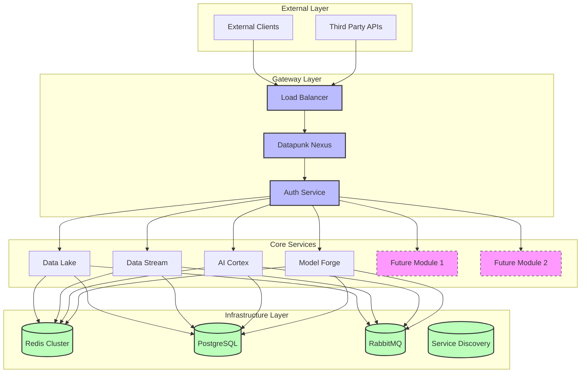
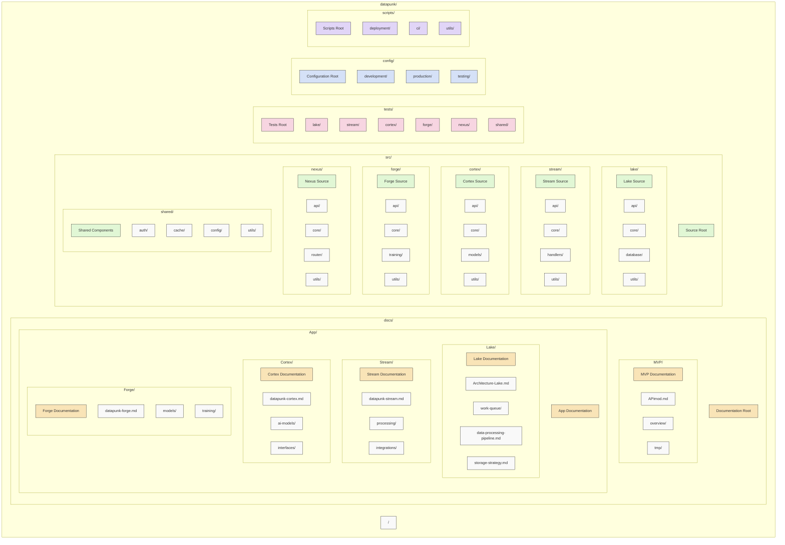

# Datapunk MVP Standardization Guide

## System Architecture Overview



## Directory Structure Overview



### Key Directory Purposes

1. **docs/**: Documentation and architectural designs
   - `MVP/`: MVP-related documentation
   - `App/`: Module-specific documentation
   - Each module has its own documentation subdirectory

2. **src/**: Source code for all modules
   - Each module follows a similar structure:
     - `api/`: API definitions and handlers
     - `core/`: Core business logic
     - `utils/`: Utility functions
     - Module-specific directories (e.g., `database/`, `handlers/`, `models/`)
   - `shared/`: Common components used across modules

3. **tests/**: Test suites
   - Mirrors the src/ structure
   - Contains unit, integration, and e2e tests

4. **config/**: Configuration files
   - Environment-specific configurations
   - Shared configuration templates

5. **scripts/**: Utility scripts
   - Deployment scripts
   - CI/CD helpers
   - Development utilities

### Standard Module Structure

Each module follows this basic structure:

```
module/
├── api/
│   ├── routes/
│   ├── handlers/
│   └── middleware/
├── core/
│   ├── services/
│   ├── models/
│   └── utils/
├── tests/
│   ├── unit/
│   ├── integration/
│   └── e2e/
└── utils/
    ├── helpers/
    └── constants/
```

## 1. Core Infrastructure Standards

### Service Communication

```yaml
communication_standards:
  internal:
    primary_protocol: "gRPC"
    fallback_protocol: "REST"
    service_mesh: "istio"
    mtls: true
    timeout: 30
    retry_policy:
      max_attempts: 3
      backoff: "exponential"
      initial_delay: "1s"
  
  external:
    protocols: ["REST", "GraphQL"]
    api_versioning: "URI-based"
    documentation: "OpenAPI 3.0"
```

### Caching Architecture

```yaml
redis_cluster:
  deployment:
    mode: "cluster"
    nodes: 3
    replication_factor: 2
  
  configuration:
    maxmemory: "8GB"
    maxmemory_policy: "volatile-lru"
    
  usage_patterns:
    hot_data:
      ttl: 3600
      max_size: "2GB"
    rate_limiting:
      window: 60
      max_requests: 1000
    session:
      ttl: 86400
    
  synchronization:
    method: "pub/sub"
    channels:
      - "cache_invalidate"
      - "cache_update"
```

### Authentication Flow

```yaml
auth_flow:
  external:
    primary: "JWT"
    session_management: "Redis"
    oauth2:
      providers:
        - "Google"
        - "GitHub"
      flow: "authorization_code"
  
  internal:
    type: "mTLS"
    backup: "API Keys"
    rotation: "7d"
```

### Event Communication

```yaml
event_standards:
  broker: "RabbitMQ"
  formats:
    schema: "Apache Avro"
    encoding: "JSON"
  patterns:
    command: "Direct Exchange"
    event: "Topic Exchange"
    query: "RPC"
```

## 2. Standardized Monitoring

### Metrics Collection

```yaml
metrics_standard:
  collection:
    engine: "Prometheus"
    interval: "15s"
    retention: "15d"
    exporters:
      - "node_exporter"
      - "redis_exporter"
      - "postgresql_exporter"
  
  required_metrics:
    - name: "request_duration_seconds"
      type: "histogram"
      labels: ["service", "endpoint", "status"]
    - name: "error_rate_total"
      type: "counter"
      labels: ["service", "error_type"]
    - name: "resource_usage"
      type: "gauge"
      labels: ["service", "resource_type"]
```

### Logging Standards

```yaml
logging_standard:
  format: "JSON"
  required_fields:
    - "timestamp"
    - "service"
    - "trace_id"
    - "span_id"
    - "level"
    - "message"
  levels:
    - "ERROR"
    - "WARN"
    - "INFO"
    - "DEBUG"
  retention:
    hot: "7d"
    warm: "30d"
    cold: "365d"
```

## 3. Security Standards

### Data Protection

```yaml
security_standards:
  encryption:
    in_transit: "TLS 1.3"
    at_rest: "AES-256"
    key_rotation: "30d"
  
  authentication:
    external: "JWT + OAuth2"
    internal: "mTLS"
    session:
      store: "Redis"
      ttl: 86400
  
  authorization:
    rbac: true
    policy_engine: "OPA"
    audit_logging: true
```

## 4. Module-Specific Updates

### Nexus Updates

```python
nexus_updates = {
    "service_discovery": {
        "implementation": "Consul",
        "registration": "Automatic",
        "health_checks": "5s interval"
    },
    "routing": {
        "strategy": "weighted round-robin",
        "circuit_breaker": "hystrix-based",
        "timeout": "configurable per-route"
    }
}
```

### Data Lake Updates

```python
lake_updates = {
    "auth_integration": {
        "add_oauth": True,
        "row_level_security": "policy-based",
        "service_auth": "mTLS"
    },
    "event_handling": {
        "cdc": "Debezium",
        "streaming": "Change Streams",
        "batching": "Bulk Operations"
    }
}
```

### Data Stream Updates

```python
stream_updates = {
    "cache_alignment": {
        "use_central_redis": True,
        "local_buffer": "Limited scope",
        "invalidation": "Event-driven"
    },
    "processing": {
        "standardize_flow": "Temporal",
        "error_handling": "Dead Letter Queue",
        "retry_policy": "Exponential backoff"
    }
}
```

## 5. Implementation Order

1. Infrastructure Updates
   - Deploy standardized Redis Cluster
   - Configure RabbitMQ
   - Set up Consul

2. Core Services
   - Update Nexus first
   - Modify Data Lake
   - Adjust Data Stream

3. Integration Layer
   - Standardize APIs
   - Update event formats
   - Implement monitoring

## 6. Monitoring Standards

### Metrics Collection

```yaml
metrics:
  collection:
    engine: "Prometheus"
    interval: "15s"
    retention: "15d"
  
  standardized_metrics:
    - "request_duration_seconds"
    - "error_rate_total"
    - "cache_hit_ratio"
    - "queue_depth"
    
  logging:
    format: "JSON"
    levels: ["ERROR", "WARN", "INFO", "DEBUG"]
    correlation_id: true
```

### Health Checks

```yaml
health_checks:
  standard_endpoints:
    - "/health/live"
    - "/health/ready"
    - "/health/startup"
  
  checks:
    interval: "5s"
    timeout: "3s"
    threshold: 3
```

## 7. Resource Management

### Compute Resources

```yaml
resource_limits:
  lake:
    cpu: "4"
    memory: "8G"
  stream:
    cpu: "2"
    memory: "4G"
  cortex:
    cpu: "4"
    memory: "8G"
  forge:
    cpu: "4"
    memory: "16G"
```

References resource allocations from:

```markdown
datapunk/docs/App/architecture.md
startLine: 141
endLine: 154
```
