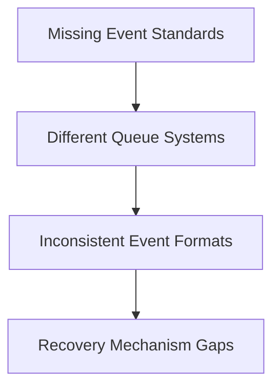

# Module Overview Analysis

## Cross-Module Consistency Issues

### 1. Caching Strategy Discrepancies

```yaml
inconsistencies:
  redis_usage:
    data_lake: "Hot data access, materialized views"
    data_stream: "Stream cache, rate limiting"
    nexus: "Multi-level caching, write-through"
  recommendation: "Standardize Redis cluster configuration and usage patterns"
```

### 2. Authentication Flow Gaps

- Data Lake lacks explicit OAuth2 support shown in Stream/Nexus
- Stream and Nexus have different OAuth implementations
- Service-to-service auth needs standardization

### 3. Monitoring Inconsistencies

- Each module defines different health check patterns
- Metric collection varies across modules
- No standardized logging format defined

## Critical Risks

### 1. Data Consistency

```python
risks = {
    "cache_sync": "Multiple Redis instances across modules",
    "state_management": "Distributed state across Stream and Lake",
    "transaction_boundaries": "Cross-module transaction handling unclear"
}
```

### 2. Performance Bottlenecks

- Multiple network hops through Nexus
- Potential cache coherency issues
- Resource contention between modules

### 3. Security Concerns

- Token propagation between services unclear
- PII handling varies across modules
- Audit logging not standardized

## Integration Gaps

### 1. Event Communication



### 2. Service Discovery

- Consul mentioned in Nexus but not in other modules
- Health check implementation varies
- Service registration process unclear

## Required Standardization

### 1. Protocol Standards

```yaml
standardize:
  internal_communication:
    primary: "gRPC"
    events: "RabbitMQ"
    caching: "Redis Cluster"
  external_apis:
    rest: "OpenAPI 3.0"
    graphql: "Federation 2.0"
    websocket: "Socket.IO"
```

### 2. Security Standards

- Unified authentication flow
- Consistent authorization model
- Standardized encryption approach

### 3. Operational Standards

- Common health check format
- Unified metric collection
- Standardized logging format

## Implementation Recommendations

### 1. Immediate Actions

1. Create shared protocol documentation
2. Standardize authentication flow
3. Unify monitoring approach

### 2. Architecture Updates

```python
updates_needed = {
    "data_lake": [
        "Add OAuth2 support",
        "Standardize health checks",
        "Clarify event handling"
    ],
    "data_stream": [
        "Align cache strategy",
        "Update auth flow",
        "Standardize metrics"
    ],
    "nexus": [
        "Detail service discovery",
        "Clarify cache coherency",
        "Document retry policies"
    ]
}
```

### 3. Documentation Needs

- Service interaction patterns
- Error handling standards
- Recovery procedures
- Configuration management

## Future Considerations

### 1. Scalability

- Service mesh adoption strategy
- Geographic distribution approach
- Load balancing standardization

### 2. Monitoring

- Centralized logging strategy
- Unified metrics collection
- Tracing implementation

### 3. Development

- API versioning strategy
- Schema evolution approach
- Feature flag management
