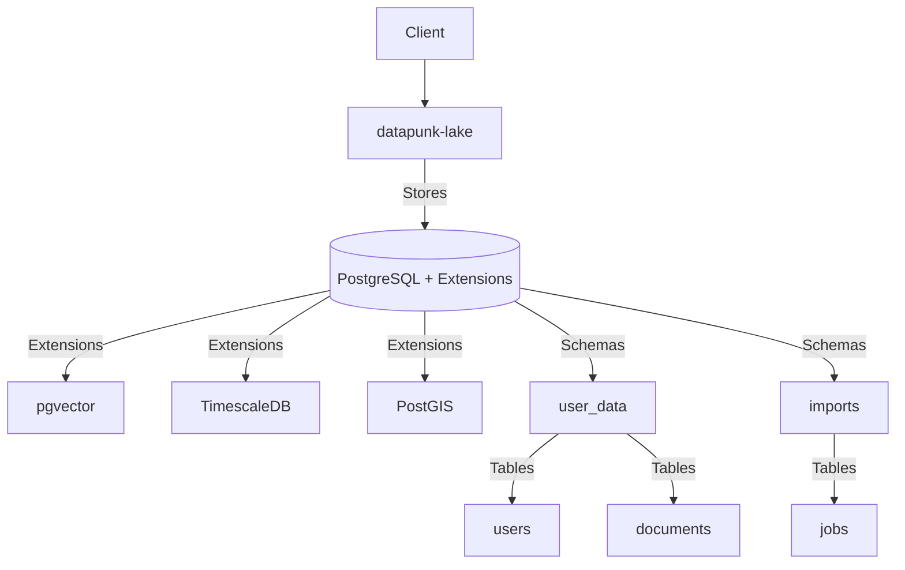

# Datapunk MVP Timeline

## Day 1 Implementation Plan

### Database Foundation

#### PostgreSQL Setup

```yaml
database_setup:
  extensions:
    - vector:  # For future AI embeddings
        version: "0.5.1"
        config: 
          dimension: 768  # BERT-compatible
    - timescaledb:  # For time-series data
        version: "2"
        enabled: true
    - postgis:  # For spatial data
        version: "3"
        enabled: true
    - pg_partman:  # For table partitioning
        enabled: true
    - pg_trgm:  # For text search
        enabled: true
    - hstore:  # For flexible metadata
        enabled: true
  
  core_schemas:
    - user_data:
        intent: "Personal data isolation"
        security: "Row-level security enabled"
    - imports:
        intent: "Staging area for data ingestion"
        cleanup: "Automated after processing"
```

### Success Criteria

```python
success_criteria = {
    "must_have": [
        "datapunk-lake container running",
        "pgvector extension verified",
        "Core schemas and tables created",
        "Row-level security enabled",
        "Basic health checks passing",
        "Archive directory configured"
    ],
    "nice_to_have": [
        "Performance tuning implemented",
        "Monitoring setup started",
        "Initial documentation",
        "Basic backup configuration",
        "TimescaleDB configured",
        "PostGIS ready",
        "Partitioning setup"
    ],
    "defer": [
        "Advanced indexing",
        "Replication setup",
        "Complex partitioning",
        "Advanced security",
        "Spatial data optimization",
        "Time-series optimization"
    ]
}
```

### Architecture Diagram



### Core Tables
```sql
-- Users table for authentication
CREATE TABLE users (
    id UUID PRIMARY KEY DEFAULT gen_random_uuid(),
    email TEXT UNIQUE NOT NULL,
    created_at TIMESTAMPTZ DEFAULT CURRENT_TIMESTAMP,
    metadata JSONB
);

-- Documents table for all personal data
CREATE TABLE documents (
    id UUID PRIMARY KEY DEFAULT gen_random_uuid(),
    user_id UUID REFERENCES users(id),
    content TEXT NOT NULL,
    content_type TEXT NOT NULL,
    embedding vector(768),  -- Ready for AI
    metadata JSONB,
    created_at TIMESTAMPTZ DEFAULT CURRENT_TIMESTAMP,
    source TEXT NOT NULL,  -- e.g., 'google_takeout'
    source_timestamp TIMESTAMPTZ
);

-- Import tracking
CREATE TABLE import_jobs (
    id UUID PRIMARY KEY DEFAULT gen_random_uuid(),
    user_id UUID REFERENCES users(id),
    status TEXT NOT NULL,
    started_at TIMESTAMPTZ DEFAULT CURRENT_TIMESTAMP,
    completed_at TIMESTAMPTZ,
    error TEXT,
    metadata JSONB
);
```

### Performance Configuration
```ini
# Basic PostgreSQL tuning
max_connections = 200
shared_buffers = 2GB
effective_cache_size = 6GB
maintenance_work_mem = 512MB
checkpoint_completion_target = 0.9
wal_buffers = 16MB
default_statistics_target = 100
random_page_cost = 1.1
effective_io_concurrency = 200
work_mem = 16MB
min_wal_size = 1GB
max_wal_size = 4GB
```
