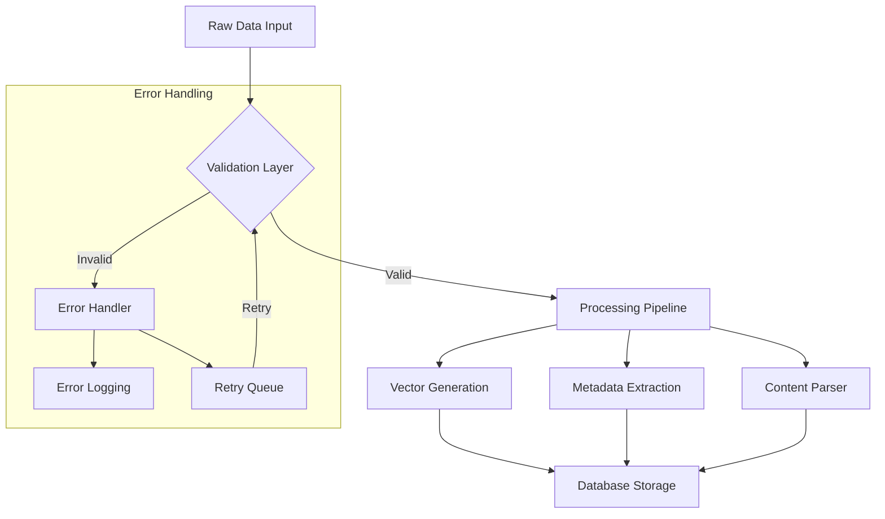
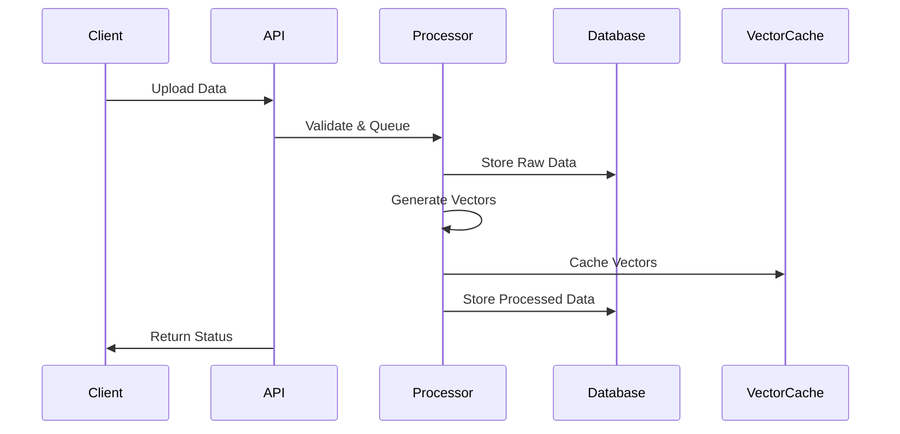

# Datapunk MVP - Day 2 Implementation Plan

## Purpose

Build upon Day 1's database foundation by implementing core data processing capabilities and initial API endpoints.

## Context

References Day 1 implementation from:

```markdown:datapunk/docs/MVP/week1/day1.md
startLine: 1
endLine: 91
```

## Design/Details

### 1. Core Data Processing Implementation



### 2. API Implementation

```python
# Core endpoints structure
endpoints = {
    "data": {
        "POST /data/upload": "Bulk data upload with validation",
        "POST /data/process": "Process existing data",
        "GET /data/{id}": "Retrieve processed data",
        "GET /data/status/{job_id}": "Check processing status"
    },
    "vectors": {
        "POST /vectors/generate": "Generate embeddings",
        "GET /vectors/similar/{id}": "Find similar items"
    },
    "health": {
        "GET /health": "Service health check",
        "GET /health/detailed": "Detailed system status"
    }
}
```

### 3. Database Extensions

```sql
-- Additional tables for Day 2
CREATE TABLE processing_jobs (
    id UUID PRIMARY KEY DEFAULT gen_random_uuid(),
    status TEXT NOT NULL,
    created_at TIMESTAMP DEFAULT CURRENT_TIMESTAMP,
    completed_at TIMESTAMP,
    error TEXT,
    metadata JSONB
);

CREATE TABLE vector_cache (
    id UUID PRIMARY KEY DEFAULT gen_random_uuid(),
    document_id UUID REFERENCES documents(id),
    embedding vector(768),
    created_at TIMESTAMP DEFAULT CURRENT_TIMESTAMP,
    last_used TIMESTAMP,
    metadata JSONB
);
```

## Prerequisites

- Day 1 implementation completed and verified
- PostgreSQL with pgvector extension
- Python environment with required packages:
  - FastAPI
  - asyncpg
  - pydantic
  - python-multipart
  - numpy
  - sentence-transformers

## Testing Notes

### Unit Tests

```python
test_cases = {
    "data_validation": [
        "test_file_size_limits",
        "test_supported_formats",
        "test_malformed_data",
        "test_duplicate_detection"
    ],
    "processing": [
        "test_metadata_extraction",
        "test_content_parsing",
        "test_vector_generation",
        "test_error_handling"
    ],
    "api": [
        "test_upload_endpoints",
        "test_processing_status",
        "test_data_retrieval",
        "test_error_responses"
    ]
}
```

### Integration Tests

- End-to-end data processing flow
- Database interaction verification
- Error handling and recovery
- Performance under load

## Dependencies

- PostgreSQL 15+
- pgvector extension
- Python 3.11+
- CUDA (optional, for GPU acceleration)
- Redis (for caching)

## Error Handling and Logging

```python
error_handling = {
    "validation_errors": {
        "log_level": "WARNING",
        "retry_count": 3,
        "alert_threshold": 10
    },
    "processing_errors": {
        "log_level": "ERROR",
        "retry_policy": "exponential_backoff",
        "alert_immediate": True
    },
    "system_errors": {
        "log_level": "CRITICAL",
        "alert_channels": ["slack", "email"],
        "requires_investigation": True
    }
}
```

## Performance Considerations

- Implement batch processing for large datasets
- Use connection pooling for database operations
- Cache frequently accessed vectors
- Implement background job processing
- Monitor memory usage during vector operations

## Security Considerations

- Implement rate limiting on API endpoints
- Validate file types and content
- Scan for malicious content
- Implement proper error messages (no system details)
- Log all processing attempts

## Metrics and Monitoring

```python
metrics = {
    "processing": [
        "processing_time_per_document",
        "queue_length",
        "error_rate",
        "vector_generation_time"
    ],
    "database": [
        "query_performance",
        "connection_pool_usage",
        "vector_storage_size",
        "cache_hit_rate"
    ],
    "api": [
        "request_latency",
        "error_rates",
        "endpoint_usage",
        "concurrent_connections"
    ]
}
```

## Data Flow



## Known Issues

- Vector generation can be memory-intensive
- Large file uploads need streaming implementation
- Cache invalidation strategy needed
- Retry mechanism needs fine-tuning

## Trade-Offs and Design Decisions

- Using PostgreSQL for vector storage vs. dedicated vector DB
- Synchronous vs. asynchronous processing
- Local vs. distributed processing
- Cache strategy vs. storage space

```
