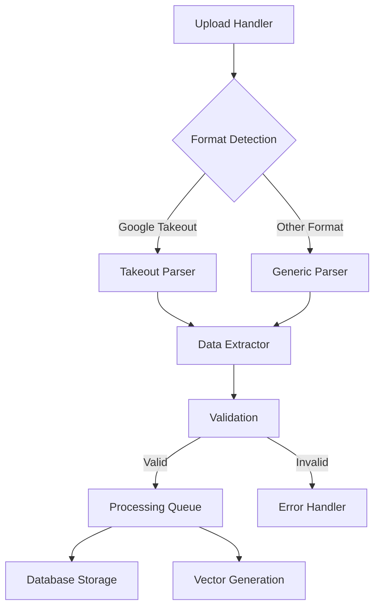

# Datapunk MVP - Day 3 Implementation Plan

## Purpose

Implement data ingestion capabilities with focus on Google Takeout parsing and bulk upload support.

## Prerequisites

- Day 2 implementation verified
- Processing pipeline operational
- Database extensions active

## Core Components

### 1. Google Takeout Parser

```json
{
    "supported_formats": {
        "activity": ["json", "html"],
        "location": ["json", "kml"],
        "mail": ["mbox", "html"],
        "photos": ["json", "metadata"]
    },
    "parsing_strategy": {
        "chunked_processing": true,
        "parallel_execution": true,
        "memory_efficient": true
    },
    "validation_rules": {
        "file_structure": "google_standard",
        "encoding": "utf-8",
        "size_limits": "configurable"
    }
}
```

### 2. Bulk Upload System

```json
{
    "capabilities": {
        "chunked_upload": true,
        "resume_support": true,
        "integrity_check": true,
        "deduplication": true
    },
    "processing": {
        "batch_size": 1000,
        "concurrent_uploads": 5,
        "temp_storage": "configurable"
    },
    "monitoring": {
        "progress_tracking": true,
        "status_updates": "real-time",
        "error_reporting": "detailed"
    }
}
```

### 3. Processing Pipeline Integration



## Implementation Details

### 1. API Endpoints

```json
{
    "upload": {
        "POST /upload/google-takeout": "Process Google Takeout archive",
        "POST /upload/bulk": "Generic bulk data upload",
        "GET /upload/status/{job_id}": "Check upload progress"
    },
    "parser": {
        "POST /parse/detect-format": "Detect file format",
        "POST /parse/extract-metadata": "Extract file metadata"
    }
}
```

### 2. Error Handling

```json
{
    "upload_errors": {
        "invalid_format": "Unsupported file format",
        "size_exceeded": "File size limit exceeded",
        "corrupt_file": "File integrity check failed"
    },
    "parsing_errors": {
        "invalid_structure": "Invalid file structure",
        "missing_required": "Required fields missing",
        "encoding_error": "Encoding not supported"
    }
}
```

## Testing Strategy

### Unit Tests

```json
{
    "format_detection": [
        "test_google_takeout_detection",
        "test_unknown_format_handling"
    ],
    "data_extraction": [
        "test_activity_parsing",
        "test_location_parsing",
        "test_metadata_extraction"
    ],
    "error_handling": [
        "test_corrupt_file_handling",
        "test_invalid_format_response"
    ]
}
```

### Integration Tests

- End-to-end upload flow
- Parser integration with processing pipeline
- Storage system integration
- Error recovery scenarios

## Success Criteria

```json
{
    "must_have": [
        "Google Takeout parsing operational",
        "Bulk upload system working",
        "Basic format detection",
        "Error handling implemented",
        "Progress tracking functional"
    ],
    "nice_to_have": [
        "Advanced format detection",
        "Parallel processing",
        "Upload resume capability",
        "Detailed progress reporting"
    ]
}
```

## Performance Considerations

- Implement streaming for large files
- Use worker pools for parallel processing
- Optimize memory usage during parsing
- Implement caching for repeated operations
- Monitor system resources during bulk operations

## Dependencies

- PostgreSQL with pgvector extension
- Redis for job queue management
- Python FastAPI framework
- Vector processing libraries
- File processing utilities

## Error Handling and Logging

- Implement structured logging
- Set up error tracking
- Configure monitoring alerts
- Establish retry mechanisms
- Define fallback procedures

## Security Considerations

- Validate file signatures
- Implement upload size limits
- Scan for malicious content
- Enforce authentication
- Apply rate limiting
