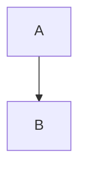

# Handling Nested Code Blocks in Markdown Files

## Issue

When working with markdown files that contain nested code blocks (like mermaid diagrams or code snippets), there's a specific syntax requirement to prevent the markdown structure from breaking.

## Solution

1. Use four backticks (````) to open and close the outer markdown code block
2. Use three backticks (```) for all nested code blocks inside
3. Always specify the language for nested code blocks (e.g., `python`, `mermaid`)
4. Keep the markdown content and nested code blocks properly indented for readability

## Example Structure

Here's how to properly structure a markdown file with nested code blocks:

````markdown
# Title

Regular markdown content


````

More markdown content

```python
def example():
    pass
```

```

## Common Mistakes to Avoid

- Using three backticks for the outer markdown block
- Forgetting to specify language for nested code blocks
- Using four backticks for nested code blocks
- Not properly closing code blocks

## Best Practices

1. Always start with four backticks and the language:markdown for the outer block
2. Use three backticks and specify the language for each nested block
3. Maintain consistent indentation
4. Verify all code blocks are properly closed
5. Include empty lines before and after nested code blocks for better readability
```
