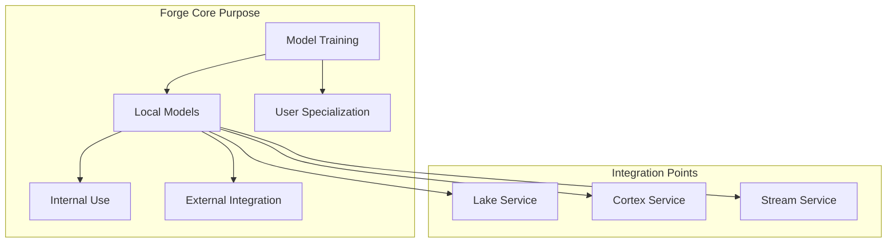
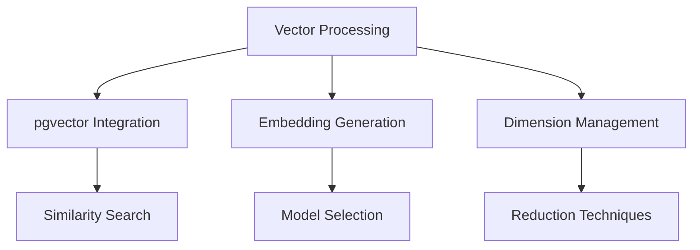
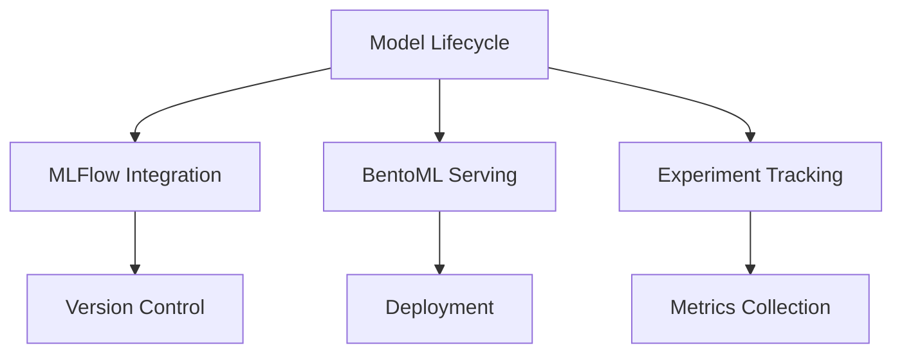
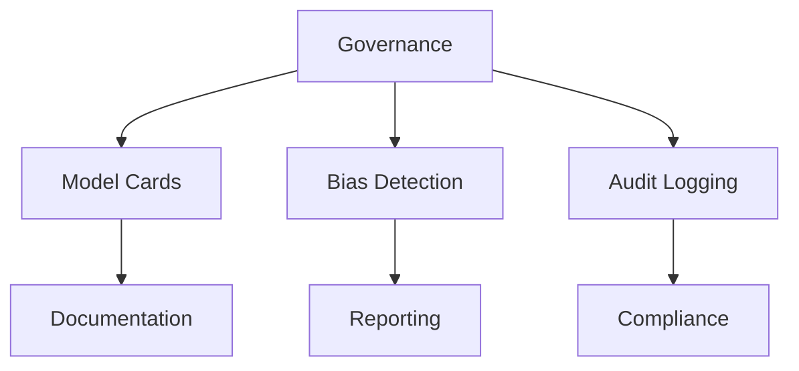

# Datapunk Development Roadmap

## Purpose

This document outlines the detailed implementation strategy and roadmap for the Datapunk platform, focusing on core services, infrastructure components, and service mesh integration.

## Context

This roadmap aligns with the platform's architectural vision while providing concrete steps for implementation. It prioritizes foundational components that enable scalable growth.

## Design/Details

### Phase 1: Lake Service Implementation

#### 1.1 Data Ingestion Framework


##### Storage Layer Integration for Data Patterns

```yaml
storage_coordination:
  hot_tier:
    - active_partition_placement
    - index_locality
    - cache_proximity
  warm_tier:
    - batch_processing_location
    - intermediate_results
  cold_tier:
    - archive_management
    - compliance_storage
```

##### Performance Monitoring for Data Patterns

```yaml
monitoring_integration:
  metrics:
    - partition_balance
    - cache_hit_rates
    - query_distribution
    - storage_utilization
  alerts:
    - imbalance_detection
    - performance_degradation
    - resource_constraints
```

#### 1.2 Core Storage Engines for Data Patterns

##### Vector Storage Implementation for Data Patterns

```python
from typing import List, Dict, Optional
import numpy as np
from pgvector.psycopg2 import register_vector

class VectorStorageEngine:
    def __init__(self, connection_pool, index_type: str = "ivfflat"):
        self.pool = connection_pool
        self.index_type = index_type
        register_vector(connection_pool)

    async def create_index(self, table_name: str, dimension: int) -> None:
        # Vector index creation
        pass

    async def store_vectors(self, vectors: List[np.ndarray], metadata: Dict) -> bool:
        # Vector storage with metadata
        pass

    async def similarity_search(self, query_vector: np.ndarray, k: int = 10) -> List[Dict]:
        # Approximate nearest neighbor search
        pass

    async def batch_upsert(self, vectors: List[np.ndarray], metadata: List[Dict]) -> bool:
        # Batch vector upsert operations
        pass
```

##### Time Series Storage Implementation for Data Patterns

```python
from typing import List, Dict, Optional
from datetime import datetime
import pandas as pd

class TimeSeriesEngine:
    def __init__(self, connection_pool):
        self.pool = connection_pool

    async def create_hypertable(self, table_name: str, time_column: str) -> None:
        # TimescaleDB hypertable creation
        pass

    async def store_series(self, data: pd.DataFrame, metadata: Dict) -> bool:
        # Time series data storage
        pass

    async def query_range(self, start: datetime, end: datetime, filters: Dict) -> pd.DataFrame:
        # Time range query implementation
        pass

    async def aggregate_series(self, aggregation: Dict) -> Dict:
        # Time series aggregation
        pass
```

##### Spatial Storage Implementation for Data Patterns

```python
from typing import List, Dict, Optional
from shapely.geometry import shape
import geopandas as gpd

class SpatialStorageEngine:
    def __init__(self, connection_pool):
        self.pool = connection_pool

    async def store_geometry(self, geometry: shape, metadata: Dict) -> bool:
        # Spatial data storage
        pass

    async def spatial_search(self, query_geometry: shape, relation: str) -> List[Dict]:
        # Spatial search implementation
        pass

    async def create_spatial_index(self, table_name: str, geometry_column: str) -> None:
        # PostGIS index creation
        pass
```


#### 1.3 Processing Pipeline for Data Patterns


##### Data Validation Framework for Data Patterns

```python
from typing import Any, Dict, Optional, List
from pydantic import BaseModel, ValidationError

class ValidationRule(BaseModel):
    field: str
    rule_type: str
    parameters: Dict

class DataValidator:
    def __init__(self, rules: List[ValidationRule]):
        self.rules = rules

    async def validate(self, data: Any) -> tuple[bool, List[str]]:
        errors = []
        # Validation implementation
        return len(errors) == 0, errors

    async def add_rule(self, rule: ValidationRule) -> None:
        # Rule addition logic
        pass
```

##### Transformation Engine for Data Patterns

```python
from typing import Any, Dict, List
from abc import ABC, abstractmethod

class TransformationStep(ABC):
    @abstractmethod
    async def transform(self, data: Any) -> Any:
        pass

class TransformationPipeline:
    def __init__(self, steps: List[TransformationStep]):
        self.steps = steps

    async def execute(self, data: Any) -> Any:
        result = data
        for step in self.steps:
            result = await step.transform(result)
        return result
```

##### Quality Control System for Data Patterns

```python
from typing import Dict, List
from dataclasses import dataclass

@dataclass
class QualityMetrics:
    completeness: float
    accuracy: float
    consistency: float
    timeliness: float

class QualityController:
    def __init__(self, thresholds: Dict[str, float]):
        self.thresholds = thresholds

    async def check_quality(self, data: Any) -> QualityMetrics:
        # Quality check implementation
        pass

    async def generate_report(self, metrics: QualityMetrics) -> Dict:
        # Report generation
        pass
```

#### 1.4 Integration Framework for Data Patterns


### Phase 2: Infrastructure Layer Enhancements

#### 2.1 Core Infrastructure Services


#### 2.2 Cache Service Implementation

```python
from typing import Any, Dict, Optional, List
from redis.asyncio import Redis
from datetime import timedelta

class CacheService:
    def __init__(self, redis_client: Redis):
        self.redis = redis_client
        self.default_ttl = timedelta(hours=1)

    async def get_cached_data(self, key: str) -> Optional[Any]:
        # Cache retrieval implementation
        pass

    async def set_cached_data(self, key: str, value: Any, ttl: Optional[timedelta] = None) -> bool:
        # Cache storage implementation
        pass

    async def invalidate_pattern(self, pattern: str) -> int:
        # Pattern-based cache invalidation
        pass

    async def get_cache_stats(self) -> Dict[str, int]:
        # Cache statistics collection
        pass
```

#### 2.3 Database Service Implementation

```python
from typing import Dict, List, Optional
import asyncpg
from asyncpg import Pool

class DatabaseService:
    def __init__(self, pool: Pool):
        self.pool = pool
        self.statement_cache = {}

    async def initialize_extensions(self) -> None:
        """Initialize required PostgreSQL extensions"""
        extensions = [
            'postgis',
            'timescaledb',
            'pgvector',
            'hstore',
            'pg_stat_statements'
        ]
        # Extension initialization logic
        pass

    async def setup_partitioning(self, table_name: str, partition_key: str) -> None:
        # Table partitioning setup
        pass

    async def create_indexes(self, table_name: str, indexes: List[Dict]) -> None:
        # Index creation with optimization
        pass

    async def vacuum_analyze(self, table_name: str) -> None:
        # Table maintenance operations
        pass
```

#### 2.4 Message Queue Implementation

```python
from typing import Callable, Dict, Optional
from aio_pika import connect_robust, Message, ExchangeType

class MessageQueueService:
    def __init__(self, connection_params: Dict):
        self.params = connection_params
        self.exchanges: Dict = {}
        self.queues: Dict = {}

    async def setup_exchange(self, name: str, type: ExchangeType = ExchangeType.TOPIC) -> None:
        # Exchange setup implementation
        pass

    async def setup_queue(self, name: str, routing_key: str, exchange: str) -> None:
        # Queue setup implementation
        pass

    async def publish_message(self, exchange: str, routing_key: str, message: Dict) -> None:
        # Message publication implementation
        pass

    async def subscribe(self, queue: str, callback: Callable) -> None:
        # Subscription implementation
        pass
```

#### 2.5 Resource Management

```python
from typing import Dict, Optional
from dataclasses import dataclass

@dataclass
class ResourceQuota:
    cpu_limit: str
    memory_limit: str
    storage_limit: str
    iops_limit: Optional[int]

class ResourceManager:
    def __init__(self, quotas: Dict[str, ResourceQuota]):
        self.quotas = quotas
        self.allocations: Dict = {}

    async def allocate_resources(self, service_name: str, requirements: Dict) -> bool:
        # Resource allocation implementation
        pass

    async def monitor_usage(self, service_name: str) -> Dict:
        # Resource monitoring implementation
        pass

    async def adjust_quotas(self, service_name: str, new_quota: ResourceQuota) -> None:
        # Quota adjustment implementation
        pass
```

#### 2.6 Infrastructure Monitoring

```python
from typing import Dict, List
import prometheus_client as prom

class InfrastructureMonitor:
    def __init__(self):
        self.metrics = {
            'cpu_usage': prom.Gauge('cpu_usage', 'CPU usage percentage'),
            'memory_usage': prom.Gauge('memory_usage', 'Memory usage percentage'),
            'disk_usage': prom.Gauge('disk_usage', 'Disk usage percentage'),
            'network_io': prom.Counter('network_io', 'Network I/O bytes'),
            'queue_depth': prom.Gauge('queue_depth', 'Message queue depth')
        }

    async def collect_metrics(self) -> Dict[str, float]:
        # Metrics collection implementation
        pass

    async def export_metrics(self) -> None:
        # Metrics export implementation
        pass

    async def alert_on_threshold(self, metric: str, threshold: float) -> None:
        # Alert generation implementation
        pass
```

#### 2.7 Cache Service Extensions

Enhances existing CacheService with distributed coordination:

```python
from typing import Dict, List, Optional
from enum import Enum

class ConsistencyMode(Enum):
    EVENTUAL = "eventual"
    STRONG = "strong"
    SESSION = "session"

class CacheServiceExtensions:
    """Extensions for the existing CacheService class"""

    async def configure_consistency(self, mode: ConsistencyMode) -> None:
        """Configure cache consistency model"""
        pass

    async def setup_cache_replication(self, replica_count: int) -> None:
        """Configure cache replication strategy"""
        pass

    async def handle_cache_events(self, event_type: str) -> None:
        """Handle cache invalidation events"""
        pass
```

#### 2.8 Database Service Extensions

Extends DatabaseService with advanced failover and replication:

```python
from typing import Dict, List, Optional
from dataclasses import dataclass

@dataclass
class ReplicaConfig:
    host: str
    port: int
    replica_type: str  # sync, async, logical

class DatabaseServiceExtensions:
    """Extensions for the existing DatabaseService class"""

    async def configure_replication(self, replica_configs: List[ReplicaConfig]) -> None:
        """Setup and manage database replication"""
        pass

    async def manage_connection_pools(self) -> None:
        """Advanced connection pool management"""
        pass

    async def handle_failover_scenarios(self) -> None:
        """Automated failover handling"""
        pass
```

#### 2.9 Message Queue Extensions

Enhances MessageQueueService with advanced resilience patterns:

```python
from typing import Dict, Optional, Callable
from dataclasses import dataclass

@dataclass
class QueueResilienceConfig:
    retry_limit: int
    backoff_factor: float
    dead_letter_policy: str

class MessageQueueExtensions:
    """Extensions for the existing MessageQueueService class"""

    async def setup_message_tracking(self) -> None:
        """Enhanced message tracking and replay"""
        pass

    async def configure_queue_resilience(self, config: QueueResilienceConfig) -> None:
        """Advanced resilience configuration"""
        pass

    async def implement_circuit_breaker(self) -> None:
        """Queue-specific circuit breaker"""
        pass
```

#### 2.10 Resource Management Extensions

Extends ResourceManager with predictive capabilities:

```python
from typing import Dict, List
import numpy as np
from datetime import datetime

class ResourceManagerExtensions:
    """Extensions for the existing ResourceManager class"""

    async def predict_resource_usage(self, window_size: int) -> Dict[str, float]:
        """Predictive resource analytics"""
        pass

    async def optimize_resource_distribution(self) -> None:
        """Advanced resource optimization"""
        pass

    async def handle_resource_spikes(self) -> None:
        """Spike detection and handling"""
        pass
```

#### 2.11 Integration Patterns

##### 2.11.1 Cross-Service Communication


#### 2.11.2 Monitoring Integration

Extends existing monitoring with advanced telemetry:

```python
class EnhancedMonitoring:
    """Extensions for the existing InfrastructureMonitor class"""

    async def collect_distributed_metrics(self) -> Dict[str, float]:
        """Collect metrics from distributed components"""
        pass

    async def analyze_performance_patterns(self) -> Dict[str, List]:
        """Advanced performance analysis"""
        pass
```

#### 2.12 Performance Considerations

- Minimal overhead for consistency management
- Optimized replication strategies
- Efficient resource prediction
- Low-latency monitoring

#### 2.13 Security Considerations

- Enhanced encryption for distributed caching
- Secure replica synchronization
- Queue-level access control
- Resource isolation guarantees

#### 2.14 Enhanced Component Testing

- Distributed cache consistency
- Replica failover scenarios
- Message queue resilience
- Resource prediction accuracy

#### 2.15 Integration Testing for Infrastructure

- Cross-component communication
- Failure recovery mechanisms
- Performance under load
- Security compliance

#### 2.16 Migration Guide for existing implementations

For existing implementations:

```python
# Example extension integration
class EnhancedCacheService(CacheService, CacheServiceExtensions):
    """Combines existing CacheService with new extensions"""

    async def initialize_extensions(self) -> None:
        """Setup enhanced features"""
        await self.configure_consistency(ConsistencyMode.STRONG)
        await self.setup_cache_replication(replica_count=3)
```

### Phase 3: Service Mesh Implementation

#### 3.1 Core Mesh Components


#### 3.2 Service Discovery Implementation

```python
from typing import Dict, List, Optional
from dataclasses import dataclass
from datetime import datetime

@dataclass
class ServiceInstance:
    service_id: str
    host: str
    port: int
    health_check_endpoint: str
    metadata: Dict
    last_heartbeat: datetime

class ServiceRegistry:
    def __init__(self):
        self.services: Dict[str, List[ServiceInstance]] = {}
        self.health_states: Dict[str, bool] = {}

    async def register_service(self, instance: ServiceInstance) -> bool:
        # Service registration implementation
        pass

    async def deregister_service(self, service_id: str) -> bool:
        # Service deregistration implementation
        pass

    async def get_service_instances(self, service_name: str) -> List[ServiceInstance]:
        # Service discovery implementation
        pass

    async def update_health_state(self, service_id: str, is_healthy: bool) -> None:
        # Health state update implementation
        pass
```

#### 3.3 Load Balancing Implementation

```python
from typing import List, Optional, Dict
from enum import Enum
from dataclasses import dataclass

class LoadBalancingStrategy(Enum):
    ROUND_ROBIN = "round_robin"
    LEAST_CONNECTIONS = "least_connections"
    WEIGHTED_ROUND_ROBIN = "weighted_round_robin"
    CONSISTENT_HASH = "consistent_hash"

@dataclass
class ServiceEndpoint:
    host: str
    port: int
    weight: int = 1
    current_connections: int = 0

class LoadBalancer:
    def __init__(self, strategy: LoadBalancingStrategy):
        self.strategy = strategy
        self.endpoints: Dict[str, List[ServiceEndpoint]] = {}
        self.current_index: Dict[str, int] = {}

    async def add_endpoint(self, service: str, endpoint: ServiceEndpoint) -> None:
        # Endpoint addition implementation
        pass

    async def remove_endpoint(self, service: str, host: str, port: int) -> None:
        # Endpoint removal implementation
        pass

    async def get_next_endpoint(self, service: str, key: Optional[str] = None) -> ServiceEndpoint:
        # Load balancing implementation
        pass
```

#### 3.4 Circuit Breaking Implementation

```python
from typing import Dict, Optional
from datetime import datetime, timedelta
from enum import Enum

class CircuitState(Enum):
    CLOSED = "closed"
    OPEN = "open"
    HALF_OPEN = "half_open"

class CircuitBreaker:
    def __init__(self,
                 failure_threshold: int = 5,
                 reset_timeout: timedelta = timedelta(seconds=60),
                 half_open_calls: int = 3):
        self.failure_threshold = failure_threshold
        self.reset_timeout = reset_timeout
        self.half_open_calls = half_open_calls
        self.failure_count: Dict[str, int] = {}
        self.state: Dict[str, CircuitState] = {}
        self.last_failure_time: Dict[str, datetime] = {}

    async def record_success(self, service: str) -> None:
        # Success recording implementation
        pass

    async def record_failure(self, service: str) -> None:
        # Failure recording implementation
        pass

    async def is_allowed(self, service: str) -> bool:
        # Circuit state check implementation
        pass

    async def get_circuit_stats(self, service: str) -> Dict:
        # Statistics collection implementation
        pass
```

#### 3.5 Security Implementation

```python
from typing import Dict, Optional
from cryptography.fernet import Fernet
from jwt import encode, decode

class MeshSecurity:
    def __init__(self, key_manager):
        self.key_manager = key_manager
        self.fernet = Fernet(key_manager.get_encryption_key())

    async def generate_service_token(self, service_id: str, claims: Dict) -> str:
        # Token generation implementation
        pass

    async def validate_service_token(self, token: str) -> Optional[Dict]:
        # Token validation implementation
        pass

    async def encrypt_payload(self, payload: bytes) -> bytes:
        # Payload encryption implementation
        pass

    async def decrypt_payload(self, encrypted_payload: bytes) -> bytes:
        # Payload decryption implementation
        pass

    async def setup_mtls(self, service_id: str) -> Dict:
        # mTLS setup implementation
        pass
```

#### 3.6 Proxy/Sidecar Implementation

```python
from typing import Dict, Optional
from dataclasses import dataclass
import aiohttp
import asyncio

@dataclass
class ProxyConfig:
    service_name: str
    listen_port: int
    metrics_port: int
    admin_port: int
    tracing_enabled: bool
    access_log_path: str

class ServiceProxy:
    def __init__(self, config: ProxyConfig):
        self.config = config
        self.metrics = {}
        self.active_connections: Dict[str, int] = {}

    async def initialize(self) -> None:
        # Proxy initialization implementation
        pass

    async def handle_request(self, request: Dict) -> Dict:
        # Request handling with telemetry
        pass

    async def collect_metrics(self) -> Dict:
        # Metrics collection for proxy
        pass
```

#### 3.7 Traffic Management

```python
from typing import Dict, List, Optional
from enum import Enum
from dataclasses import dataclass

class TrafficPolicy(Enum):
    CANARY = "canary"
    BLUE_GREEN = "blue_green"
    A_B_TEST = "a_b_test"
    SHADOW = "shadow"

@dataclass
class RouteRule:
    service: str
    destination: str
    weight: int
    headers: Optional[Dict] = None
    retry_policy: Optional[Dict] = None
    timeout: Optional[int] = None

class TrafficManager:
    def __init__(self):
        self.rules: Dict[str, List[RouteRule]] = {}
        self.active_policies: Dict[str, TrafficPolicy] = {}

    async def apply_routing_rules(self, service: str, rules: List[RouteRule]) -> None:
        # Route rule application implementation
        pass

    async def handle_canary_deployment(self, service: str, new_version: str, percentage: float) -> None:
        # Canary deployment implementation
        pass
```

#### 3.8 Retry & Backoff Policies

```python
from typing import Optional, Dict
from dataclasses import dataclass
import random
import asyncio

@dataclass
class RetryPolicy:
    max_attempts: int = 3
    initial_delay: float = 0.1
    max_delay: float = 2.0
    multiplier: float = 2.0
    jitter: float = 0.1

class RetryHandler:
    def __init__(self, policy: RetryPolicy):
        self.policy = policy
        self.attempt_counts: Dict[str, int] = {}

    async def execute_with_retry(self, operation_id: str, operation: callable) -> Optional[any]:
        attempt = 0
        while attempt < self.policy.max_attempts:
            try:
                return await operation()
            except Exception as e:
                delay = self._calculate_backoff(attempt)
                attempt += 1
                if attempt == self.policy.max_attempts:
                    raise e
                await asyncio.sleep(delay)

    def _calculate_backoff(self, attempt: int) -> float:
        delay = min(
            self.policy.initial_delay * (self.policy.multiplier ** attempt),
            self.policy.max_delay
        )
        return delay + random.uniform(0, self.policy.jitter)
```

#### 3.9 Service Mesh Control Plane


```python
from typing import Dict, List, Optional
from dataclasses import dataclass

@dataclass
class MeshPolicy:
    timeout_ms: int
    retry_policy: RetryPolicy
    circuit_breaker_policy: Dict
    traffic_policy: TrafficPolicy

class ControlPlane:
    def __init__(self):
        self.policies: Dict[str, MeshPolicy] = {}
        self.proxy_configs: Dict[str, ProxyConfig] = {}
        self.global_settings: Dict = {}

    async def apply_mesh_policy(self, service: str, policy: MeshPolicy) -> None:
        # Policy application implementation
        pass

    async def configure_service_mesh(self, config: Dict) -> None:
        # Mesh configuration implementation
        pass

    async def get_mesh_status(self) -> Dict:
        # Mesh status collection implementation
        pass
```

### Phase 4: Security & Authentication Implementation

#### 4.1 Core Security Architecture


#### 4.2 Authentication Service Implementation

```python
from datetime import datetime, timedelta
from typing import Optional, Dict, List
from jose import jwt
from passlib.context import CryptContext

class AuthenticationService:
    def __init__(self,
                 secret_key: str,
                 algorithm: str = "HS256",
                 access_token_expire_minutes: int = 30):
        self.secret_key = secret_key
        self.algorithm = algorithm
        self.access_token_expire_minutes = access_token_expire_minutes
        self.pwd_context = CryptContext(schemes=["bcrypt"], deprecated="auto")

    async def create_access_token(self, data: Dict) -> str:
        expires_delta = timedelta(minutes=self.access_token_expire_minutes)
        expire = datetime.utcnow() + expires_delta
        to_encode = data.copy()
        to_encode.update({"exp": expire})
        return jwt.encode(to_encode, self.secret_key, algorithm=self.algorithm)

    async def verify_token(self, token: str) -> Optional[Dict]:
        try:
            payload = jwt.decode(token, self.secret_key, algorithms=[self.algorithm])
            return payload
        except jwt.JWTError:
            return None

    async def verify_password(self, plain_password: str, hashed_password: str) -> bool:
        return self.pwd_context.verify(plain_password, hashed_password)

    async def get_password_hash(self, password: str) -> str:
        return self.pwd_context.hash(password)
```

#### 4.3 API Key Management

```python
from typing import Dict, Optional
from datetime import datetime, timedelta
import secrets
from cryptography.fernet import Fernet

class APIKeyManager:
    def __init__(self, encryption_key: bytes):
        self.fernet = Fernet(encryption_key)
        self.key_store: Dict[str, Dict] = {}

    async def generate_api_key(self,
                             service_id: str,
                             scopes: List[str],
                             expires_in: Optional[timedelta] = None) -> str:
        key = secrets.token_urlsafe(32)
        encrypted_key = self.fernet.encrypt(key.encode())

        self.key_store[key] = {
            "service_id": service_id,
            "scopes": scopes,
            "created_at": datetime.utcnow(),
            "expires_at": datetime.utcnow() + expires_in if expires_in else None
        }
        return encrypted_key.decode()

    async def validate_api_key(self, encrypted_key: str) -> Optional[Dict]:
        try:
            key = self.fernet.decrypt(encrypted_key.encode()).decode()
            key_data = self.key_store.get(key)

            if not key_data:
                return None

            if key_data["expires_at"] and datetime.utcnow() > key_data["expires_at"]:
                return None

            return key_data
        except Exception:
            return None

    async def revoke_api_key(self, encrypted_key: str) -> bool:
        try:
            key = self.fernet.decrypt(encrypted_key.encode()).decode()
            self.key_store.pop(key, None)
            return True
        except Exception:
            return False
```

#### 4.4 Role-Based Access Control (RBAC)

```python
from typing import Dict, List, Set
from dataclasses import dataclass
from enum import Enum

class Permission(Enum):
    READ = "read"
    WRITE = "write"
    DELETE = "delete"
    ADMIN = "admin"

@dataclass
class Role:
    name: str
    permissions: Set[Permission]
    parent_role: Optional[str] = None

class RBACService:
    def __init__(self):
        self.roles: Dict[str, Role] = {}
        self.user_roles: Dict[str, Set[str]] = {}

    async def create_role(self,
                         name: str,
                         permissions: Set[Permission],
                         parent_role: Optional[str] = None) -> Role:
        role = Role(name=name, permissions=permissions, parent_role=parent_role)
        self.roles[name] = role
        return role

    async def assign_role_to_user(self, user_id: str, role_name: str) -> bool:
        if role_name not in self.roles:
            return False

        if user_id not in self.user_roles:
            self.user_roles[user_id] = set()

        self.user_roles[user_id].add(role_name)
        return True

    async def check_permission(self,
                             user_id: str,
                             required_permission: Permission) -> bool:
        if user_id not in self.user_roles:
            return False

        user_role_names = self.user_roles[user_id]
        for role_name in user_role_names:
            role = self.roles[role_name]
            if required_permission in role.permissions:
                return True

            # Check parent roles
            current_role = role
            while current_role.parent_role:
                parent_role = self.roles[current_role.parent_role]
                if required_permission in parent_role.permissions:
                    return True
                current_role = parent_role

        return False
```

#### 4.5 Audit Logging Service

```python
from typing import Dict, Any
from datetime import datetime
import json
import logging
from enum import Enum

class AuditEventType(Enum):
    AUTH_SUCCESS = "auth_success"
    AUTH_FAILURE = "auth_failure"
    PERMISSION_CHECK = "permission_check"
    ROLE_CHANGE = "role_change"
    API_KEY_GENERATED = "api_key_generated"
    API_KEY_REVOKED = "api_key_revoked"

class AuditLogger:
    def __init__(self, log_file: str = "audit.log"):
        self.logger = logging.getLogger("audit")
        handler = logging.FileHandler(log_file)
        handler.setFormatter(
            logging.Formatter('%(asctime)s - %(name)s - %(levelname)s - %(message)s')
        )
        self.logger.addHandler(handler)
        self.logger.setLevel(logging.INFO)

    async def log_event(self,
                       event_type: AuditEventType,
                       user_id: str,
                       details: Dict[str, Any],
                       ip_address: Optional[str] = None) -> None:
        event = {
            "timestamp": datetime.utcnow().isoformat(),
            "event_type": event_type.value,
            "user_id": user_id,
            "ip_address": ip_address,
            "details": details
        }
        self.logger.info(json.dumps(event))

    async def get_user_audit_trail(self,
                                 user_id: str,
                                 start_time: Optional[datetime] = None,
                                 end_time: Optional[datetime] = None) -> List[Dict]:
        # Audit trail retrieval implementation
        pass
```

#### 4.6 OAuth2 Implementation

```python
from typing import Optional, Dict, List
from datetime import datetime, timedelta
from fastapi.security import OAuth2PasswordBearer
from jose import JWTError, jwt
from pydantic import BaseModel

class OAuth2Provider:
    def __init__(self,
                 client_id: str,
                 client_secret: str,
                 authorize_url: str,
                 token_url: str,
                 scopes: List[str]):
        self.client_id = client_id
        self.client_secret = client_secret
        self.authorize_url = authorize_url
        self.token_url = token_url
        self.scopes = scopes
        self.oauth2_scheme = OAuth2PasswordBearer(tokenUrl="token")

    async def create_authorization_url(self,
                                    state: str,
                                    redirect_uri: str) -> str:
        params = {
            "client_id": self.client_id,
            "response_type": "code",
            "state": state,
            "redirect_uri": redirect_uri,
            "scope": " ".join(self.scopes)
        }
        # Authorization URL generation implementation
        pass

    async def exchange_code_for_token(self,
                                    code: str,
                                    redirect_uri: str) -> Dict:
        data = {
            "client_id": self.client_id,
            "client_secret": self.client_secret,
            "grant_type": "authorization_code",
            "code": code,
            "redirect_uri": redirect_uri
        }
        # Token exchange implementation
        pass

    async def refresh_token(self, refresh_token: str) -> Dict:
        data = {
            "client_id": self.client_id,
            "client_secret": self.client_secret,
            "grant_type": "refresh_token",
            "refresh_token": refresh_token
        }
        # Token refresh implementation
        pass
```

#### 4.7 Session Management

```python
from typing import Optional, Dict, Any
from datetime import datetime, timedelta
import redis.asyncio as redis
import json
import secrets

class SessionManager:
    def __init__(self,
                 redis_client: redis.Redis,
                 session_timeout: int = 3600,
                 session_prefix: str = "session:",
                 max_active_sessions: int = 5):
        self.redis = redis_client
        self.session_timeout = session_timeout
        self.session_prefix = session_prefix
        self.max_active_sessions = max_active_sessions

    async def create_session(self,
                           user_id: str,
                           metadata: Dict[str, Any]) -> str:
        session_id = secrets.token_urlsafe(32)
        session_data = {
            "user_id": user_id,
            "created_at": datetime.utcnow().isoformat(),
            "last_accessed": datetime.utcnow().isoformat(),
            "metadata": metadata,
            "is_active": True
        }

        # Check and enforce max active sessions
        await self._enforce_max_sessions(user_id)

        # Store session
        await self.redis.setex(
            f"{self.session_prefix}{session_id}",
            self.session_timeout,
            json.dumps(session_data)
        )
        return session_id

    async def get_session(self, session_id: str) -> Optional[Dict]:
        session_data = await self.redis.get(f"{self.session_prefix}{session_id}")
        if not session_data:
            return None

        session = json.loads(session_data)
        if not session.get("is_active"):
            return None

        # Update last accessed time
        session["last_accessed"] = datetime.utcnow().isoformat()
        await self.redis.setex(
            f"{self.session_prefix}{session_id}",
            self.session_timeout,
            json.dumps(session)
        )
        return session

    async def invalidate_session(self, session_id: str) -> bool:
        session_data = await self.get_session(session_id)
        if not session_data:
            return False

        session_data["is_active"] = False
        await self.redis.setex(
            f"{self.session_prefix}{session_id}",
            300,  # Keep for 5 minutes for audit
            json.dumps(session_data)
        )
        return True

    async def _enforce_max_sessions(self, user_id: str) -> None:
        # Get all active sessions for user
        pattern = f"{self.session_prefix}*"
        all_sessions = await self.redis.keys(pattern)
        user_sessions = []

        for session_key in all_sessions:
            session_data = await self.redis.get(session_key)
            if session_data:
                session = json.loads(session_data)
                if (session.get("user_id") == user_id and
                    session.get("is_active")):
                    user_sessions.append({
                        "key": session_key,
                        "last_accessed": session["last_accessed"]
                    })

        # If over limit, remove oldest sessions
        if len(user_sessions) >= self.max_active_sessions:
            sorted_sessions = sorted(
                user_sessions,
                key=lambda x: x["last_accessed"]
            )
            for session in sorted_sessions[:(len(user_sessions) -
                                          self.max_active_sessions + 1)]:
                await self.invalidate_session(
                    session["key"].decode().replace(self.session_prefix, "")
                )

    async def get_user_sessions(self, user_id: str) -> List[Dict]:
        # Get all active sessions for a user
        pattern = f"{self.session_prefix}*"
        all_sessions = await self.redis.keys(pattern)
        user_sessions = []

        for session_key in all_sessions:
            session_data = await self.redis.get(session_key)
            if session_data:
                session = json.loads(session_data)
                if (session.get("user_id") == user_id and
                    session.get("is_active")):
                    session["session_id"] = session_key.decode().replace(
                        self.session_prefix, ""
                    )
                    user_sessions.append(session)

        return user_sessions
```

#### 4.8 Social OAuth Integration

```python
from typing import Dict, Optional, List, Union
from enum import Enum
from pydantic import BaseModel
import httpx

class OAuthProvider(Enum):
    GOOGLE = "google"
    MICROSOFT = "microsoft"
    GITHUB = "github"
    DISCORD = "discord"
    SPOTIFY = "spotify"

class SocialAuthConfig(BaseModel):
    provider: OAuthProvider
    client_id: str
    client_secret: str
    scopes: List[str]
    authorize_url: str
    token_url: str
    user_info_url: str
    redirect_uri: str

class SocialAuthManager:
    def __init__(self, configs: Dict[OAuthProvider, SocialAuthConfig]):
        self.configs = configs
        self.http_client = httpx.AsyncClient()
        self.token_store: Dict[str, Dict] = {}  # In production, use Redis

    async def get_auth_url(self, provider: OAuthProvider, state: str) -> str:
        config = self.configs[provider]
        params = {
            "client_id": config.client_id,
            "redirect_uri": config.redirect_uri,
            "scope": " ".join(config.scopes),
            "response_type": "code",
            "state": state
        }

        # Add provider-specific parameters
        if provider == OAuthProvider.GOOGLE:
            params["access_type"] = "offline"  # For refresh token
            params["prompt"] = "consent"
        elif provider == OAuthProvider.MICROSOFT:
            params["response_mode"] = "query"

        return f"{config.authorize_url}?{urlencode(params)}"

    async def handle_callback(self,
                            provider: OAuthProvider,
                            code: str) -> Dict[str, Any]:
        config = self.configs[provider]

        # Exchange code for tokens
        token_data = await self._exchange_code(provider, code)

        # Get user info
        user_info = await self._get_user_info(provider, token_data["access_token"])

        # Store tokens
        await self._store_tokens(provider, user_info["id"], token_data)

        return user_info

    async def refresh_access_token(self,
                                 provider: OAuthProvider,
                                 user_id: str) -> Optional[str]:
        stored_tokens = await self._get_stored_tokens(provider, user_id)
        if not stored_tokens or "refresh_token" not in stored_tokens:
            return None

        config = self.configs[provider]
        refresh_data = {
            "client_id": config.client_id,
            "client_secret": config.client_secret,
            "refresh_token": stored_tokens["refresh_token"],
            "grant_type": "refresh_token"
        }

        async with self.http_client as client:
            response = await client.post(config.token_url, data=refresh_data)
            if response.status_code == 200:
                new_tokens = response.json()
                # Update stored tokens
                await self._store_tokens(provider, user_id, new_tokens)
                return new_tokens["access_token"]
        return None
```

#### 4.9 Enhanced Token Management

```python
from typing import Optional, Dict, List
from datetime import datetime, timedelta
import jwt
from redis.asyncio import Redis
from cryptography.fernet import Fernet

class TokenType(Enum):
    ACCESS = "access"
    REFRESH = "refresh"
    SOCIAL = "social"
    API = "api"

class TokenManager:
    def __init__(self,
                 redis_client: Redis,
                 encryption_key: bytes,
                 jwt_secret: str):
        self.redis = redis_client
        self.fernet = Fernet(encryption_key)
        self.jwt_secret = jwt_secret

    async def create_token_pair(self,
                              user_id: str,
                              scopes: List[str],
                              metadata: Dict = None) -> Dict[str, str]:
        # Create access token
        access_token = await self._create_jwt(
            user_id,
            scopes,
            metadata,
            expires_delta=timedelta(minutes=30)
        )

        # Create refresh token
        refresh_token = await self._create_refresh_token(user_id)

        # Store refresh token
        await self._store_refresh_token(user_id, refresh_token)

        return {
            "access_token": access_token,
            "refresh_token": refresh_token,
            "token_type": "bearer"
        }

    async def refresh_tokens(self, refresh_token: str) -> Optional[Dict[str, str]]:
        # Validate refresh token
        user_id = await self._validate_refresh_token(refresh_token)
        if not user_id:
            return None

        # Get user info from storage
        user_info = await self._get_user_info(user_id)
        if not user_info:
            return None

        # Create new token pair
        return await self.create_token_pair(
            user_id,
            user_info["scopes"],
            user_info["metadata"]
        )

    async def revoke_all_tokens(self, user_id: str) -> None:
        # Revoke all refresh tokens
        pattern = f"refresh_token:{user_id}:*"
        async for key in self.redis.scan_iter(match=pattern):
            await self.redis.delete(key)

        # Add to blocklist if needed
        await self._add_to_blocklist(user_id)

    async def _create_jwt(self,
                         user_id: str,
                         scopes: List[str],
                         metadata: Optional[Dict],
                         expires_delta: timedelta) -> str:
        expires_at = datetime.utcnow() + expires_delta
        to_encode = {
            "sub": user_id,
            "scopes": scopes,
            "exp": expires_at,
            "iat": datetime.utcnow(),
            "metadata": metadata or {}
        }
        return jwt.encode(to_encode, self.jwt_secret, algorithm="HS256")

    async def _create_refresh_token(self, user_id: str) -> str:
        token = secrets.token_urlsafe(32)
        encrypted_token = self.fernet.encrypt(token.encode())
        return encrypted_token.decode()

    async def _store_refresh_token(self, user_id: str, token: str) -> None:
        key = f"refresh_token:{user_id}:{token}"
        await self.redis.setex(key, timedelta(days=30), "valid")

    async def _validate_refresh_token(self, token: str) -> Optional[str]:
        try:
            decrypted = self.fernet.decrypt(token.encode()).decode()
            pattern = f"refresh_token:*:{token}"
            async for key in self.redis.scan_iter(match=pattern):
                user_id = key.split(":")[1]
                if await self.redis.get(key) == "valid":
                    return user_id
        except Exception:
            pass
        return None
```

#### 4.10 Cross-Service Token Propagation

```python
from typing import Dict, Optional
from dataclasses import dataclass
import hashlib
import time

@dataclass
class TokenContext:
    user_id: str
    scopes: List[str]
    metadata: Dict
    source_service: str
    trace_id: str

class TokenPropagator:
    def __init__(self, redis_client: Redis, service_name: str):
        self.redis = redis_client
        self.service_name = service_name

    async def propagate_token(self,
                            target_service: str,
                            context: TokenContext) -> str:
        # Create service-to-service token
        token = await self._create_service_token(context)

        # Store token context
        await self._store_token_context(token, context)

        return token

    async def validate_propagated_token(self, token: str) -> Optional[TokenContext]:
        # Retrieve and validate token context
        context = await self._get_token_context(token)
        if not context:
            return None

        # Verify service chain
        if not await self._verify_service_chain(context):
            return None

        return context

    async def _create_service_token(self, context: TokenContext) -> str:
        timestamp = int(time.time())
        token_data = f"{context.user_id}:{context.source_service}:{timestamp}"
        return hashlib.sha256(token_data.encode()).hexdigest()

    async def _store_token_context(self, token: str, context: TokenContext) -> None:
        key = f"service_token:{token}"
        await self.redis.setex(
            key,
            timedelta(minutes=5),
            json.dumps(asdict(context))
        )

    async def _verify_service_chain(self, context: TokenContext) -> bool:
        # Implement service chain verification logic
        # Ensure the token is being used by an authorized service
        pass
```

### Phase 5: Monitoring and Observability Enhancement

#### 5.1 Core Observability Infrastructure


#### 5.2 Unified Metrics Service

```python
from typing import Dict, Optional, List
from prometheus_client import Counter, Histogram, Gauge, Summary
from dataclasses import dataclass

@dataclass
class MetricDefinition:
    name: str
    type: str
    description: str
    labels: List[str]
    buckets: Optional[List[float]] = None

class UnifiedMetricsService:
    def __init__(self):
        self._metrics: Dict[str, Any] = {}
        self._initialize_core_metrics()

    def _initialize_core_metrics(self):
        # System metrics
        self.system_metrics = {
            'cpu_usage': Gauge('system_cpu_usage', 'CPU usage percentage'),
            'memory_usage': Gauge('system_memory_usage', 'Memory usage in bytes'),
            'disk_usage': Gauge('system_disk_usage', 'Disk usage in bytes'),
        }

        # Application metrics
        self.app_metrics = {
            'request_duration': Histogram(
                'request_duration_seconds',
                'Request duration in seconds',
                buckets=[0.1, 0.5, 1.0, 2.0, 5.0]
            ),
            'request_count': Counter(
                'request_total',
                'Total request count',
                ['method', 'endpoint', 'status']
            ),
            'active_connections': Gauge(
                'active_connections',
                'Number of active connections'
            )
        }

        # Business metrics
        self.business_metrics = {
            'transaction_value': Summary(
                'transaction_value_dollars',
                'Transaction value in dollars'
            ),
            'active_users': Gauge(
                'active_users',
                'Number of active users'
            )
        }

    async def record_metric(self, metric_name: str, value: float, labels: Optional[Dict] = None) -> None:
        if metric_name not in self._metrics:
            raise ValueError(f"Unknown metric: {metric_name}")

        metric = self._metrics[metric_name]
        if labels:
            metric.labels(**labels).observe(value)
        else:
            metric.observe(value)

    async def get_metrics_snapshot(self) -> Dict:
        # Implementation for getting current metrics snapshot
        pass
```

#### 5.3 Enhanced Logging Service

```python
from typing import Any, Dict, Optional, List
from elasticsearch import AsyncElasticsearch
import structlog
from datetime import datetime

class EnhancedLoggingService:
    def __init__(self, es_client: AsyncElasticsearch):
        self.es = es_client
        self.logger = structlog.get_logger()
        self._initialize_indices()

    async def _initialize_indices(self):
        # Create necessary indices with proper mappings
        pass

    async def log_event(self,
                       level: str,
                       event: str,
                       context: Dict[str, Any],
                       trace_id: Optional[str] = None) -> None:
        log_entry = {
            "timestamp": datetime.utcnow().isoformat(),
            "level": level,
            "event": event,
            "context": context,
            "trace_id": trace_id,
            "service": self.service_name,
            "environment": self.environment
        }

        # Store in Elasticsearch
        await self.es.index(
            index=f"logs-{datetime.utcnow():%Y.%m.%d}",
            document=log_entry
        )

    async def query_logs(self,
                        query: Dict,
                        time_range: Dict,
                        size: int = 100) -> List[Dict]:
        # Implementation for querying logs
        pass

    async def create_log_summary(self,
                               time_range: Dict,
                               group_by: List[str]) -> Dict:
        # Implementation for creating log summaries
        pass
```

#### 5.4 Distributed Tracing Enhancement

```python
from opentelemetry import trace
from opentelemetry.trace import Span, SpanKind
from opentelemetry.trace.propagation.tracecontext import TraceContextTextMapPropagator
from typing import Optional, Dict, List

class EnhancedTracingService:
    def __init__(self, service_name: str):
        self.service_name = service_name
        self.tracer = trace.get_tracer(__name__)
        self.propagator = TraceContextTextMapPropagator()

    async def create_span(self,
                         name: str,
                         kind: SpanKind = SpanKind.INTERNAL,
                         attributes: Optional[Dict] = None,
                         parent_context: Optional[Dict] = None) -> Span:
        # Enhanced span creation with more context
        pass

    async def inject_context(self,
                           headers: Dict[str, str],
                           context: Optional[Dict] = None) -> Dict[str, str]:
        # Inject trace context into headers
        pass

    async def extract_context(self, headers: Dict[str, str]) -> Optional[Dict]:
        # Extract trace context from headers
        pass

    async def record_exception(self,
                             span: Span,
                             exception: Exception,
                             attributes: Optional[Dict] = None) -> None:
        # Record exception details in span
        pass
```

#### 5.5 Health Check System

```python
from typing import Dict, List, Optional
from enum import Enum
from dataclasses import dataclass
from datetime import datetime

class HealthStatus(Enum):
    HEALTHY = "healthy"
    DEGRADED = "degraded"
    UNHEALTHY = "unhealthy"

@dataclass
class HealthCheck:
    name: str
    status: HealthStatus
    details: Dict
    timestamp: datetime
    dependencies: List[str]

class HealthCheckService:
    def __init__(self):
        self.checks: Dict[str, callable] = {}
        self._register_core_checks()

    async def _register_core_checks(self):
        # Register basic health checks
        pass

    async def register_check(self,
                           name: str,
                           check_func: callable,
                           dependencies: List[str] = None) -> None:
        # Register new health check
        pass

    async def run_checks(self,
                        include_dependencies: bool = True) -> Dict[str, HealthCheck]:
        # Run all registered health checks
        pass

    async def get_health_status(self) -> HealthStatus:
        # Get overall system health status
        pass
```

#### 5.6 Alert Management

```python
from typing import Dict, List, Optional
from enum import Enum
from datetime import datetime, timedelta

class AlertSeverity(Enum):
    INFO = "info"
    WARNING = "warning"
    ERROR = "error"
    CRITICAL = "critical"

class AlertManager:
    def __init__(self, notification_service):
        self.notification_service = notification_service
        self.alert_rules: Dict[str, Dict] = {}
        self.alert_history: List[Dict] = []

    async def add_alert_rule(self,
                           name: str,
                           condition: callable,
                           severity: AlertSeverity,
                           notification_channels: List[str]) -> None:
        # Add new alert rule
        pass

    async def evaluate_rules(self) -> List[Dict]:
        # Evaluate all alert rules
        pass

    async def send_alert(self,
                        alert: Dict,
                        channels: List[str]) -> None:
        # Send alert through notification channels
        pass

    async def get_alert_history(self,
                              time_range: Optional[timedelta] = None,
                              severity: Optional[AlertSeverity] = None) -> List[Dict]:
        # Get alert history with filtering
        pass
```

### Phase 6: Deployment Automation

#### 6.1 Infrastructure as Code

```python
from typing import Dict, Optional
from pulumi import ResourceOptions
from pulumi_kubernetes import Provider, apps, core

class InfrastructureManager:
    def __init__(self, cluster_config: Dict[str, Any]):
        self.provider = Provider("k8s-provider", kubeconfig=cluster_config["kubeconfig"])
        self.namespace = core.v1.Namespace("datapunk-namespace")

    async def provision_environment(self, env_name: str, config: Dict) -> Dict[str, Any]:
        """Provisions complete environment with networking, storage, and compute"""
        # Environment provisioning implementation
        pass

    async def setup_monitoring(self, config: Dict) -> None:
        """Configures monitoring stack (Prometheus, Grafana, AlertManager)"""
        # Monitoring setup implementation
        pass

    async def configure_networking(self, network_config: Dict) -> None:
        """Sets up service mesh, ingress, and network policies"""
        # Network configuration implementation
        pass
```

#### 6.2 Deployment Pipeline


#### 6.3 Deployment Manager

```python
from typing import Dict, List, Optional
from kubernetes import client, config
from datetime import datetime

class DeploymentManager:
    def __init__(self, k8s_config: Dict):
        self.k8s_apps = client.AppsV1Api()
        self.k8s_core = client.CoreV1Api()
        self.deployment_history: List[Dict] = []

    async def deploy_service(
        self,
        service_name: str,
        image: str,
        config: Dict,
        strategy: str = "rolling"
    ) -> bool:
        """Deploys service with specified strategy"""
        # Deployment implementation
        pass

    async def rollback_deployment(
        self,
        service_name: str,
        revision: str
    ) -> bool:
        """Handles deployment rollbacks"""
        # Rollback implementation
        pass

    async def health_check(
        self,
        service_name: str,
        timeout: int = 300
    ) -> bool:
        """Verifies deployment health"""
        # Health check implementation
        pass
```

#### 6.4 Security Integration

```python
from typing import Dict, List
from dataclasses import dataclass
from datetime import datetime

@dataclass
class SecurityScan:
    scan_id: str
    timestamp: datetime
    findings: List[Dict]
    severity_counts: Dict[str, int]

class SecurityPipeline:
    def __init__(self, config: Dict):
        self.scanners = self._initialize_scanners(config)
        self.policy_engine = self._setup_policy_engine()

    async def run_security_checks(
        self,
        artifact_path: str,
        scan_type: str
    ) -> SecurityScan:
        """Executes security scans on deployment artifacts"""
        # Security scanning implementation
        pass

    async def validate_compliance(
        self,
        scan_results: SecurityScan
    ) -> bool:
        """Validates scan results against security policies"""
        # Compliance validation implementation
        pass
```

#### 6.5 Monitoring Integration

```python
from typing import Dict, Optional
from prometheus_client import Counter, Histogram
from opentelemetry import trace

class DeploymentMonitor:
    def __init__(self):
        self.deployment_duration = Histogram(
            'deployment_duration_seconds',
            'Time taken for deployments',
            ['service', 'environment']
        )
        self.deployment_status = Counter(
            'deployment_status_total',
            'Deployment outcomes',
            ['service', 'status']
        )

    async def track_deployment(
        self,
        deployment_id: str,
        metrics: Dict
    ) -> None:
        """Records deployment metrics"""
        # Metric recording implementation
        pass

    async def alert_on_failure(
        self,
        deployment_id: str,
        error: str
    ) -> None:
        """Handles deployment failure alerts"""
        # Alert handling implementation
        pass
```

#### 6.6 Configuration Management

```python
from typing import Dict, Optional
from dataclasses import dataclass

@dataclass
class ConfigurationSet:
    environment: str
    service_name: str
    config_values: Dict
    secrets: Dict
    version: str

class ConfigManager:
    def __init__(self, vault_client, config_store):
        self.vault = vault_client
        self.store = config_store

    async def load_configuration(
        self,
        service: str,
        environment: str
    ) -> ConfigurationSet:
        """Loads service configuration for deployment"""
        # Configuration loading implementation
        pass

    async def validate_configuration(
        self,
        config: ConfigurationSet
    ) -> bool:
        """Validates configuration against schema"""
        # Configuration validation implementation
        pass
```

#### 6.7 Artifact Management

```python
from typing import Optional, BinaryIO
from azure.storage.blob import BlobServiceClient

class ArtifactManager:
    def __init__(self, storage_config: Dict[str, str]):
        self.blob_service = BlobServiceClient.from_connection_string(
            storage_config["connection_string"]
        )

    async def store_artifact(
        self,
        artifact_path: str,
        metadata: Dict[str, str]
    ) -> str:
        """Stores deployment artifacts"""
        # Artifact storage implementation
        pass

    async def retrieve_artifact(
        self,
        artifact_id: str
    ) -> Optional[BinaryIO]:
        """Retrieves deployment artifacts"""
        # Artifact retrieval implementation
        pass
```

### Phase 7: Data Processing Pipeline

#### 7.1 Stream Processing


#### 7.2 Stream Processor

```python
from typing import Any, Callable, Dict, List
from confluent_kafka import Consumer, Producer

class StreamProcessor:
    def __init__(self, kafka_config: Dict):
        self.consumer = Consumer(kafka_config)
        self.producer = Producer(kafka_config)
        self.processors: Dict[str, Callable] = {}

    async def register_processor(self, topic: str, processor: Callable) -> None:
        # Processor registration logic
        pass

    async def process_stream(self, batch_size: int = 100) -> None:
        # Stream processing logic
        pass

    async def emit_event(self, topic: str, key: str, value: Dict) -> None:
        # Event emission logic
        pass
```

#### 7.3 Enhanced Stream Processing Engine

```python
from typing import Any, Dict, List, Optional
from dataclasses import dataclass
from datetime import datetime
from enum import Enum

class ProcessingStrategy(Enum):
    EXACTLY_ONCE = "exactly_once"
    AT_LEAST_ONCE = "at_least_once"
    AT_MOST_ONCE = "at_most_once"

@dataclass
class StreamConfig:
    processing_strategy: ProcessingStrategy
    batch_timeout: int
    max_batch_size: int
    retry_policy: Dict
    dead_letter_queue: str

class EnhancedStreamProcessor:
    def __init__(self, kafka_config: Dict, stream_config: StreamConfig):
        self.consumer = Consumer(kafka_config)
        self.producer = Producer(kafka_config)
        self.config = stream_config
        self.state_store = StateStore()
        self.metrics = ProcessingMetrics()

    async def register_processor_chain(
        self,
        topic: str,
        processors: List[Callable],
        error_handler: Optional[Callable] = None
    ) -> None:
        """Register a chain of processors for a topic"""
        pass

    async def commit_offset(self, topic: str, partition: int, offset: int) -> None:
        """Commit offset with exactly-once semantics"""
        pass

    async def handle_dead_letter(self, message: Dict, error: Exception) -> None:
        """Process failed messages"""
        pass
```

#### 7.4 State Management

```python
from typing import Any, Dict, Optional
import redis
from datetime import timedelta

class StateStore:
    def __init__(self, redis_config: Dict):
        self.redis = redis.Redis(**redis_config)

    async def get_state(self, key: str) -> Optional[Any]:
        """Retrieve state with versioning"""
        pass

    async def set_state(
        self,
        key: str,
        value: Any,
        ttl: Optional[timedelta] = None
    ) -> None:
        """Set state with optional TTL"""
        pass

    async def atomic_update(
        self,
        key: str,
        update_func: Callable[[Any], Any]
    ) -> None:
        """Atomic state updates"""
        pass
```

#### 7.5 Processing Rules Engine

```python
from typing import Dict, List
from dataclasses import dataclass

@dataclass
class Rule:
    name: str
    condition: Callable
    action: Callable
    priority: int
    metadata: Dict

class RuleEngine:
    def __init__(self):
        self.rules: Dict[str, Rule] = {}
        self.metrics = RuleMetrics()

    async def add_rule(self, rule: Rule) -> None:
        """Add processing rule"""
        pass

    async def evaluate_message(self, message: Dict) -> List[Dict]:
        """Evaluate message against rules"""
        pass

    async def update_rule(self, rule_name: str, updates: Dict) -> None:
        """Update existing rule"""
        pass
```

#### 7.6 Integration Points


#### 7.7 Processing Strategies

```python
from typing import Dict, Optional
from datetime import datetime
from enum import Enum

class ProcessingMode(Enum):
    ORDERED = "ordered"
    UNORDERED = "unordered"
    PARALLEL = "parallel"

class MessageProcessor:
    def __init__(self, mode: ProcessingMode):
        self.mode = mode
        self.metrics = ProcessingMetrics()
        self.error_handler = ErrorHandler()

    async def process_with_ordering(
        self,
        messages: List[Dict],
        partition_key: str
    ) -> List[Dict]:
        """Process messages with ordering guarantees"""
        pass

    async def process_in_parallel(
        self,
        messages: List[Dict],
        max_concurrent: int = 10
    ) -> List[Dict]:
        """Process messages in parallel with concurrency control"""
        pass

    async def handle_duplicates(
        self,
        message: Dict,
        dedup_window: timedelta
    ) -> bool:
        """Handle message deduplication"""
        pass
```

### Phase 8: Forge Service Integration

#### 8.1 Model Training Infrastructure



##### Implementation Components for Forge Service

1. **Model Training Pipeline**

```python
from typing import Dict, Optional, List
from abc import ABC, abstractmethod

class ModelTrainer(ABC):
    @abstractmethod
    async def train(self, data: Dict, parameters: Dict) -> str:
        """Train model and return model identifier"""
        pass

    @abstractmethod
    async def validate(self, model_id: str, test_data: Dict) -> Dict:
        """Validate model performance"""
        pass

class SpecializedTrainer(ModelTrainer):
    def __init__(self, resource_manager):
        self.resource_manager = resource_manager

    async def train(self, data: Dict, parameters: Dict) -> str:
        # Specialized training implementation
        pass

    async def validate(self, model_id: str, test_data: Dict) -> Dict:
        # Model validation implementation
        pass
```

2. **Resource Management**

```python
from typing import Dict, Optional
from dataclasses import dataclass

@dataclass
class ResourceAllocation:
    gpu_memory: int
    cpu_cores: int
    ram_gb: int

class ResourceManager:
    def __init__(self, total_resources: ResourceAllocation):
        self.total = total_resources
        self.allocated: Dict[str, ResourceAllocation] = {}

    async def allocate(self, job_id: str, requirements: ResourceAllocation) -> bool:
        # Resource allocation logic
        pass

    async def release(self, job_id: str) -> None:
        # Resource release logic
        pass
```

### Phase 9: Cross-Service Integration

#### 9.1 Service Communication Patterns


##### Implementation Components for Gateway Service

1. **Gateway Configuration**

```python
from fastapi import FastAPI, Depends
from typing import Dict, Optional

class ServiceGateway:
    def __init__(self, service_registry, auth_service):
        self.app = FastAPI()
        self.registry = service_registry
        self.auth = auth_service

    async def route_request(self, service: str, endpoint: str, payload: Dict) -> Optional[Dict]:
        # Request routing implementation
        pass

    async def handle_response(self, response: Dict) -> Dict:
        # Response handling implementation
        pass
```

2. **Service Health Monitoring**

```python
from datetime import datetime
from typing import Dict, List

class HealthMonitor:
    def __init__(self, service_registry):
        self.registry = service_registry
        self.health_checks: Dict[str, List[Dict]] = {}

    async def check_service_health(self, service_name: str) -> bool:
        # Health check implementation
        pass

    async def report_metrics(self, service_name: str, metrics: Dict) -> None:
        # Metrics reporting implementation
        pass
```

### Phase 10: Vector Processing Implementation

#### 10.1 Vector Storage and Search



##### Implementation Components

1. **Vector Storage Engine**

```python
from typing import List, Dict, Optional
import numpy as np
from pgvector.psycopg2 import register_vector

class VectorStore:
    def __init__(self, connection_pool):
        self.pool = connection_pool
        register_vector(connection_pool)

    async def store_vectors(self, vectors: List[np.ndarray], metadata: Dict) -> bool:
        # Vector storage implementation
        pass

    async def similarity_search(self, query_vector: np.ndarray, k: int = 10) -> List[Dict]:
        # Similarity search implementation
        pass
```

### Phase 11: MLOps Infrastructure

#### 11.1 Model Lifecycle Management



##### Implementation Components

1. **Feature Store Integration**

```python
from typing import Dict, List
from feast import FeatureStore

class FeatureManager:
    def __init__(self, store: FeatureStore):
        self.store = store

    async def get_training_features(self, entity_df: pd.DataFrame) -> Dict:
        # Feature retrieval implementation
        pass

    async def materialize_features(self, feature_views: List[str]) -> None:
        # Feature materialization implementation
        pass
```

### Phase 12: Ethics & Governance

#### 12.1 Model Transparency Framework



##### Implementation Components

1. **Model Card Generator**

```python
from typing import Dict, Optional
from dataclasses import dataclass

@dataclass
class ModelCard:
    model_id: str
    purpose: str
    performance_metrics: Dict
    limitations: List[str]
    ethical_considerations: List[str]

class ModelCardGenerator:
    async def generate_card(self, model_id: str) -> ModelCard:
        # Model card generation implementation
        pass

    async def update_metrics(self, model_id: str, metrics: Dict) -> None:
        # Metrics update implementation
        pass
```

2. **Bias Detection System**

```python
from typing import Dict, List
import pandas as pd

class BiasDetector:
    def __init__(self, sensitive_attributes: List[str]):
        self.sensitive_attributes = sensitive_attributes

    async def analyze_training_data(self, data: pd.DataFrame) -> Dict:
        # Training data bias analysis
        pass

    async def analyze_predictions(self, predictions: pd.DataFrame) -> Dict:
        # Prediction bias analysis
        pass
```

Would you like me to continue with more MVP components or elaborate on any specific aspect?
