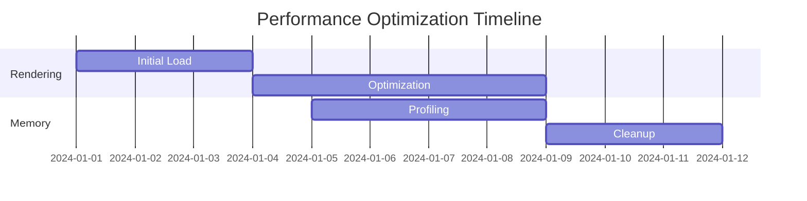

# Mermaid Advanced Features and Optimization Guide

## Purpose

This document complements existing Mermaid documentation by providing advanced techniques, optimization strategies, and integration patterns.

## Context

Building upon our existing standards and syntax guides, these advanced features enable more sophisticated diagram creation and better performance.

## Advanced Features

### 1. Interactive Callbacks

```javascript
mermaid.initialize({
  securityLevel: "loose",
  flowchart: {
    htmlLabels: true,
    curve: "basis",
  },
  callback: function (id) {
    console.log("Diagram rendered:", id);
    // Custom post-render actions
  },
});
```

### 2. Dynamic Rendering Patterns

```javascript
// Lazy loading pattern
const renderDiagram = async (elementId, diagramDefinition) => {
  const element = document.getElementById(elementId);
  if (isElementInViewport(element)) {
    await mermaid.render("graphDiv", diagramDefinition);
  }
};
```

### 3. Advanced Styling Techniques

#### Custom Node Styling

```mermaid
%%{init: {
  'theme': 'base',
  'themeVariables': {
    'primaryColor': '#ff0000',
    'primaryBorderColor': '#fff',
    'primaryTextColor': '#fff',
    'lineColor': '#F8B229',
    'secondaryColor': '#006100',
    'tertiaryColor': '#fff',
    'fontFamily': 'Fira Code',
    'fontSize': '16px',
    'nodeBorder': '2px solid',
    'mainBkg': '#001f3f',
    'nodeBkg': '#003366',
    'clusterBkg': '#00264d'
  }
}}%%
```

#### Advanced Layout Control

```mermaid
%%{init: {
  'flowchart': {
    'nodeSpacing': 50,
    'rankSpacing': 80,
    'curve': 'basis',
    'padding': 20,
    'useMaxWidth': false,
    'htmlLabels': true,
    'diagramPadding': 8
  }
}}%%
```

### 4. Integration Patterns

#### CI/CD Pipeline Integration

```yaml
mermaid-pipeline:
  script:
    - npm install -g @mermaid-js/mermaid-cli
    - mmdc -i input.mmd -o output.svg -c config.json
    - mmdc -i input.mmd -o output.png -b transparent
```

#### Dynamic Data Integration

```javascript
const generateDiagram = (data) => {
  return `
    graph TD
      ${data.nodes.map((node) => `${node.id}[${node.label}]`).join("\n")}
      ${data.edges.map((edge) => `${edge.from}-->${edge.to}`).join("\n")}
  `;
};
```

### 5. Performance Optimization

#### Memory Management

```javascript
// Clear rendered diagrams when not needed
mermaid.initialize({
  startOnLoad: false,
});

const cleanupDiagrams = () => {
  document.querySelectorAll(".mermaid svg").forEach((svg) => {
    svg.remove();
  });
};
```

#### Rendering Optimization

```javascript
// Batch rendering for multiple diagrams
const batchRender = async (diagrams) => {
  const chunks = chunkArray(diagrams, 3); // Process 3 at a time
  for (const chunk of chunks) {
    await Promise.all(
      chunk.map((diagram) => mermaid.render(diagram.id, diagram.definition))
    );
    await new Promise((resolve) => setTimeout(resolve, 100)); // Prevent UI blocking
  }
};
```

### 6. Advanced Animation Techniques

```css
.mermaid .node {
  transition: transform 0.3s ease-in-out;
}

.mermaid .node:hover {
  transform: scale(1.1);
}

.mermaid .edgePath {
  transition: stroke-width 0.2s ease;
}

.mermaid .edgePath:hover {
  stroke-width: 3px;
}
```

### 7. Accessibility Enhancements

```javascript
mermaid.initialize({
  ariaLabel: "Process flow diagram",
  accessibility: {
    describeDiagram: true,
    description: "This diagram shows the main process flow of our application",
    colors: {
      colorBlind: true,
    },
  },
});
```

## Error Handling Matrix

| Scenario              | Detection              | Resolution                                      |
| --------------------- | ---------------------- | ----------------------------------------------- |
| Syntax Error          | Parser validation      | Provide detailed error message with line number |
| Rendering Timeout     | Performance monitoring | Implement progressive rendering                 |
| Memory Leak           | Memory profiling       | Cleanup unused SVG elements                     |
| Browser Compatibility | Feature detection      | Fallback to static images                       |

## Performance Metrics



## Security Considerations

### XSS Prevention

```javascript
// Sanitize input before rendering
const sanitizeDiagram = (input) => {
  return input
    .replace(/[<>]/g, "")
    .replace(/javascript:/gi, "")
    .replace(/on\w+=/gi, "");
};
```

## Testing Strategy

```javascript
describe("Mermaid Diagram Tests", () => {
  it("should render complex diagrams correctly", async () => {
    const diagram = `graph TD; A-->B; B-->C;`;
    const result = await mermaid.render("test-id", diagram);
    expect(result.svg).toBeTruthy();
  });
});
```

## References

1. [Mermaid Performance Guide](https://mermaid.js.org/misc/performance.html)
2. [Advanced Configuration](https://mermaid.js.org/config/configuration.html)
3. [Integration Examples](https://mermaid.js.org/misc/integrations.html)
