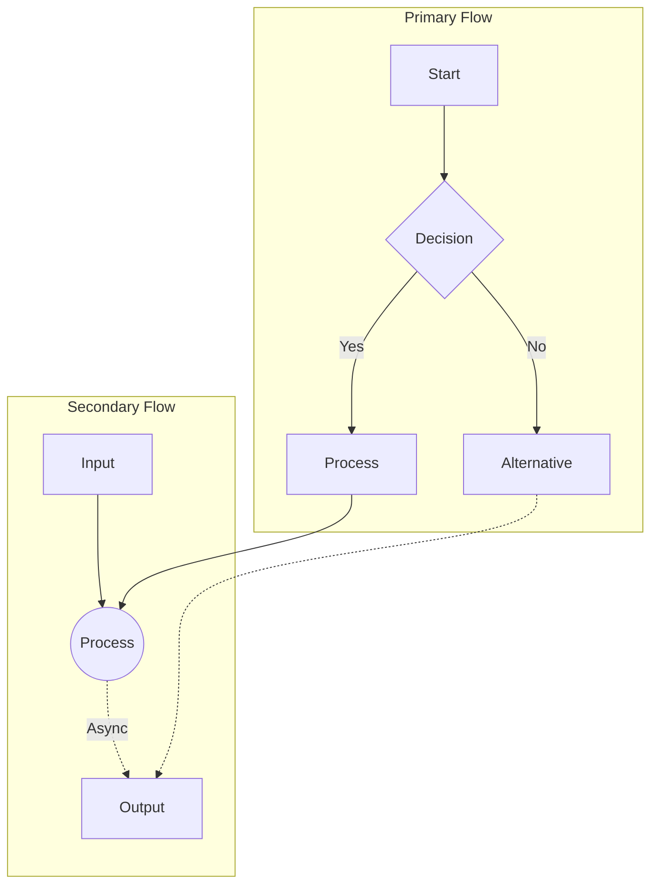
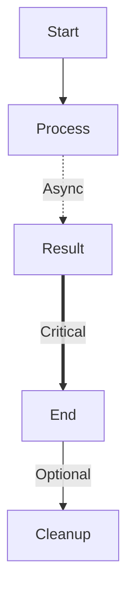
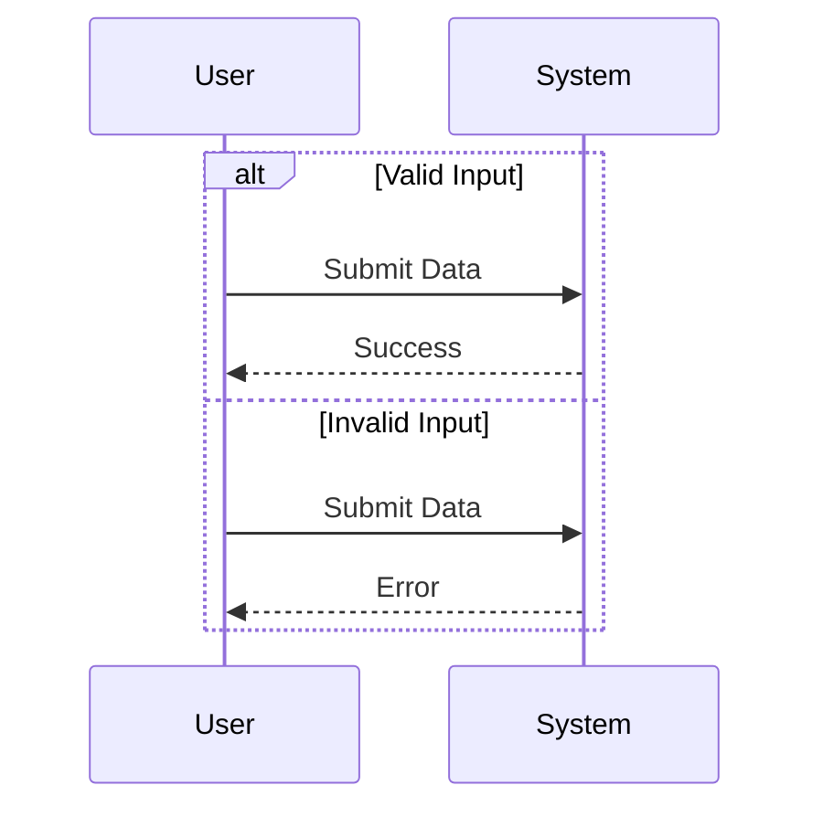
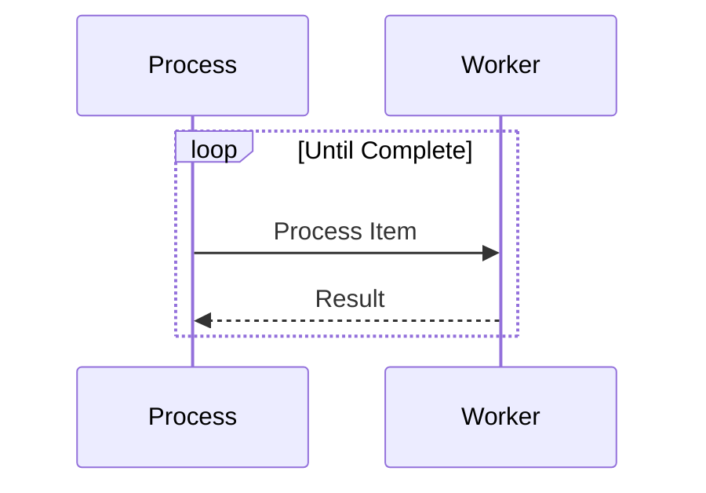
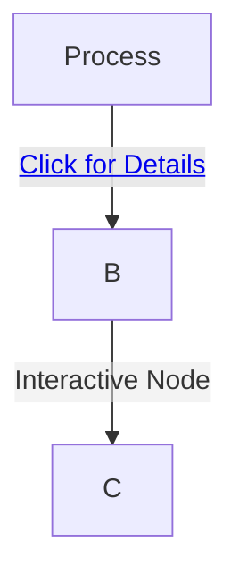
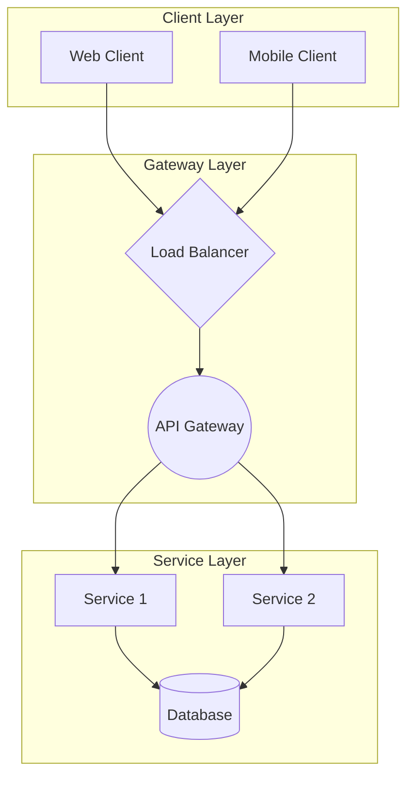

# Mermaid Diagram Layout Standards

## Core Layout Principles

### 1. Shape Control

- Target a roughly square aspect ratio (1:1 to 1:1.5)
- Maximum width should not exceed 1.5x height
- Use vertical layouts (`TB`) as the default direction
- Break wide diagrams into vertical sections using subgraphs

### 2. Configuration and Initialization

```javascript
mermaid.initialize({
  startOnLoad: true,
  theme: "forest",
  sequence: {
    diagramMarginX: 50,
    diagramMarginY: 10,
    actorMargin: 50,
    width: 150,
    height: 65,
    boxMargin: 10,
    boxTextMargin: 5,
    messageMargin: 35,
    mirrorActors: true,
  },
  flowchart: {
    htmlLabels: false,
    curve: "linear",
  },
});
```

### 3. Development Integration

#### Editor Integration

- Use Mermaid plugins with:
  - Visual Studio Code
  - Atom
  - Sublime Text
  - Benefits: Syntax highlighting, code completion, live preview

#### Documentation Platforms

- Direct integration with:
  - GitBook
  - MkDocs
  - Docusaurus
  - Markdown-based documentation

#### DevOps Integration

- Embed diagrams in:
  - CI/CD pipeline reports
  - Jenkins documentation
  - GitLab CI visualizations
  - Build process documentation

### 4. Advanced Layout Techniques



### 5. Visual Enhancement Techniques

#### Node Styling

- Use diverse shapes for clear visual hierarchy:
  - `[Rectangle]` - Standard processes
  - `(Round)` - Entry/Exit points
  - `{Diamond}` - Decision points
  - `((Circle))` - Interface points
  - `>Asymmetric]` - Inputs/Outputs

#### Connection Types



### 6. Complex Flow Management

#### Using Alt Sections



#### Loop Visualization



### 7. Interactive Enhancements

#### HTML Integration



#### Dynamic Elements

- Include clickable elements
- Add HTML labels for rich formatting
- Embed links to documentation
- Use hover states for additional information

## Implementation Guidelines

### 1. CSS Configuration

```css
.mermaid {
  --diagram-padding: 20px;
  --node-spacing: 50px;
  --rank-spacing: 80px;

  display: flex;
  justify-content: center;
  padding: var(--diagram-padding);
  max-width: min(900px, 90vw);
  aspect-ratio: 1 / 1.2;
}
```

### 2. Best Practices

1. **Vertical Flow Organization**

   - Stack related components vertically
   - Use subgraphs for parallel processes
   - Limit horizontal node spread to 3-4 items

2. **Connection Management**

   - Use different line styles meaningfully:
     - Solid (`-->`) for main flow
     - Dotted (`-.->`) for async/optional
     - Thick (`==>`) for critical paths
   - Minimize crossing lines with proper node placement

3. **Interactive Elements**
   - Use notes for additional context
   - Implement loops for repetitive processes
   - Utilize alt sections for conditional flows

### 3. Troubleshooting

| Common Issues     | Solution                                           |
| ----------------- | -------------------------------------------------- |
| Wide diagrams     | Split into vertical subgraphs                      |
| Dense connections | Use intermediate nodes                             |
| Overlapping       | Increase spacing variables                         |
| Poor readability  | Implement proper node shapes and connection styles |

## Advanced Examples

### Complex System Architecture



## Export Options

### Format Support

- SVG (recommended for web)
- mmd (recommended for source control and design)

## Maintenance Guidelines

1. **Version Control**

   - Store diagrams as both mmd and svg in source control
   - Review diagram changes in PRs
   - Maintain diagram history

2. **Documentation Sync**

   - Keep diagrams updated with code changes
   - Include diagrams in code review process
   - Use of comments should be liberal

3. **Performance Optimization**
   - Use lazy loading for multiple diagrams
   - Implement caching strategies
