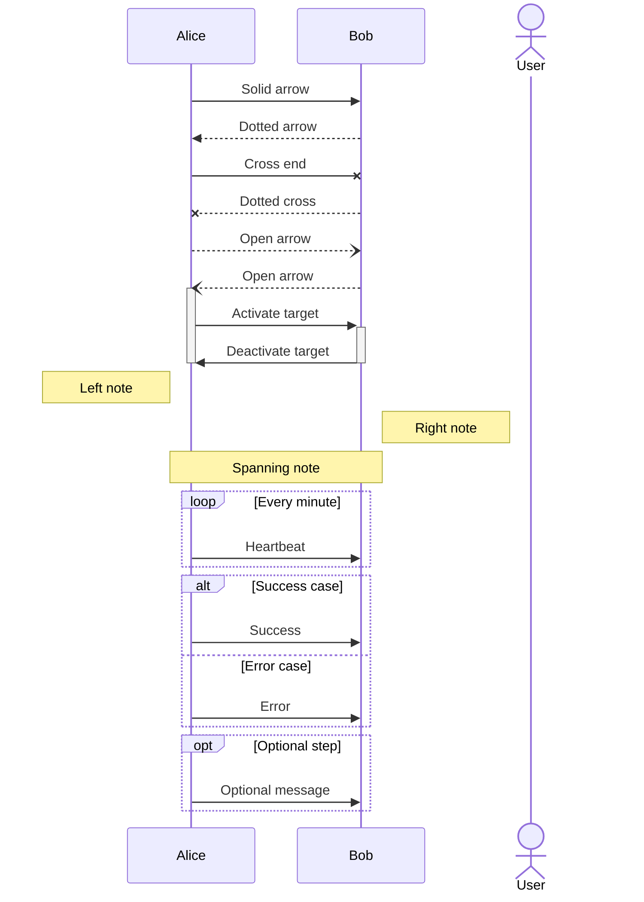
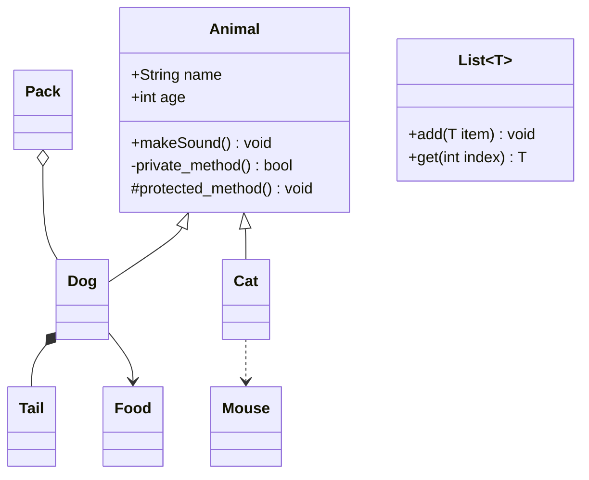
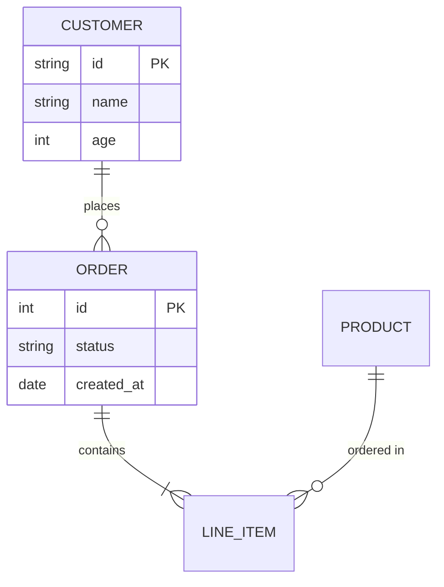
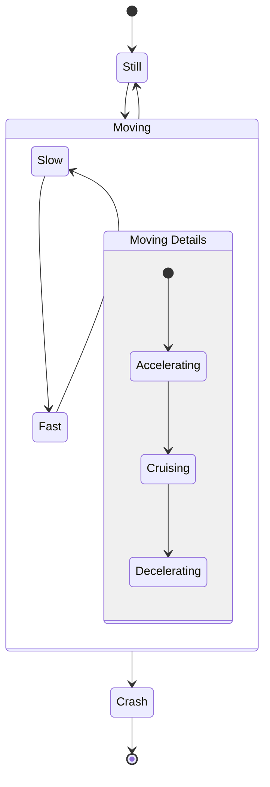
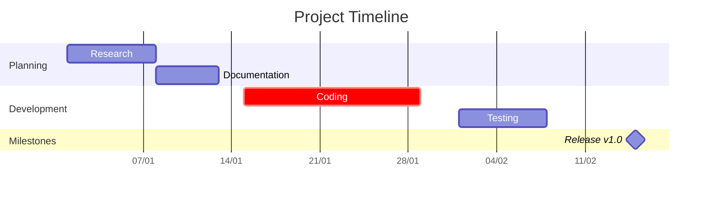
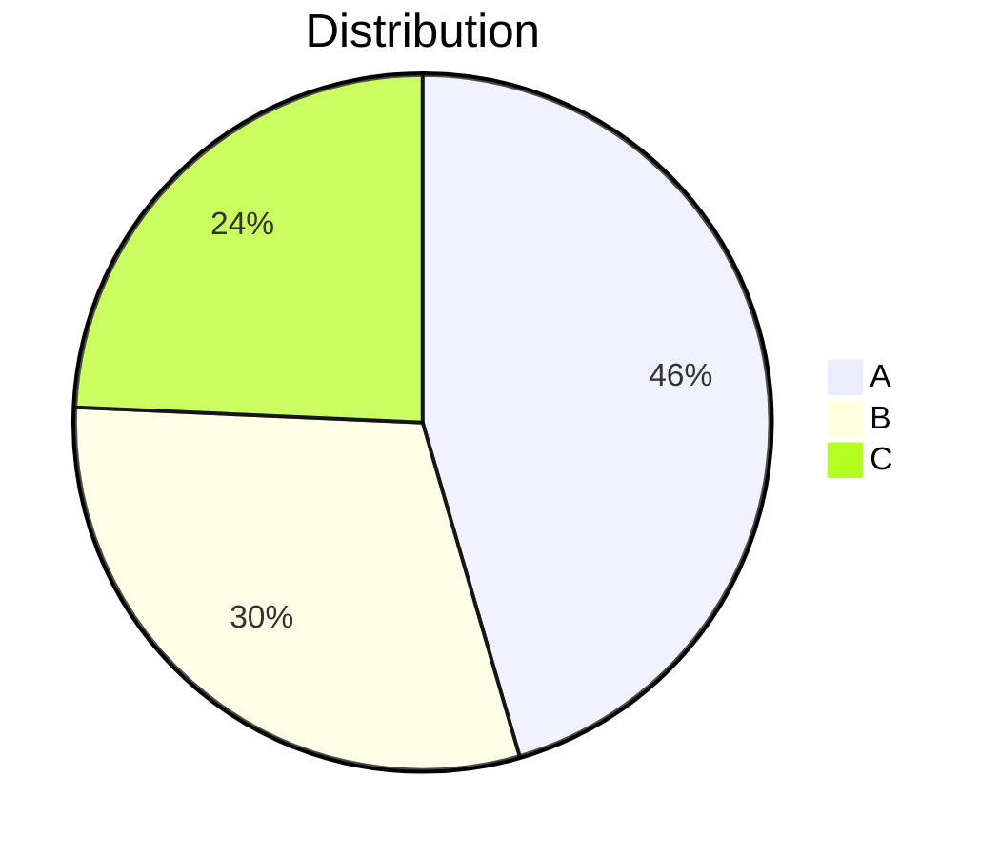
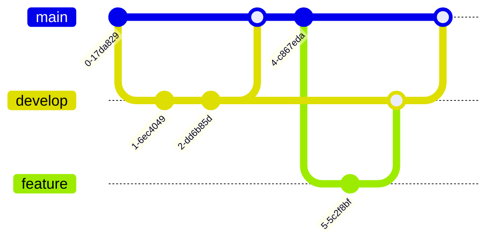

# Advanced Mermaid Syntax Guide

## Purpose

This document provides a comprehensive reference for all Mermaid diagram syntaxes, including advanced features and configurations.

## Context

Mermaid supports multiple diagram types, each with its own syntax rules and capabilities.([1](https://github.com/mermaid-js/mermaid/tree/develop/packages/mermaid/src/docs/syntax))

## Detailed Syntax Reference

### 1. Flowchart Syntax

```mermaid
graph TD
    %% Basic node types
    A[Square Node]
    B(Rounded Node)
    C([Stadium Node])
    D[[Subroutine]]
    E[(Database)]
    F((Circle))
    G>Asymmetric]
    H{Diamond}
    I{{Hexagon}}
    J[/Parallelogram/]
    K[\Parallelogram alt\]
    L[/Trapezoid\]
    M[\Trapezoid alt/]

    %% Connection types
    A --> B %% Arrow
    B --- C %% Line
    C -.-> D %% Dotted arrow
    D ==> E %% Thick arrow
    E -.- F %% Dotted line
    F ==== G %% Thick line

    %% Advanced connections
    H --text--> I
    I ==text==> J
    J -.text.-> K
    K --text--- L
    L ==text=== M
```

### 2. Sequence Diagram Syntax



### 3. Class Diagram Syntax



### 4. Entity Relationship Diagram Syntax



### 5. State Diagram Syntax



### 6. Gantt Chart Syntax



### 7. Pie Chart Syntax



### 8. Git Graph Syntax



## Advanced Features

### Theme Configuration

```mermaid
%%{init: {
  'theme': 'base',
  'themeVariables': {
    'primaryColor': '#ff0000',
    'primaryTextColor': '#fff',
    'primaryBorderColor': '#fff',
    'lineColor': '#f00',
    'secondaryColor': '#006100',
    'tertiaryColor': '#fff'
  }
}}%%
```

### Directives

```mermaid
%%{init: {'securityLevel': 'loose', 'theme':'dark'}}%%
%%{config: { 'fontFamily': 'arial', 'fontSize': 14 } }%%
```

## Error Handling and Logging

- Syntax validation through live editor
- Browser console error messages
- Common error patterns and solutions

## Known Issues

- Complex diagrams may have performance impact
- Browser compatibility considerations
- Mobile rendering limitations

## Performance Considerations

- Limit node count for complex diagrams
- Use appropriate diagram type for data representation
- Consider lazy loading for multiple diagrams

## Security Considerations

- Sanitize user input for dynamic diagrams
- Use appropriate security level settings
- Validate external data sources

## Testing Notes

- Verify rendering in multiple browsers
- Test different themes and configurations
- Validate complex diagram structures

## References

1. [Mermaid Syntax Documentation](https://github.com/mermaid-js/mermaid/tree/develop/packages/mermaid/src/docs/syntax)
2. [Mermaid Configuration Guide](https://github.com/mermaid-js/mermaid/tree/develop/packages/mermaid/src/docs/config)
3. [Community Examples](https://github.com/mermaid-js/mermaid/tree/develop/packages/mermaid/src/docs/community)
