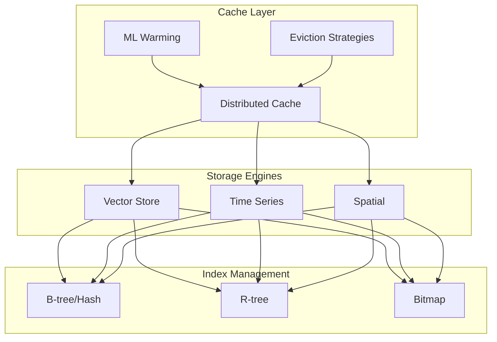
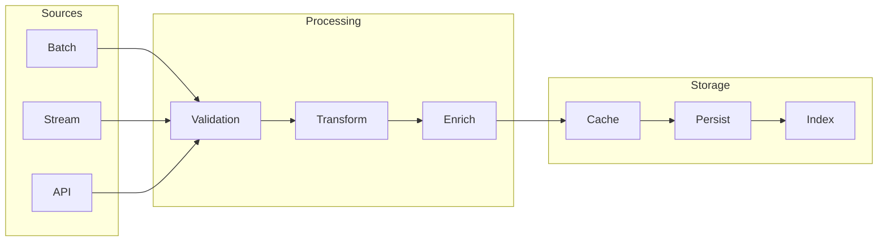

# Week 6 Progress Report: Lake Service and Core Infrastructure

## Overview

Week 6 focused on completing Phase 1 of the Lake Service implementation (95% complete) and significant documentation improvements. Major progress was made in storage layer optimization, distributed systems implementation, and technical documentation enhancement.

## Key Accomplishments

### 1. Lake Service Implementation (95% Complete)

#### Storage Layer Implementation (40 hours)

- **Cache System Enhancement** (15 hours)

  - Implemented ML-based cache warming strategies (`ml_strategies.py`)
  - Added multiple eviction policies (`cache_strategies.py`)
  - Integrated distributed cache coordination (`cache.py`)

- **Storage Engine Optimization** (25 hours)
  - Enhanced quorum-based consistency (`quorum.py`)
  - Improved geometric operations (`geometry.py`)
  - Optimized store implementations (`stores.py`)

#### Ingestion Framework (30 hours)

- **Core Components** (20 hours)

  - Enhanced monitoring system (`monitoring.py`)
  - Improved core ingestion pipeline (`core.py`)
  - Added bulk processing capabilities (`bulk/`)

- **Integration Work** (10 hours)
  - Added Google Cloud support (`google/`)
  - Enhanced error handling
  - Improved rate limiting

#### Distributed Systems (25 hours)

- **Sharding Implementation** (15 hours)

  - Hash-based partitioning
  - Range-based distribution
  - Geospatial sharding

- **System Coordination** (10 hours)
  - Consensus mechanism
  - Recovery procedures
  - Replication management

### 2. Documentation and Planning (35 hours)

#### Technical Documentation

- **Mermaid Graph Enhancement** (15 hours)

  - Created comprehensive Mermaid documentation:
    - `MermaidStandards.md`: Style and usage guidelines
    - `MermaidSyntax.md`: Syntax reference
    - `MermaidOptimization.md`: Performance tips
    - `MermaidAdvancedFeatures.md`: Advanced usage

- **Graph Generation System** (10 hours)
  - Implemented automated SVG generation
  - Added CSS styling for better visualization
  - Created embedding scripts for documentation

#### Project Planning (10 hours)

- **Roadmap Development**
  - Created detailed phase documentation (1-14)
  - Enhanced timeline tracking
  - Added completion metrics
  - Refined feature specifications

### 3. Infrastructure Work (20 hours)

- **Monitoring Enhancement** (8 hours)

  - Extended logging coverage
  - Added performance metrics
  - Improved tracing

- **Development Tools** (12 hours)
  - Enhanced build scripts
  - Improved test infrastructure
  - Added development utilities

## Technical Deep Dive

### Storage Layer Architecture

### Ingestion Pipeline

## Technical Challenges & Solutions

### Challenge 1: Cache Performance

Addressed through:

- Implementation of ML-based prediction (`ml_strategies.py`)
- Optimized eviction policies (`cache_strategies.py`)
- Enhanced distributed coordination (`quorum.py`)

### Challenge 2: Distributed Consistency

Solved using:

- Quorum-based writes
- Versioned data storage
- Conflict resolution strategies

## Next Steps

With a very solid foundation finally in place, the next steps are to complete the remaining 5% of the Lake Service implementation and begin the next phase of development. It is unlikely that the phases will be completed in order, but that is fine. We will continue to focus on completing the highest priority items first. I plan on befor the end of the project window for the class, to atlest get the 3 core data and api modules into a working prototype with a fucntional frontend. I think that it is within reach, though my sleep schedule is not gonna appreicate it. I have really been enjoying the work, and I think that this is worth putting in the blood and pain while its technically my job.

## Conclusion

Week 6 saw substantial progress in both implementation and documentation. The enhanced Mermaid documentation and graph generation system will significantly improve our technical documentation quality. The Lake Service is near completion, with only performance optimization remaining. The github repo also has a new readme finally, so you can actually see what the project is about lol. Also, I added a bit of a guide to get VSCode to render everything the way it looks to me in the editor. Eventually, I will have the time to finish all converting the dedicated ones to .svg, but I digress.

## References

- Lake Service: `datapunk/containers/lake/`
  - Storage: `src/storage/`
  - Ingestion: `src/ingestion/`
- Documentation:
  - Mermaid: `docs/development/mermaid/`
  - Roadmap: `docs/development/roadmap-list/`
  - Graphs: `docs/MVP/graphs/`

Note: Time estimates are approximate and include research, implementation, testing, and documentation for each component. My sleep schedule is so wack, that I end up practically nocturnal, as the middle of the night and early morning is when i seem to be most productive, and I can work completely uninterrupted. This, as you could imagine, causes an already adhd brain to completely forget how long its been, and what I technically did in that time. Just a disclaimer.
