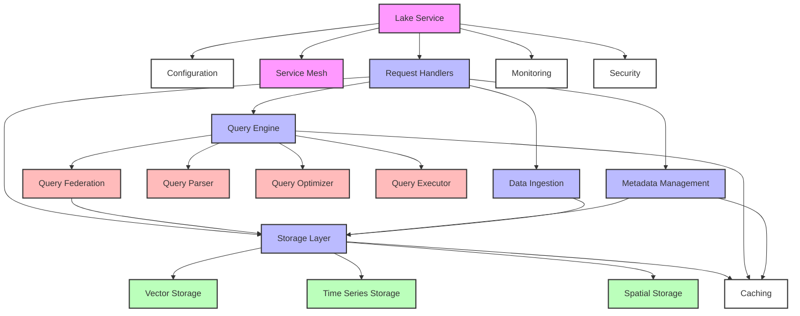

/\*

- Lake Service Documentation
- ========================
-
- Purpose: Documentation of the Lake service components and architecture
- Last Updated: 2024-01-09
  \*/

/\*

- Directory Structure Overview
- ***
- /datapunk/containers/lake/
- ├── src/ - Source code
- │ ├── config/ - Configuration management
- │ ├── handlers/ - Request handlers
- │ ├── ingestion/ - Data ingestion
- │ ├── mesh/ - Service mesh integration
- │ ├── metadata/ - Metadata management
- │ ├── processing/ - Data processing
- │ ├── query/ - Query processing
- │ ├── services/ - Service layer
- │ ├── storage/ - Storage management
- │ └── main.py - Application entry point
  \*/

/\*

- TODOs and Known Issues
- ***
- 1.  Verify all component dependencies are documented
- 2.  Check for duplicate functionality between query and storage layers
- 3.  Document integration points with other services
- 4.  Add performance considerations for each major component
- 5.  Document security considerations and access controls
- 6.  Add deployment and scaling guidelines
- 7.  Document backup and recovery procedures
- 8.  Add monitoring and alerting setup
      \*/

/\*

- Core Components
- ==============
  \*/

/\*

- 1.  Configuration (/src/config)
- ***
  \*/

// Core Configuration
// /src/config/config_manager.py - Configuration management
// - Service configuration
// - Environment handling
// - Configuration validation

// Storage Configuration
// /src/config/storage_config.py - Storage-specific configuration
// - Storage engine settings
// - Connection parameters
// - Performance tuning

/\*

- 2.  Request Handlers (/src/handlers)
- ***
  \*/

// Core Operation Handlers
// /src/handlers/storage_handler.py - Storage operations
// - CRUD operations
// - Storage engine coordination
// - Transaction management

// /src/handlers/query_handler.py - Query operations
// - Query routing
// - Query optimization
// - Result handling

// /src/handlers/ingestion_handler.py - Ingestion operations
// - Data intake
// - Validation coordination
// - Pipeline management

// /src/handlers/processing_handler.py - Processing operations
// - Data transformation
// - Processing pipeline coordination
// - Error handling

// Data Management Handlers
// /src/handlers/metadata_handler.py - Metadata operations
// - Schema management
// - Metadata indexing
// - Relationship tracking

// /src/handlers/partition_handler.py - Partition operations
// - Data partitioning
// - Partition management
// - Distribution control

// /src/handlers/config_handler.py - Configuration operations
// - Configuration management
// - Settings validation
// - Environment control

// Integration Handlers
// /src/handlers/stream_handler.py - Stream operations
// - Stream processing
// - Real-time data handling
// - Flow control

// /src/handlers/nexus_handler.py - Nexus integration
// - Service integration
// - Cross-service communication
// - Protocol handling

// /src/handlers/federation_handler.py - Federation operations
// - Query federation
// - Data distribution
// - Cross-node coordination

/\*

- 3.  Data Ingestion (/src/ingestion)
- ***
  \*/

// Core Ingestion
// /src/ingestion/core.py - Base ingestion functionality
// - Pipeline coordination
// - Data flow management
// - Error handling

// Data Sources
// /src/ingestion/sources/file_source.py - File ingestion
// - File system monitoring
// - Format detection
// - Batch processing

// /src/ingestion/sources/stream_source.py - Stream ingestion
// - Real-time data handling
// - Stream processing
// - Flow control

// /src/ingestion/sources/api_source.py - API ingestion
// - API integration
// - Protocol handling
// - Rate limiting

// Data Validation
// /src/ingestion/validation/schema_validator.py - Schema validation
// - Schema enforcement
// - Type checking
// - Constraint validation

// /src/ingestion/validation/quality_validator.py - Quality validation
// - Data quality checks
// - Anomaly detection
// - Quality metrics

// Data Transformation
// /src/ingestion/transform/base_transformer.py - Base transformation
// - Data cleaning
// - Format conversion
// - Field mapping

// /src/ingestion/transform/specialized_transformer.py - Specialized transformation
// - Custom transformations
// - Complex mappings
// - Business logic

// Integration
// /src/ingestion/google/takeout.py - Google Takeout integration
// - Google data import
// - Format handling
// - Metadata extraction

/\*

- 4.  Service Mesh (/src/mesh)
- ***
  \*/

// Core Mesh
// /src/mesh/mesh_integrator.py - Service mesh integration
// - Service discovery
// - Load balancing
// - Circuit breaking
// - Health checking
// - Retry logic
// - Timeout management
// - Traffic routing
// - Metrics collection
// - Tracing integration
// - Security enforcement

// Initialization
// /src/mesh/**init**.py - Mesh initialization
// - Configuration loading
// - Component registration
// - Service startup

/\*

- 5.  Metadata Management (/src/metadata)
- ***
  \*/

// Core Metadata
// /src/metadata/core.py - Base metadata functionality
// - Schema management
// - Metadata indexing
// - Relationship tracking
// - Version control
// - Lineage tracking
// - Access control
// - Audit logging

// Storage Layer
// /src/metadata/store.py - Metadata storage
// - Storage backend
// - CRUD operations
// - Query interface
// - Cache integration
// - Transaction handling

// Enhancement Features
// /src/metadata/analyzer.py - Metadata analysis
// - Pattern detection
// - Schema inference
// - Quality assessment
// - Usage analytics
// - Impact analysis
// - Dependency tracking
// - Anomaly detection
// - Trend analysis

// Performance Features
// /src/metadata/cache.py - Metadata caching
// - Cache management
// - Invalidation strategy
// - Consistency control
// - Performance optimization
// - Memory management
// - Cache warming
// - Cache eviction

/\*

- 6. Data Processing (/src/processing)
- ***
  \*/

// Core Processing
// /src/processing/validator.py - Data validation
// - Schema validation
// - Data type checking
// - Constraint validation
// - Format verification
// - Quality assessment
// - Custom rule enforcement
// - Error reporting
// - Validation metrics
// - Pipeline integration

/\*

- 7.  Query Processing (/src/query)
- ***
  \*/

// Query Parsing (/src/query/parser)
// Core Parser
// /src/query/parser/core.py - Base parsing functionality
// - Query tokenization
// - AST generation
// - Syntax validation

// SQL Support
// /src/query/parser/sql.py - SQL parsing
// /src/query/parser/sql_advanced.py - Advanced SQL features
// /src/query/parser/sql_extensions.py - SQL extensions
// - SQL dialect support
// - Query normalization
// - Extension handling

// NoSQL Support
// /src/query/parser/nosql.py - NoSQL parsing
// /src/query/parser/nosql_advanced.py - Advanced NoSQL features
// /src/query/parser/nosql_extensions.py - NoSQL extensions
// - Document queries
// - Graph traversal
// - Key-value operations

// Query Optimization (/src/query/optimizer)
// /src/query/optimizer/core.py - Base optimization
// /src/query/optimizer/rules.py - Optimization rules
// /src/query/optimizer/index_aware.py - Index-aware optimization
// /src/query/optimizer/executor_bridge.py - Executor integration
// - Cost-based optimization
// - Rule-based optimization
// - Index utilization
// - Join optimization

// Query Formatting (/src/query/formatter)
// /src/query/formatter/core.py - Base formatting
// /src/query/formatter/specialized.py - Specialized formatters
// - Query beautification
// - Format conversion
// - Output customization

// Query Validation (/src/query/validation)
// /src/query/validation/core.py - Base validation
// /src/query/validation/sql.py - SQL validation
// /src/query/validation/sql_advanced.py - Advanced SQL validation
// /src/query/validation/nosql.py - NoSQL validation
// - Syntax checking
// - Semantic validation
// - Permission checking
// - Resource validation

// Query Federation (/src/query/federation)
// Core Federation
// /src/query/federation/core.py - Base federation
// /src/query/federation/manager.py - Federation management
// /src/query/federation/planner.py - Query planning
// /src/query/federation/executor.py - Federation execution
// - Query distribution
// - Result aggregation
// - Cross-node optimization

// Federation Processing
// /src/query/federation/splitter.py - Query splitting
// /src/query/federation/merger.py - Result merging
// /src/query/federation/rules.py - Federation rules
// - Query decomposition
// - Result composition
// - Rule application

// Federation Features
// /src/query/federation/cache_strategies.py - Caching
// /src/query/federation/monitoring.py - Monitoring
// /src/query/federation/alerting.py - Alerting
// /src/query/federation/visualization.py - Visualization
// /src/query/federation/profiling.py - Performance profiling
// - Performance optimization
// - System monitoring
// - Alert management
// - Visual analytics

// Federation Adapters
// /src/query/federation/adapters/base.py - Base adapter
// /src/query/federation/adapters/sql.py - SQL adapter
// /src/query/federation/adapters/postgres.py - PostgreSQL
// /src/query/federation/adapters/timescale.py - TimescaleDB
// /src/query/federation/adapters/timescale_advanced.py - Advanced TimescaleDB
// /src/query/federation/adapters/pgvector.py - pgvector
// /src/query/federation/adapters/pgvector_advanced.py - Advanced pgvector
// /src/query/federation/adapters/specialized.py - Specialized adapters
// - Database connectivity
// - Protocol handling
// - Feature support

// Query Execution (/src/query/executor)
// Core Execution
// /src/query/executor/core.py - Base execution
// /src/query/executor/joins.py - Join operations
// /src/query/executor/aggregates.py - Aggregations
// /src/query/executor/windows.py - Window functions
// - Query execution
// - Result generation
// - Resource management

// Execution Features
// /src/query/executor/parallel.py - Parallel execution
// /src/query/executor/adaptive.py - Adaptive execution
// /src/query/executor/caching.py - Execution caching
// /src/query/executor/streaming.py - Stream processing
// - Parallel processing
// - Runtime adaptation
// - Cache utilization
// - Stream handling

// Execution Management
// /src/query/executor/monitoring.py - Execution monitoring
// /src/query/executor/fault_tolerance.py - Error handling
// /src/query/executor/progress.py - Progress tracking
// /src/query/executor/resources.py - Resource management
// /src/query/executor/security.py - Security enforcement
// - Performance monitoring
// - Error recovery
// - Progress reporting
// - Resource control
// - Security checks

/\*

- 8.  Service Layer (/src/services)
- ***
  \*/

// Core Services
// /src/services/lake_service.py - Lake service implementation
// - Service initialization
// - Request handling
// - Component coordination
// - Error management
// - Resource management
// - Lifecycle control
// - Health monitoring
// - Performance tracking

// Service Management
// /src/services/service_manager.py - Service lifecycle management
// - Service registration
// - Dependency injection
// - Configuration management
// - State management
// - Health checking
// - Graceful shutdown
// - Recovery handling
// - Load balancing

/\*

- 9.  Storage Management (/src/storage)
- ***
  \*/

// Core Storage
// /src/storage/core.py - Base storage functionality
// - Storage abstraction
// - CRUD operations
// - Transaction management
// - Connection pooling
// - Error handling
// - Performance monitoring

// Storage Types
// /src/storage/vector.py - Vector storage
// - Vector operations
// - Similarity search
// - Dimension management
// - Index optimization
// - Batch processing

// /src/storage/timeseries.py - Time series storage
// - Time-based operations
// - Series management
// - Aggregation support
// - Retention policies
// - Continuous aggregates

// /src/storage/spatial.py - Spatial storage
// - Spatial operations
// - Geometry handling
// - Spatial indexing
// - Coordinate systems
// - Topology operations

// Storage Features
// /src/storage/partitioning.py - Data partitioning
// - Partition strategy
// - Distribution logic
// - Rebalancing
// - Partition pruning

// /src/storage/indexing.py - Index management
// - Index creation
// - Index maintenance
// - Query optimization
// - Statistics collection

// /src/storage/caching.py - Cache management
// - Cache strategies
// - Invalidation
// - Consistency
// - Memory management

// /src/storage/backup.py - Backup management
// - Backup strategies
// - Recovery procedures
// - Point-in-time recovery
// - Consistency checks

/\*

- 10. Main Application (/src)
- ***
  \*/

// /src/main.py - Main application entry point
// - Service initialization
// - Component wiring
// - Configuration loading
// - Error handling
// - Shutdown procedures
// - Health checks
// - Metrics collection
// - Logging setup

/\*

- Duplicate Functionality Analysis
- ============================
  \*/

/\*

- 1. Query and Storage Layer Overlap

---

\*/

// Caching Implementation
// - /src/query/federation/cache_strategies.py
// - /src/storage/caching.py
// - /src/metadata/cache.py
// TODO: Consolidate caching strategies into a shared caching service
// TODO: Implement cache coherence protocol between layers

// Validation Logic
// - /src/query/validation/_
// - /src/processing/validator.py
// - /src/ingestion/validation/_
// TODO: Create a shared validation framework
// TODO: Implement validation rule inheritance

// Index Management
// - /src/query/optimizer/index_aware.py
// - /src/storage/indexing.py
// TODO: Centralize index management
// TODO: Implement cross-layer index usage optimization

/\*

- 2. Monitoring and Metrics Overlap

---

\*/

// Performance Monitoring
// - /src/query/federation/monitoring.py
// - /src/query/executor/monitoring.py
// - /src/services/lake_service.py
// TODO: Create unified monitoring service
// TODO: Standardize metrics collection

// Health Checking
// - /src/mesh/mesh_integrator.py
// - /src/services/service_manager.py
// TODO: Consolidate health check implementation
// TODO: Create centralized health monitoring

/\*

- 3. Security Implementation Overlap

---

\*/

// Access Control
// - /src/query/validation/core.py
// - /src/metadata/core.py
// - /src/query/executor/security.py
// TODO: Implement centralized security service
// TODO: Standardize access control patterns

/\*

- Component Cross-References
- ======================
  \*/

/\*

- 1.  Data Flow Dependencies
- ***
  \*/

// Ingestion Pipeline
// ingestion/core.py -> processing/validator.py -> storage/core.py
// - Data flows from ingestion through validation to storage
// - Metadata is tracked via metadata/core.py
// - Events are monitored via query/federation/monitoring.py

// Query Pipeline
// query/parser/_ -> query/optimizer/_ -> query/executor/_ -> storage/_
// - Queries are parsed, optimized, and executed
// - Results flow back through executor to client
// - Federation handled by query/federation/\* when needed

/\*

- 2.  Service Dependencies
- ***
  \*/

// Core Service Dependencies
// services/lake_service.py depends on:
// - handlers/\* for request handling
// - mesh/mesh_integrator.py for service mesh
// - config/config_manager.py for configuration

// Handler Dependencies
// handlers/storage*handler.py depends on:
// - storage/* for storage operations
// - metadata/_ for metadata operations
// handlers/query_handler.py depends on:
// - query/_ for query processing
// - federation/\_ for distributed queries

/\*

- 3.  Feature Dependencies
- ***
  \*/

// Caching Dependencies
// storage/caching.py coordinates with:
// - query/federation/cache_strategies.py
// - metadata/cache.py
// For coherent caching across layers

// Monitoring Dependencies
// mesh/mesh_integrator.py coordinates with:
// - query/federation/monitoring.py
// - query/executor/monitoring.py
// For comprehensive system monitoring

/\*

- Component-Specific TODOs
- ====================
  \*/

/\*

- 1.  Configuration TODOs
- ***
  \*/

// config/config_manager.py
// TODO: Implement dynamic configuration reloading
// TODO: Add configuration validation schemas
// TODO: Add configuration versioning
// TODO: Implement configuration backup/restore

// config/storage_config.py
// TODO: Add performance tuning presets
// TODO: Implement auto-tuning based on workload
// TODO: Add storage engine-specific optimizations

/\*

- 2.  Query Processing TODOs
- ***
  \*/

// Query Parser
// TODO: Add support for custom query languages
// TODO: Implement query cost estimation
// TODO: Add query plan visualization
// TODO: Improve error messages and suggestions

// Query Optimizer
// TODO: Implement adaptive query optimization
// TODO: Add statistics-based optimization
// TODO: Support user-defined optimization rules
// TODO: Add optimization fence hints

// Query Federation
// TODO: Implement cross-datacenter federation
// TODO: Add federation cost model
// TODO: Improve federation reliability
// TODO: Add federation monitoring dashboard

/\*

- 3.  Storage TODOs
- ***
  \*/

// Vector Storage
// TODO: Implement approximate nearest neighbor search
// TODO: Add vector compression
// TODO: Optimize batch operations
// TODO: Add vector clustering

// Time Series Storage
// TODO: Implement downsampling
// TODO: Add forecasting capabilities
// TODO: Optimize chunk size
// TODO: Add real-time aggregation

// Spatial Storage
// TODO: Add spatial clustering
// TODO: Implement spatial partitioning
// TODO: Add geofencing support
// TODO: Optimize spatial joins

/\*

- 4.  Service Layer TODOs
- ***
  \*/

// Service Management
// TODO: Implement graceful degradation
// TODO: Add service discovery
// TODO: Improve fault tolerance
// TODO: Add service metrics dashboard

// Mesh Integration
// TODO: Add circuit breaker patterns
// TODO: Implement retry strategies
// TODO: Add rate limiting
// TODO: Improve mesh monitoring

/\*

- Component Dependency Diagram
- ========================
  \*/

This completes the comprehensive documentation of the Lake service, including:

1. Component structure and relationships
2. Duplicate functionality analysis
3. Cross-references between components
4. Specific TODOs for each component
5. Visual dependency diagram

Would you like me to:

1. Add more detail to any section?
2. Create additional diagrams for specific subsystems?
3. Add performance considerations for component interactions?
4. Document specific integration points with other services?
