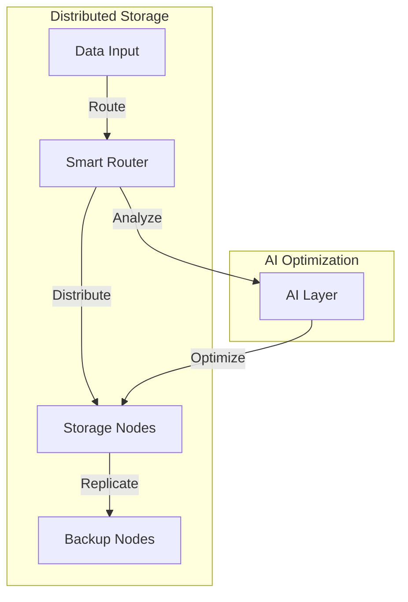
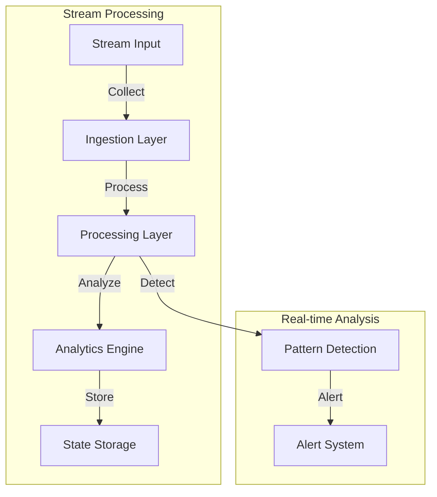
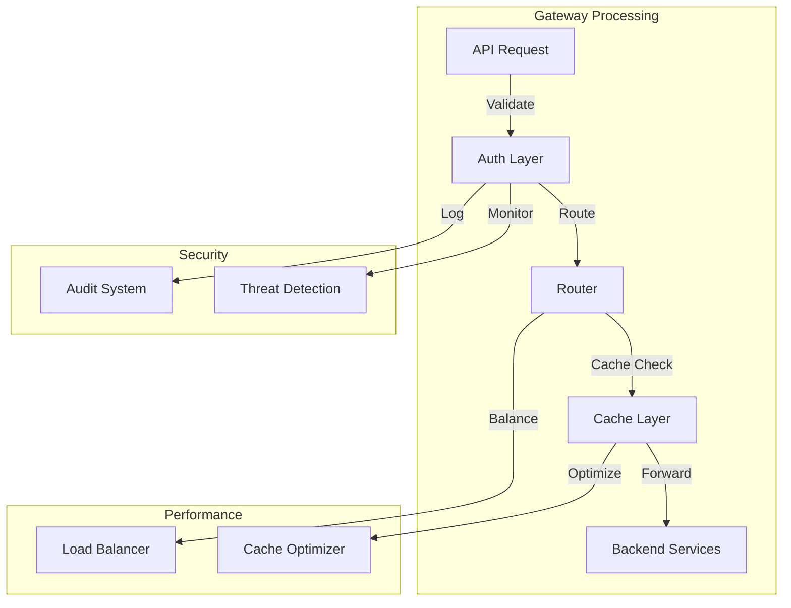

# Datapunk Project Status & Restructuring Plan

## Current Progress

### Completed Components

- ✓ Database connection pooling
- ✓ Message queue handling (DLQ, Retry, Batch patterns)
- ✓ Caching strategies
- ✓ Metrics collection
- ✓ Basic auth components
- ✓ Service mesh foundations

### In Progress Components

- ⚠️ Service discovery implementation
- ⚠️ Health check coordination
- ⚠️ Circuit breaking
- ⚠️ Load balancing
- ⚠️ Retry policies

## Proposed Restructuring Plan

### Shared Library (`datapunk/lib/shared/datapunk_shared/`)

```python
datapunk_shared/
├── auth/ # Authentication & Authorization
│ ├── core/ # Core auth functionality
│ ├── api_keys/ # API key management
│ ├── policy/ # Policy management
│ └── audit/ # Audit logging & reporting
├── database/ # Database Operations
│ ├── pool.py # Connection pooling ✓
│ └── migrations.py # Schema migrations ✓
├── messaging/ # Message Handling
│ ├── patterns/ # Messaging Patterns
│ │ ├── dlq.py # Dead Letter Queue ✓
│ │ ├── retry.py # Retry Logic ✓
│ │ └── batch.py # Batch Processing ✓
│ ├── pubsub/ # Pub/Sub System
│ │ ├── broker.py # Message Broker ✓
│ │ └── subscriber.py # Message Subscriber ✓
│ └── queue/ # Queue Management
│ └── manager.py # Queue Manager ✓
├── cache/ # Caching System
│ └── manager.py # Cache Manager ✓
├── monitoring/ # System Monitoring
│ └── metrics.py # Metrics Collection ✓
└── mesh/ # Service Mesh
├── discovery/ # Service Discovery ⚠️
├── health/ # Health Checking ⚠️
├── routing/ # Request Routing ⚠️
├── communication/ # Service Communication ⚠️
└── security/ # Mesh Security ⚠️
```

## Container-Specific Structure Proposal

### Lake Service Implementation Plan (`datapunk/containers/lake/`)

#### Storage Engines

```python
src/storage/
├── vector.py          # Vector storage engine
│   ├── VectorStore   # Main vector storage class
│   ├── IndexManager  # Vector index management
│   └── QueryEngine   # Vector similarity search
├── timeseries.py     # Time series storage
│   ├── TSStore      # Time series storage class
│   ├── Aggregator   # Time-based aggregations
│   └── Downsampler  # Data downsampling
└── spatial.py        # Spatial data storage
    ├── SpatialStore # Spatial storage class
    ├── GeoIndex     # Geospatial indexing
    └── SpatialQuery # Spatial query processing
```

#### Core Features for Lake Service

1. Data Processing Pipeline
   - Validation rules engine
   - Data transformation framework
   - Entity recognition system
   - Relationship extraction
   - Quality control checks
   - Load distribution

2. Performance Optimization
   - Parallel processing
   - Batch operations
   - Memory management
   - I/O optimization
   - Index management
   - Cache utilization
   - Resource allocation

3. Monitoring & Metrics
   - Processing speed tracking
   - Error rate monitoring
   - Data quality scoring
   - Resource utilization metrics
   - Pipeline latency tracking
   - Batch completion rates
   - Storage efficiency metrics

4. Security Controls
   - Encryption at rest
   - Access logging
   - PII handling
   - Data classification
   - Retention policies
   - Audit trails
   - Access controls

5. Recovery & Backup
   - Checkpoint creation
   - State management
   - Rollback capabilities
   - Backup procedures

#### Resource Management for Lake Service

```yaml
resource_coordination:
    maintenance_window:
        cpu_allocation: "75% available"
        io_priority: high
    memory_reservation: "4GB"
    conflict_resolution:
        job_prioritization:
        resource_scheduling:
        workload_balancing:
```

#### Error Handling Strategy for Lake Service

- Detailed error logging
- Failed record quarantine
- Validation error categorization
- Retry policies
- Alert thresholds
- Recovery procedures
- Error reporting

#### Integration Points for Lake Service

1. Service Mesh Integration
   - Health check endpoints
   - Service discovery registration
   - Circuit breaker implementation
   - Load balancer configuration
   - Retry policy definition

2. Monitoring Integration
   - Metrics export
   - Health check reporting
   - Performance monitoring
   - Resource utilization tracking
   - Error tracking

3. Security Integration
   - Authentication middleware
   - Authorization checks
   - Audit logging
   - Encryption services
   - Key management

#### Testing Requirements for Lake Service

1. Unit Tests
   - Storage engine components
   - Data processing pipeline
   - Security controls
   - Recovery procedures

2. Integration Tests
   - Cross-service communication
   - Data flow validation
   - Security integration
   - Monitoring system integration

3. Performance Tests
   - Storage engine benchmarks
   - Processing pipeline throughput
   - Query performance
   - Resource utilization

4. Recovery Tests
   - Backup/restore procedures
   - Error handling
   - Circuit breaker functionality
   - State management

#### Future Enhancements for Lake Service



#### Implementation Priorities for Lake Service

1. Core Storage Engines
   - Vector storage implementation
   - Time series storage implementation
   - Spatial storage implementation

2. Processing Pipeline
   - Data validation framework
   - Transformation engine
   - Quality control system

3. Security & Monitoring
   - Access control implementation
   - Monitoring integration
   - Audit logging system

4. Integration & Testing
   - Service mesh integration
   - Test suite development
   - Performance optimization

#### Deployment Considerations for Lake Service

- Container resource limits
- Storage volume management
- Backup location configuration
- Network security rules
- Service mesh configuration
- Monitoring setup

### Stream Service (`datapunk/containers/stream/`)

#### Core Components for Stream Service

```python
src/
├── ingestion/ # Stream ingestion handlers
│ ├── collectors/ # Data collectors
│ │ ├── http.py # HTTP/Webhook ingestion
│ │ ├── kafka.py # Kafka consumer
│ │ ├── mqtt.py # MQTT subscriber
│ │ └── grpc.py # gRPC streaming
│ ├── validators/ # Input validation
│ │ ├── schema.py # Schema validation
│ │ └── rules.py # Business rules
│ └── transformers/ # Data transformation
├── processing/ # Stream processing
│ ├── pipelines/ # Processing pipelines
│ ├── operators/ # Stream operators
│ └── state/ # State management
└── api/ # Service APIs
├── rest/ # REST endpoints
│ ├── grpc/ # gRPC services
│ └── websocket/ # WebSocket handlers
```

#### Core Features for Stream Service

1. Stream Ingestion
   - Multi-protocol support (HTTP, Kafka, MQTT, gRPC)
   - Real-time data validation
   - Rate limiting and throttling
   - Back-pressure handling
   - Protocol transformation
   - Schema enforcement

2. Stream Processing
   - Real-time analytics
   - Event pattern detection
   - Stream aggregations
   - Window operations
   - State management
   - Error recovery

3. Performance Features
   - Parallel processing
   - Buffer management
   - Throughput optimization
   - Latency monitoring
   - Resource management
   - Load shedding

4. Reliability Features
   - Data persistence
   - Message ordering
   - Exactly-once processing
   - Fault tolerance
   - Error handling
   - Recovery mechanisms

#### Resource Management for Stream Service

```yaml
resource_coordination:
    processing:
        cpu_allocation: "60% available"
        memory_limit: "8GB"
        buffer_size: "1GB"
    ingestion:
        max_concurrent: 1000
        batch_size: 100
        queue_limit: 10000
```

#### Error Handling Strategy for Stream Service

- Stream validation errors
- Processing failures
- Connection issues
- Resource exhaustion
- State corruption
- Recovery procedures

#### Integration Points for Stream Service

1. Service Mesh Integration
   - Service discovery
   - Health reporting
   - Load balancing
   - Circuit breaking
   - Retry policies

2. Monitoring Integration
   - Stream metrics
   - Processing stats
   - Resource usage
   - Error tracking
   - Performance monitoring

3. Security Integration
   - Stream authentication
   - Data encryption
   - Access control
   - Audit logging
   - Policy enforcement

#### Testing Requirements for Stream Service

1. Unit Tests
   - Collector components
   - Processing operators
   - State management
   - Error handling

2. Integration Tests
   - Protocol handlers
   - Pipeline processing
   - State persistence
   - Recovery mechanisms

3. Performance Tests
   - Throughput capacity
   - Latency profiles
   - Resource usage
   - Scaling behavior

4. Reliability Tests
   - Fault tolerance
   - Data consistency
   - Error recovery
   - State restoration

#### Implementation Priorities for Stream Service

1. Core Stream Processing
   - Data ingestion
   - Basic processing
   - State management
   - Error handling

2. Protocol Support
   - HTTP endpoints
   - Kafka integration
   - MQTT support
   - gRPC streaming

3. Advanced Features
   - Complex processing
   - Analytics
   - Pattern detection
   - Advanced state management

4. Optimization
   - Performance tuning
   - Resource optimization
   - Scaling improvements
   - Monitoring integration

#### Deployment Considerations for Stream Service

- Container resource limits
- Network configuration
- Security policies
- Service mesh setup
- Monitoring integration
- Scaling policies

#### Future Enhancements for Stream Service



### Nexus Gateway (`datapunk/containers/nexus/`)

#### Core Components for Nexus Gateway

```python
src/
├── routing/ # API Routing Layer
│ ├── router.py # Main routing logic
│ ├── middleware/ # Request middleware
│ │ ├── auth.py # Authentication middleware
│ │ ├── rate_limit.py # Rate limiting
│ │ └── logging.py # Request logging
│ └── endpoints/ # Route definitions
├── auth/ # Auth Middleware
│ ├── providers/ # Auth providers
│ │ ├── oauth.py
│ │ ├── jwt.py
│ │ └── api_key.py
│ ├── policies/ # Auth policies
│ └── validators/ # Request validation
└── caching/ # Response Caching
├── store.py # Cache storage
├── policies.py # Cache policies
└── invalidation.py # Cache invalidation  
```

#### Core Features for Nexus Gateway

1. API Gateway
   - Request routing
   - Protocol translation
   - Load balancing
   - Rate limiting
   - Request/Response transformation
   - API versioning
   - Error handling

2. Authentication & Authorization
   - Multiple auth providers
   - Token validation
   - Permission management
   - Role-based access
   - API key management
   - OAuth2/OIDC support

3. Caching System
   - Response caching
   - Cache invalidation
   - Cache policies
   - Distributed caching
   - Cache warming
   - Cache metrics

4. Security Features
   - Request validation
   - Input sanitization
   - CORS management
   - SSL/TLS termination
   - IP filtering
   - Security headers

#### Resource Management for Nexus Gateway

```yaml
resource_coordination:
    routing:
        max_concurrent: 10000
        timeout: 30s
        buffer_size: "100MB"
    caching:
        max_memory: "2GB"
        max_items: 100000
        ttl: 3600s
    auth:
        token_cache_size: 10000
        max_validations: 5000
```

#### Error Handling Strategy

- Request validation errors
- Authentication failures
- Authorization failures
- Routing errors
- Backend service errors
- Cache errors
- Rate limit errors

#### Integration Points

1. Service Mesh Integration
   - Service discovery
   - Health checking
   - Circuit breaking
   - Load balancing
   - Retry policies

2. Monitoring Integration
   - Request metrics
   - Error tracking
   - Performance monitoring
   - Cache statistics
   - Auth metrics

3. Security Integration
   - Auth providers
   - Token validation
   - Security policies
   - Audit logging
   - Threat detection

#### Testing Requirements

1. Unit Tests
   - Routing logic
   - Auth middleware
   - Cache system
   - Request validation

2. Integration Tests
   - API endpoints
   - Auth flows
   - Cache operations
   - Service communication

3. Performance Tests
   - Request throughput
   - Response latency
   - Cache performance
   - Auth validation speed

4. Security Tests
   - Auth bypass attempts
   - Input validation
   - Rate limiting
   - Token security

#### Implementation Priorities

1. Core Gateway
   - Request routing
   - Error handling
   - Basic auth
   - Simple caching

2. Advanced Features
   - Complex routing
   - Advanced auth
   - Distributed caching
   - Rate limiting

3. Security Features
   - Advanced validation
   - Security policies
   - Threat protection
   - Audit logging

4. Optimization
   - Performance tuning
   - Resource optimization
   - Monitoring integration
   - Scaling improvements

#### Deployment Considerations

- Container resource limits
- Network configuration
- Security policies
- Service mesh setup
- Monitoring integration
- Scaling policies

#### Future Enhancements for Nexus Gateway



## Integration Points Needed

1. Service mesh cross-service authentication
2. External identity provider integration
3. Security event monitoring
4. Frontend metric visualization
5. Real-time system health monitoring

## Priority Improvements

1. Permission system granularity
2. Token management enhancement
3. OAuth2/OIDC support
4. Hardware security module support
5. Secret management
6. Audit trail searchability

## Testing Strategy

1. Data Flow Integration Tests
2. Service Health Checks
3. Performance Benchmarks
4. API Contract Tests
5. Frontend Integration Tests

## Development Guidelines

1. Use Poetry for dependency management
2. Implement comprehensive retry logic
3. Focus on code reusability
4. Maintain clear documentation
5. Prioritize error handling
6. Enable real-time monitoring
7. Support troubleshooting capabilities

## Next Steps

1. Complete service mesh components
2. Implement container-specific functionality
3. Set up testing environment
4. Develop frontend monitoring dashboard
5. Integrate security improvements
6. Establish CI/CD pipeline

## Notes

- All shared components should be universal and reusable
- Prefer optimized Python implementations where beneficial
- Maintain consistent error handling across components
- Ensure proper integration with monitoring system
- Support both REST and gRPC communication
