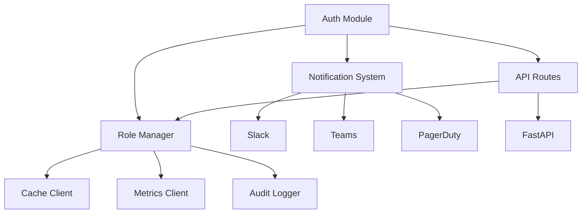

# Authentication Module Overview

## Purpose

Provides a comprehensive security framework implementing industry-standard authentication and authorization patterns for distributed systems, with support for role-based access control, audit logging, and multi-channel notifications.

## Architecture

The module consists of several key components:

### Core Types (`types.md`)

- Authentication primitives
- Validation structures
- Policy definitions
- Audit types

### Role Management (`role_manager.md`)

- Role lifecycle
- Assignment handling
- Cache management
- Audit integration

### Notification System (`notification_channels.md`)

- Multi-channel delivery
- Priority routing
- Message templating
- Integration points

### API Routes (`routes.md`)

- RBAC endpoints
- Audit APIs
- Request handling
- Response formatting

## Key Features

1. Role-Based Access Control:

   - Role hierarchy
   - Policy enforcement
   - Permission inheritance
   - Temporal constraints

2. Security Notifications:

   - Multiple channels
   - Priority levels
   - Rich formatting
   - Delivery tracking

3. Audit System:

   - Comprehensive logging
   - Context capture
   - Compliance support
   - Event tracking

4. API Integration:
   - RESTful endpoints
   - Async operations
   - Error handling
   - Cache management

## Integration Points

1. Service Communication:

   - Role validation
   - Permission checks
   - Audit events
   - Notifications

2. Cache Management:

   - Role caching
   - Assignment storage
   - Invalidation
   - Consistency

3. Monitoring:
   - Security metrics
   - Audit trails
   - Performance data
   - Health status

## Configuration Examples

### Role Definition

```python
role_config = {
    "name": "admin",
    "policies": [
        {"resource": "users", "permissions": ["read", "write"]},
        {"resource": "settings", "permissions": ["read"]}
    ],
    "parent_roles": ["user"],
    "metadata": {"department": "IT"}
}
```

### Notification Setup

```python
notification_config = {
    "channels": {
        "slack": {"webhook_url": "...", "default_channel": "#alerts"},
        "teams": {"webhook_url": "..."},
        "pagerduty": {"api_key": "...", "service_id": "..."}
    },
    "priorities": {
        "high": ["slack", "pagerduty"],
        "medium": ["slack"],
        "low": ["teams"]
    }
}
```

### Audit Configuration

```python
audit_config = {
    "log_level": "INFO",
    "retention_days": 90,
    "include_context": True,
    "compliance_standards": ["SOC2", "ISO27001"]
}
```

## Performance Considerations

- Caching strategies
- Async operations
- Connection pooling
- Resource optimization

## Security Considerations

- Role validation
- Permission checks
- Audit completeness
- Notification security

## Known Issues

- Cache consistency
- Notification reliability
- Basic rate limiting
- Manual failover

## Future Improvements

1. Enhanced Security:

   - Advanced role patterns
   - Dynamic permissions
   - Threat detection
   - Zero trust model

2. Performance Optimization:

   - Distributed caching
   - Efficient validation
   - Query optimization
   - Resource pooling

3. Management Features:

   - Configuration UI
   - Monitoring dashboard
   - Health checks
   - Analytics

4. Integration Capabilities:
   - Identity providers
   - External systems
   - Custom channels
   - Compliance tools

## Module Dependencies



## Compliance Support

The module supports common regulatory requirements:

1. SOC 2:

   - Access control
   - Audit logging
   - Change management
   - Incident response

2. ISO 27001:

   - Identity management
   - Access control
   - Audit trails
   - Security monitoring

3. GDPR:

   - Data protection
   - Access records
   - Audit logging
   - Incident reporting

4. HIPAA:
   - Access control
   - Audit trails
   - Secure messaging
   - Incident tracking
