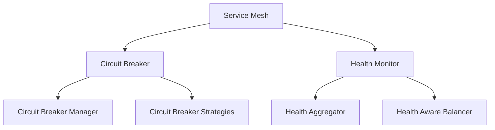

# Service Mesh Core Module (**init**.py)

## Purpose

Provides core service mesh functionality with circuit breaking, health monitoring, and service orchestration capabilities, following a sidecar pattern for service mesh implementation.

## Context

Entry point for the service mesh library that establishes component relationships and initialization order while providing access to core mesh functionality.

## Dependencies

- Circuit breaker components
- Health monitoring components
- Service mesh core
- Type checking support

## Core Components

### Circuit Breaker Components

```python
from .circuit_breaker.circuit_breaker import CircuitBreaker
from .circuit_breaker.circuit_breaker_manager import CircuitBreakerManager
from .circuit_breaker.circuit_breaker_strategies import CircuitBreakerStrategy
from .circuit_breaker.circuit_breaker_advanced import AdvancedCircuitBreaker
```

Provides:

- Basic circuit breaking
- Circuit breaker management
- Strategy implementation
- Advanced features

### Health Monitoring

```python
from .health.health_aggregator import HealthAggregator
from .health.health_aware_balancer import HealthAwareLoadBalancer
```

Enables:

- Health status aggregation
- Health-aware routing
- Load balancing

### Core Service Mesh

```python
from .mesh import ServiceMesh
from .integrator import ServiceIntegrator
```

Implements:

- Service mesh orchestration
- Component integration
- Service routing

### Type Checking Support

```python
if TYPE_CHECKING:
    from ..monitoring import MetricsClient
    from ..cache import CacheClient
```

Provides:

- Development-time type checking
- Interface definitions
- Dependency clarity

## Implementation Details

### Component Organization

1. Circuit Breakers

   - Fault tolerance
   - Failure detection
   - Recovery management

2. Health Monitoring

   - Status aggregation
   - Load balancing
   - Health checks

3. Service Mesh Core
   - Orchestration
   - Integration
   - Routing

## Performance Considerations

- Import order impact
- Type checking overhead
- Component initialization
- Resource usage
- Startup time

## Security Considerations

- Component isolation
- Type safety
- Resource protection
- Access control
- Dependency validation

## Known Issues

- Import order sensitivity
- Type checking limitations
- Component dependencies
- Initialization sequence
- Resource management

## Trade-offs and Design Decisions

### Module Organization

- **Decision**: Sidecar pattern
- **Rationale**: Service isolation
- **Trade-off**: Complexity vs. isolation

### Type Checking

- **Decision**: Optional type checking
- **Rationale**: Development safety
- **Trade-off**: Overhead vs. safety

### Component Access

- **Decision**: Direct component exposure
- **Rationale**: Flexible integration
- **Trade-off**: Control vs. flexibility

## Future Improvements

1. Enhanced type safety
2. Lazy component loading
3. Resource optimization
4. Dependency injection
5. Configuration validation

## Example Usage

```python
from datapunk.lib.mesh import (
    ServiceMesh,
    CircuitBreaker,
    HealthAggregator
)

# Create service mesh
mesh = ServiceMesh(
    service_name="api",
    metrics=metrics_client,
    cache=cache_client
)

# Configure circuit breaker
breaker = CircuitBreaker(
    failure_threshold=0.5,
    reset_timeout=30.0
)

# Setup health monitoring
health = HealthAggregator(metrics_client)
```

## Related Components

- Circuit Breaker
- Health Monitor
- Service Mesh
- Load Balancer
- Service Discovery

## Testing Considerations

1. Import order
2. Type checking
3. Component initialization
4. Resource management
5. Integration testing
6. Dependency mocking

## Deployment Considerations

1. Component availability
2. Resource allocation
3. Type checking mode
4. Dependency management
5. Version compatibility

## Component Dependencies



## Module Structure

```
lib/mesh/
├── __init__.py
├── circuit_breaker/
│   ├── circuit_breaker.py
│   ├── circuit_breaker_manager.py
│   ├── circuit_breaker_strategies.py
│   └── circuit_breaker_advanced.py
├── health/
│   ├── health_aggregator.py
│   └── health_aware_balancer.py
└── mesh.py
```

## Initialization Sequence

1. Circuit breaker components
2. Health monitoring system
3. Service mesh core
4. Type checking setup
5. Resource allocation

## Type Checking Integration

- Development-time checks
- Interface validation
- Dependency verification
- Error prevention
- Code completion
